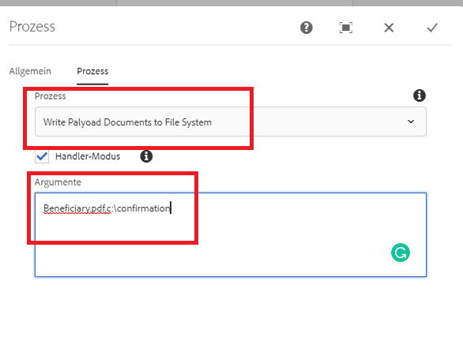

# Schreiben des Dokuments in das Dateisystem

Ein üblicher Anwendungsfall besteht darin, die generierten Dokumente im Workflow in das Dateisystem zu schreiben.
Dieser benutzerdefinierte Workflow-Prozessschritt erleichtert das Schreiben der Workflow-Dokumente in das Dateisystem.
Der benutzerdefinierte Prozess akzeptiert die folgenden kommagetrennten Argumente

```java
ChangeBeneficiary.pdf,c:\confirmation
```

Das erste Argument ist der Name des Dokuments, das Sie im Dateisystem speichern möchten. Das zweite Argument ist der Speicherort des Ordners, in dem Sie das Dokument speichern möchten. Im obigen Anwendungsfall wird das Dokument beispielsweise in `c:\confirmation\ChangeBeneficiary.pdf` geschrieben

Der folgende Screenshot zeigt die Argumente, die Sie an den benutzerdefinierten Prozessschritt übergeben müssen


[Das benutzerdefinierte Bundle kann von hier aus heruntergeladen werden:](/help/forms/assets/common-osgi-bundles/SetValueApp.core-1.0-SNAPSHOT.jar)
