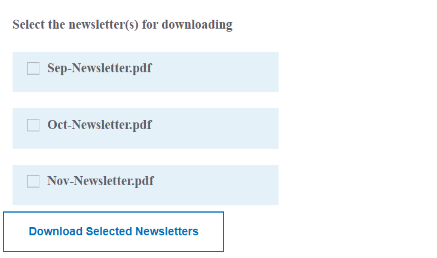

# Einführung

Ein gängiges Anwendungsbeispiel besteht darin, den Inhalt von DAM-Ordnern (PDF-Dateien, Word-Dokumente usw.) mithilfe der Kontrollkästchen-Komponente aufzulisten und es den Benutzenden zu ermöglichen, eine oder mehrere Dateien zum Herunterladen auszuwählen. Die ausgewählten Dateien werden zu einer Datei zusammengestellt, die die Benutzenden herunterladen können.

## Voraussetzungen

Sie benötigen Folgendes:

* eine funktionierende AEM-Instanz mit installiertem Formular-Add-on-Paket

* [eine gemäß diesem Dokument eingerichtete Entwicklungsumgebung](https://experienceleague.adobe.com/docs/experience-manager-learn/forms/creating-your-first-osgi-bundle/create-your-first-osgi-bundle.html?lang=de)

## Nächste Schritte

[Befüllen der Auswahlgruppe](./populating-choice-group-with-dam-folder-content.md)
