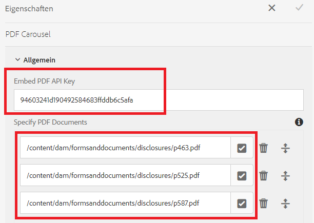

# Anzeigen mehrerer PDF-Dokumente in einem Karussell

Ein gängiger Anwendungsfall besteht darin, der Person, die ein Formular ausfüllt, mehrere PDF-Dokumente zur Überprüfung anzuzeigen, bevor sie das Formular absendet.

Zur Durchführung dieses Anwendungsfalls haben wir die [Adobe PDF Embed-API](https://www.adobe.io/apis/documentcloud/dcsdk/pdf-embed.html) verwendet.

[Eine Live-Demo dieses Beispiels finden Sie hier.](https://forms.enablementadobe.com/content/dam/formsanddocuments/wefinancecreditcard/jcr:content?wcmmode=disabled)

Die folgenden Schritte wurden ausgeführt, um die Integration abzuschließen.

## Erstellen einer benutzerdefinierten Komponente zum Anzeigen mehrerer PDF-Dokumente

Eine benutzerdefinierte Komponente (PDF-Karussell) wurde erstellt, um die PDF-Dokumente zu durchlaufen.

## Client-Bibliothek

Eine Client-Bibliothek wurde erstellt, um die PDF-Dokumente mithilfe der Adobe PDF Embed-API anzuzeigen. Die anzuzeigenden PDF-Dokumente werden in den PDF-Karussellkomponenten angegeben.

## Erstellen eines adaptiven Formulars

Erstellen Sie ein adaptives Formular mit mehreren Registerkarten (dieses Beispiel umfasst 3 Registerkarten).
Fügen Sie adaptive Formularkomponenten auf den ersten beiden Registerkarten hinzu.
Fügen Sie die PDF-Karussellkomponente auf der dritten Registerkarte hinzu.
Konfigurieren Sie die PDF-Karussellkomponente, wie im Screenshot unten dargestellt.

**PDF-API-Schlüssel einbetten**: Dies ist der Schlüssel, mit dem Sie das PDF-Dokument einbetten können. Dieser Schlüssel funktioniert nur mit „localhost“. Sie können [Ihren eigenen Schlüssel](https://www.adobe.io/apis/documentcloud/dcsdk/pdf-embed.html) erstellen und einer anderen Domain zuordnen.

**PDF-Dokumente angeben**: Hier können Sie die PDF-Dokumente angeben, die im Karussell angezeigt werden sollen.

## Bereitstellen des Beispiels auf Ihrem Server

Gehen Sie wie folgt vor, um dies auf Ihrem lokalen Server zu testen:

1. [Importieren Sie die Client-Bibliothek](assets/pdf-carousel-client-lib.zip) mit [Package Manager](http://localhost:4502/crx/packmgr/index.jsp) in Ihre lokale AEM-Instanz.
1. [Importieren Sie die PDF-Karussellkomponente](assets/pdf-carousel-component.zip) mit [Package Manager](http://localhost:4502/crx/packmgr/index.jsp) in Ihre lokale AEM-Instanz.
1. [Importieren Sie das adaptive Formular](assets/adaptive-form-pdf-carousel.zip) mit [Package Manager](http://localhost:4502/crx/packmgr/index.jsp) in Ihre lokale AEM-Instanz.
1. [Importieren Sie die anzuzeigenden PDF-Beispieldokumente](assets/pdf-carousel-sample-documents.zip) über den [Link zum Hochladen der Asset-Datei](http://localhost:4502/assets.html/content/dam) in Ihre lokale AEM-Instanz.
1. [Zeigen Sie das adaptive Formular in einer Vorschau an](http://localhost:4502/content/dam/formsanddocuments/wefinancecreditcard/jcr:content?wcmmode=disabled).
1. Wechseln Sie zur Registerkarte „Zu überprüfende Dokumente“. In der Karussellkomponente sollten drei PDF-Dokumente zu sehen sein.
