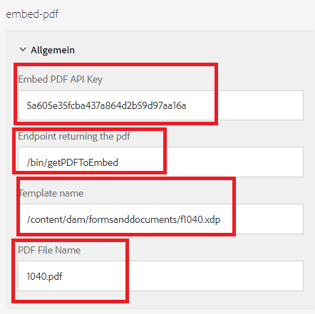

# Inline-Anzeige des DoR

Ein gängiger Anwendungsfall besteht darin, ein PDF-Dokument mit den von den Benutzenden eingegebenen Daten anzuzeigen.

Zur Durchführung dieses Anwendungsfalls haben wir die [Adobe PDF Embed-API](https://www.adobe.io/apis/documentcloud/dcsdk/pdf-embed.html) verwendet.

Die folgenden Schritte wurden ausgeführt, um die Integration abzuschließen.

## Erstellen einer benutzerdefinierten Komponente zur Inline-Anzeige der PDF

Eine benutzerdefinierte Komponente (embed-pdf) wurde erstellt, um das vom POST-Aufruf zurückgegebene PDF-Dokument einzubetten.

## Client-Bibliothek

Der folgende Code wird ausgeführt, wenn auf das Kontrollkästchen `viewPDF` geklickt wird. Wir übergeben die Daten des adaptiven Formulars und den Vorlagennamen an den Endpunkt, um die PDF zu generieren. Die generierte PDF wird dann der Person, die das Formular ausfüllt, mithilfe von „pdf einbetten“ der JavaScript-Bibliothek angezeigt.

```javascript
$(document).ready(function() {

    $(".viewPDF").click(function() {
        console.log("view pdfclicked");
        window.guideBridge.getDataXML({
            success: function(result) {
                var obj = new FormData();
                obj.append("data", result.data);
                obj.append("template", document.querySelector("[data-template]").getAttribute("data-template"));
                const fetchPromise = fetch(document.querySelector("[data-endpoint]").getAttribute("data-endpoint"), {
                        method: "POST",
                        body: obj,
                        contentType: false,
                        processData: false,

                    })
                    .then(response => {

                        var adobeDCView = new AdobeDC.View({
                            clientId: document.querySelector("[data-apikey]").getAttribute("data-apikey"),
                            divId: "adobe-dc-view"
                        });
                        console.log("In preview file");
                        adobeDCView.previewFile(

                            {
                                content: {
                                    promise: response.arrayBuffer()
                                },
                                metaData: {
                                    fileName: document.querySelector("[data-filename]").getAttribute("data-filename")
                                }
                            }
                        );


                        console.log("done")
                    })


            }
        });
    });


});
```

## Generieren von Beispieldaten für die XDP

* Öffnen Sie die XDP in AEM Forms Designer.
* Klicken Sie auf „Datei auswählen“ > „Formular-Eigenschaften“ > „Vorschau“
* Klicken Sie auf „Vorschaudaten erstellen“
* Klicken Sie auf „Erstellen“
* Geben Sie einen aussagekräftigen Dateinamen wie „form-data.xml“ an.

## Erstellen einer XSD aus den XML-Daten 

Sie können eines der kostenlosen Online-Tools verwenden, um aus den im vorherigen Schritt generierten XML-Daten ein [XSD](https://www.freeformatter.com/xsd-generator.html) zu generieren.

## Hochladen der Vorlage

Stellen Sie sicher, dass Sie die xdp-Vorlage in [AEM Forms](http://localhost:4502/aem/forms.html/content/dam/formsanddocuments) über die Schaltfläche „Erstellen“ hochladen


## Erstellen eines adaptiven Formulars

Erstellen Sie ein adaptives Formular basierend auf der XSD aus dem vorherigen Schritt.
Fügen Sie dem adaptiven Formular eine neue Registerkarte hinzu. Fügen Sie dieser Registerkarte eine Kontrollkästchen-Komponente und eine embed-pdf-Komponente hinzu.
Vergewissern Sie sich, dass Sie das Kontrollkästchen viewPDF nennen.
Konfigurieren Sie die Komponente „embed-pdf“, wie im Screenshot unten dargestellt


**PDF-API-Schlüssel einbetten** – Dies ist der Schlüssel, den Sie zum Einbetten des PDF-Dokuments verwenden können. Dieser Schlüssel funktioniert nur mit „localhost“. Sie können [Ihren eigenen Schlüssel](https://www.adobe.io/apis/documentcloud/dcsdk/pdf-embed.html) erstellen und einer anderen Domain zuordnen.

**Endpunkt, der PDF zurückgibt** – Dies ist das benutzerdefinierte Servlet, das die Daten mit der XDP-Vorlage zusammenführt und die PDF zurückgibt.

**Vorlagenname** – Dies ist der Pfad zur xdp. In der Regel wird sie im Ordner „formsanddocuments“ gespeichert.

**PDF-Dateiname** – Dies ist die Zeichenfolge, die in der embed-pdf-Komponente angezeigt wird.

## Erstellen eines benutzerdefinierten Servlets

Ein benutzerdefiniertes Servlet wurde erstellt, um die Daten mit der XDP-Vorlage zusammenzuführen und die PDF zurückzugeben. Der Code dafür ist unten aufgeführt. Das benutzerdefinierte Servlet ist Teil des [embedpdf-Bundles](assets/embedpdf.core-1.0-SNAPSHOT.jar)

```java
import java.io.ByteArrayInputStream;
import java.io.IOException;
import java.io.InputStream;
import java.io.OutputStream;
import java.io.StringReader;
import java.io.StringWriter;
import javax.servlet.Servlet;
import javax.xml.parsers.DocumentBuilder;
import javax.xml.parsers.DocumentBuilderFactory;
import javax.xml.transform.Transformer;
import javax.xml.transform.TransformerFactory;
import javax.xml.transform.dom.DOMSource;
import javax.xml.transform.stream.StreamResult;
import javax.xml.xpath.XPath;
import javax.xml.xpath.XPathConstants;
import javax.xml.xpath.XPathFactory;

import org.apache.sling.api.SlingHttpServletRequest;
import org.apache.sling.api.SlingHttpServletResponse;
import org.apache.sling.api.servlets.SlingAllMethodsServlet;
import org.osgi.service.component.annotations.Component;
import org.osgi.service.component.annotations.Reference;
import org.slf4j.Logger;
import org.slf4j.LoggerFactory;
import org.w3c.dom.Node;
import org.w3c.dom.NodeList;
import org.xml.sax.InputSource;
import com.adobe.aemfd.docmanager.Document;
import com.adobe.fd.output.api.OutputService;

package com.embedpdf.core.servlets;
@Component(service = {
   Servlet.class
}, property = {
   "sling.servlet.methods=post",
   "sling.servlet.paths=/bin/getPDFToEmbed"
})
public class StreamPDFToEmbed extends SlingAllMethodsServlet {
   @Reference
   OutputService outputService;
   private static final long serialVersionUID = 1 L;
   private static final Logger log = LoggerFactory.getLogger(StreamPDFToEmbed.class);

   protected void doPost(SlingHttpServletRequest request, SlingHttpServletResponse response) throws IOException {
      String xdpName = request.getParameter("template");
      String formData = request.getParameter("data");
      log.debug("in doPOST of Stream PDF Form Data is >>> " + formData + " template is >>> " + xdpName);

      try {

         XPathFactory xfact = XPathFactory.newInstance();
         XPath xpath = xfact.newXPath();
         DocumentBuilderFactory factory = DocumentBuilderFactory.newInstance();
         DocumentBuilder builder = factory.newDocumentBuilder();

         org.w3c.dom.Document xmlDataDoc = builder.parse(new InputSource(new StringReader(formData)));

         // get the data to merge with template

         Node afBoundData = (Node) xpath.evaluate("afData/afBoundData", xmlDataDoc, XPathConstants.NODE);
         NodeList afBoundDataChildren = afBoundData.getChildNodes();
         String afDataNodeName = afBoundDataChildren.item(0).getNodeName();
         Node nodeWithDataToMerge = (Node) xpath.evaluate("afData/afBoundData/" + afDataNodeName, xmlDataDoc, XPathConstants.NODE);
         StringWriter writer = new StringWriter();
         Transformer transformer = TransformerFactory.newInstance().newTransformer();
         transformer.transform(new DOMSource(nodeWithDataToMerge), new StreamResult(writer));
         String xml = writer.toString();
         InputStream targetStream = new ByteArrayInputStream(xml.getBytes());
         Document xmlDataDocument = new Document(targetStream);
         // get the template
         Document xdpTemplate = new Document(xdpName);
         log.debug("got the  xdp Template " + xdpTemplate.length());

         // use output service the merge data with template
         com.adobe.fd.output.api.PDFOutputOptions pdfOptions = new com.adobe.fd.output.api.PDFOutputOptions();
         pdfOptions.setAcrobatVersion(com.adobe.fd.output.api.AcrobatVersion.Acrobat_11);
         com.adobe.aemfd.docmanager.Document documentToReturn = outputService.generatePDFOutput(xdpTemplate, xmlDataDocument, pdfOptions);

         // stream pdf to the client

         InputStream fileInputStream = documentToReturn.getInputStream();
         response.setContentType("application/pdf");
         response.addHeader("Content-Disposition", "attachment; filename=AemFormsRocks.pdf");
         response.setContentLength((int) fileInputStream.available());
         OutputStream responseOutputStream = response.getOutputStream();
         int bytes;
         while ((bytes = fileInputStream.read()) != -1) {
            responseOutputStream.write(bytes);
         }
         responseOutputStream.flush();
         responseOutputStream.close();

      } catch (Exception e) {

         System.out.println("Error " + e.getMessage());
      }

   }

}
```


## Bereitstellen des Beispiels auf Ihrem Server

Führen Sie die folgenden Schritte aus, um dies auf Ihrem lokalen Server zu testen:

1. [Laden Sie das embedpdf-Bundle herunter und installieren Sie es](assets/embedpdf.core-1.0-SNAPSHOT.jar).
Dies verfügt über das Servlet, um die Daten mit der XDP-Vorlage zusammenzuführen und die PDF-Datei zurückschicken.
1. Fügen Sie den Pfad /bin/getPDFToEmbed im Abschnitt „Ausgeschlossene Pfade“ des Adobe Granite CSRF-Filter mit [AEM ConfigMgr](http://localhost:4502/system/console/configMgr) hinzu. In Ihrer Produktionsumgebung sollten Sie das [CSRF Protection Framework](https://experienceleague.adobe.com/docs/experience-manager-65/developing/introduction/csrf-protection.html?lang=de) verwenden.
1. [Importieren Sie die Client-Bibliothek und benutzerdefinierte Komponente.](assets/embed-pdf.zip)
1. [Importieren Sie das adaptive Formular und die Vorlage.](assets/embed-pdf-form-and-xdp.zip)
1. [Zeigen Sie das adaptive Formular in einer Vorschau an.](http://localhost:4502/content/dam/formsanddocuments/from1040/jcr:content?wcmmode=disabled)
1. Füllen Sie einige Formularfelder aus.
1. Wechseln Sie zur Registerkarte „PDF anzeigen“. Aktivieren Sie das Kontrollkästchen „PDF anzeigen“. Im Formular sollte ein PDF-Dokument angezeigt werden, das mit den Daten des adaptiven Formulars ausgefüllt ist.
