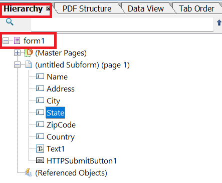

# Herunterladen eines interaktiven DoR

Ein gängiges Nutzungsszenario besteht darin, ein interaktives DoR mit den adaptiven Formulardaten herunterzuladen. Das heruntergeladene DoR wird dann mit Adobe Acrobat oder Adobe Reader vervollständigt.

## Adaptives Formular basiert nicht auf dem XSD-Schema

Wenn Ihr XDP und adaptives Formular nicht auf einem Schema basieren, führen Sie die folgenden Schritte aus, um ein interaktives Datensatzdokument zu generieren.

### Erstellen eines adaptiven Formulars

Erstellen Sie ein adaptives Formular und stellen Sie sicher, dass die Feldnamen in dem adaptiven Formular mit den Feldnamen in Ihrer XDP-Vorlage identisch sind.
Notieren Sie sich den Stammelementnamen Ihrer XDP-Vorlage.


### Client-Bibliothek

Der folgende Code wird ausgeführt, wenn die Schaltfläche „PDF herunterladen“ ausgelöst wird:

```javascript
$(document).ready(function() {
    $(".downloadPDF").click(function() {
        window.guideBridge.getDataXML({
            success: function(guideResultObject) {
                var req = new XMLHttpRequest();
                req.open("POST", "/bin/generateinteractivedor", true);
                req.responseType = "blob";
                var postParameters = new FormData();
                postParameters.append("dataXml", guideResultObject.data);
                postParameters.append("xdpName","two.xdp")
                postParameters.append("formBasedOnSchema", "false");
                postParameters.append("xfaRootElement","form1");
                console.log(guideResultObject.data);
                req.send(postParameters);
                req.onreadystatechange = function() {
                    if (req.readyState == 4 && req.status == 200) {
                        download(this.response, "report.pdf", "application/pdf");
                    }


                }
            }
        });

    });
});
```

## Adaptives Formular basierend auf dem XSD-Schema

Wenn Ihr XDP nicht auf XSD basiert, führen Sie die folgenden Schritte aus, um XSD(Schema) zu erstellen, auf dem Ihr adaptives Formular basiert

### Generieren von Beispieldaten für die XDP

* Öffnen Sie die XDP in AEM Forms Designer.
* Klicken Sie auf „Datei auswählen“ > „Formular-Eigenschaften“ > „Vorschau“
* Klicken Sie auf „Vorschaudaten erstellen“
* Klicken Sie auf „Erstellen“
* Geben Sie einen aussagekräftigen Dateinamen wie „form-data.xml“ an.

### Erstellen einer XSD aus den XML-Daten 

Sie können eines der kostenlosen Online-Tools verwenden, um aus den im vorherigen Schritt generierten XML-Daten eine [XSD](https://www.freeformatter.com/xsd-generator.html) zu generieren.

### Erstellen eines adaptiven Formulars

Erstellen Sie ein adaptives Formular basierend auf der XSD aus dem vorherigen Schritt. Verknüpfen Sie das Formular mit der Client-Bibliothek „irs“. Diese Client-Bibliothek enthält den Code, um einen POST-Aufruf an das Servlet durchzuführen, der die PDF an die aufrufende Anwendung zurückgibt.
Der folgende Code wird ausgelöst, wenn _PDF herunterladen_ angeklickt wird

```javascript
$(document).ready(function() {
    $(".downloadPDF").click(function() {
        window.guideBridge.getDataXML({
            success: function(guideResultObject) {
                var req = new XMLHttpRequest();
                req.open("POST", "/bin/generateinteractivedor", true);
                req.responseType = "blob";
                var postParameters = new FormData();
                postParameters.append("dataXml", guideResultObject.data);
                postParameters.append("xdpName","f8918-r14e_redo-barcode_3 2.xdp")
                postParameters.append("formBasedOnSchema", "true");
                postParameters.append("dataNodeToExtract","afData/afBoundData/topmostSubform");
                console.log(guideResultObject.data);
                req.send(postParameters);
                req.onreadystatechange = function() {
                    if (req.readyState == 4 && req.status == 200) {
                        download(this.response, "report.pdf", "application/pdf");
                    }


                }
            }
        });

    });
});
```


## Erstellen eines benutzerdefinierten Servlets

Erstellen Sie ein benutzerdefiniertes Servlet, das die Daten mit der XDP-Vorlage zusammenführt und das PDF-Dokument zurückgibt. Der Code dafür ist unten aufgeführt. Das benutzerdefinierte Servlet ist Teil des [AEMFormsDocumentServices.core-1.0-SNAPSHOT-Bundles](/help/forms/assets/common-osgi-bundles/AEMFormsDocumentServices.core-1.0-SNAPSHOT.jar)).

```java
public class GenerateIInteractiveDor extends SlingAllMethodsServlet {
    private static final long serialVersionUID = 1 L;
    @Reference
    DocumentServices documentServices;
    @Reference
    FormsService formsService;
    private static final Logger log = LoggerFactory.getLogger(GenerateIInteractiveDor.class);

    protected void doGet(SlingHttpServletRequest request, SlingHttpServletResponse response) {
        doPost(request, response);
    }
    protected void doPost(SlingHttpServletRequest request, SlingHttpServletResponse response) {
        String xdpName = request.getParameter("xdpName");

        boolean formBasedOnXSD = Boolean.parseBoolean(request.getParameter("formBasedOnSchema"));

        XPathFactory xfact = XPathFactory.newInstance();
        XPath xpath = xfact.newXPath();
        String dataXml = request.getParameter("dataXml");
        log.debug("The data xml is " + dataXml);
        org.w3c.dom.Document xmlDataDoc = documentServices.w3cDocumentFromStrng(dataXml);
        Document renderedPDF = null;
        try {
            if (!formBasedOnXSD) {
                String xfaRootElement = request.getParameter("xfaRootElement");
                DocumentBuilderFactory dbFactory = DocumentBuilderFactory.newInstance();
                DocumentBuilder dBuilder = dbFactory.newDocumentBuilder();
                org.w3c.dom.Document newXMLDocument = dBuilder.newDocument();
                Element rootElement = newXMLDocument.createElement(xfaRootElement);
                String unboundData = "afData/afUnboundData/data";
                Node dataNode = (Node) xpath.evaluate(unboundData, xmlDataDoc, XPathConstants.NODE);
                NodeList dataChildNodes = dataNode.getChildNodes();
                for (int i = 0; i<dataChildNodes.getLength(); i++) {
                    Node childNode = dataChildNodes.item(i);
                    if (childNode.getNodeType() == 1) {
                        Element newElement = newXMLDocument.createElement(childNode.getNodeName());
                        newElement.setTextContent(childNode.getTextContent());
                        rootElement.appendChild(newElement);
                        log.debug("the node name is  " + childNode.getNodeName() + " and its value is " + childNode.getTextContent());
                    }
                }
                newXMLDocument.appendChild(rootElement);
                Document xmlDataDocument = documentServices.orgw3cDocumentToAEMFDDocument(newXMLDocument);
                String xdpTemplatePath = "crx:///content/dam/formsanddocuments";
                com.adobe.fd.forms.api.PDFFormRenderOptions renderOptions = new com.adobe.fd.forms.api.PDFFormRenderOptions();
                renderOptions.setAcrobatVersion(com.adobe.fd.forms.api.AcrobatVersion.Acrobat_11);
                renderOptions.setContentRoot(xdpTemplatePath);
                renderOptions.setRenderAtClient(com.adobe.fd.forms.api.RenderAtClient.NO);
                renderedPDF = formsService.renderPDFForm(xdpName, xmlDataDocument, renderOptions);

            } else {
                // form is based on xsd
                // get the actual xml data that needs to be merged with the template. This can be made more generic
                String nodeToExtract = request.getParameter("dataNodeToExtract");
                Node dataNode = (Node) xpath.evaluate(nodeToExtract, xmlDataDoc, XPathConstants.NODE);
                StringWriter writer = new StringWriter();
                Transformer transformer = TransformerFactory.newInstance().newTransformer();
                transformer.transform(new DOMSource(dataNode), new StreamResult(writer));
                String xml = writer.toString();
                System.out.println(xml);
                xmlDataDoc = documentServices.w3cDocumentFromStrng(xml);
                Document xmlDataDocument = documentServices.orgw3cDocumentToAEMFDDocument(xmlDataDoc);
                String xdpTemplatePath = "crx:///content/dam/formsanddocuments";
                com.adobe.fd.forms.api.PDFFormRenderOptions renderOptions = new com.adobe.fd.forms.api.PDFFormRenderOptions();
                renderOptions.setAcrobatVersion(com.adobe.fd.forms.api.AcrobatVersion.Acrobat_11);
                renderOptions.setContentRoot(xdpTemplatePath);
                renderOptions.setRenderAtClient(com.adobe.fd.forms.api.RenderAtClient.NO);
                renderedPDF = formsService.renderPDFForm(xdpName, xmlDataDocument, renderOptions);
            }
            InputStream fileInputStream = renderedPDF.getInputStream();
            response.setContentType("application/pdf");
            response.addHeader("Content-Disposition", "attachment; filename=" + xdpName.replace("xdp", "pdf"));
            response.setContentLength((int) fileInputStream.available());
            OutputStream responseOutputStream = response.getOutputStream();
            int bytes;
            while ((bytes = fileInputStream.read()) != -1) {
                responseOutputStream.write(bytes);
            }
            responseOutputStream.flush();
            responseOutputStream.close();

        } catch (XPathExpressionException | TransformerException | FormsServiceException | IOException | ParserConfigurationException e) {
            log.debug(e.getMessage());
        }

    }

}
```

Im Beispiel-Code extrahieren wir den XDP-Namen und andere Parameter aus dem Anfrageobjekt. Wenn das Formular nicht auf XSD basiert, wird das XML-Dokument erstellt, das mit der XDP zusammengeführt werden soll. Wenn das Formular auf XSD basiert, extrahieren wir einfach den entsprechenden Knoten aus den gesendeten adaptiven Formulardaten, um das XML-Dokument zu generieren, das mit der XDP-Vorlage zusammengeführt werden soll.

## Bereitstellen des Beispiels auf Ihrem Server

Führen Sie die folgenden Schritte aus, um dies auf Ihrem lokalen Server zu testen:

1. [Laden Sie das DevelopingWithServiceUser-Bundle herunter und installieren Sie es.](/help/forms/assets/common-osgi-bundles/DevelopingWithServiceUser.jar)
1. Fügen Sie den folgenden Eintrag im Apache Sling Service User Mapper Service hinzu:
DevelopingWithServiceUser.core:getformsresourceresolver=fd-service
1. [Laden Sie das benutzerdefinierte DocumentServices-Bundle herunter und installieren Sie es](/help/forms/assets/common-osgi-bundles/AEMFormsDocumentServices.core-1.0-SNAPSHOT.jar).  Dies verfügt über das Servlet, um die Daten mit der XDP-Vorlage zusammenzuführen und die PDF-Datei zurückschicken.
1. [Importieren Sie die Client-Bibliothek.](assets/generate-interactive-dor-client-lib.zip)
1. [Importieren Sie die Artikel-Assets (adaptives Formular, XDP-Vorlagen und XSD).](assets/generate-interactive-dor-sample-assets.zip)
1. [Zeigen Sie das adaptive Formular in einer Vorschau an](http://localhost:4502/content/dam/formsanddocuments/f8918complete/jcr:content?wcmmode=disabled).
1. Füllen Sie einige der Formularfelder aus.
1. Klicken Sie auf „PDF herunterladen“, um die PDF zu erhalten. Möglicherweise müssen Sie einige Sekunden warten, bis die PDF heruntergeladen wird.

>[!NOTE]
>
>Sie können den gleichen Anwendungsfall mit [einem nicht XSD-basierten adaptiven Formular](http://localhost:4502/content/dam/formsanddocuments/two/jcr:content?wcmmode=disabled) versuchen.  Stellen Sie sicher, dass Sie die entsprechenden Parameter an den POST-Endpunkt in „streampdf.js“ übergeben, der sich in der IRS-Client-Bibliothek befindet.
