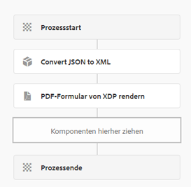

# Generieren einer PDF mit Daten aus der auf Kernkomponenten basierenden Formularübermittlung

Im Folgenden finden Sie den überarbeiteten Text:

Ein typisches Szenario besteht darin, eine PDF aus Daten zu generieren, die über ein auf Kernkomponenten basierendes adaptives Formular übermittelt werden. Diese Daten liegen immer im JSON-Format vor. Um eine PDF mithilfe der Render PDF-API zu generieren, müssen die JSON-Daten in das XML-Format konvertiert werden. Für diesen Konvertierungsvorgang wird die `toString`-Methode von `org.json.XML` verwendet. Weitere Informationen finden Sie in der [Dokumentation zur `org.json.XML.toString`-Methode](https://www.javadoc.io/doc/org.json/json/20171018/org/json/XML.html#toString-java.lang.Object-).

## Auf dem JSON-Schema basierendes adaptives Formular

Führen Sie die folgenden Schritte aus, um ein JSON-Schema für Ihr adaptives Formular zu erstellen.

### Generieren von Beispieldaten für die XDP

Gehen Sie wie folgt vor, um den Prozess zu optimieren:

1. Öffnen Sie die XDP-Datei in AEM Forms Designer.
1. Navigieren Sie zu „Datei“ > „Formulareigenschaften“ > „Vorschau“.
1. Wählen Sie „Vorschaudaten erstellen“ aus.
1. Wählen Sie „Erstellen“ aus.
1. Wählen Sie einen aussagekräftigen Dateinamen aus, z. B. `form-data.xml`.

### Generieren eines JSON-Schemas aus XML-Daten

Sie können ein beliebiges kostenloses Onlinetool nutzen, um anhand der im vorherigen Schritt generierten XML-Daten [XML in JSON zu konvertieren](https://jsonformatter.org/xml-to-jsonschema).

### Benutzerdefinierter Workflow-Prozess zum Konvertieren von JSON in XML

Mit dem bereitgestellten Code wird JSON in XML konvertiert und das XML-Ergebnis in einer Workflow-Prozessvariablen namens `dataXml` gespeichert.

```java
import org.slf4j.LoggerFactory;
import com.adobe.granite.workflow.WorkflowException;
import java.io.InputStream;
import java.io.BufferedReader;
import java.io.InputStreamReader;
import javax.jcr.Node;
import javax.jcr.Session;
import org.json.JSONObject;
import org.json.XML;
import org.slf4j.Logger;
import org.osgi.service.component.annotations.Component;
import com.adobe.granite.workflow.WorkflowSession;
import com.adobe.granite.workflow.exec.WorkItem;
import com.adobe.granite.workflow.exec.WorkflowProcess;
import com.adobe.granite.workflow.metadata.MetaDataMap;

@Component(property = {
    "service.description=Convert JSON to XML",
    "process.label=Convert JSON to XML"
})
public class ConvertJSONToXML implements WorkflowProcess {

    private static final Logger log = LoggerFactory.getLogger(ConvertJSONToXML.class);

    @Override
    public void execute(final WorkItem workItem, final WorkflowSession workflowSession, final MetaDataMap arg2) throws WorkflowException {
        String processArgs = arg2.get("PROCESS_ARGS", "string");
        log.debug("The process argument I got was " + processArgs);
        
        String submittedDataFile = processArgs;
        String payloadPath = workItem.getWorkflowData().getPayload().toString();
        log.debug("The payload in convert json to xml " + payloadPath);
        
        String dataFilePath = payloadPath + "/" + submittedDataFile + "/jcr:content";
        try {
            Session session = workflowSession.adaptTo(Session.class);
            Node submittedJsonDataNode = session.getNode(dataFilePath);
            InputStream jsonDataStream = submittedJsonDataNode.getProperty("jcr:data").getBinary().getStream();
            BufferedReader streamReader = new BufferedReader(new InputStreamReader(jsonDataStream, "UTF-8"));
            StringBuilder stringBuilder = new StringBuilder();
            String inputStr;
            while ((inputStr = streamReader.readLine()) != null) {
                stringBuilder.append(inputStr);
            }
            JSONObject submittedJson = new JSONObject(stringBuilder.toString());
            log.debug(submittedJson.toString());
            
            String xmlString = XML.toString(submittedJson);
            log.debug("The json converted to XML " + xmlString);
            
            MetaDataMap metaDataMap = workItem.getWorkflow().getWorkflowData().getMetaDataMap();
            metaDataMap.put("xmlData", xmlString);
        } catch (Exception e) {
            log.error("Error converting JSON to XML: " + e.getMessage(), e);
        }
    }
}
```

### Erstellen eines Workflows

Erstellen Sie einen Workflow mit zwei Schritten, um Formularübermittlungen zu verarbeiten:

1. Im ersten Schritt kommt ein benutzerdefinierter Prozess zur Anwendung, um die übermittelten JSON-Daten in XML umzuwandeln.
1. Im nachfolgenden Schritt wird eine PDF generiert, indem die XML-Daten mit der XDP-Vorlage kombiniert werden.




## Bereitstellen des Beispiel-Codes

Führen Sie folgende Schritte aus, um dies auf Ihrem lokalen Server zu testen:

1. [Laden Sie das benutzerdefinierte Bundle über die AEM OSGi-Web-Konsole herunter und installieren Sie es](assets/convertJsonToXML.core-1.0.0-SNAPSHOT.jar).
1. [Importieren Sie das Workflow-Paket](assets/workflow_to_render_pdf.zip).
1. [Importieren Sie das beispielhafte adaptive Formular und die beispielhafte XDP-Vorlage](assets/adaptive_form_and_xdp_template.zip).
1. [Zeigen Sie das adaptive Formular in einer Vorschau an](http://localhost:4502/content/dam/formsanddocuments/f23/jcr:content?wcmmode=disabled).
1. Füllen Sie einige Formularfelder aus.
1. Übermitteln Sie das Formular, um den AEM-Workflow initiieren.
1. Suchen Sie nach der gerenderten PDF im Payload-Ordner des Workflows.
