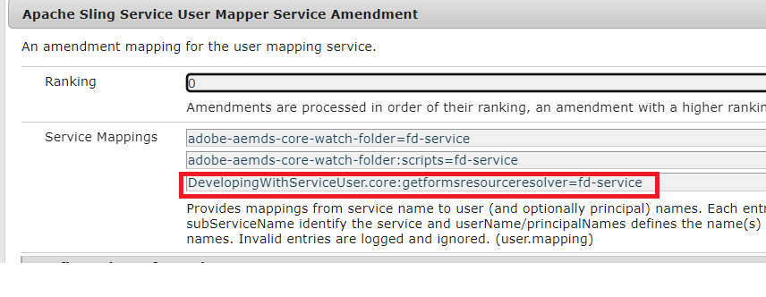

# PDF-Dokument mit Fragmenten mithilfe des ECMA-Skripts erstellen{#developing-with-output-and-forms-services-in-aem-forms}


In diesem Artikel verwenden wir den Output-Dienst, um PDF-Dateien mit XDP-Fragmenten zu generieren. Die Haupt-XDP und die Fragmente befinden sich im CRX-Repository. Es ist wichtig, die Dateisystemordnerstruktur in AEM zu imitieren. Wenn Sie beispielsweise ein Fragment im Fragmentordner in Ihrer xdp verwenden, müssen Sie einen Ordner mit dem Namen **Fragmente** unter Ihrem Basisordner in AEM. Der Basisordner enthält Ihre Basis-XDP-Vorlage. Wenn Sie beispielsweise die folgende Struktur auf Ihrem Dateisystem haben
* c:\xdptemplates - This will contain your base xdp template
* c:\xdptemplates\fragments - This folder will contain fragments and the main template will reference the fragment as shown below
   .
* Die Ordner-xdpdocuments enthalten Ihre Basisvorlage und die Fragmente in **Fragmente** Ordner

Sie können die erforderliche Struktur mithilfe der [Formulare und Dokument-Benutzeroberfläche](http://localhost:4502/aem/forms.html/content/dam/formsanddocuments)

Im Folgenden finden Sie die Ordnerstruktur für das Beispiel-XDP, das 2 Fragmente verwendet


* Output-Dienst - In der Regel wird dieser Dienst verwendet, um XML-Daten mit einer xdp-Vorlage oder PDF zusammenzuführen, um eine reduzierte PDF-Datei zu generieren. Weitere Informationen finden Sie im Abschnitt [javadoc](https://helpx.adobe.com/experience-manager/6-5/forms/javadocs/index.html?com/adobe/fd/output/api/OutputService.html) für den Output-Dienst. In diesem Beispiel verwenden wir Fragmente, die sich im CRX-Repository befinden.


Das folgende ECMA-Skript wurde verwendet, um PDF zu generieren. Beachten Sie die Verwendung von ResourceResolver und ResourceResolverHelper im Code. Der ResourceResolver ist erforderlich, da dieser Code außerhalb jedes Benutzerkontexts ausgeführt wird.

```java
var inputMap = processorContext.getInputMap();
var itr = inputMap.entrySet().iterator();
var entry = inputMap.entrySet().iterator().next();
var xmlData = inputMap.get(entry.getKey());
log.info("Got XML Data File");

var resourceResolverHelper = sling.getService(Packages.com.adobe.granite.resourceresolverhelper.ResourceResolverHelper);
var aemDemoListings = sling.getService(Packages.com.mergeandfuse.getserviceuserresolver.GetResolver);
log.info("Got service resolver");
var resourceResolver = aemDemoListings.getFormsServiceResolver();
//The ResourceResolverHelper execute's the following code within the context of the resourceResolver 
resourceResolverHelper.callWith(resourceResolver, {call: function()
       {
             //var statement = new Packages.com.adobe.aemfd.docmanager.Document("/content/dam/formsanddocuments/xdpdocuments/main.xdp",resourceResolver);
               var outputService = sling.getService(Packages.com.adobe.fd.output.api.OutputService);
            var pdfOutputOptions = new Packages.com.adobe.fd.output.api.PDFOutputOptions();
            pdfOutputOptions.setContentRoot("crx:///content/dam/formsanddocuments/xdpdocuments");
            pdfOutputOptions.setAcrobatVersion(Packages.com.adobe.fd.output.api.AcrobatVersion.Acrobat_11);
            var dataMergedDocument = outputService.generatePDFOutput("main.xdp",xmlData,pdfOutputOptions);
               //var dataMergedDocument = outputService.generatePDFOutput(statement,xmlData,pdfOutputOptions);
            processorContext.setResult("mergeddocument.pdf",dataMergedDocument);
            log.info("Generated the pdf document with fragments");
      }

 });
```

**So testen Sie das Beispielpaket auf Ihrem System**
* [Bereitstellen des DevelopingWithServiceUSer-Bundles](assets/DevelopingWithServiceUser.jar)
* Eintrag hinzufügen **DevelopingWithServiceUser.core:getformsresourceresolver=fd-service** in der User Mapper-Dienständerung, wie im Screenshot unten dargestellt
   
* [Herunterladen und Importieren von Beispiel-XDP-Dateien und ECMA-Skripten](assets/watched-folder-fragments-ecma.zip).
Dadurch wird eine überwachte Ordnerstruktur im Ordner c:/fragments/outputService erstellt.

* [Beispieldatendatei extrahieren](assets/usingFragmentsSampleData.zip) und legen Sie sie im Installationsordner Ihres überwachten Ordners ab (c:\fragmentsandoutputservice\install).

* Überprüfen Sie den Ergebnisordner Ihrer Konfiguration des überwachten Ordners auf die generierte PDF-Datei.
