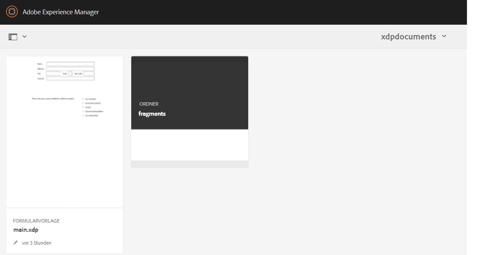

# Generieren von PDF-Dokumenten mithilfe von Fragmenten{#developing-with-output-and-forms-services-in-aem-forms}


In diesem Artikel verwenden wir den Output-Dienst, um PDF-Dateien mit XDP-Fragmenten zu generieren. Die XDP-Hauptdatei und die Fragmente befinden sich im CRX-Repository. Es ist wichtig, die Dateisystem-Ordnerstruktur in AEM nachzuahmen. Wenn Sie beispielsweise ein Fragment im Fragmentordner in Ihrer XDP verwenden, müssen Sie einen Ordner mit dem Namen **fragments** unter Ihrem Basisordner in AEM erstellen. Der Basisordner enthält Ihre XDP-Basisvorlage. Folgendes gilt, wenn beispielsweise die folgende Struktur auf Ihrem Dateisystem vorhanden ist:
* c:\xdptemplates: Dieser Ordner enthält Ihre XDP-Basisvorlage.
* c:\xdptemplates\fragments: Dieser Ordner enthält Fragmente und die Hauptvorlage verweist auf das Fragment, wie unten dargestellt.
  .
* Die Ordner „xdpdocuments“ enthält Ihre Basisvorlage und die Fragmente im Ordner **fragments**.

Sie können die erforderliche Struktur mithilfe der Benutzeroberfläche [Formulare und Dokumente](http://localhost:4502/aem/forms.html/content/dam/formsanddocuments) erstellen.

Im Folgenden finden Sie die Ordnerstruktur für das XDP-Beispiel, das 2 Fragmente verwendet.



* Output-Dienst: In der Regel wird dieser Dienst verwendet, um XML-Daten mit einer XDP-Vorlage oder PDF zusammenzuführen, um eine reduzierte PDF-Datei zu generieren. Weitere Informationen finden Sie im [Javadoc](https://helpx.adobe.com/de/experience-manager/6-5/forms/javadocs/index.html?com/adobe/fd/output/api/OutputService.html) für den Output-Dienst. In diesem Beispiel verwenden wir Fragmente, die sich im CRX-Repository befinden.


Der folgende Code wurde verwendet, um Fragmente in die PDF-Datei einzuschließen.

```java
System.out.println("I am in using fragments POST.jsp");
// contentRootURI is the base folder. All fragments are relative to this folder
String contentRootURI = request.getParameter("contentRootURI");
String xdpName = request.getParameter("xdpName");
javax.servlet.http.Part xmlDataPart = request.getPart("xmlDataFile");
System.out.println("Got xml file");
String filePath = request.getParameter("saveLocation");
java.io.InputStream xmlIS = xmlDataPart.getInputStream();
com.adobe.aemfd.docmanager.Document xmlDocument = new com.adobe.aemfd.docmanager.Document(xmlIS);
com.adobe.fd.output.api.OutputService outputService = sling.getService(com.adobe.fd.output.api.OutputService.class);

if (outputService == null) {
  System.out.println("The output service is  null.....");
} else {
  System.out.println("The output service is  not null.....");

}
com.adobe.fd.output.api.PDFOutputOptions pdfOptions = new com.adobe.fd.output.api.PDFOutputOptions();
pdfOptions.setAcrobatVersion(com.adobe.fd.output.api.AcrobatVersion.Acrobat_11);

pdfOptions.setContentRoot(contentRootURI);

com.adobe.aemfd.docmanager.Document generatedDocument = outputService.generatePDFOutput(xdpName, xmlDocument, pdfOptions);
generatedDocument.copyToFile(new java.io.File(filePath));
out.println("Document genreated and saved to " + filePath);
```

**So testen Sie das Beispielpaket auf Ihrem System:**

* [Laden Sie die XDP-Beispieldateien herunter und installieren Sie sie in AEM.](assets/xdp-templates-fragments.zip)
* [Laden Sie das Paket herunter und installieren Sie es mit Package Manager.](assets/using-fragments-assets.zip)
* [Die beispielhafte XDP-Datei und die entsprechenden Fragmente können hier heruntergeladen werden.](assets/xdptemplates.zip)

**Nachdem Sie das Paket installiert haben, müssen Sie die folgenden URLs unter „Adobe Granite CSRF Filter“ auf die Zulassungsliste setzen.**

1. Führen Sie die folgenden Schritte aus, um die oben genannten Pfade auf die Zulassungsliste zu setzen.
1. [Melden Sie sich bei configMgr an.](http://localhost:4502/system/console/configMgr)
1. Suchen Sie nach „Adobe Granite CSRF Filter“.
1. Fügen Sie den folgenden Pfad in den ausgeschlossenen Abschnitten hinzu und speichern Sie
1. /content/AemFormsSamples/usingfragments.

Es gibt verschiedene Möglichkeiten, den Beispiel-Code zu testen. Am schnellsten und einfachsten lässt sich hier die Postman-App verwenden. Mit Postman können Sie POST-Anfragen an Ihren Server richten. Installieren Sie die Postman-App auf Ihrem System.
Starten Sie die App und geben Sie die folgende URL ein, um die API für den Datenexport zu testen.

Stellen Sie sicher, dass Sie „POST“ aus der Dropdown-Liste ausgewählt haben: 
http://localhost:4502/content/AemFormsSamples/usingfragments.html
Stellen Sie sicher, dass Sie „Autorisierung“ als Standardauthentifizierung angeben. Geben Sie den Benutzernamen und das Passwort für den AEM-Server an.
Navigieren Sie zur Registerkarte „Hauptteil“ und geben Sie die Anfrageparameter an, wie in der Abbildung unten dargestellt.

Klicken Sie dann auf die Schaltfläche „Senden“.

[Sie könnten diese Postman-Sammlung importieren, um die API zu testen.](assets/usingfragments.postman_collection.json)
