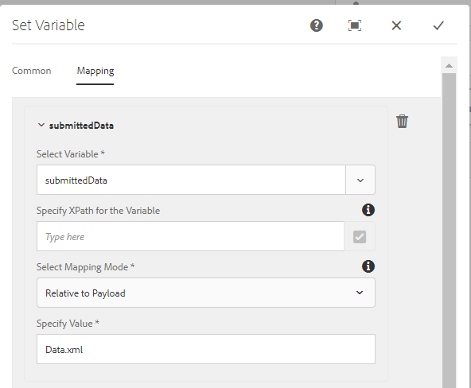

# Erstellen eines Workflows zum Überprüfen der gesendeten Daten

Workflows werden normalerweise verwendet, um gesendete Daten zur Überprüfung und Genehmigung weiterzuleiten. Workflows werden mit dem Workflow-Editor in AEM erstellt. Die Workflows kann beim Senden des adaptiven Formulars ausgelöst werden. Die folgenden Schritte führen Sie durch die Erstellung Ihres ersten Workflows.

## Voraussetzung

Vergewissern Sie sich bitte, dass Sie eine funktionierende Instanz von AEM Forms haben. Folgen Sie dem [Installationshandbuch](https://docs.adobe.com/content/help/en/experience-manager-65/forms/install-aem-forms/osgi-installation/installing-configuring-aem-forms-osgi.html) , um AEM Forms zu installieren und zu konfigurieren

## Workflow-Modell erstellen

* [Workflow-Modelle öffnen](http://localhost:4502/libs/cq/workflow/admin/console/content/models.html)
* Klicken Sie auf Erstellen -> Modell erstellen
* Geben Sie einen aussagekräftigen Titel und Namen ein, z. B. _Übermittelte Daten_&#x200B;überprüfen.
* Tippen Sie vorsichtig auf den neu erstellten Workflow und klicken Sie auf das Symbol _Bearbeiten_ .
* Der Workflow wird im Bearbeitungsmodus geöffnet. Der Workflow verfügt standardmäßig über eine Komponente mit dem Namen _Step1_. Wählen Sie diese Komponente aus und klicken Sie auf das Symbol zum Löschen, um die Komponente zu löschen.
* Auf der linken Seite sind die verschiedenen Workflow-Komponenten aufgeführt, die zum Erstellen Ihres Workflows verwendet werden können. Sie können die Komponenten nach _Forms Workflow_ filtern.

## Variable erstellen

* Klicken Sie auf das Symbol der Variablen, um neue Variablen zu erstellen. Variablen werden zum Speichern von Werten verwendet. AEM Forms bietet eine Reihe von Variablentypen, die erstellt werden können. Heute erstellen wir eine Variable vom Typ XML, um die gesendeten Daten des adaptiven Formulars zu speichern. Erstellen Sie eine neue Variable mit dem Namen _submitData_ des Typs XML, wie in der folgenden Abbildung dargestellt.

   >[!NOTE]
Wenn das Formular auf dem Formulardatenmodell basiert, haben die gesendeten Daten das JSON-Format. In diesem Fall erstellen Sie eine Variable des Typs JSON, die die gesendeten Daten enthält.

* Klicken Sie auf das Symbol _Schritte_ links, um die verschiedenen Workflow-Komponenten Liste. Ziehen Sie die Komponente _&quot;Variable_ festlegen&quot;auf Ihren Workflow auf der rechten Seite. Stellen Sie sicher, dass Sie die Komponente &quot; _Variable_ festlegen&quot;unter den Beginn &quot;Fluss&quot;setzen.
   * Klicken Sie auf die Komponente _Variable_ festlegen und dann auf das Symbol _Schraubenschlüssel_ , um das Eigenschaftenblatt der Komponente zu öffnen.
   * Klicken Sie auf die Registerkarte Zuordnung ->Hinzufügen Zuordnung->Zuordnungsvariable. Legen Sie die Werte wie im Screenshot unten gezeigt fest.
      

## hinzufügen

* Ziehen Sie die Komponente _&quot;Aufgabe_ zuweisen&quot;auf die rechte Seite unter der Komponente &quot; _Variable_ festlegen&quot;.
   * Klicken Sie auf die Komponente _Aufgabe_ zuweisen und dann auf das _Schraubenschlüsselsymbol_ , um das Eigenschaftenblatt zu öffnen.
   * Geben Sie der Komponente &quot;Aufgabe zuweisen&quot;einen aussagekräftigen Titel.
   * Klicken Sie auf die Registerkarte &quot;Forms und Dokumente&quot;und legen Sie die folgenden Eigenschaften wie im Screenshot dargestellt fest
      

   * _1 Durch Auswahl dieser Option wird der Workflow nicht mit einem bestimmten adaptiven Formular verknüpft._
   * _2 Das Workflow-Engine sucht nach der Datei &quot;Data.xml&quot;relativ zur Payload im Repository_

   * Klicken Sie auf die Registerkarte &quot;Bevollmächtigter&quot;. Hier können Sie die Aufgabe einem Benutzer in Ihrem Unternehmen zuweisen. In diesem Fall weisen wir die Aufgabe dem Administrator zu, wie im Screenshot unten gezeigt.
      
   * Speichern Sie Ihre Änderungen, indem Sie auf das Symbol _Fertig_ der Komponente klicken
* Klicken Sie auf _Synchronisieren_ , um das Laufzeitmodell des Workflows zu generieren.
Ihr Workflow-Modell ist jetzt bereit und kann mit der Übermittlungsaktion des adaptiven Formulars verknüpft werden.

