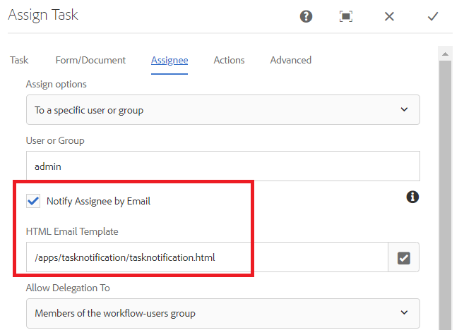

# Anpassen der Benachrichtigung zu Assign Task

Die Komponente &quot;Aufgabe zuweisen&quot;wird verwendet, um Workflow-Teilnehmern Aufgaben zuzuweisen. Wenn eine Aufgabe einem Benutzer oder einer Gruppe zugewiesen wird, wird eine E-Mail-Benachrichtigung an die definierten Benutzer- oder Gruppenmitglieder gesendet.
Diese E-Mail-Benachrichtigung enthält normalerweise dynamische Daten zur Aufgabe. Diese dynamischen Daten werden mithilfe des generierten Systems abgerufen [Metadateneigenschaften](https://experienceleague.adobe.com/docs/experience-manager-65/forms/publish-process-aem-forms/use-metadata-in-email-notifications.html#using-system-generated-metadata-in-an-email-notification).
Um Werte aus den gesendeten Formulardaten in die E-Mail-Benachrichtigung einzubeziehen, müssen wir eine benutzerdefinierte Metadateneigenschaft erstellen und diese benutzerdefinierten Metadateneigenschaften dann in der E-Mail-Vorlage verwenden


## Erstellen benutzerdefinierter Metadateneigenschaften

Der empfohlene Ansatz besteht darin, eine OSGi-Komponente zu erstellen, die die getUserMetadata -Methode der [WorkitemUserMetadataService](https://helpx.adobe.com/experience-manager/6-5/forms/javadocs/com/adobe/fd/workspace/service/external/WorkitemUserMetadataService.html#getUserMetadataMap--)

Der folgende Code erstellt 4 Metadateneigenschaften (_firstName_,_lastName_,_reason_ und _amountRequested_) und legt den Wert aus den gesendeten Daten fest. Beispiel: Metadateneigenschaft _firstName_ Der Wert von ist auf den Wert des Elements firstName aus den gesendeten Daten festgelegt. Im folgenden Code wird davon ausgegangen, dass die gesendeten Daten des adaptiven Formulars im XML-Format vorliegen. Adaptive Forms basierend auf einem JSON-Schema oder Formulardatenmodell generiert Daten im JSON-Format.


```java
package com.aemforms.workitemuserservice.core;

import java.io.InputStream;
import java.util.HashMap;
import java.util.Map;

import javax.jcr.Session;
import javax.xml.parsers.DocumentBuilder;
import javax.xml.parsers.DocumentBuilderFactory;
import javax.xml.xpath.XPath;

import org.osgi.framework.Constants;
import org.osgi.service.component.annotations.Component;
import org.slf4j.Logger;
import org.slf4j.LoggerFactory;
import org.w3c.dom.*;


import com.adobe.fd.workspace.service.external.WorkitemUserMetadataService;
import com.adobe.granite.workflow.WorkflowSession;
import com.adobe.granite.workflow.exec.WorkItem;
import com.adobe.granite.workflow.metadata.MetaDataMap;
@Component(property={Constants.SERVICE_DESCRIPTION+"=A sample implementation of a user metadata service.",
Constants.SERVICE_VENDOR+"=Adobe Systems",
"process.label"+"=Sample Custom Metadata Service"})


public class WorkItemUserServiceImpl implements WorkitemUserMetadataService {
private static final Logger log = LoggerFactory.getLogger(WorkItemUserServiceImpl.class);

@Override
public Map<String, String> getUserMetadata(WorkItem workItem, WorkflowSession workflowSession,MetaDataMap metadataMap)
{
HashMap<String, String> customMetadataMap = new HashMap<String, String>();
String payloadPath = workItem.getWorkflowData().getPayload().toString();
String dataFilePath = payloadPath + "/Data.xml/jcr:content";
Session session = workflowSession.adaptTo(Session.class);
DocumentBuilderFactory factory = null;
DocumentBuilder builder = null;
Document xmlDocument = null;
javax.jcr.Node xmlDataNode = null;
try
{
    xmlDataNode = session.getNode(dataFilePath);
    InputStream xmlDataStream = xmlDataNode.getProperty("jcr:data").getBinary().getStream();
    XPath xPath = javax.xml.xpath.XPathFactory.newInstance().newXPath();
    factory = DocumentBuilderFactory.newInstance();
    builder = factory.newDocumentBuilder();
    xmlDocument = builder.parse(xmlDataStream);
    Node firstNameNode = (org.w3c.dom.Node) xPath.compile("afData/afUnboundData/data/firstName")
            .evaluate(xmlDocument, javax.xml.xpath.XPathConstants.NODE);
    log.debug("The value of first name element  is " + firstNameNode.getTextContent());
    Node lastNameNode = (org.w3c.dom.Node) xPath.compile("afData/afUnboundData/data/lastName")
            .evaluate(xmlDocument, javax.xml.xpath.XPathConstants.NODE);
    Node amountRequested = (org.w3c.dom.Node) xPath
            .compile("afData/afUnboundData/data/amountRequested")
            .evaluate(xmlDocument, javax.xml.xpath.XPathConstants.NODE);
    Node reason = (org.w3c.dom.Node) xPath.compile("afData/afUnboundData/data/reason")
            .evaluate(xmlDocument, javax.xml.xpath.XPathConstants.NODE);
    customMetadataMap.put("firstName", firstNameNode.getTextContent());
    customMetadataMap.put("lastName", lastNameNode.getTextContent());
    customMetadataMap.put("amountRequested", amountRequested.getTextContent());
    customMetadataMap.put("reason", reason.getTextContent());
    log.debug("Created  " + customMetadataMap.size() + " metadata  properties");

}
catch (Exception e)
{
    log.debug(e.getMessage());
}
return customMetadataMap;
}

}
```

## Verwenden der benutzerdefinierten Metadateneigenschaften in der E-Mail-Vorlage für Aufgabenbenachrichtigungen

In der E-Mail-Vorlage können Sie die Metadateneigenschaft mithilfe der folgenden Syntax einbeziehen, wobei &quot;amountRequested&quot;die Metadateneigenschaft ist `${amountRequested}`

## Aufgabe zuweisen zur Verwendung der benutzerdefinierten Metadateneigenschaft konfigurieren

Nachdem die OSGi-Komponente auf AEM Server erstellt und bereitgestellt wurde, konfigurieren Sie die Komponente &quot;Aufgabe zuweisen&quot;wie unten gezeigt, um benutzerdefinierte Metadateneigenschaften zu verwenden.




## Aktivieren der Verwendung von benutzerdefinierten Metadateneigenschaften


## So versuchen Sie es auf Ihrem Server

* [Konfigurieren des Day CQ Mail Service](https://experienceleague.adobe.com/docs/experience-manager-65/administering/operations/notification.html?lang=de#configuring-the-mail-service)
* Verknüpfen einer gültigen E-Mail-ID mit [Admin-Benutzer](http://localhost:4502/security/users.html)
* Laden Sie die [Workflow-and-notification-template](assets/workflow-and-task-notification-template.zip) using [Package Manager](http://localhost:4502/crx/packmgr/index.jsp)
* Download [Adaptives Formular](assets/request-travel-authorization.zip) und importieren Sie in AEM aus [Formulare und Dokumente](http://localhost:4502/aem/forms.html/content/dam/formsanddocuments).
* Bereitstellen und Starten der [Benutzerdefiniertes Bundle](assets/work-items-user-service-bundle.jar) mithilfe der [Webkonsole](http://localhost:4502/system/console/bundles)
* [Vorschau erstellen und Formular senden](http://localhost:4502/content/dam/formsanddocuments/requestfortravelauhtorization/jcr:content?wcmmode=disabled)

Bei der Formularübermittlung wird die Aufgabenzuweisung an die E-Mail-ID gesendet, die dem Admin-Benutzer zugeordnet ist. Der folgende Screenshot zeigt eine Beispiel-Benachrichtigung zur Aufgabenzuweisung


>[!NOTE]
>Die E-Mail-Vorlage für die Benachrichtigung über die Zuweisung von Aufgaben muss im folgenden Format vorliegen:
>
> subject=Task Assigned - `${workitem_title}`
>
> message=String, der Ihre E-Mail-Vorlage ohne neue Zeilenzeichen darstellt.

## Aufgabenkommentare in E-Mail-Benachrichtigung &quot;Aufgabe zuweisen&quot;

In einigen Fällen können Sie die Kommentare des vorherigen Aufgabenbesitzers in nachfolgende Aufgabenbenachrichtigungen aufnehmen. Der Code zum Erfassen des letzten Kommentars der Aufgabe ist unten aufgeführt:

```java
package samples.aemforms.taskcomments.core;

import org.osgi.service.component.annotations.Component;

import java.util.HashMap;
import java.util.List;
import java.util.Map;

import javax.jcr.Session;

import org.osgi.framework.Constants;
import org.slf4j.Logger;
import org.slf4j.LoggerFactory;
import com.adobe.granite.workflow.WorkflowSession;
import com.adobe.granite.workflow.exec.HistoryItem;
import com.adobe.granite.workflow.exec.WorkItem;
import com.adobe.granite.workflow.metadata.MetaDataMap;

import com.adobe.fd.workspace.service.external.WorkitemUserMetadataService;
@Component(property = {
  Constants.SERVICE_DESCRIPTION + "=A sample implementation of a user metadata service.",
  Constants.SERVICE_VENDOR + "=Adobe Systems",
  "process.label" + "=Capture Workflow Comments"
})

public class CaptureTaskComments implements WorkitemUserMetadataService {
  private static final Logger log = LoggerFactory.getLogger(CaptureTaskComments.class);
  @Override
  public Map <String, String> getUserMetadata(WorkItem workItem, WorkflowSession workflowSession, MetaDataMap metadataMap) {
    HashMap < String, String > customMetadataMap = new HashMap < String, String > ();
    workflowSession.adaptTo(Session.class);
    try {
      List <HistoryItem> workItemsHistory = workflowSession.getHistory(workItem.getWorkflow());
      int listSize = workItemsHistory.size();
      HistoryItem lastItem = workItemsHistory.get(listSize - 1);
      String reviewerComments = (String) lastItem.getWorkItem().getMetaDataMap().get("workitemComment");
      log.debug("####The comment I got was ...." + reviewerComments);
      customMetadataMap.put("comments", reviewerComments);
      log.debug("Created  " + customMetadataMap.size() + " metadata  properties");

    } catch (Exception e) {
      log.debug(e.getMessage());
    }
    return customMetadataMap;
  }

}
```

Das Bundle mit dem obigen Code kann [heruntergeladen von hier](assets/samples.aemforms.taskcomments.taskcomments.core-1.0-SNAPSHOT.jar)
