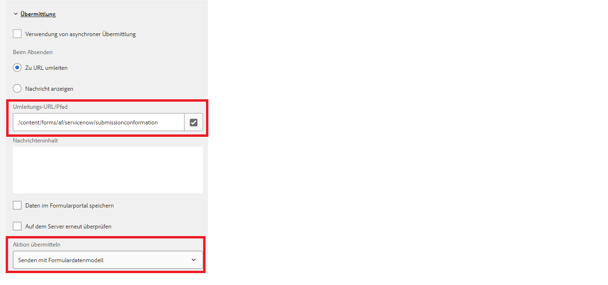

# Anpassen der Dankeseite

Wenn Sie ein adaptives Formular an einen REST-Endpunkt senden, können Sie eine Bestätigungsmeldung anzeigen, die die Benutzenden darüber informiert, dass die Formularübermittlung erfolgreich war. Die POST-Antwort enthält Details zur Übermittlung, wie z. B. die Sende-ID und eine gut durchdachte Bestätigungsnachricht mit der Sende-ID, was zu einem besseren Benutzererlebnis beiträgt. Diese Antwort kann auf der Dankeseite angezeigt werden, die mit Ihrem adaptiven Formular konfiguriert wurde.

Folgender Screenshot zeigt das Absenden eines Formulars mit der Übermittlungsaktion „Formulardatenmodell“ mit einer konfigurierten Dankeseite



Die POST eines Formulardatenmodells gibt in der Antwort immer ein JSON-Objekt zurück. Diese JSON-Datei ist in der URL der Dankeseite als Abfrageparameter mit dem Namen _fdmSubmitResult_ verfügbar. Sie können diesen Anfrageparameter analysieren und die JSON-Elemente auf der Dankeseite anzeigen.
Folgender Beispiel-Code analysiert die JSON-Antwort, um den Wert des Zahlenfelds zu extrahieren. Zum Ausfüllen des Formulars wird dann die entsprechende XML-Datei erstellt und in der slingRequest übergeben. Dieser Code wird normalerweise in das JSP der Seitenkomponente geschrieben, die mit der adaptiven Formularvorlage verknüpft ist.

```java
if(request.getParameter("fdmSubmitResult")!=null)
{
    String fdmSubmitResult =  request.getParameter("fdmSubmitResult");
    String status = request.getParameter("status");
    com.google.gson.JsonObject jsonObject = com.google.gson.JsonParser.parseString(fdmSubmitResult).getAsJsonObject();
    String caseNumber = jsonObject.get("result").getAsJsonObject().get("number").getAsString();
    slingRequest.setAttribute("data","<afData><afUnboundData><data><caseNumber>"+caseNumber+"</caseNumber><status>"+status+"</status></data></afUnboundData></afData>");
}
```

Es wird empfohlen, Ihre Dankeseite anhand einer neuen Vorlage für adaptive Formulare zu erstellen, mit der Sie den benutzerdefinierten Code schreiben können, um die Antwort aus den Anfrageparametern zu extrahieren.

## Testen der Lösung

Erstellen Sie ein adaptives Formular und konfigurieren Sie es so, dass es mit der Übermittlungsaktion für das Formulardatenmodell gesendet wird.
[Bereitstellen der Beispielvorlage für adaptive Formulare](assets/thank-you-page-template.zip)
Erstellen Sie ein Dankesformular anhand dieser Vorlage
Verknüpfen Sie diese Dankeseite mit Ihrem Hauptformular
Ändern Sie den JSP-Code in [createXml.jsp](http://localhost:4502/apps/thank-you-page-template/component/page/thankyoupage/createxml.jsp), um die XML zu erstellen, die zum Vorausfüllen des adaptiven Formulars erforderlich ist.
Vorschau und Übermittlung eines adaptiven Formulars.
Die Dankeseite sollte angezeigt und mit Daten vorausgefüllt werden, wie in der XML angegeben
