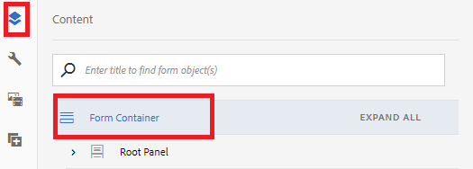
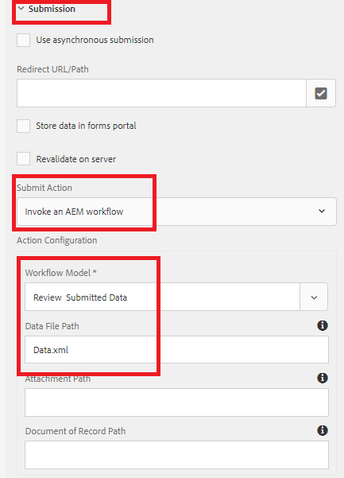

# Konfigurieren des adaptiven Formulars zum Auslösen AEM Workflows

* Herunterladen [des adaptiven Formulars](assets/time-off-application.zip)
* Nach [Formular und Dokumenten suchen](http://localhost:4502/aem/forms.html/content/dam/formsanddocuments)
* Klicken Sie auf Erstellen -> Datei-Upload. Wählen Sie das in Schritt 1 heruntergeladene Formular aus
* Open [Adaptive Form in edit mode](http://localhost:4502/editor.html/content/forms/af/timeofapplication.html).
* Öffnen des Inhaltsexplorers
   
* Wählen Sie den Knoten &quot;Form Container&quot;und öffnen Sie seine Konfigurationseigenschaften
   
* Bedienfeld &quot;Übermittlung&quot;erweitern
* Legen Sie die Übermittlungsaktion des Formulars wie im Screenshot oben angegeben fest.
   _Notieren Sie sich unbedingt den Wert, der im Feld Datendateipfad angegeben ist. Dieser Wert muss mit dem Wert übereinstimmen, den Sie im Abschnitt &quot;Vorauffüllen&quot;der Komponente &quot;Aufgabe zuweisen&quot;Ihres Workflows angeben._

Wenn Sie das adaptive Formular nun ausfüllen und senden, wird der mit der Übermittlungsaktion des Formulars verbundene Arbeitsablauf ausgelöst.
