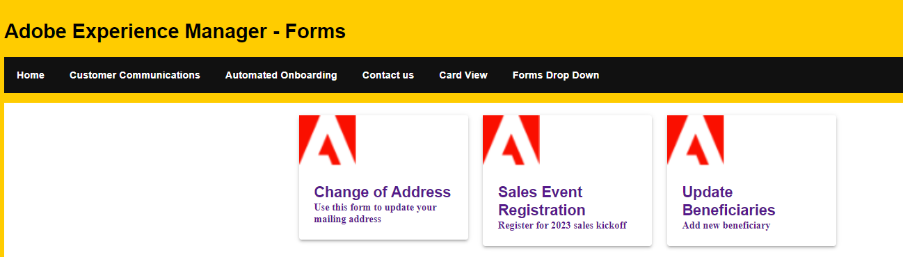

# Abrufen und Anzeigen der Formulare im Kartenformat

Das Kartenansichtsformat ist ein Design-Muster, das Informationen oder Daten in Form von Karten darstellt. Jede Karte stellt einen diskreten Inhalt oder Dateneintrag dar und besteht normalerweise aus einem visuell getrennten Container mit spezifischen Elementen, die darin angeordnet sind.
Klickbare Karten in React sind interaktive Komponenten, die Karten oder Kacheln ähneln und von Benutzenden angeklickt oder angetippt werden können. Wenn Benutzende auf eine klickbare Karte klicken oder tippen, wird eine bestimmte Aktion oder ein bestimmtes Verhalten ausgelöst, z. B. das Navigieren zu einer anderen Seite, das Öffnen eines Modals oder das Aktualisieren der Benutzeroberfläche.

In diesem Artikel verwenden wir die [listforms-API](https://opensource.adobe.com/aem-forms-af-runtime/api/#tag/List-Forms/operation/listForms), um die Formulare abzurufen, die Formulare im Kartenformat anzuzeigen und das adaptive Formular beim Klick-Ereignis zu öffnen.



## Kartenvorlage

Der folgende Code wurde zum Entwerfen der Kartenvorlage verwendet. Die Kartenvorlage zeigt den Titel und die Beschreibung des adaptiven Formulars zusammen mit dem Adobe-Logo an. [Komponenten der Material-Benutzeroberfläche](https://mui.com/) wurden bei der Erstellung dieses Layouts verwendet.


```javascript
import Container from "@mui/material/Container";
import Form from './Form';
import PlainText from './plainText'
import TextField from './TextField'
import Button from './Button';
import { AdaptiveForm } from "@aemforms/af-react-renderer";

import { CardActionArea, Typography } from "@mui/material";
import { Box } from "@mui/system";
import { useState,useEffect } from "react";
import DisplayForm from "../DisplayForm";
import { Link } from "react-router-dom";
export default function FormCard({headlessForm}) {
const extendMappings =
    {
        'plain-text' : PlainText,
        'text-input' : TextField,
        'button' : Button,
        'form': Form
    };
   
    return (
        
            <Grid item xs={3}>
                <Paper elevation={3}>
                    
                    <Box padding={3}>
                        <Link style={{ textDecoration: 'none' }} to={`/displayForm${headlessForm.id}`}>
                            <Typography variant="subtititle2" component="h2">
                                {headlessForm.title}
                            </Typography>
                            <Typography variant="subtititle3" component="h4">
                                {headlessForm.description}
                            </Typography>
                        </Link>
                
                    </Box>
                </Paper>
            </Grid>
    );
    

};
```

Die folgende Route wurde in Main.js definiert, um zu DisplayForm.js zu navigieren

```javascript
    <Route path="/displayForm/:formID" element={<DisplayForm/>} exact/>
```

## Abrufen der Formulare

Die listforms-API wurde verwendet, um die Formulare vom AEM-Server abzurufen. Die API gibt ein Array von JSON-Objekten zurück, wobei jedes JSON-Objekt ein Formular darstellt.

```javascript
import { useState,useEffect } from "react";
import React, { Component } from "react";
import FormCard from "./components/FormCard";
import Grid from "@mui/material/Grid";
import Paper from "@mui/material/Paper";
import Container from "@mui/material/Container";
 
export default function ListForm(){
    const [fetchedForms,SetHeadlessForms] = useState([])
    const getForms=async()=>{
        const response = fetch("/adobe/forms/af/listforms")
        let headlessForms = await (await response).json();
        console.log(headlessForms.items);
        SetHeadlessForms(headlessForms.items);
    }
    useEffect( ()=>{
        getForms()
        

    },[]);
    return(
        <div>
             <div>
                <Container>
                   <Grid container spacing={3}>
                       {
                            fetchedForms.map( (afForm,index) =>
                                <FormCard headlessForm={afForm} key={index}/>
                         
                            )
                        }
                    </Grid>
                </Container>
             </div>

        </div>
    )
}
```

Im obigen Code werden die abgerufenen Formulare mit der map-Funktion durchlaufen, und für jedes Element im fetchedForms-Array wird eine FormCard-Komponente erstellt und dem Grid-Container hinzugefügt. Sie können jetzt die ListForm-Komponente in Ihrer React-App gemäß Ihren Anforderungen verwenden.

## Nächste Schritte

[Anzeigen des adaptiven Formulars, wenn Benutzende auf eine Karte klicken](./open-form-card-view.md)
