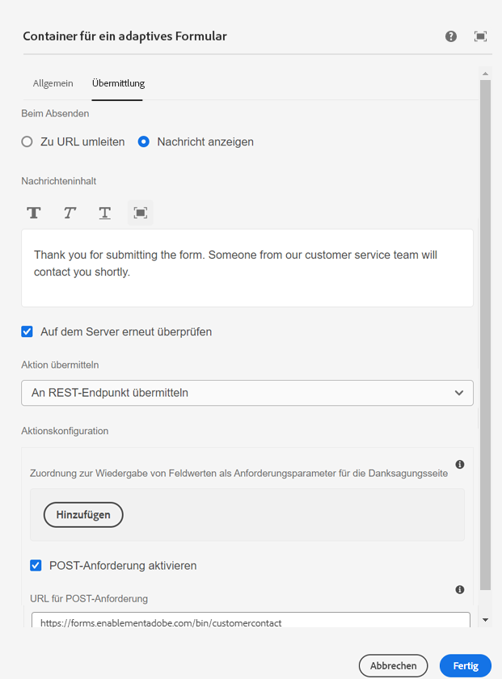

# Anzeige der konfigurierten Dankesnachricht

Eine Dankesnachricht bei der Formularübermittlung ist eine aufmerksame Möglichkeit, Benutzenden für das Ausfüllen und Übermitteln eines Formulars eine Rückmeldung zu geben und zu danken. Sie bestätigt den Empfang des übermittelten Formulars und drückt Wertschätzung dafür aus. Die Dankesnachricht wird über die Registerkarte „Übermittlung“ im Container für adaptive Formulare konfiguriert.



Auf die konfigurierte Dankesnachricht kann im onSuccess-Ereignis-Handler der AdaptiveForm-Superkomponente zugegriffen werden.
Der Code für die Zuordnung des onSuccess-Ereignisses und der Code für den onSuccess-Ereignis-Handler sind unten aufgeführt.

```javascript
<AdaptiveForm mappings={extendMappings} onSubmitSuccess={onSuccess} formJson={selectedForm}/>
```

```javascript
const onSuccess=(action) =>{
        let body = action.payload?.body;
        debugger;
        setThankYouMessage(body.thankYouMessage.replace(/<(.|\n)*?>/g, ''));
        console.log("Thank you message "+body.thankYouMessage.replace(/<(.|\n)*?>/g, ''));

      }
```

Die vollständige Funktionskomponente für Kontakte ist unten angegeben.

```javascript
import Form from './components/Form';
import PlainText from './components/plainText';
import TextField from './components/TextField';
import Button from './components/Button';
import { useState,useEffect } from "react";
import { AdaptiveForm } from "@aemforms/af-react-renderer";
export default function Contact(){
  
    const [selectedForm, setForm] = useState("");
    const [thankYouMessage, setThankYouMessage] = useState("");
    const [formSubmitted, setFormSubmitted] = useState(false);
  
    const extendMappings = {
        'plain-text' : PlainText,
        'text-input' : TextField,
        'button' : Button,
        'form': Form
      };
     const onSuccess=(action) =>{
        let body = action.payload?.body;
        debugger;
        setFormSubmitted(true);
        setThankYouMessage(body.thankYouMessage.replace(/<(.|\n)*?>/g, ''));
        // Remove any html tags in the thank you message
        console.log("Thank you message "+body.thankYouMessage.replace(/<(.|\n)*?>/g, ''));

      }
      
      const getForm = async () => {
        
        const resp = await fetch('/adobe/forms/af/L2NvbnRlbnQvZm9ybXMvYWYvY29udGFjdHVz');
        // Get the form id manually using the listform api
        let formJSON = await resp.json();
        setForm(formJSON.afModelDefinition)
      }
      useEffect( ()=>{
        getForm()
        

    },[]);
    
    return(
        
        <div>
           {!formSubmitted ?
            (
                <div>
                    <h1>Get in touch with us!!!!</h1>
                    <AdaptiveForm mappings={extendMappings} onSubmitSuccess={onSuccess} formJson={selectedForm}/>
                </div>
            ) :
            (
                <div>
                    <div>{thankYouMessage}</div>
                </div>
            )}
        </div>
      
          
        
    )
}
```

Der obige Code verwendet native HTML-Komponenten, die den im adaptiven Formular verwendeten Komponenten zugeordnet sind. Beispielsweise ordnen wir die text-input-Komponente des adaptiven Formulars der TextField-Komponente zu. Die im Artikel verwendeten nativen Komponenten können [hier](./assets/native-components.zip) heruntergeladen werden.
