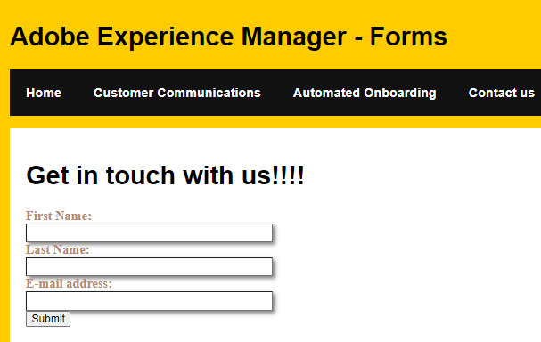

# Einbetten eines Headless-adaptiven Formulars

In diesem Artikel werden die Grundlagen zum Einbetten eines Headless-adaptiven Formulars in Ihre Spa-Website behandelt. In diesem Artikel wird davon ausgegangen, dass Sie über eine vorhandene Single-Page-App verfügen und ein in AEM Forms 6.5.16 erstelltes adaptives Formular mit Kernkomponenten einbetten möchten.
Durch das Einschließen eines Formulars in eine Einzelseiten-App können Benutzer Daten nahtlos eingeben und senden, ohne dass eine Seitenaktualisierung erforderlich ist. Dies verbessert die Interaktivität und Effizienz der Anwendung.

Der folgende Screenshot zeigt ein Kontaktformular in SPA

## Voraussetzungen

* React-Erlebnis

* Laufende Instanz von AEM Forms 6.5.16

* [Headless-Formulare in der Autoren- und Veröffentlichungsinstanz aktivieren](https://experienceleague.adobe.com/docs/experience-manager-headless-adaptive-forms/using/quick-setup/enable-headless-adaptive-forms-and-core-components.html?lang=en)

## Nächste Schritte

[Installieren von Abhängigkeiten](./install-af-react-libraries.md)

