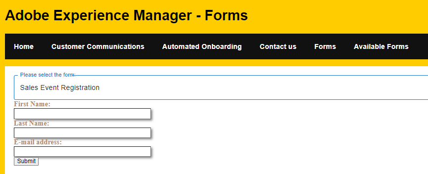

# Auswählen eines Formulars zum Ausfüllen aus einer Dropdown-Liste

Dropdown-Listen bieten eine kompakte und organisierte Möglichkeit, Benutzenden eine Liste von Optionen anzuzeigen. Die Elemente in der Dropdown-Liste werden mit den Ergebnissen der [listforms-API](https://opensource.adobe.com/aem-forms-af-runtime/api/#tag/List-Forms/operation/listForms) befüllt



## Dropdown-Liste

Der folgende Code wurde verwendet, um die Dropdown-Liste mit den Ergebnissen des listforms-API-Aufrufs zu füllen. Basierend auf der Auswahl der Benutzenden wird das adaptive Formular angezeigt, das die Benutzenden ausfüllen und senden können. Bei der Erstellung dieser Oberfläche wurden [Komponenten der Material-Benutzeroberfläche](https://mui.com/) verwendet

```javascript
import * as React from 'react';
import Form from './components/Form';
import PlainText from './components/plainText';
import TextField from './components/TextField';
import Button from './components/Button';
import Box from '@mui/material/Box';
import InputLabel from '@mui/material/InputLabel';
import MenuItem from '@mui/material/MenuItem';
import FormControl from '@mui/material/FormControl';
import Select, { SelectChangeEvent } from '@mui/material/Select';
import { AdaptiveForm } from "@aemforms/af-react-renderer";

import { useState,useEffect } from "react";
export default function SelectFormFromDropDownList()
 {
    const extendMappings =
    {
        'plain-text' : PlainText,
        'text-input' : TextField,
        'button' : Button,
        'form': Form
    };

const[formID, setFormID] = useState('');
const[afForms,SetOptions] = useState([]);
const [selectedForm, setForm] = useState('');
const HandleChange = (event) =>
     {
        console.log("The form id is "+event.target.value) 
    
        setFormID(event.target.value)
        
     };
const getForm = async () =>
     {
        
        console.log("The formID in getForm"+ formID);
        const resp = await fetch(`/adobe/forms/af/${formID}`);
        let formJSON = await resp.json();
        console.log(formJSON.afModelDefinition);
        setForm(formJSON.afModelDefinition);
     }
const getAFForms =async()=>
     {
        const response = await fetch("/adobe/forms/af/listforms")
        //let myresp = await response.status;
        let myForms = await response.json();
        console.log("Got response"+myForms.items[0].title);
        console.log(myForms.items)
        
        //setFormID('test');
        SetOptions(myForms.items)

        
     }
     useEffect( ()=>{
        getAFForms()
        

    },[]);
    useEffect( ()=>{
        getForm()
        

    },[formID]);

  return (
    <Box sx={{ minWidth: 120 }}>
      <FormControl fullWidth>
        <InputLabel id="demo-simple-select-label">Please select the form</InputLabel>
        <Select
          labelId="demo-simple-select-label"
          id="demo-simple-select"
          value={formID}
          label="Please select a form"
          onChange={HandleChange}
          
        >
       {afForms.map((afForm,index) => (
    
        
          <MenuItem  key={index} value={afForm.id}>{afForm.title}</MenuItem>
        ))}
        
       
        </Select>
      </FormControl>
      <div><AdaptiveForm mappings={extendMappings} formJson={selectedForm}/></div>
    </Box>
    

  );
  

}
```

Die beiden folgenden API-Aufrufe wurden bei der Erstellung dieser Benutzeroberfläche verwendet

* [ListForm](https://opensource.adobe.com/aem-forms-af-runtime/api/#tag/List-Forms/operation/listForms). Der Aufruf zum Abrufen der Formulare erfolgt nur einmal, wenn die Komponente gerendert wird. Die Ergebnisse des API-Aufrufs werden in der afForms-Variablen gespeichert.
Im obigen Code durchlaufen wir afForms mithilfe der Zuordnungsfunktion. Für jedes Element im afForms-Array wird eine MenuItem-Komponente erstellt und der Select-Komponente hinzugefügt.

* Formular abrufen – Es erfolgt ein GET-Aufruf an [getForm](https://opensource.adobe.com/aem-forms-af-runtime/api/#tag/Get-Form-Definition), wobei die ID die ID des von der bzw. vom Benutzenden in der Dropdown-Liste ausgewählten adaptiven Formulars ist. Das Ergebnis dieses GET-Aufrufs wird in selectedForm gespeichert.

```
const resp = await fetch(`/adobe/forms/af/${formID}`);
let formJSON = await resp.json();
console.log(formJSON.afModelDefinition);
setForm(formJSON.afModelDefinition);
```

* Anzeigen des ausgewählten Formulars. Der folgende Code wurde verwendet, um das ausgewählte Formular anzuzeigen. Das AdaptiveForm-Element wird im npm-Paket „aemforms/af-response-renderer“ bereitgestellt und erwartet die Zuordnungen und „formJson“ als Eigenschaften

```
<div><AdaptiveForm mappings={extendMappings} formJson={selectedForm}/></div>
```

## Nächste Schritte

[Anzeigen der Formulare im Karten-Layout](./display-forms-card-view.md)
