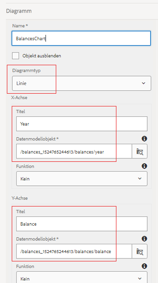

# Konfigurieren des Liniendiagramms für Ihr erstes interaktives Kommunikationsmittel-Dokument

In diesem Teil fügen wir dem Bedienfeld Kontofortschritt ein Liniendiagramm hinzu.

Melden Sie sich bei AEM Forms an und navigieren Sie zu Adobe Experience Manager > Forms > Forms &amp; Dokumente.

Öffnen Sie den Ordner &quot;401KStatement&quot;.

Öffnen Sie die 401KStatement im Bearbeitungsmodus.

Mit AEM Forms 6.4 ist es ganz einfach, Daten mit verschiedenen Diagrammtypen anzuzeigen. Wir werden ein Liniendiagramm verwenden, um die Salden nach Jahren anzuzeigen.

Tippen Sie auf der rechten Seite auf den Bereich **Zielgruppe** und klicken Sie auf das Symbol &quot;+&quot;, um das Dialogfeld &quot;Komponente einfügen&quot;aufzurufen.

Wählen Sie Diagramm, um die Diagrammkomponente einzufügen.

Konfigurieren Sie die Diagrammkomponente gemäß den Einstellungen im Screenshot unten und speichern Sie Ihre Einstellungen, indem Sie auf das blaue Häkchen klicken.

Stellen Sie sicher, dass Sie das richtige Formulardatenmodellelement für die X- und Y-Achse auswählen.

**Liniendiagrammeinstellungen in AEM Forms 6.4**

**Liniendiagrammeinstellungen in AEM Forms 6.5**

