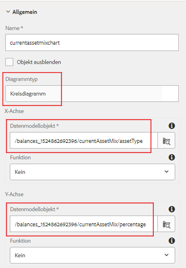
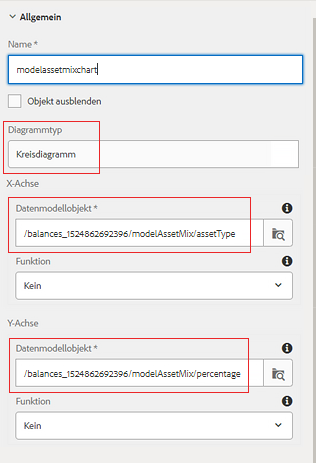

# Konfigurieren des Investment Mix-Bedienfelds

In diesem Teil werden wir Kreisdiagramme hinzufügen, um den aktuellen und Modell-Investment-Mix anzuzeigen.

* Melden Sie sich bei AEM Forms an und navigieren Sie zu Adobe Experience Manager > Forms > Forms &amp; Documents.

* Öffnen Sie den Ordner 401KStatement .

* Öffnen Sie die 401KStatement im Bearbeitungsmodus.

* Wir fügen 2 Tortendiagramme hinzu, die den aktuellen und Modell-Investment-Mix des Kontoinhabers darstellen.

## Aktueller Asset-Mix {#current-asset-mix}

* Tippen Sie auf das Bedienfeld &quot;CurrentAssetMix&quot;auf der rechten Seite, wählen Sie das Symbol &quot;+&quot;aus und fügen Sie eine Textkomponente ein. Ändern Sie den Standardtext in &quot;Aktueller Asset-Mix&quot;.

* Tippen Sie auf das Bedienfeld &quot;CurrentAssetMix&quot;, wählen Sie das Symbol &quot;+&quot;aus und fügen Sie die Diagrammkomponente ein. Tippen Sie auf die neu eingefügte Diagrammkomponente und klicken Sie auf das Symbol &quot;Schraubenschlüssel&quot;, um das Konfigurationseigenschaftsblatt für das Diagramm zu öffnen.

* Legen Sie die Eigenschaften wie in der Abbildung unten dargestellt fest. Stellen Sie sicher, dass der Diagrammtyp Kreisdiagramm ist.

* Beachten Sie das Datenmodellobjekt, das an die X- und Y-Achsen gebunden ist. Sie müssen das Stammelement des Formulardatenmodells auswählen und dann im Drilldown-Verfahren das entsprechende Element auswählen.

* 

## Modell-Asset-Mix {#model-asset-mix}

* Tippen Sie auf das Bedienfeld &quot;RecommendedAssetMix&quot;auf der rechten Seite, wählen Sie das Symbol &quot;+&quot;aus und fügen Sie eine Textkomponente ein. Ändern Sie den Standardtext in &quot;Model Asset Mix&quot;.

* Tippen Sie auf das Bedienfeld &quot;RecommendedAssetMix&quot;, wählen Sie das Symbol &quot;+&quot;aus und fügen Sie die Diagrammkomponente ein. Tippen Sie auf die neu eingefügte Diagrammkomponente und klicken Sie auf das Symbol &quot;Schraubenschlüssel&quot;, um das Konfigurationseigenschaftsblatt für das Diagramm zu öffnen.

* Legen Sie die Eigenschaften wie in der Abbildung unten dargestellt fest. Stellen Sie sicher, dass der Diagrammtyp Kreisdiagramm ist.

* Beachten Sie das Datenmodellobjekt, das an die X- und Y-Achsen gebunden ist. Sie müssen das Stammelement des Formulardatenmodells auswählen und dann im Drilldown-Verfahren das entsprechende Element auswählen.

* 

## Nächste Schritte

[Bereitstellung des Webkanaldokuments vorbereiten](./parttwelve.md)
