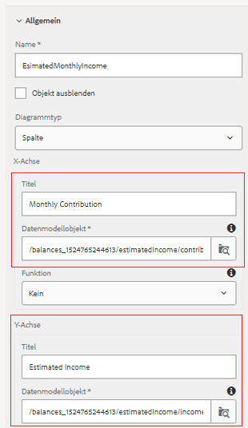

# Konfigurieren des Outlook-Bedienfelds für Ruhestand{#configuring-retirement-outlook-panel}

* Dies ist Teil 10 eines mehrstufigen Tutorials zur Erstellung Ihres ersten interaktiven Kommunikations-Dokuments. In diesem Teil konfigurieren wir das Retirement Outlook-Bedienfeld, indem wir Text- und Diagrammkomponenten hinzufügen.

* Melden Sie sich bei AEM Forms an und navigieren Sie zu Adobe Experience Manager > Forms > Forms &amp; Dokumente.

* Öffnen Sie den Ordner &quot;401KStatement&quot;.

* Öffnen Sie das Dokument 401KStatement im Bearbeitungsmodus.

**linken Fensterbereich konfigurieren - Zielgruppe**

* Tippen Sie auf der rechten Seite auf das linke Bedienfeld und klicken Sie auf das Pluszeichen, um das Dialogfeld &quot;Zielgruppe einfügen&quot;aufzurufen.

* Komponente &quot;Text einfügen&quot;

* Tippen Sie vorsichtig auf die neu hinzugefügte Textkomponente, um die Komponenten-Symbolleiste aufzurufen.

* Wählen Sie das Symbol &quot;Stift&quot;, um den Standardtext zu bearbeiten.

* Ersetzen Sie den Standardtext durch &quot;**Ihr Rentenergebnis-Outlook&quot;**

**RightsPanel-Zielgruppe konfigurieren**

* Tippen Sie auf der rechten Seite auf die Zielgruppe RightPanel und klicken Sie auf das Pluszeichen, um das Dialogfeld &quot;Komponente einfügen&quot;aufzurufen.

* Komponente &quot;Text einfügen&quot;

* Tippen Sie vorsichtig auf die neu hinzugefügte Textkomponente, um die Komponenten-Symbolleiste aufzurufen.

* Wählen Sie das Symbol &quot;Stift&quot;, um den Standardtext zu bearbeiten.

* Ersetzen Sie den Standardtext durch &quot;**Geschätztes monatliches Renteneinkommen&quot;**

## hinzufügen Ruhestandseinkommen Outlook-Dokument Fragment {#add-retirement-income-outlook-document-fragment}

* Klicken Sie auf das Asset-Symbol und wenden Sie den Filter an, um Assets vom Typ &quot;Dokument-Fragmente&quot;anzuzeigen. Ziehen Sie das Fragment RetirementIncomeOutlook-Dokument in den Bereich Zielgruppe des linken Bedienfelds.

* Sie können [auf diese Seite](https://helpx.adobe.com/experience-manager/kt/forms/using/interactive-communication-web-channel-aem-forms/9.html) verweisen, wenn Sie Inhaltsbereiche mit einem Dokument-Fragment versehen.

## Geschätztes Monatseinkommen-Diagramm {#adding-estimated-monthly-income-chart} hinzufügen

* Klicken Sie rechts auf den Bereich Zielgruppe RightPanel. Klicken Sie auf das &quot;+&quot;-Symbol, um die Diagrammkomponente einzufügen. Wir verwenden ein Spaltendiagramm, um das geschätzte Monatseinkommen anzuzeigen. Tippen Sie vorsichtig auf die neu eingefügte Diagrammkomponente. Wählen Sie das Symbol &quot;Schraubenschlüssel&quot;, um das Konfigurationseigenschaftsblatt zu öffnen.Konfigurieren Sie das Diagramm mit den folgenden Eigenschaften, wie im Screenshot unten dargestellt.

**AEM Forms 6.4 - Konfiguration des Diagramms zur Schätzung des monatlichen Einkommens**

**AEM Forms 6.5 - Konfiguration des Diagramms der geschätzten Monatseinkommen**

