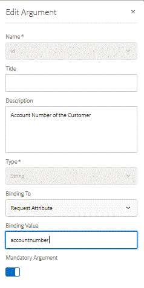

# Webkanaldokument für die Bereitstellung einrichten {#setting-up-the-delivery-of-web-channel-document}

In diesem Teil sehen wir uns den Versand des Webkanaldokuments per E-Mail an.

Nachdem Sie Ihr Dokument zur interaktiven Kommunikation mit Webkanälen definiert und getestet haben, benötigen Sie einen Bereitstellungsmechanismus, um das Webkanaldokument an den Empfänger zu senden.

Um E-Mails als Bereitstellungsmechanismus für unser Webkanaldokument verwenden zu können, müssen wir eine geringfügige Änderung am Formulardatenmodell vornehmen.

[Weitere Informationen zum Webkanal-Versand per E-Mail](/help/forms/interactive-communications/delivery-of-web-channel-document-tutorial-use.md)

Melden Sie sich bei AEM Forms an.

* Navigieren Sie zu Forms > Datenintegrationen .

* Öffnen Sie das Datenmodell RetirementAccountStatement im Bearbeitungsmodus.

* Wählen Sie das Bildobjekt aus und klicken Sie auf die Schaltfläche &quot;Bearbeiten&quot;.

* Wählen Sie das Stiftsymbol aus, um das id-Argument im Bearbeitungsmodus zu öffnen.

* Ändern Sie die Bindung in &quot;RequestAttribute&quot;.

* Legen Sie die Kontonummer im Bindungswert wie unten dargestellt fest.

* Auf diese Weise übergeben wir die Kontonummer über das Anfrageattribut an das Formulardatenmodell.

* Achten Sie darauf, Ihre Änderungen zu speichern.
   

## Testen der E-Mail-Bereitstellung des Webkanal-Dokuments {#test-email-delivery-of-web-channel-document}

* [Installieren von Beispiel-Assets mit Package Manager](assets/webchanneldelivery.zip)
* [Bei crx anmelden](http://localhost:4502/crx/de/index.jsp#)

* Navigieren Sie zu /home/users

* Suchen Sie nach Admin-Benutzer unter dem Knoten des Benutzers.

* Wählen Sie den Profilknoten des Admin-Benutzers aus.

* Erstellen Sie eine Eigenschaft mit der Bezeichnung &quot;Kundennummer&quot;. Stellen Sie sicher, dass der Eigenschaftstyp eine Zeichenfolge ist.

* Setzen Sie den Wert dieser Eigenschaft der Kundennummer auf &quot;3059827&quot;. Sie können diesen Wert beliebig auf eine zufällige Zahl einstellen.

* [Öffnen Sie getad.html](http://localhost:4502/content/getad.html)

* Der mit dieser URL verknüpfte Code erhält die Kontonummer des angemeldeten Benutzers. Diese Kontonummer wird dann als Anforderungsattribut an den FDM übergeben. Der FDM ruft dann die mit dieser Kontonummer verknüpften Daten ab und füllt das Webkanaldokument aus.

>[!NOTE]
>
>Sehen Sie sich die **/apps/AEMForms/fetchad/GET.jsp**-Datei in crx an. Vergewissern Sie sich, dass die String-Variable webChannelDocument auf einen gültigen Pfad für Kommunikationsdokumente verweist.
