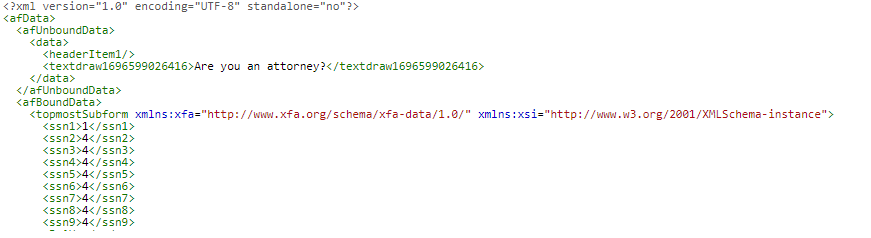
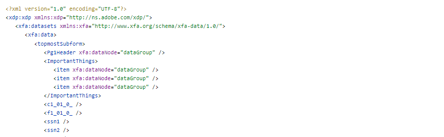

# Einführung

Der erste Schritt besteht darin, ein Schema zu erstellen, das auf den Daten basiert, die zum Ausfüllen des adaptiven Formulars verwendet werden sollen.

## XFA basiert auf einem Schema

Verwenden Sie das Schema, um Ihr adaptives Formular zu erstellen

## XFA basiert nicht auf einem Schema

* Öffnen Sie die XDP in AEM Forms Designer.
* Datei auswählen | Formular-Eigenschaften | Vorschau.
* Klicken Sie auf „Vorschaudaten erstellen“.
* Klicken Sie auf „Erstellen“.
* Geben Sie einen aussagekräftigen Dateinamen wie „`form-data.xml`“ an

Sie können eines der kostenlosen Online-Tools verwenden, um aus den im vorherigen Schritt generierten XML-Daten ein [XSD](https://www.freeformatter.com/xsd-generator.html) zu generieren.

Erstellen Sie ein adaptives Formular basierend auf dem Schema aus dem vorherigen Schritt.

>[!NOTE]
>Es wird immer empfohlen, die Daten zu untersuchen, die bei der Übermittlung des adaptiven Formulars generiert werden. Auf diese Weise erhalten Sie eine gute Vorstellung vom XML-Format der Daten, die mit dem adaptiven Formular zusammengeführt werden müssen.

Daten, die aus dem adaptiven Formular übermittelt wurden

Aus der PDF-Datei exportierte Daten

Aus den exportierten Daten müssen Sie den Knoten **_topmostSubform_** extrahieren, wobei die entsprechenden Namespaces erhalten bleiben müssen, um die Daten erfolgreich mit dem adaptiven Formular zusammenzuführen.

## Nächste Schritte

[Erstellen eines OSGi-Dienstes](./create-osgi-service.md)
