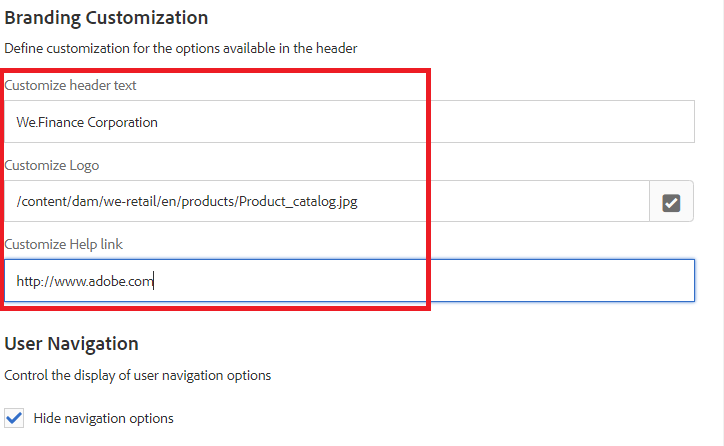

# AEM-Posteingang

AEM Inbox konsolidiert Benachrichtigungen und Aufgaben aus verschiedenen AEM Komponenten, einschließlich Forms Workflows. Wenn ein Forms-Workflow ausgelöst wird, der einen Schritt zur Zuweisung einer Aufgabe enthält, wird die dazugehörige Anwendung als Aufgabe im Posteingang der zugewiesenen Person angezeigt.
In der Benutzeroberfläche des Posteingangs können die Aufgaben in einer Listen- oder einer Kalenderansicht angezeigt werden. Sie können außerdem die Einstellungen für die Anzeige konfigurieren. Sie können Aufgaben anhand verschiedener Parameter filtern. Sie können einen Experience Manager-Posteingang anpassen, um den Standardtitel einer Spalte zu ändern, die Spaltenposition neu anzuordnen und zusätzliche Spalten anzuzeigen, die auf den Daten eines Workflows basieren

>[!NOTE]
>
>Sie müssen Mitglied von Administratoren oder Workflow-Administratoren sein, um die Spalten des Postfachs anzupassen.

## Spaltenanpassung

[AEM Posteingang](http://localhost:4502/aem/inbox)starten Öffnen Sie die Admin-Steuerung, indem Sie auf das Symbol _Liste Ansicht_ klicken und dann _Admin Control_ auswählen, wie im Screenshot unten dargestellt

In der Benutzeroberfläche für die Spaltenanpassung können Sie die folgenden Vorgänge durchführen

* Spalten löschen
* Spalten neu anordnen
* Spalten umbenennen

## Branding-Anpassung

Bei der Branding-Anpassung können Sie die folgenden Schritte ausführen:

* hinzufügen Ihres Firmenlogos
* Kopfzeilentext anpassen
* Link zur Hilfe anpassen
* Navigationsoptionen ausblenden

