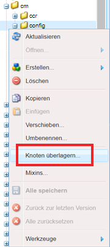
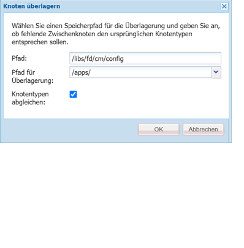
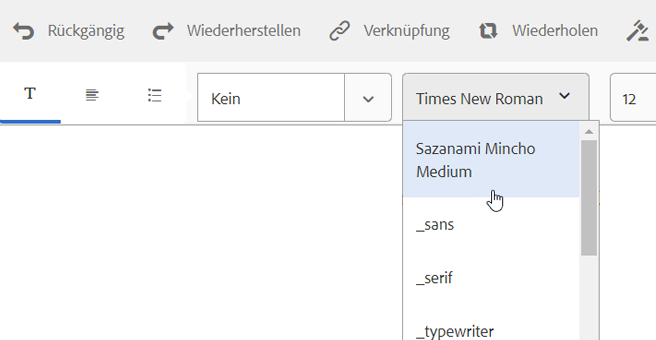

# Texteditor anpassen{#customize-text-editor}

## Übersicht {#overview}

Sie können den Texteditor zum Erstellen von Dokumentfragmenten anpassen, um weitere Schriftarten und Schriftgrade hinzuzufügen. Diese Schriftarten enthalten englische und nicht-englische Schriftarten wie Japanisch.

In den Schrifteinstellungen können Sie folgende Änderungen vornehmen:

* Schriftfamilie und -größe
* Eigenschaften wie Höhe und Zeichenabstand
* Standardwerte für Schriftfamilie und -größe, Höhe, Zeichenabstand und Datumsformat
* Einzüge für Aufzählungszeichen

Dazu müssen Sie folgende Schritte durchführen:

1. [Anpassen von Schriftarten, indem Sie die Datei „tbxeditor-config.xml“ in CRX bearbeiten ](#customizefonts)
1. [Fügen Sie dem Clientcomputer benutzerdefinierte Schriftarten hinzu](#addcustomfonts)

## Anpassen von Schriftarten durch Bearbeiten der Datei „tbxeditor-config.xml“ in CRX {#customizefonts}

Anpassen von Schriften durch Bearbeiten der Datei  tbxeditor-config.xml führen Sie folgende Schritte durch:

1. Wechseln Sie zu `https://'[server]:[port]'/[ContextPath]/crx/de` und melden Sie sich als Administrator an.
1. Erstellen Sie im Programmordner einen Ordner mit dem Namen „config“ mit dem Pfad/der Struktur ähnlich dem config-Ordner, der sich unter libs/fd/cm/config befindet, indem Sie folgende Schritte durchführen:

   1. Klicken Sie mit der rechten Maustaste auf den Elementordner an folgendem Speicherort und wählen Sie **Überlagerungsknoten**:

      `/libs/fd/cm/config`

      

   1. Stellen Sie sicher, dass das Dialogfeld „Überlagerungsknoten“ die folgenden Werte enthält:

      **Pfad**: /libs/fd/cm/config

      **Speicherort**: /apps/

      **Knotentypen abgleichen**: Ausgewählt

      

   1. Klicken Sie auf **OK**. Die Ordnerstruktur wird im Apps-Ordner erstellt.

   1. Klicken Sie auf **Alle speichern**.

1. Erstellen Sie eine Kopie der Datei „tbxeditor-config.xml“ im neu erstellten Konfigurationsordner, indem Sie die folgenden Schritte ausführen:

   1. Klicken Sie mit der rechten Maustaste auf die Datei „tbxeditor-config.xml“ unter „libs/fd/cm/config“ und wählen Sie **Kopieren**.
   1. Klicken Sie mit der rechten Maustaste auf den folgenden Ordner und wählen Sie **Einfügen:**

      `apps/fd/cm/config`

   1. Der Name der eingefügten Datei lautet standardmäßig `copy of tbxeditor-config.xml.` Benennen Sie die Datei in `tbxeditor-config.xml` um und klicken Sie auf **Alles speichern**.

1. Öffnen Sie die Datei „tbxeditor-config.xml“ unter „applications/fd/cm/config“ und nehmen Sie dann die erforderlichen Änderungen vor.

   1. Doppelklicken Sie auf die Datei „tbxeditor-config.xml“ unter „applications/fd/cm/config“. Die Datei wird geöffnet.

      ```xml
      <editorConfig>
         <bulletIndent>0.25in</bulletIndent>
      
         <defaultDateFormat>DD-MM-YYYY</defaultDateFormat>
      
         <fonts>
            <default>Times New Roman</default>
            <font>_sans</font>
            <font>_serif</font>
            <font>_typewriter</font>
            <font>Arial</font>
            <font>Courier</font>
            <font>Courier New</font>
            <font>Geneva</font>
            <font>Georgia</font>
            <font>Helvetica</font>
            <font>Tahoma</font>
            <font>Times New Roman</font>
            <font>Times</font>
            <font>Verdana</font>
         </fonts>
      
         <fontSizes>
            <default>12</default>
            <fontSize>8</fontSize>
            <fontSize>9</fontSize>
            <fontSize>10</fontSize>
            <fontSize>11</fontSize>
            <fontSize>12</fontSize>
            <fontSize>14</fontSize>
            <fontSize>16</fontSize>
            <fontSize>18</fontSize>
            <fontSize>20</fontSize>
            <fontSize>22</fontSize>
            <fontSize>24</fontSize>
            <fontSize>26</fontSize>
            <fontSize>28</fontSize>
            <fontSize>36</fontSize>
            <fontSize>48</fontSize>
            <fontSize>72</fontSize>
         </fontSizes>
      
         <lineHeights>
            <default>2</default>     
            <lineHeight>2</lineHeight>
            <lineHeight>3</lineHeight>
            <lineHeight>4</lineHeight>
            <lineHeight>5</lineHeight>
            <lineHeight>6</lineHeight>
            <lineHeight>7</lineHeight>
            <lineHeight>8</lineHeight>
            <lineHeight>9</lineHeight>
            <lineHeight>10</lineHeight>
            <lineHeight>11</lineHeight>
            <lineHeight>12</lineHeight>
            <lineHeight>13</lineHeight>
            <lineHeight>14</lineHeight>
            <lineHeight>15</lineHeight>
            <lineHeight>16</lineHeight>
         </lineHeights>
      
         <letterSpacings>
            <default>0</default>
            <letterSpacing>0</letterSpacing>
            <letterSpacing>1</letterSpacing>
            <letterSpacing>2</letterSpacing>
            <letterSpacing>3</letterSpacing>
            <letterSpacing>4</letterSpacing>
            <letterSpacing>5</letterSpacing>
            <letterSpacing>6</letterSpacing>
            <letterSpacing>7</letterSpacing>
            <letterSpacing>8</letterSpacing>
            <letterSpacing>9</letterSpacing>
            <letterSpacing>10</letterSpacing>
            <letterSpacing>11</letterSpacing>
            <letterSpacing>12</letterSpacing>
            <letterSpacing>13</letterSpacing>
            <letterSpacing>14</letterSpacing>
            <letterSpacing>15</letterSpacing>
            <letterSpacing>16</letterSpacing>
         </letterSpacings>
      </editorConfig>
      ```

   1. Nehmen Sie die erforderlichen Änderungen in der Datei vor, um Folgendes in den Einstellungen für die Schriftart zu ändern:

      * Hinzufügen oder Entfernen von Schriftfamilie und -größe
      * Eigenschaften wie Höhe und Zeichenabstand
      * Standardwerte für Schriftfamilie und -größe, Höhe, Zeichenabstand und Datumsformat
      * Einzüge für Aufzählungszeichen

      Um zum Beispiel eine japanische Schriftart mit dem Namen Sazanami Mincho Medium hinzuzufügen, müssen Sie Folgendes eintragen in der  XML-Datei: `<font>Sazanami Mincho Medium</font>`. Außerdem müssen Sie diese Schriftart auf dem Client-Computer installieren, der verwendet wird, um auf die Schriftartanpassung zuzugreifen und mit dieser zu arbeiten. Weitere Informationen finden Sie unter[ Hinzufügen von benutzerdefinierten Schriften zum Clientcomputer](#addcustomfonts).

      Sie können auch die Standardeinstellungen für verschiedene Aspekte des Textes ändern und die Schriftarten aus dem Texteditor entfernen, indem Sie die Einträge entfernen.

   1. Klicken Sie auf **Alle speichern**.

## Fügen Sie dem Client-Computer benutzerdefinierte Schriftarten hinzu {#addcustomfonts}

Wenn Sie auf eine Schriftart im Texteditor für Interaktive Kommunikation zugreifen, muss sie auf dem Client-Computer vorhanden sein, den Sie für den Zugriff auf Interaktive Kommunikation verwenden. Um eine benutzerdefinierte Schriftart im Texteditor verwenden zu können, müssen Sie diese zunächst auf dem Client-Computer installieren.

Weitere Informationen zum Installieren von Schriftarten finden Sie hier:

* [Installieren oder Deinstallieren von Schriftarten unter Windows](https://windows.microsoft.com/de-de/windows-vista/install-or-uninstall-fonts) 
* [Mac-Grundlagen: Schriftartenbuch](https://support.apple.com/de-de/HT201749) 

## Zugriff auf Schriftartanpassungen {#access-font-customizations}

Nachdem Sie an den Schriftarten in der Datei „tbxeditor-config.xml“ in CRX Änderungen vorgenommen und die erforderlichen Schriftarten auf dem Client-Computer installiert haben, der verwendet wird, um auf AEM Forms zuzugreifen, werden die Änderungen im Texteditor angezeigt.

Zum Beispiel wird die Schriftart Sazanami Mincho Medium, die in der Prozedur [Anpassen von Schriftarten durch Bearbeiten der Datei „tbxeditor-config.xml“ in CRX](#customizefonts) hinzugefügt wurde, in der Texteditor-Schnittstelle wie folgt angezeigt:



>[!NOTE]
>
>Um Text auf Japanisch anzuzeigen, müssen Sie zunächst den Text mit japanischen Zeichen eingeben. Die Anwendung einer benutzerdefinierten japanischen Schriftart formatiert den Text nur auf bestimmte Weise. Die Anwendung einer benutzerdefinierten japanischen Schriftart ändert englische oder andere Zeichen nicht in japanische Zeichen.
