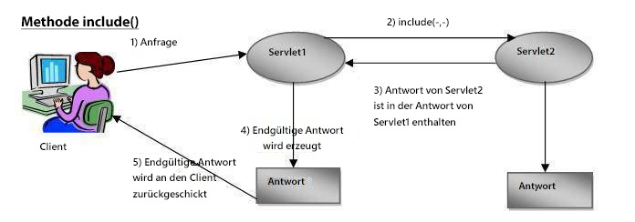
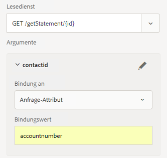

# E-Mail-Versand des Web-Kanal-Dokuments

Nachdem Sie Ihr interaktives Dokument für die interaktive Kommunikation mit dem Web Kanal definiert und getestet haben, benötigen Sie einen Versand-Mechanismus, um das Web-Kanal-Dokument an den Empfänger zu senden.

In diesem Artikel betrachten wir E-Mail als Versand-Mechanismus für Web-Kanal-Dokument. Der Empfänger erhält per E-Mail einen Link zum Web-Kanal-Dokument.Wenn er auf den Link klickt, wird er aufgefordert, sich zu authentifizieren, und das Web-Kanal-Dokument wird mit den Daten des angemeldeten Benutzers gefüllt.

Sehen wir uns das folgende Codefragment an. Dieser Code ist Teil von GET.jsp, der ausgelöst wird, wenn der Benutzer auf den Link in der E-Mail klickt, um das Web-Kanal-Dokument Ansicht. Wir erhalten den angemeldeten Benutzer mit dem Jackrabbit UserManager. Nach Erhalt des angemeldeten Benutzers erhalten wir den Wert der accountNumber-Eigenschaft, die mit dem Profil des Benutzers verknüpft ist.

Dann verbinden wir den Wert accountNumber mit einem Schlüssel namens accountNumber in der Map. Der Schlüssel **accountNumber** wird im Formulardatenmodell als Anforderungsattribut definiert. Der Wert dieses Attributs wird als Eingabeparameter an die Methode zum Lesen des Formulardatenmodells übergeben.

Zeile 7: Wir senden die empfangene Anfrage an ein anderes Servlet, basierend auf dem Ressourcentyp, der von der Interactive Communication Dokument-URL identifiziert wird. Die von diesem zweiten Servlet zurückgegebene Antwort ist in der Antwort des ersten Servlets enthalten.

```java
org.apache.jackrabbit.api.security.user.UserManager um = ((org.apache.jackrabbit.api.JackrabbitSession) session).getUserManager();
org.apache.jackrabbit.api.security.user.Authorizable loggedinUser = um.getAuthorizable(session.getUserID());
String accountNumber = loggedinUser.getProperty("profile/accountNumber")[0].getString();
map.put("accountnumber",accountNumber);
slingRequest.setAttribute("paramMap",map);
CustomParameterRequest wrapperRequest = new CustomParameterRequest(slingRequest,"GET");
wrapperRequest.getRequestDispatcher("/content/forms/af/401kstatement/irastatement/channels/web.html").include(wrapperRequest, response);
```



Visuelle Darstellung des Codes der Zeile 7



Anforderungsattribut definiert für den Lesedienst des Formulardatenmodells


[Beispiel AEM Paket](assets/webchanneldelivery.zip).
