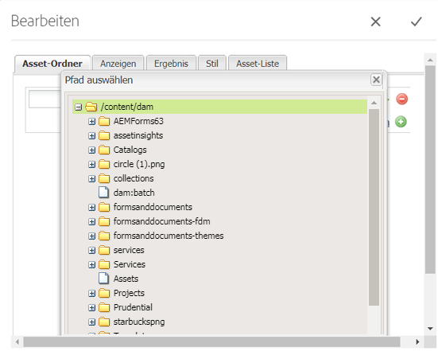
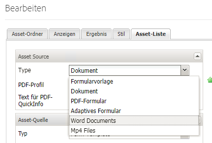

# Registrieren benutzerdefinierter Asset-Typen {#registering-custom-asset-types}

Aktivieren benutzerdefinierter Asset-Typen für die Auflistung im AEMForms Portal

>[!NOTE]
>
>Vergewissern Sie sich, dass Sie AEM 6.3 mit SP1 und die entsprechende AEM Forms Hinzufügen On Installed haben. Diese Funktion funktioniert nur mit AEM Forms 6.3 SP1 und höher

## Basispfad {#specify-base-path} angeben

Der Basispfad ist der Repository-Pfad auf der obersten Ebene, der alle Assets umfasst, die ein Benutzer in der Such- und Listenkomponente Liste haben soll. Bei Bedarf kann der Benutzer auch bestimmte Orte innerhalb des Basispfads im Dialogfeld zum Bearbeiten von Komponenten konfigurieren, sodass die Suche an bestimmten Orten ausgelöst wird, anstatt alle Knoten im Basispfad zu durchsuchen. Standardmäßig wird der Basispfad als Suchpfadkriterium zum Abrufen der Assets verwendet, es sei denn, der Benutzer konfiguriert einen Satz spezifischer Pfade von diesem Speicherort aus. Es ist wichtig, einen optimalen Wert für diesen Pfad zu haben, um eine leistungsstarke Suche durchzuführen. Der Standardwert für den Basispfad bleibt **_/content/dam/formsanddocuments_**, da sich alle AEM Forms-Elemente in **_/content/dam/formsanddocuments befinden._**

Schritte zum Konfigurieren des Basispfads

1. Bei CRX anmelden
1. Navigieren Sie zu **/libs/fd/fp/extensions/querybuilder/basepath**

1. Klicken Sie in der Symbolleiste auf &quot;Überlagerungsknoten&quot;
1. Stellen Sie sicher, dass die Überlagerung &quot;/apps/&quot;lautet.
1. Klicken Sie auf OK
1. Klicken Sie auf „Speichern“.
1. Navigieren Sie zur neuen Struktur, die unter **/apps/fd/fp/extensions/querybuilder/basepath** erstellt wurde.

1. Ändern Sie den Wert der Eigenschaft path in **&quot;/content/dam&quot;**
1. Klicken Sie auf „Speichern“.

Durch Angabe der Pfadeigenschaft zu **&quot;/content/dam&quot;** setzen Sie im Grunde den Basispfad auf /content/dam. Dies kann durch Öffnen der Komponente &quot;Search &amp; Lister&quot;überprüft werden.

## Benutzerdefinierte Asset-Typen {#register-custom-asset-types} registrieren

Wir haben eine neue Registerkarte (Asset-Auflistung) zur Komponente &quot;Suche und Lister&quot;hinzugefügt. Auf dieser Registerkarte werden standardmäßig Asset-Typen und weitere von Ihnen konfigurierte Asset-Typen Liste. Standardmäßig werden die folgenden Asset-Typen aufgelistet

1. Adaptive Formulare
1. Formularvorlagen
1. PDF-Formulare
1. Dokument(Statische PDFs)

**Schritte zum Registrieren benutzerdefinierter Asset-Typen**

1. Überlagerungsknoten von **/libs/fd/fp/extensions/querybuilder/assettypes**

1. Überlagerungsspeicherort auf &quot;/apps&quot;festlegen
1. Navigieren Sie zur neuen Struktur, die unter **/apps/fd/fp/extensions/querybuilder/assettypes ** erstellt wurde.

1. Erstellen Sie unter diesem Speicherort einen Knoten &#39;nt:unstructured&#39; für den zu registrierenden Typ und nennen Sie den Knoten **mp4files. hinzufügen Sie die folgenden beiden Eigenschaften zu diesem mp4files-Knoten**

   1. hinzufügen Eigenschaft &quot;jcr:title&quot;, um den Anzeigenamen des Asset-Typs anzugeben. Legen Sie den Wert von jcr:title auf &quot;MP4-Dateien&quot;fest.
   1. hinzufügen Eigenschaft &quot;type&quot;und legen Sie ihren Wert auf &quot;videos&quot;fest. Dies ist der Wert, den wir in unserer Vorlage zur Liste von Assets des Typs Videos verwenden. Speichern Sie Ihre Änderungen.

1. Erstellen Sie einen Knoten des Typs &quot;nt:unstructured&quot;unter mp4files. Benennen Sie diese Node &quot;searchKriteriums&quot;
1. hinzufügen eines oder mehrere Filter unter Suchkriterien. Angenommen, der Benutzer möchte einen Suchfilter für die Liste mp4Files haben, deren Mime-Typ &quot;video/mp4&quot;ist, können Sie dies hier tun.
1. Erstellen Sie eine Node des Typs &quot;nt:unstructured&quot;unter den Knotensuchkriterien. Benennen Sie diesen Knoten &quot;filetypes&quot;
1. hinzufügen die folgenden 2 Eigenschaften zu diesem Knoten &quot;filetypes&quot;

   1. name: ./jcr:content/metadata/dc:format
   1. Wert: video/mp4

1. Das bedeutet, dass Assets mit der Eigenschaft dc:format gleich video/mp4 als Asset-Typ &quot;MP4-Videos&quot;betrachtet werden. Sie können jede Eigenschaft, die auf dem Knoten &quot;jcr:content/metadata&quot;aufgeführt ist, für die Suchkriterien verwenden

1. **Speichern Sie Ihre Arbeit unbedingt**

Nachdem Sie die oben genannten Schritte ausgeführt haben, wird der neue Asset-Typ (MP4-Dateien) in der Dropdown-Liste &quot;Asset-Typen&quot;der Komponente &quot;Search &amp; Lister&quot;wie unten dargestellt in der Beginn &quot;Search &amp; Lister&quot;angezeigt.

[Wenn Sie Probleme haben, dies zu erreichen, können Sie das folgende Paket importieren.](assets/assettypeskt1.zip) Für das Paket sind zwei benutzerdefinierte Asset-Typen definiert. MP4-Dateien und Worddocuments. Sehen Sie sich die /apps/fd/fp/extensions/querybuilder/assettypes **an.**

[Installieren Sie das Paket](assets/customportalpage.zip) customeportal. Dieses Paket enthält eine Beispielportalseite. Diese Seite wird in Teil 2 dieses Lernprogramms verwendet

