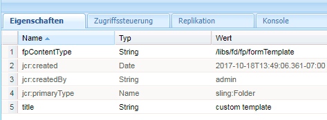
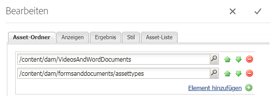
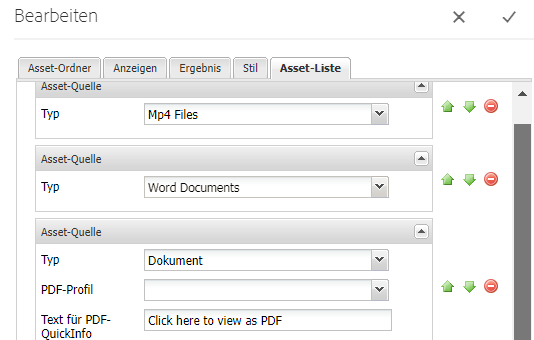

# Auflisten benutzerdefinierter Asset-Typen in AEM Forms {#listing-custom-asset-types-in-aem-forms}

## Erstellen einer benutzerdefinierten Vorlage {#creating-custom-template}


Für die Zwecke dieses Artikels erstellen wir eine benutzerdefinierte Vorlage, um die benutzerdefinierten Asset-Typen und die OOTB-Asset-Typen auf derselben Seite anzuzeigen. Um eine benutzerdefinierte Vorlage zu erstellen, befolgen Sie die folgenden Anweisungen

1. Erstellen Sie ein Sling: Ordner unter /apps. Benennen Sie es &quot; myportalcomponent &quot;
1. Fügen Sie eine fpContentType-Eigenschaft hinzu. Setzen Sie den Wert auf &quot;**/libs/fd/ fp/formTemplate&quot;.**
1. hinzufügen Sie eine Eigenschaft &quot;title&quot;und legen Sie als Wert &quot;custom template&quot;fest. Dieser Name wird in der Dropdown-Liste der Komponente &quot;Search &amp; Lister&quot;angezeigt.
1. Erstellen Sie unter diesem Ordner &quot;template.html&quot;. Diese Datei enthält den Code zum Formatieren und Anzeigen der verschiedenen Asset-Typen.



Im folgenden Code werden die verschiedenen Asset-Typen mithilfe der Such- und Lister-Komponente Liste. Für jeden Asset-Typ erstellen wir separate HTML-Elemente, wie vom Tag &quot;data-type = &quot;videos&quot; dargestellt. Für den Asset-Typ &quot;Videos&quot;verwenden wir das &lt;video>-Element, um das Video inline abzuspielen. Für den Asset-Typ &quot;WordDocuments&quot;verwenden wir unterschiedliche HTML-Markierungen.

```html
<div class="__FP_boxes-container __FP_single-color">
   <div  data-repeatable="true">
     <div class = "__FP_boxes-thumbnail" style="float:left;margin-right:20px;" data-type = "videos">
   <video width="400" controls>
       <source src="${path}" type="video/mp4">
    </video>
         <h3 class="__FP_single-color" title="${name}" tabindex="0">${name}</h3>
     </div>
     <div class="__FP_boxes-thumbnail" style="float:left;margin-right:20px;" data-type = "worddocuments">
       <a href="/assetdetails.html${path}" target="_blank">
           
          </a>
          <h3 class="__FP_single-color" title="${name}" tabindex="0">${name}</h3>
     </div>
  <div class="__FP_boxes-thumbnail" style="float:left;margin-right:20px;" data-type = "xfaForm">
       <a href="/assetdetails.html${path}" target="_blank">
           
          </a>
          <h3 class="__FP_single-color" title="${name}" tabindex="0">${name}</h3>
                <a href="{formUrl}"></a><p>

     </div>
  <div class="__FP_boxes-thumbnail" style="float:left;margin-right:20px;" data-type = "printForm">
       <a href="/assetdetails.html${path}" target="_blank">
           
          </a>
          <h3 class="__FP_single-color" title="${name}" tabindex="0">${name}</h3>
                <a href="{pdfUrl}"></a><p>
     </div>
   </div>
</div>
```

>[!NOTE]
>
>Zeile 11 - Bitte ändern Sie die Bild src, um auf ein Bild Ihrer Wahl in DAM zu zeigen.
>
>Um das adaptive Forms in dieser Vorlage Liste, erstellen Sie ein neues div und legen Sie das data-type-Attribut auf &quot;guide&quot;fest. Sie können den div kopieren und einfügen, dessen data-type=&quot;printForm&quot;lautet, und den Datentyp des neu kopierten div auf &quot;guide&quot; setzen

## Konfigurieren der Komponente &quot;Search &amp; Lister&quot; {#configure-search-and-lister-component}

Sobald wir die benutzerdefinierte Vorlage definiert haben, müssen wir diese benutzerdefinierte Vorlage mit der Komponente &quot;Search and Lister&quot;verknüpfen. Stellen Sie den Browser [auf diese URL ](http://localhost:4502/editor.html/content/AemForms/CustomPortal.html).

Wechseln Sie in den Designmodus und konfigurieren Sie das Absatzsystem, um die Komponente &quot;Search &amp; Lister&quot;in die Gruppe der zulässigen Komponenten aufzunehmen. Die Komponente &quot;Search &amp; Lister&quot;ist Teil der Dokument Services-Gruppe.

Wechseln Sie in den Bearbeitungsmodus und fügen Sie die Komponente &quot;Search &amp; Lister&quot;dem ParSys hinzu.

Öffnen Sie die Konfigurationseigenschaften der Komponente &quot;Search and Lister&quot;. Vergewissern Sie sich, dass die Registerkarte &quot;Asset-Ordner&quot;ausgewählt ist. Wählen Sie die Ordner aus, aus denen die Assets in der Such- und Lister-Komponente Liste werden sollen. Für die Zwecke dieses Artikels habe ich

* /content/dam/VideosAndWordDocuments
* /content/dam/formsanddocuments/assettypes



Registerkarte zur Registerkarte &quot;Anzeige&quot;. Hier wählen Sie die Vorlage aus, in der die Assets in der Such- und Listenkomponente angezeigt werden sollen.

Wählen Sie &quot;benutzerdefinierte Vorlage&quot;aus der Dropdown-Liste aus.


Konfigurieren Sie die Asset-Typen, die im Portal Liste werden sollen. So konfigurieren Sie die Registerkarten der Asset-Liste und konfigurieren die Asset-Typen. In diesem Beispiel haben wir die folgenden Assettypen konfiguriert

1. MP4-Dateien
1. Word-Dokumente
1. Dokument(Dies ist der OOTB-Asset-Typ)
1. Formularvorlage (dies ist OOTB-Asset-Typ)

Der folgende Screenshot zeigt Ihnen die Asset-Typen, die für die Auflistung konfiguriert wurden



Nachdem Sie die Komponente &quot;Search &amp; Lister Portal&quot;konfiguriert haben, ist es an der Zeit, den Listener in Aktion zu sehen. Stellen Sie den Browser [auf diese URL ](http://localhost:4502/content/AemForms/CustomPortal.html?wcmmode=disabled). Das Ergebnis sollte ungefähr dem unten gezeigten Bild entsprechen.

>[!NOTE]
>
>Wenn Ihr Portal benutzerdefinierte Asset-Typen auf einem Veröffentlichungsserver auflistet, vergewissern Sie sich bitte, dass Sie dem Benutzer &quot;fd-service&quot;die &quot;read&quot;-Berechtigung für den Knoten **/apps/fd/fp/extensions/querybuilder** erteilen.


[Bitte laden Sie dieses Paket mit Package Manager herunter und installieren Sie es.](assets/customassettypekt1.zip) Dies enthält Beispiel-MP4- und Word-Dokumente und XDP-Dateien, die als Asset-Typen zur Liste mit der Such- und Listster-Komponente verwendet werden.
