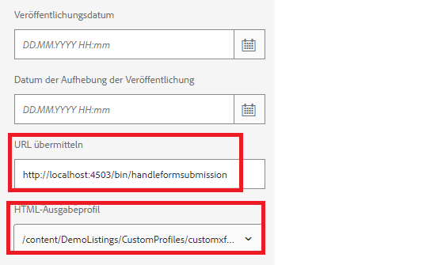

# Umsetzen dieses Anwendungsfalls auf Ihrem System

>[!NOTE]
>
>Damit die Beispiel-Assets auf Ihrem System funktionieren, wird davon ausgegangen, dass Sie Zugriff auf eine AEM Forms-Autoren- und AEM Forms-Veröffentlichungsinstanz haben.

Gehen Sie wie folgt vor, um diesen Anwendungsfall auf Ihrem lokalen System umzusetzen:

## Stellen Sie Folgendes in Ihrer AEM Forms-Autoreninstanz bereit

* [Installieren Sie das MobileFormToWorkflow-Bundle](assets/MobileFormToWorkflow.core-1.0.0-SNAPSHOT.jar)

* [Importieren Sie das benutzerdefinierte Profil](assets/customprofile.zip), das die Daten aus dem HTML5-Formular mit der XDP zusammenführt und ein interaktives PDF-Dokument zurückgibt.

* [Bereitstellen des Pakets &quot;Entwickeln mit Dienstbenutzern&quot;](https://experienceleague.adobe.com/docs/experience-manager-learn/assets/developingwithserviceuser.zip?lang=en)
Fügen Sie den folgenden Eintrag im Apache Sling Service User Mapper Service mithilfe von configMgr hinzu.

```
DevelopingWithServiceUser.core:getformsresourceresolver=fd-service
```

* Sie können die Formularübermittlungen in einem anderen Ordner speichern, indem Sie den Ordnernamen in der Konfiguration AEM Server-Anmeldedaten mit [configMgr](http://localhost:4502/system/console/configMg) angeben. Wenn Sie den Ordner ändern, stellen Sie sicher, dass Sie einen Starter für den Ordner erstellen, um den Workflow **ReviewSubmittedPDF** Trigger.


* [Importieren Sie die Beispiel-XDP und das Workflow-Paket mit Package Manager](assets/xdp-form-and-workflow.zip).


## Stellen Sie die folgenden Assets in der Veröffentlichungsinstanz bereit

* [Installieren Sie das MobileFormToWorkflow-Bundle](assets/MobileFormToWorkflow.core-1.0.0-SNAPSHOT.jar)

* Geben Sie den Benutzernamen/das Kennwort für die Autoreninstanz und einen **vorhandenen Speicherort in Ihrem AEM-Repository** an, um die gesendeten Daten mithilfe von [configMgr](http://localhost:4503/system/console/configMgr) in den Anmeldedaten des AEM-Servers zu speichern. Sie können die URL des Endpunkts auf AEM Workflow-Server unverändert lassen. Dies ist der Endpunkt, der die Daten aus der Übermittlung in dem angegebenen Knoten extrahiert und speichert.
  

* [Bereitstellen des Pakets &quot;Entwickeln mit Dienstbenutzern&quot;](https://experienceleague.adobe.com/docs/experience-manager-learn/assets/developingwithserviceuser.zip?lang=en)
* [Öffnen Sie die OSGi-Konfiguration.](http://localhost:4503/system/console/configMgr)
* Suchen Sie nach **Apache Sling Referrer Filter**. Stellen Sie sicher, dass das Kontrollkästchen „Leere zulassen“ aktiviert ist.
* [Importieren Sie das benutzerdefinierte Profil](assets/customprofile.zip), das die Daten aus dem HTML5-Formular mit der XDP zusammenführt und ein interaktives PDF-Dokument zurückgibt.


## Testen der Lösung

* Bei Ihrer Autoreninstanz anmelden
* [Bearbeiten Sie die erweiterten Eigenschaften von w9.xdp](http://localhost:4502/libs/fd/fm/gui/content/forms/formmetadataeditor.html/content/dam/formsanddocuments/w9.xdp). Vergewissern Sie sich, dass die Sende-URL und das Renderprofil wie unten dargestellt korrekt eingestellt sind.
  

* Publish the w9.xdp
* Bei der Veröffentlichungsinstanz anmelden
* [Vorschau des w9-Formulars anzeigen](http://localhost:4503/content/dam/formsanddocuments/w9.xdp/jcr:content)
* Füllen Sie mehrere Felder aus und klicken Sie dann auf die Schaltfläche in der Symbolleiste, um die interaktive PDF-Datei herunterzuladen.
* Füllen Sie die heruntergeladene PDF-Datei mit Acrobat aus und klicken Sie auf die Schaltfläche „Senden“.
* Sie sollten eine Erfolgsmeldung erhalten.
* Melden Sie sich bei der AEM-Autoreninstanz als Admin an.
* [Überprüfen Sie den AEM-Posteingang.](http://localhost:4502/aem/inbox)
* Sie sollten über ein Arbeitselement verfügen, um die übermittelte PDF-Datei zu überprüfen.

>[!NOTE]
>
>Anstatt die PDF-Datei an das in der Veröffentlichungsinstanz ausgeführte Servlet zu übermitteln, haben einige Kundinnen und Kunden das Servlet im Servlet-Container, z. B. Tomcat, bereitgestellt. Das alles hängt von der Topologie ab, mit der die Kundin oder der Kunde vertraut ist. Für dieses Tutorial verwenden wir das in der Veröffentlichungsinstanz bereitgestellte Servlet, um die PDF-Übermittlungen zu verarbeiten.
