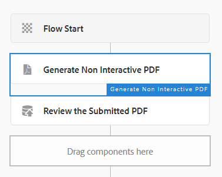

# Arbeitsablauf zum Überprüfen und Genehmigen der gesendeten PDF

Der letzte und letzte Schritt besteht darin, AEM Arbeitsablauf zu erstellen, der eine statische oder nicht interaktive PDF-Datei zur Überprüfung und Genehmigung generiert. Der Workflow wird über einen AEM Launcher ausgelöst, der auf dem Knoten `/content/pdfsubmissions` konfiguriert ist.

Der folgende Screenshot zeigt die Schritte im Workflow.

## Arbeitsablaufschritt &quot;Nicht interaktive PDF erstellen&quot;

Die XDP-Vorlage und die mit der Vorlage zusammenzuführenden Daten werden hier angegeben. Die zusammenzuführenden Daten sind die gesendeten Daten aus der PDF-Datei. Diese gesendeten Daten werden unter dem Knoten `/content/pdfsubmissions` gespeichert.

Die generierte PDF wird der Workflow-Variablen `submittedPDF` zugewiesen.

### Zuweisen der generierten PDF zur Überprüfung und Genehmigung

Die Workflow-Komponente &quot;Aufgabe zuweisen&quot;wird hier verwendet, um die generierte PDF-Datei zur Überprüfung und Genehmigung zuzuweisen. Die Variable `submittedPDF` wird auf der Registerkarte &quot;Forms und Dokumente&quot;der Komponente &quot;Aufgabe zuweisen&quot;verwendet.

