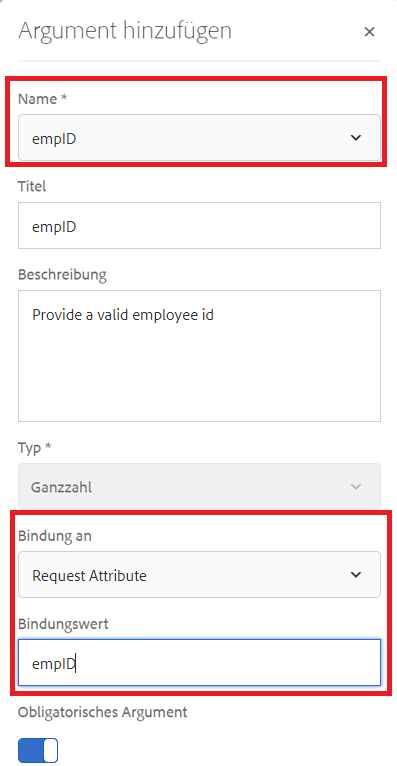
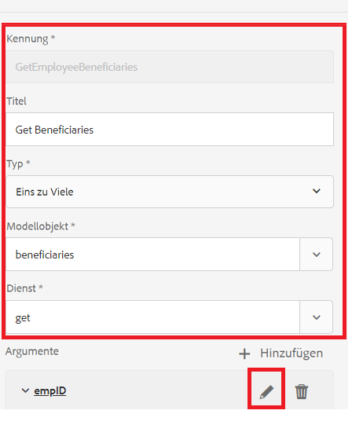
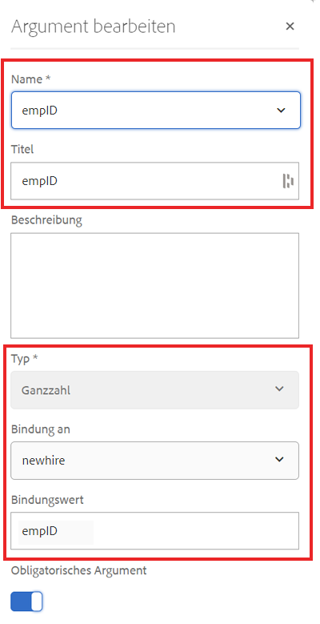
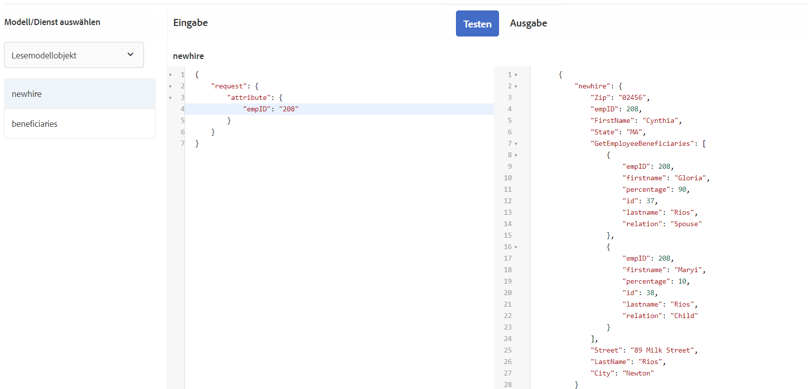

# Formulardatenmodell konfigurieren

## Apache Sling Connection Pooled DataSource

Der erste Schritt bei der Erstellung eines RDBMS-gesicherten Formulardatenmodells besteht darin, Apache Sling Connection Pooled DataSource zu konfigurieren. Gehen Sie wie folgt vor, um die Datenquelle zu konfigurieren:

* Verweisen Sie Ihren Browser auf [configMgr](http://localhost:4502/system/console/configMgr)
* Suchen Sie nach **Apache Sling Connection Pooled DataSource**
* hinzufügen Sie einen neuen Eintrag und geben Sie die im Screenshot angezeigten Werte ein.
* 
* Speichern Sie Ihre Änderungen

>[!NOTE]
>Der JDBC Connection-URI, Benutzername und Kennwort ändern sich je nach Ihrer MySQL-Datenbankkonfiguration.

## Formulardatenmodell erstellen

* Verweisen Sie Ihren Browser auf [Datenintegrationen](http://localhost:4502/aem/forms.html/content/dam/formsanddocuments-fdm)
* Klicken Sie auf _Erstellen_->_Formulardatenmodell_
* Geben Sie einen aussagekräftigen Namen und Titel für das Formulardatenmodell wie **Employee** ein.
* Klicken Sie auf _Weiter_
* Wählen Sie die Datenquelle aus, die im vorherigen Abschnitt (Foren) erstellt wurde.
* Klicken Sie auf _Erstellen_->Bearbeiten, um das neu erstellte Formulardatenmodell im Bearbeitungsmodus zu öffnen.
* Erweitern Sie den Knoten _forums_, um das Schema employee anzuzeigen. Erweitern Sie den Knoten employee, um die 2 Tabellen anzuzeigen.

## hinzufügen Entitäten zu Ihrem Modell

* Stellen Sie sicher, dass die Node employee erweitert wird.
* Wählen Sie die neuen und die begünstigten Entitäten aus und klicken Sie auf _Hinzufügen Ausgewählte_

## hinzufügen-Dienst für neue Entität

* Neue Entität auswählen
* Klicken Sie auf _Eigenschaften bearbeiten_
* Wählen Sie Get aus der Dropdown-Liste Lesen-Dienst
* Klicken Sie auf das Symbol +, um dem get-Dienst Parameter hinzuzufügen.
* Geben Sie die Werte wie im Screenshot gezeigt an
* 
>[!NOTE]
> Der get-Dienst erwartet einen Wert, der der empID-Spalte der newhire-Entität zugeordnet ist. Es gibt mehrere Möglichkeiten, diesen Wert weiterzugeben. In diesem Lernprogramm wird die empID über den Anforderungsparameter empID weitergeleitet.
* Klicken Sie auf _Fertig_, um die Argumente für den get-Dienst zu speichern.
* Klicken Sie auf _Fertig_, um Änderungen am Formulardatenmodell zu speichern

## hinzufügen von 2 Stellen

Die zwischen Datenbankentitäten definierten Verknüpfungen werden nicht automatisch im Formulardatenmodell erstellt. Die Verknüpfungen zwischen Entitäten müssen mithilfe des Formulardatenmodelleditors definiert werden. Jede neue Einrichtung kann einen oder mehrere Begünstigte haben, wir müssen eine Eins-zu-viele-Verbindung zwischen den neuen und den begünstigten Einrichtungen definieren.
Die folgenden Schritte führen Sie durch den Prozess der Erstellung der Eins-zu-viele-Verbindung

* Wählen Sie eine neue Entität und klicken Sie auf _Hinzufügen Association_
* Geben Sie einen aussagekräftigen Titel und einen Bezeichner für die Zuordnung und andere Eigenschaften ein, wie im folgenden Screenshot gezeigt
   

* Klicken Sie auf das Symbol _edit_ unter dem Abschnitt Argumente

* Werte angeben, die in diesem Screenshot gezeigt werden
* 
* **Wir verknüpfen die beiden Entitäten mit der Spalte empID der Empfänger und neuer Entitäten.**
* Klicken Sie auf _Fertig_, um Ihre Änderungen zu speichern

## Formulardatenmodell testen

Unser Formulardatenmodell verfügt jetzt über den Dienst **_get_**, der empID akzeptiert und die Details des neuen und seiner Empfänger zurückgibt. Gehen Sie wie folgt vor, um den get-Dienst zu testen.

* Neue Entität auswählen
* Klicken Sie auf _Testmodellobjekt_
* Geben Sie eine gültige empID ein und klicken Sie auf _Test_
* Sie sollten die Ergebnisse wie im Screenshot unten dargestellt erhalten
* 
