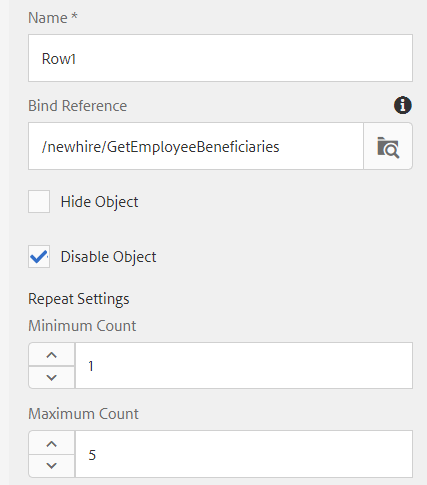

# Adaptives Formular erstellen

Bisher haben wir Folgendes geschaffen:

* Datenbank mit 2 Tabellen: `newhire` und `beneficiaries`
* Apache Sling Connection Pool DataSource konfiguriert
* RDBMS-basiertes Formulardatenmodell

Der nächste Schritt besteht darin, ein adaptives Formular zu erstellen und zu konfigurieren, um das Formulardatenmodell zu verwenden.  Um den Head-Beginn abzurufen, können Sie das Musterformular [downloaden und importieren. ](assets/fdm-demo-af.zip) Das Musterformular enthält einen Abschnitt mit den Mitarbeiterdetails und einen weiteren Abschnitt mit den Begünstigten der Liste.

## Formular mit Formulardatenmodell verknüpfen

Das mit diesem Kurs bereitgestellte Musterformular ist mit keinem Formulardatenmodell verknüpft. Um das Formular für die Verwendung des Formulardatenmodells zu konfigurieren, müssen wir die folgenden Schritte ausführen:

* Wählen Sie das FDMDemo-Formular
* Klicken Sie auf _Eigenschaften_->_Formularmodell_
* Formulardatenmodell aus der Dropdown-Liste auswählen
* Suchen und wählen Sie das in der vorherigen Lektion erstellte Formulardatenmodell aus.
* Klicken Sie auf _Speichern &amp; Schließen_

## Vorlagendienst konfigurieren

Der erste Schritt besteht darin, den Vorfülldienst für das Formular zuzuordnen. Gehen Sie wie folgt vor, um den Vorfülldienst zu verknüpfen

* Wählen Sie das `FDMDemo`-Formular
* Klicken Sie auf _Bearbeiten_, um das Formular im Bearbeitungsmodus zu öffnen.
* Wählen Sie Form Container in der Inhaltshierarchie und klicken Sie auf das Schraubenschlüsselsymbol, um das Eigenschaftenblatt zu öffnen
* Wählen Sie _Vorfülldienst für Formulardatenmodelle_ aus der Dropdown-Liste Vorfülldienst
* Klicken Sie auf blaue ☑, um Ihre Änderungen zu speichern

* 

## Mitarbeiterdetails konfigurieren

Der nächste Schritt ist die Bindung der Textfelder des adaptiven Formulars an die Elemente des Formulardatenmodells. Sie müssen das Eigenschaftenblatt der folgenden Felder öffnen und bindRef wie unten gezeigt einstellen

| Feldname | Bind Ref |
|------------|--------------------|
| Vorname | /newhire/FirstName |
| Nachname | /newhire/lastName |

>[!NOTE]
>
>Sie können zusätzliche Textfelder hinzufügen und an geeignete Formulardatenmodellelemente binden.

## Tabelle &quot;Empfänger&quot;konfigurieren

Der nächste Schritt besteht darin, die Begünstigten der Arbeitnehmer in Tabellenform anzuzeigen. Das bereitgestellte Musterformular verfügt über eine Tabelle mit 4 Spalten und einer einzelnen Zeile. Wir müssen die Tabelle so konfigurieren, dass sie je nach Anzahl der Begünstigten wächst.

* Öffnen Sie das Formular im Bearbeitungsmodus.
* Erweitern des Stammfelds->Ihre Empfänger->Tabelle
* Wählen Sie &quot;Zeile1&quot;und klicken Sie auf das Schraubenschlüsselsymbol, um das Eigenschaftenblatt zu öffnen.
* Legen Sie die Bindungsreferenz auf **/newhire/GetEmployeeBeneficiaries** fest.
* Legen Sie die Wiederholungseinstellungen fest: Mindestanzahl auf 1 und Höchstanzahl auf 5.
* Ihre Row1-Konfiguration sollte wie folgt aussehen:
   
* Klicken Sie auf den blauen ☑, um Ihre Änderungen zu speichern

## Zellen binden

Schließlich müssen wir die Zellen der Zeile an die Elemente des Formulardatenmodells binden.

* Erweitern des Stammfelds->Ihre Begünstigten->Tabelle->Zeile1
* Legen Sie die Bindungsreferenz für jede Zeilenzelle gemäß der folgenden Tabelle fest

| Zeilenzelle | Bindungsverweis |
|------------|----------------------------------------------|
| Vorname | /newhire/GetEmployeeBeneficiaries/firstname |
| Nachname | /newhire/GetEmployeeBeneficiaries/lastname |
| Beziehung | /newhire/GetEmployeeBeneficiaries/relation |
| Prozentsatz | /newhire/GetEmployeeBeneficiaries/percent |

* Klicken Sie auf den blauen ☑, um Ihre Änderungen zu speichern

## Formular testen

Wir müssen das Formular nun mit der entsprechenden empID in der URL öffnen. Die folgenden 2 Links füllen Formulare mit Informationen aus der Datenbank aus
[Formular mit empID=207](http://localhost:4502/content/dam/formsanddocuments/fdmdemo/jcr:content?wcmmode=disabled&amp;empID=207)
[Formular mit empID=208](http://localhost:4502/content/dam/formsanddocuments/fdmdemo/jcr:content?wcmmode=disabled&amp;empID=208)

## Fehlerbehebung

Mein Formular ist leer und enthält keine Daten.

* Stellen Sie sicher, dass das Formulardatenmodell die richtigen Ergebnisse zurückgibt.
* Das Formular ist mit dem korrekten Formulardatenmodell verknüpft
* Feldbindungen überprüfen
* Überprüfen Sie die Stdout-Protokolldatei. Sie sollten sehen, dass empID in die Datei geschrieben wird. Wenn Sie diesen Wert nicht sehen, verwendet Ihr Formular möglicherweise nicht die bereitgestellte benutzerdefinierte Vorlage.

Tabelle wird nicht ausgefüllt

* Überprüfen der Zeile1-Bindung
* Stellen Sie sicher, dass die Wiederholungseinstellungen für Zeile1 korrekt festgelegt sind (Min = 1 und Max = 5 oder höher).

