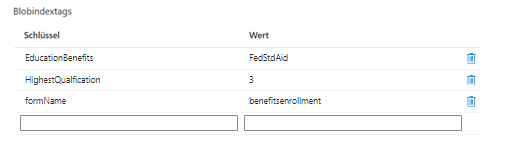

# Erstellen einer benutzerdefinierten Übermittlung

Es wurde ein benutzerdefinierter Übermittlungs-Handler geschrieben, um die Formularübermittlung zu verarbeiten.  Der benutzerdefinierte Übermittlungs-Handler führt im Wesentlichen Folgendes aus:

* Extrahiert den Namen des gesendeten Formulars.
* Extrahiert die gesendeten Daten. Die gesendeten Daten eines auf einer Kernkomponente basierenden Formulars liegen immer im JSON-Format vor.
* Extrahiert und speichert die Formularanhänge im Azure-Portal. Aktualisiert die gesendeten JSON-Daten mit der URL des Anhangs.
* Erstellt Blob-Index-Tags – Sucht nach der Liste des durchsuchbaren Felds für das Formular und dem zugehörigen Wert aus den gesendeten Daten.
* Verknüpft die Blob-Index-Tags mit den gesendeten Daten und speichert sie im Azure-Portal.

Der folgende Screenshot zeigt die Blob-Index-Tags im Azure-Portal

Der benutzerdefinierte Übermittlungs-Code befindet sich in **_StoreFormDataWithBlobIndexTagsInAzure_** und der Code zum Speichern und Abrufen von Daten aus Azure befindet sich in der Komponente **_SaveAndFetchFromAzure_**

## Nächste Schritte

[Erstellen einer Abfrageschnittstelle](./part3.md)
