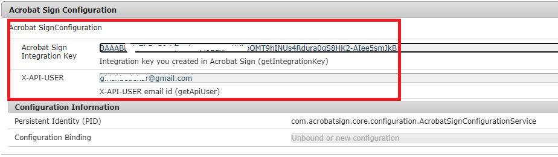

# Erstellen eines Wrappers für die Acrobat Sign-REST-API

Es wurde ein benutzerdefiniertes AEM-Bundle entwickelt, um ein Web-Formular zu erstellen und es den Endbenutzenden zurückzugeben.

* [Übergangsdokument erstellen](https://secure.na1.echosign.com/public/docs/restapi/v6#!/transientDocuments/createTransientDocument). Das durch diesen Aufruf hochgeladene Dokument wird als Übergangsdokument bezeichnet, da es nach dem Hochladen nur 7 Tage lang verfügbar ist. Die zurückgegebene ID des Übergangsdokuments kann in den API-Aufrufen verwendet werden, bei denen die hochgeladene Datei referenziert werden muss. Die Anfrage nach einem Übergangsdokument ist eine mehrteilige Anfrage, die aus drei Teilen besteht: Dateiname, MIME-Typ und Datei-Stream. Bei dieser Anfrage können Sie jeweils nur eine Datei hochladen.
* [Web-Formular erstellen](https://secure.na1.echosign.com/public/docs/restapi/v6#!/widgets/createWidget). Hierbei handelt es sich um einen primären Endpunkt, mit dem ein neues Web-Formular erstellt wird. Das Web-Formular wurde in einem AKTIVEN Status erstellt, um das Web-Formular sofort hosten zu können.
* [Web-Formular abrufen](https://secure.na1.echosign.com/public/docs/restapi/v6#!/widgets/getWidgets). Durch diesen Aufruf wird das Web-Formular der Benutzerin oder des Benutzers abgerufen. Dieses Web-Formular wird dann der aufrufenden Anwendung zum Signieren des Dokuments angezeigt.

## Erstellen einer Acrobat Sign-OSGi-Konfiguration

Die Acrobat Sign-REST-API benötigt den Integrationsschlüssel und die E-Mail-Adresse, die mit dem Integrationsschlüssel verknüpft sind. Diese beiden Werte werden als OSGi-Konfigurationseigenschaften bereitgestellt, wie unten dargestellt.



```java
package com.acrobatsign.core.configuration;

import org.osgi.service.metatype.annotations.AttributeDefinition;
import org.osgi.service.metatype.annotations.ObjectClassDefinition;


@ObjectClassDefinition(name="Acrobat Sign Configuration", description = "Acrobat SignConfiguration")
public @interface AcrobatSignConfiguration
{
    @AttributeDefinition(name="Acrobat Sign Integration Key", description = "Integration key you created in Acrobat Sign ")
        String getIntegrationKey();
    
    @AttributeDefinition(name="X-API-USER", description = "X-API-USER")
    String getApiUser();


}
```

```java
package com.acrobatsign.core.configuration;
import org.osgi.service.component.annotations.Activate;
import org.osgi.service.component.annotations.Component;
import org.osgi.service.metatype.annotations.Designate;

@Component(immediate = true, service = AcrobatSignConfigurationService.class)
@Designate(ocd = AcrobatSignConfiguration.class)
public class AcrobatSignConfigurationService {

  private String IntegrationKey;
  private String apiUserEmail;
  public String getIntegrationKey() {
    return IntegrationKey;
  }
  public String getApiUserEmail() {
    return apiUserEmail;
  }

  @Activate
  protected final void activate(AcrobatSignConfiguration config) {
    IntegrationKey = config.getIntegrationKey();

    apiUserEmail = config.getApiUser();
  }

}
```

## Abrufen der Übergangsdokument-ID

Der folgende Code wurde zum Erstellen des Übergangsdokuments geschrieben:

```java
public String getTransientDocumentID(Document documentForSigning) throws IOException {
  String integrationKey = acrobatSignConfig.getIntegrationKey();
  String apiUser = acrobatSignConfig.getApiUserEmail();
  String url = "https://api.na1.adobesign.com/api/rest/v6/transientDocuments";
  MultipartEntityBuilder builder = MultipartEntityBuilder.create();
  org.apache.http.impl.client.CloseableHttpClient httpClient = HttpClientBuilder.create().build();
  HttpPost httpPost = new HttpPost(url);
  httpPost.addHeader("x-api-user", "email:" + apiUser);
  httpPost.addHeader("Authorization", "Bearer " + integrationKey);
  builder.addBinaryBody("File", documentForSigning.getInputStream(), ContentType.DEFAULT_BINARY, "NDA.PDF");
  builder.addTextBody("File-Name", "NDA.pdf");
  HttpEntity entity = builder.build();
  log.debug("Build the entity");
  httpPost.setEntity(entity);
  CloseableHttpResponse response = httpClient.execute(httpPost);
  log.debug("Sent the request!!!!");
  log.debug("REsponse code " + response.getStatusLine().getStatusCode());
  HttpEntity httpEntity = response.getEntity();
  String transientDocumentId = JsonParser.parseString(EntityUtils.toString(httpEntity)).getAsJsonObject().get("transientDocumentId").getAsString();
  log.debug("Transient ID  " + transientDocumentId);
  return transientDocumentId;

}
```

## Abrufen der Widget-ID

```java
public String getWidgetID(String transientDocumentID) {
  String integrationKey = acrobatSignConfig.getIntegrationKey();
  String apiUser = acrobatSignConfig.getApiUserEmail();
  String url = "https://api.na1.adobesign.com:443/api/rest/v6/widgets";
  org.apache.http.impl.client.CloseableHttpClient httpClient = HttpClientBuilder.create().build();
  HttpPost httpPost = new HttpPost(url);
  httpPost.addHeader("x-api-user", "email:" + apiUser);
  httpPost.addHeader("Authorization", "Bearer " + integrationKey);

  String jsonREquest = "{\r\n" +
    "  \"fileInfos\": [\r\n" +
    "    {\r\n" +
    "      \"transientDocumentId\": \"a\"\r\n" +
    "    }\r\n" +
    "  ],\r\n" +
    "  \"name\": \"Release and Waiver Agreement\",\r\n" +
    "  \"state\": \"ACTIVE\",\r\n" +
    "  \"widgetParticipantSetInfo\": {\r\n" +
    "    \"memberInfos\": [\r\n" +
    "      {\r\n" +
    "        \"email\": \"\"\r\n" +
    "      }\r\n" +
    "    ],\r\n" +
    "    \"role\": \"SIGNER\"\r\n" +
    "  }\r\n" +
    "}";
  JsonObject jsonReq = JsonParser.parseString(jsonREquest).getAsJsonObject();
  jsonReq.getAsJsonArray("fileInfos").get(0).getAsJsonObject().addProperty("transientDocumentId", transientDocumentID);
  log.debug("The updated json object is " + jsonReq);
  try {
    StringEntity stringEntity = new StringEntity(jsonReq.toString());
    httpPost.setEntity(stringEntity);
    httpPost.addHeader("Content-Type", "application/json");
    CloseableHttpResponse response = httpClient.execute(httpPost);
    log.debug("The response is  " + response.getStatusLine().getStatusCode());
    String widgetID = JsonParser.parseString(EntityUtils.toString(response.getEntity())).getAsJsonObject().get("id").getAsString();
    log.debug("The widget id is " + widgetID);
    return widgetID;
  } catch (Exception e) {
    log.debug("Error in getting Widget ID:" + e.getMessage());

  }
  return null;
}
```

## Abrufen der Widget-URL

```java
public String getWidgetURL(String widgetId) throws ClientProtocolException, IOException {
        
        log.debug("$$$$ in get Widget URL for "+widgetId+ "widget id");
        String url = "https://api.na1.adobesign.com:443/api/rest/v6/widgets";
        org.apache.http.impl.client.CloseableHttpClient httpClient = HttpClientBuilder.create().build();
        HttpGet httpGet = new HttpGet(url);
        httpGet.addHeader("x-api-user", "email:"+acrobatSignConfig.getApiUserEmail());
        httpGet.addHeader("Authorization", "Bearer "+acrobatSignConfig.getIntegrationKey());
        CloseableHttpResponse response = httpClient.execute(httpGet);
        JsonObject jsonResponse = JsonParser.parseString(EntityUtils.toString(response.getEntity())).getAsJsonObject();
         log.debug("The json response from get widgets is "+jsonResponse.toString());
         JsonArray userWidgetList = jsonResponse.get("userWidgetList").getAsJsonArray();
         log.debug("The array size is "+userWidgetList.size());
          for(int i=0;i<userWidgetList.size();i++)
         {
        
             log.debug("Getting widget object "+i);
             JsonObject temp = userWidgetList.get(i).getAsJsonObject();
             log.debug("The widget object "+i+"is "+temp.toString());
             if(temp.get("id").getAsString().equalsIgnoreCase(widgetId))
             {
                 log.debug("Bingo found the matching widget id  "+i);
                 String widgetURL = temp.get("url").getAsString();
                 return widgetURL;
                 
             }
            
         }
        
        return null;
        
    }
```

## Nächste Schritte

[Generieren einer Acrobat Sign-Widget-URL](./create-servlet-to-expose-endpoint.md)
