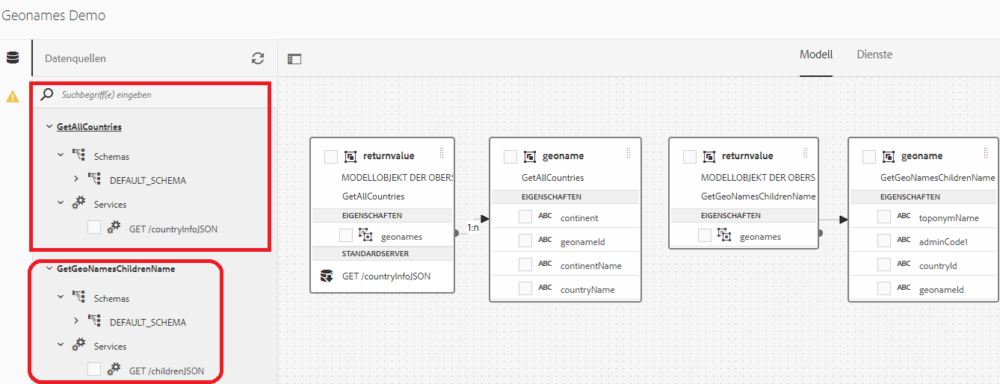
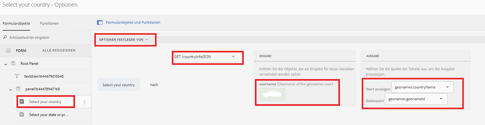
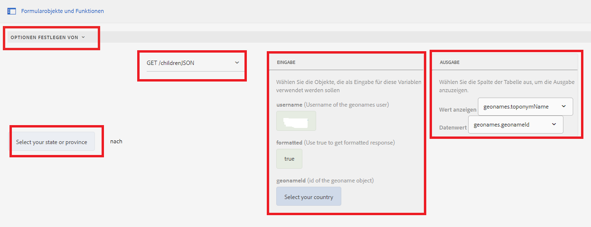

# Kaskadierende Dropdown-Listen

Eine Dropdown-Liste für die Kaskadierung ist eine Reihe von abhängigen DropDownList-Steuerelementen, in denen ein DropDownList-Steuerelement vom übergeordneten oder vorherigen DropDownList-Steuerelement abhängt. Die Elemente im DropDownList-Steuerelement werden basierend auf einem Element gefüllt, das von der Benutzerin bzw. vom Benutzer aus einem anderen DropDownList-Steuerelement ausgewählt wird.

## Demonstration des Anwendungsfalls

>[!VIDEO](https://video.tv.adobe.com/v/340344?quality=12&learn=on)

Für dieses Tutorial habe ich die [Geonames-REST-API](http://api.geonames.org/) verwendet, um diese Fähigkeit zu demonstrieren.
Es gibt eine Reihe von Organisationen, die diese Art von Diensten anbieten, und solange sie über gut dokumentierte REST-APIs verfügen, können Sie sie mithilfe der Datenintegrationsfunktion problemlos in AEM Forms integrieren.

Die folgenden Schritte wurden zur Implementierung kaskadierender Dropdown-Listen in AEM Forms ausgeführt:

## Erstellen eines Entwicklerkontos

Erstellen Sie ein Entwicklerkonto mit [Geonames](https://www.geonames.org/login). Notieren Sie sich den Benutzernamen. Dieser Benutzername ist erforderlich, um REST-APIs von geonames.org aufzurufen.

## Erstellen einer Swagger/OpenAPI-Datei

Die OpenAPI-Spezifikation (früher Swagger-Spezifikation) ist ein API-Beschreibungsformat für REST-APIs. Mit einer OpenAPI-Datei können Sie Ihre gesamte API beschreiben, einschließlich:

* verfügbarer Endpunkte (/users) und der Vorgänge für jeden Endpunkt (GET /users, POST /users)
* Aktionsparameter-Eingabe und -Ausgabe für jeden Vorgang 
Authentifizierungsmethoden
* Kontaktinformationen, Lizenz, Nutzungsbedingungen und sonstiger Informationen
* API-Spezifikationen können in YAML oder JSON geschrieben werden. Das Format ist sowohl für Menschen als auch für Maschinen leicht zu erlernen und lesbar.

Um Ihre erste Swagger/OpenAPI-Datei zu erstellen, befolgen Sie die [OpenAPI-Dokumentation](https://swagger.io/docs/specification/2-0/basic-structure/).

>[!NOTE]
> AEM Forms unterstützt die OpenAPI-Spezifikationsversion 2.0 (früher Swagger).

Verwenden Sie den [Swagger-Editor](https://editor.swagger.io/), um Ihre Swagger-Datei zu erstellen und die Operationen zu beschreiben, die alle Länder und untergeordneten Elemente des Landes oder Staates abrufen.  Die Swagger-Datei kann im JSON- oder YAML-Format erstellt werden.

## Erstellen von Datenquellen

Um AEM/AEM Forms in Anwendungen von Drittanbietern zu integrieren, ist die [Erstellung einer Datenquelle](https://experienceleague.adobe.com/docs/experience-manager-learn/forms/ic-web-channel-tutorial/parttwo.html?lang=de) in der Cloud-Service-Konfiguration erforderlich. Verwenden Sie die [Swagger-Datei](assets/geonames-swagger-files.zip), um Ihre Datenquelle zu erstellen.
Sie müssen zwei Datenquellen erstellen (eine zum Abrufen aller Länder und eine andere zum Abrufen untergeordneter Elemente).

## Erstellen von Formulardatenmodellen

Die AEM Forms-Datenintegration bietet eine intuitive Benutzeroberfläche zum Erstellen von und Arbeiten mit [Formulardatenmodellen](https://experienceleague.adobe.com/docs/experience-manager-65/forms/form-data-model/create-form-data-models.html?lang=de). Stützen Sie das Formulardatenmodell auf die Datenquelle, die im vorherigen Schritt erstellt wurde. Formulardatenmodell mit zwei Datenquellen

## Erstellen eines adaptiven Formulars

Integrieren Sie die GET-Aufrufe des Formulardatenmodells in Ihr adaptives Formular, um die Dropdown-Listen zu füllen.
Erstellen Sie ein adaptives Formular mit zwei Dropdown-Listen. Eins zur Auflistung der Länder und eins zur Auflistung der Bundesländer/Provinzen je nach Land.

### Dropdown-Liste „Länder ausfüllen“

Die Länderliste wird ausgefüllt, wenn das Formular zum ersten Mal initialisiert wird. Der folgende Screenshot zeigt den Regeleditor, der zum Ausfüllen der Optionen der Länder-Dropdown-Liste konfiguriert wurde. Dazu müssen Sie Ihren Benutzernamen mit dem Geonames-Konto angeben.

#### Ausfüllen der Dropdown-Liste Bundesland/Provinz

Die Dropdown-Liste Bundesland/Provinz muss auf der Grundlage des ausgewählten Landes ausgefüllt werden. Der folgende Screenshot zeigt die Konfiguration des Regeleditors

### Übung

Fügen Sie zwei Dropdown-Listen mit den Bezeichnungen „Landkreise und Städte“ in das Formular ein, um die Landkreise und Städte auf der Grundlage des ausgewählten Landes und Bundeslandes aufzulisten.

### Beispiel-Assets

Sie können folgende Assets herunterladen, um schnell ein Beispiel für die kaskadierende Dropdown-Liste zu erstellen.
Die fertigen Swagger-Dateien können [hier](assets/geonames-swagger-files.zip) heruntergeladen werden
Die Swagger-Dateien beschreiben folgende REST-API
* [Abrufen aller Länder](http://api.geonames.org/countryInfoJSON?username=yourusername)
* [Abrufen von untergeordneten Elementen des Geoname-Objekts](http://api.geonames.org/children?formatted=true&amp;geonameId=6252001&amp;username=yourusername)

Das fertige [Formulardatenmodell kann hier heruntergeladen werden](assets/geonames-api-form-data-model.zip)
