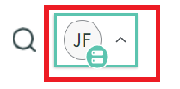

# Integrieren von AEM Forms mit [!DNL ServiceNow]

Erstellen und zeigen Sie Vorfälle in [!DNL ServiceNow] unter Verwendung des Formulardatenmodells in AEM Forms an.

## Voraussetzungen

* [!DNL ServiceNow]-Konto.
* Kenntnisse beim [Erstellen von Datenquellen](https://experienceleague.adobe.com/docs/experience-manager-learn/forms/ic-web-channel-tutorial/parttwo.html?lang=de).
* Kenntnisse zum [Formulardatenmodell](https://experienceleague.adobe.com/docs/experience-manager-65/forms/form-data-model/create-form-data-models.html?lang=de).

## Beispiel-Assets

Die in diesem Artikel bereitgestellten Beispiel-Assets umfassen Folgendes:

* Cloud-Service-Konfiguration
* Swagger-Dateien zum Erstellen eines Vorfalls und Abrufen aller Vorfälle
* Formulardatenmodell basierend auf den Swagger-Dateien
* Adaptives Formular zum Erstellen und Auflisten von [!DNL ServiceNow]-Vorfällen

## Bereitstellen der Assets auf Ihrem Server

* Laden Sie die [Beispiel-Assets](assets/service-now.zip) herunter.
* Importieren Sie die Assets mithilfe von [Package Manager](http://localhost:4502/crx/packmgr/index.jsp) in AEM.
* Die für diese Integration verwendete Swagger-Datei befindet sich unter dem ```/conf/9957/settings/cloudconfigs/fdm```-Ordner im CRX-Repository
* Bearbeiten Sie die [Cloud-Service-Konfiguration zu CreateIncident](http://localhost:4502/mnt/overlay/fd/fdm/gui/components/admin/fdmcloudservice/properties.html?item=%2Fconf%2F9957%2Fsettings%2Fcloudconfigs%2Ffdm%2Fcreateincident), um sie mit Ihrer ServiceNow-Instanz abzugleichen.
* Bearbeiten Sie die [Cloud-Service-Konfiguration zu GetAllIncidents](http://localhost:4502/mnt/overlay/fd/fdm/gui/components/admin/fdmcloudservice/properties.html?item=%2Fconf%2F9957%2Fsettings%2Fcloudconfigs%2Ffdm%2Fgetallincidents), um sie mit Ihrer ServiceNow-Instanz abzugleichen. Sie müssen Host, Benutzername und Kennwort ändern, um sie mit den Anmeldedaten Ihrer ServiceNow-Instanz abzugleichen.

## Zugriff auf die Anmeldedaten der ServiceNow-Instanz

* Klicken Sie auf Ihr Benutzerprofil.
  

* Klicken Sie auf „Instanzpasswort verwalten“.
* Die Instanzdetails werden wie folgt angezeigt:
  

## Testen der Integration

* [Öffnen Sie das adaptive Formular.](http://localhost:4502/content/dam/formsanddocuments/create-incident-in-service-now/jcr:content?wcmmode=disabled)
* Geben Sie Werte in das Feld „Beschreibung und Kommentare“ ein und klicken Sie auf die Schaltfläche „Vorfall erstellen“.
* Die Vorfall-ID des neu erstellten Vorfalls sollte sich im Textfeld befinden, und die nachstehende Tabelle sollte alle Vorfälle auflisten.
