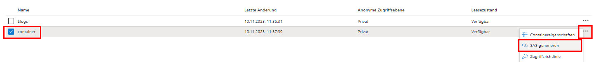
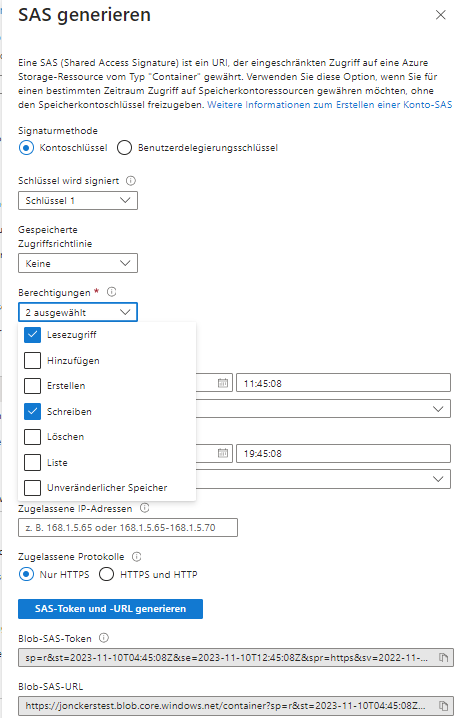
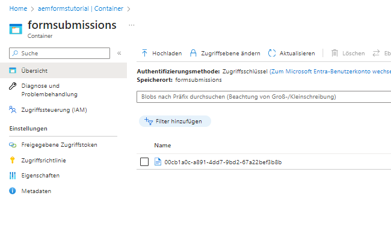

# Speichern einer Formularübermittlung in Azure Storage

In diesem Artikel erfahren Sie, wie Sie REST-Aufrufe durchführen, um gesendete AEM Forms-Daten in Azure Storage zu speichern.
Um gesendete Formulardaten in Azure Storage speichern zu können, müssen die folgenden Schritte ausgeführt werden.

## Erstellen eines Azure Storage-Kontos

[Melden Sie sich bei Ihrem Azure Portal-Konto an und erstellen Sie ein Speicherkonto](https://learn.microsoft.com/de-de/azure/storage/common/storage-account-create?tabs=azure-portal#create-a-storage-account-1). Geben Sie einen aussagekräftigen Namen für Ihr Speicherkonto ein, klicken Sie auf „Überprüfen“ und dann auf „Erstellen“. Dadurch wird Ihr Speicherkonto mit allen Standardwerten erstellt. Für die Zwecke dieses Artikels haben wir unser Speicherkonto `aemformstutorial` genannt.


## Erstellen eines Containers

Als Nächstes müssen wir einen Container erstellen, in dem die Daten aus Formularübermittlungen gespeichert werden.
Klicken Sie auf der Seite „Speicherkonto“ links auf das Menüelement „Container“ und erstellen Sie einen Container namens `formssubmissions`. Stellen Sie sicher, dass die öffentliche Zugriffsebene auf „privat“ gesetzt ist.


## Erstellen von SAS für den Container

Wir werden die Shared Access Signature- oder kurz SAS-Autorisierungsmethode für die Interaktion mit dem Azure Storage-Container verwenden.
Navigieren Sie zum Container im Speicherkonto, klicken Sie auf die Auslassungspunkte und wählen Sie die Option „SAS generieren“ aus, wie im Screenshot gezeigt.

Stellen Sie sicher, dass Sie die entsprechenden Berechtigungen und das entsprechende Enddatum angeben, wie im Screenshot unten dargestellt, und klicken Sie auf „SAS-Token und URL generieren“. Kopieren Sie das Blob-SAS-Token und die Blob-SAS-URL. Wir werden diese beiden Werte verwenden, um unsere HTTP-Aufrufe durchzuführen.
 


## Geben Sie das Blob-SAS-Token und den Speicher-URI an.

Um den Code allgemeiner zu gestalten, können die beiden Eigenschaften mit der OSGi-Konfiguration wie unten dargestellt konfiguriert werden. Dabei ist _**aemformstutorial**_ der Name des Speicherkontos, und _**formsubmissions**_ ist der Container, in dem die Daten mit einer eindeutigen BLOB-ID gespeichert werden.


## Erstellen einer PUT-Anfrage

Als nächstes muss eine PUT-Anfrage erstellt werden, um die gesendeten Formulardaten in Azure Storage zu speichern. Jede Formularübermittlung muss durch eine eindeutige BLOB-ID identifiziert werden. Die eindeutige BLOB-ID wird normalerweise in Ihrem Code erstellt und in die URL der PUT-Anfrage eingefügt.
Im Folgenden finden Sie die Teil-URL der PUT-Anfrage. Dabei ist `aemformstutorial` der Name des Speicherkontos und „formsubmit“ der Container, in dem die Daten mit einer eindeutigen BLOB-ID gespeichert werden. Der Rest der URL bleibt unverändert.
https://aemformstutorial.blob.core.windows.net/formsubmissions/blobid/sastoken
Die folgende Funktion wurde geschrieben, um die gesendeten Formulardaten mithilfe einer PUT-Anfrage in Azure Storage zu speichern. Beachten Sie die Verwendung des Container-Namens und der UUID in der URL. Mithilfe des unten aufgeführten Beispiel-Codes können Sie einen OSGi-Dienst oder ein Sling-Servlet erstellen und die Formularübermittlungen in Azure Storage speichern.

```java
 public String saveFormDatainAzure(String formData) {
    log.debug("in SaveFormData!!!!!" + formData);
    String sasToken = azurePortalConfigurationService.getSASToken();
    String storageURI = azurePortalConfigurationService.getStorageURI();
    log.debug("The SAS Token is " + sasToken);
    log.debug("The Storage URL is " + storageURI);
    org.apache.http.impl.client.CloseableHttpClient httpClient = HttpClientBuilder.create().build();
    UUID uuid = UUID.randomUUID();
    String putRequestURL = storageURI + uuid.toString();
    putRequestURL = putRequestURL + sasToken;
    HttpPut httpPut = new HttpPut(putRequestURL);
    httpPut.addHeader("x-ms-blob-type", "BlockBlob");
    httpPut.addHeader("Content-Type", "text/plain");

    try {
        httpPut.setEntity(new StringEntity(formData));

        CloseableHttpResponse response = httpClient.execute(httpPut);
        log.debug("Response code " + response.getStatusLine().getStatusCode());
        if (response.getStatusLine().getStatusCode() == 201) {
            return uuid.toString();
        }
    } catch (IOException e) {
        log.error("Error: " + e.getMessage());
        throw new RuntimeException(e);
    }
    return null;

}
```

## Überprüfen der gespeicherten Daten im Container



## Testen der Lösung

* [Stelllen Sie das benutzerdefinierte OSGi-Bundle bereit.](./assets/SaveAndFetchFromAzure.core-1.0.0-SNAPSHOT.jar)

* [Importieren Sie die benutzerdefinierte Vorlage für das adaptive Formular und die Seitenkomponente, die mit der Vorlage verknüpft ist.](./assets/store-and-fetch-from-azure.zip)

* [Importieren Sie das adaptive Beispielformular.](./assets/bank-account-sample-form.zip)

* Geben Sie die entsprechenden Werte in der Azure Portal-Konfiguration mithilfe der OSGi-Konfigurationskonsole an
* [Zeigen Sie das Bankkonto-Formular in der Vorschau an und senden Sie es ab](http://localhost:4502/content/dam/formsanddocuments/azureportalstorage/bankaccount/jcr:content?wcmmode=disabled).

* Überprüfen Sie, ob die Daten im gewünschten Azure-Speicher-Container gespeichert sind. Kopieren Sie die Blob-ID.
* [Zeigen Sie das Bankkonto-Formular in der Vorschau an](http://localhost:4502/content/dam/formsanddocuments/azureportalstorage/bankaccount/jcr:content?wcmmode=disabled&amp;guid=dba8ac0b-8be6-41f2-9929-54f627a649f6) und geben Sie die Blob-ID als einen GUID-Parameter in die URL ein, damit das Formular mit den Daten aus dem Azure-Speicher vorausgefüllt werden kann.

