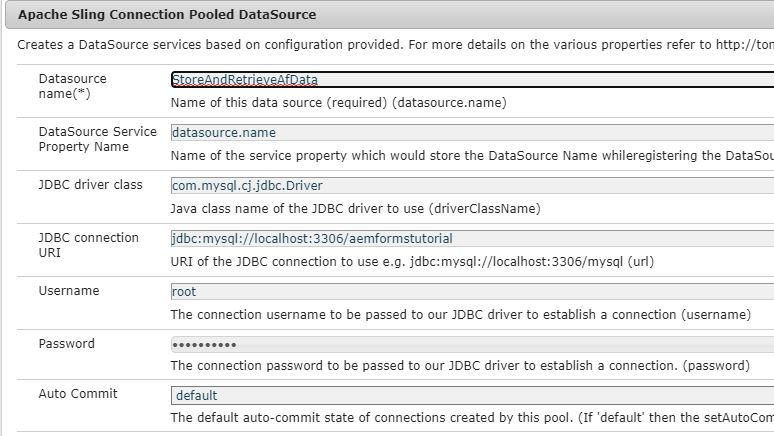

# Datenquelle konfigurieren

Es gibt viele Möglichkeiten, AEM die Integration mit externen Datenbanken zu ermöglichen. Eine der gebräuchlichsten und gängigsten Methoden der Datenbankintegration ist die Verwendung der Konfigurationseigenschaften von Apache Sling Connection Pooled DataSource über die [configMgr](http://localhost:4502/system/console/configMgr).
Der erste Schritt besteht darin, die entsprechenden [MySQL-Treiber](https://mvnrepository.com/artifact/mysql/mysql-connector-java) für AEM herunterzuladen und bereitzustellen.
Legen Sie dann die für Ihre Datenbank spezifischen Eigenschaften von Sling Connection Pooled DataSource fest. Der folgende Screenshot zeigt die Einstellungen, die für dieses Tutorial verwendet werden. Das Datenbank-Schema wird Ihnen im Rahmen dieses Lernprogramms bereitgestellt.

* JDBC Driver Class: `com.mysql.cj.jdbc.Driver`
* JDBC Connection URI: `jdbc:mysql://localhost:3306/aemformstutorial`

>[!NOTE]
>Achten Sie darauf, dass Sie Ihrer Datenquelle einen Namen geben, `StoreAndRetrieveAfData` da dies der Name ist, der im OSGi-Dienst verwendet wird.

## Datenbank erstellen

Für diesen Verwendungsfall wurde die folgende Datenbank verwendet. Die Datenbank verfügt über eine Tabelle mit `formdatawithattachments` den vier Spalten, wie im Screenshot unten dargestellt.

* Die **afdata** der Spalte enthalten die Daten des adaptiven Formulars.
* Die Spalte **attachmentsInfo** enthält die Informationen zu den Formularanlagen.
* Die Spalten **phoneNumber** enthalten die Mobiltelefonnummer der Person, die das Formular ausfüllt.

Erstellen Sie die Datenbank, indem Sie das [Datenbankmodul](assets/data-base-schema.sql)mit MySQL Workbench importieren.

## Formulardatenmodell erstellen

Erstellen Sie ein Formulardatenmodell und basieren Sie es auf der Datenquelle, die Sie im vorherigen Schritt erstellt haben.
Konfigurieren Sie den **get** -Dienst dieses Formulardatenmodells wie im Screenshot unten dargestellt.
Stellen Sie sicher, dass Sie kein Array im **get** -Dienst zurückgeben.

Mit diesem **get** -Dienst wird die Telefonnummer abgerufen, die mit der Anwendungs-ID verknüpft ist.

Dieses Formulardatenmodell wird dann im **MyAccountForm** verwendet, um die mit der Anwendungs-ID verknüpfte Telefonnummer abzurufen.
