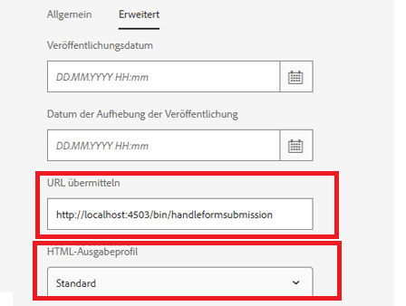

# Umsetzen dieses Anwendungsfalls auf Ihrem System

>[!NOTE]
>
>Damit die Beispiel-Assets auf Ihrem System verwendet werden können, wird davon ausgegangen, dass Sie Zugriff auf eine AEM Forms-Autoren- und AEM Forms-Veröffentlichungsinstanz haben.

Gehen Sie wie folgt vor, um diesen Anwendungsfall auf Ihrem lokalen System umzusetzen:

## Bereitstellen der folgenden Assets in der AEM Forms-Autoreninstanz

* [Installieren Sie das MobileFormToWorkflow-Bundle.](assets/MobileFormToWorkflow.core-1.0.0-SNAPSHOT.jar)

* [Stellen Sie das DevelopingWithServiceUser-Bundle bereit.](https://experienceleague.adobe.com/docs/experience-manager-learn/assets/developingwithserviceuser.zip?lang=de)
Fügen Sie den folgenden Eintrag im Apache Sling Service User Mapper Service mithilfe von configMgr hinzu.

```
DevelopingWithServiceUser.core:getformsresourceresolver=fd-service
```

* Sie können die Formularübermittlungen in einem anderen Ordner speichern, indem Sie den Ordnernamen in der Konfiguration der AEM-Server-Anmeldeinformationen mit [configMgr](http://localhost:4502/system/console/configMg) angeben. Wenn Sie den Ordner ändern, stellen Sie sicher, dass Sie einen Starter für den Ordner erstellen, um den Workflow **ReviewSubmittedPDF** auszulösen.


* [Importieren Sie die Beispiel-XDP und das Workflow-Paket mit Package Manager](assets/xdp-form-and-workflow.zip).


## Bereitstellen der folgenden Assets in der Veröffentlichungsinstanz

* [Installieren Sie das MobileFormToWorkflow-Bundle.](assets/MobileFormToWorkflow.core-1.0.0-SNAPSHOT.jar)

* Geben Sie Benutzernamen/Kennwort für die Autoreninstanz und einen **vorhandenen Speicherort in Ihrem AEM-Repository** an, um die übermittelten Daten mithilfe von [configMgr](http://localhost:4503/system/console/configMgr) in den AEM-Server-Anmeldeinformationen zu speichern. Sie können die URL des Endpunkts auf dem AEM-Workflow-Server unverändert lassen. Dies ist der Endpunkt, der die Daten aus der Übermittlung in dem angegebenen Knoten extrahiert und speichert.
  

* [Stellen Sie das DevelopingWithServiceUser-Bundlet bereit.](https://experienceleague.adobe.com/docs/experience-manager-learn/assets/developingwithserviceuser.zip?lang=de)
* [Öffnen Sie die OSGi-Konfiguration.](http://localhost:4503/system/console/configMgr)
* Suchen Sie nach **Apache Sling Referrer Filter**. Stellen Sie sicher, dass das Kontrollkästchen „Leere zulassen“ aktiviert ist.


## Testen der Lösung

* Melden Sie sich bei Ihrer Autoreninstanz an. 
* [Bearbeiten Sie die erweiterten Eigenschaften von w9.xdp](http://localhost:4502/libs/fd/fm/gui/content/forms/formmetadataeditor.html/content/dam/formsanddocuments/w9.xdp). Vergewissern Sie sich, dass die Übermittlungs-URL und das Render-Profil wie unten dargestellt korrekt festgelegt sind.
  

* Veröffentlichen Sie w9.xdp.
* Melden Sie sich bei der Veröffentlichungsinstanz an.
* [Zeigen Sie das w9-Formular in einer Vorschau an.](http://localhost:4503/content/dam/formsanddocuments/w9.xdp/jcr:content)
* Füllen Sie einige Formularfelder aus und senden Sie das Formular ab.
* Melden Sie sich bei der AEM-Autoreninstanz als Admin an.
* [Überprüfen Sie den AEM-Posteingang.](http://localhost:4502/aem/inbox)
* Sie sollten über ein Arbeitselement verfügen, um die übermittelte PDF-Datei zu überprüfen.

>[!NOTE]
>
>Anstatt die PDF-Datei an das in der Veröffentlichungsinstanz ausgeführte Servlet zu übermitteln, haben einige Kundinnen und Kunden das Servlet im Servlet-Container, z. B. Tomcat, bereitgestellt. Das alles hängt davon ab, mit welcher Topologie die Kundschaft vertraut ist. Für dieses Tutorial verwenden wir das in der Veröffentlichungsinstanz bereitgestellte Servlet, um die Formularübermittlungen zu verarbeiten.
