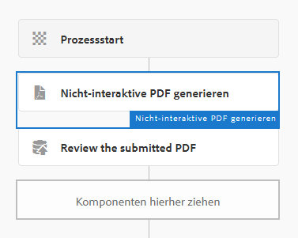
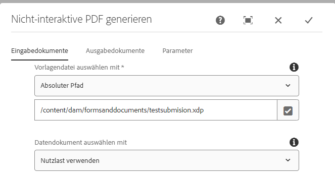
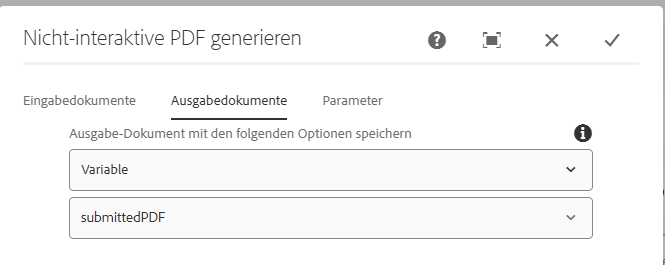
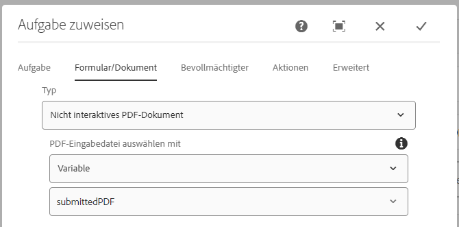

# Workflow zur Überprüfung und Genehmigung übermittelter PDF-Dateien

Der letzte und abschließende Schritt besteht darin, einen AEM-Workflow zu erstellen, bei dem eine statische (oder nicht interaktive) PDF-Datei zur Überprüfung und Genehmigung generiert wird. Der Workflow wird über einen auf dem Knoten `/content/formsubmissions` konfigurierten AEM-Starter ausgelöst.

Der folgende Screenshot zeigt die für den Workflow erforderlichen Schritte.



## Workflow-Schritt „Nicht-interaktive PDF-Datei generieren“

Die XDP-Vorlage und die mit der Vorlage zusammenzuführenden Daten werden hier angegeben. Bei den zusammenzuführenden Daten handelt es sich um die von der PDF-Datei übermittelten Daten. Diese übermittelten Daten werden unter dem Knoten ```/content/formsubmissions``` gespeichert.



Die generierte PDF-Datei wird der Workflow-Variablen `submittedPDF` zugewiesen.



### Zuweisen der generierten PDF-Datei zur Überprüfung und Genehmigung

Die Workflow-Komponente „Aufgabe zuweisen“ wird hier verwendet, um die generierte PDF-Datei zur Überprüfung und Genehmigung zuzuweisen. Die Variable `submittedPDF` wird auf der Registerkarte „Formulare/Dokumente“ der Workflow-Komponente „Aufgabe zuweisen“ verwendet.




## Nächste Schritte

[Bereitstellen der Assets in Ihrer Umgebung](./deploy-assets.md)