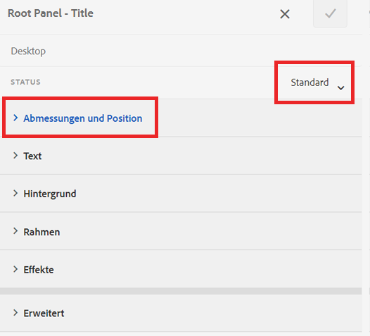
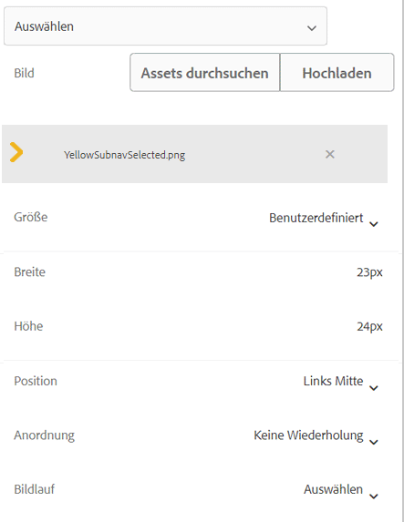
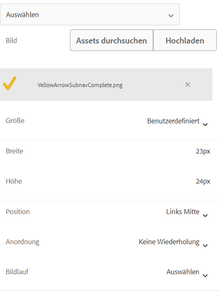

# Hinzufügen von Symbolen zur Anzeige aktiver und abgeschlossener Registerkarten

Wenn Sie ein adaptives Formular mit Navigation auf der linken Registerkarte haben, möchten Sie vielleicht Symbole anzeigen, um den Status der Registerkarte zu zeigen. Sie können beispielsweise ein Symbol anzeigen, um die aktive Registerkarte anzuzeigen, und ein Symbol, um eine abgeschlossene Registerkarte anzuzeigen, wie im Screenshot unten dargestellt.

## Erstellen eines adaptiven Formulars

Zum Erstellen des Beispielformulars wurde ein einfaches adaptives Formular verwendet, das auf der Basisvorlage und dem Canvas 3.0-Design basiert.
Die [in diesem Artikel verwendeten Symbole](assets/icons.zip) können hier heruntergeladen werden.

## Gestalten des Standardstatus

Öffnen Sie das Formular im Bearbeitungsmodus.
Vergewissern Sie sich, dass Sie sich in der Stilschicht befinden, und wählen Sie eine beliebige Registerkarte aus (z. B. die Registerkarte „Allgemein“).
Sie befinden sich im Standardzustand, wenn Sie den Stileditor für die Registerkarte öffnen, wie im Screenshot unten dargestellt

Legen Sie die CSS-Eigenschaften für den Standardstatus wie unten gezeigt fest. 
| Kategorie | Eigenschaftsname | Eigenschaftswert | 
|—|:—|:—| 
| Dimensionen und Position | Breite | 50px | 
| Text | Schriftstärke| Fett | 
| Text | Farbe | #FFF | 
|Text | Zeilenhöhe | 3 | 
|Text | Textausrichtung | Links | 
|Hintergrund| Farbe | #056dae |

Speichern Sie Ihre Änderungen

## Gestalten des aktiven Status

Stellen Sie sicher, dass der Status „Aktiv“ ist, und gestalten Sie die folgenden CSS-Eigenschaften

| Kategorie | Eigenschaftsname | Eigenschaftswert |
|:---|:---|:---|
| Dimensionen und Position | Breite | 50 px |
| Text | Schriftstärke | Fett |
| Text | Farbe | #FFF |
| Text | Zeilenhöhe | 3 |
| Text | Text Ausrichten | Linksbündig |
| Hintergrund | Farbe | #056dae |

Formatieren Sie das Hintergrundbild, wie im Screenshot unten dargestellt

Speichern Sie Ihre Änderungen.

## Gestalten des Status „Besucht“

Vergewissern Sie sich, dass Sie sich im besuchten Status befinden, und gestalten Sie die folgenden Eigenschaften

| Kategorie | Eigenschaftsname | Eigenschaftswert |
|:---|:---|:---|
| Dimensionen und Position | Breite | 50 px |
| Text | Schriftstärke | Fett |
| Text | Farbe | #FFF |
| Text | Zeilenhöhe | 3 |
| Text | Text Ausrichten | Linksbündig |
| Hintergrund | Farbe | #056dae |

Formatieren Sie das Hintergrundbild, wie im Screenshot unten dargestellt

Speichern Sie Ihre Änderungen

Zeigen Sie das Formular in der Vorschau an und testen Sie, ob die Symbole erwartungsgemäß funktionieren.
