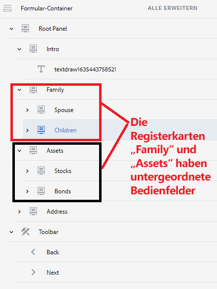

# Navigationsregisterkarten mit mehreren Panels

Wenn Ihr Formular linke Navigationsregisterkarten hat und eine der Registerkarten mehrere Panels aufweist, können Sie den Titel der untergeordneten Panels ausblenden und dennoch das Navigieren zwischen den Registerkarten und den untergeordneten Panels dieser Registerkarte ermöglichen.

## Erstellen eines adaptiven Formulars

Erstellen Sie ein adaptives Formular mit der folgenden Struktur. Das Stammbedienfeld enthält untergeordnete Panels, die links als Registerkarten angezeigt werden. Einige dieser „**Registerkarten**“ haben zusätzliche untergeordnete Panels. Die Registerkarte „Familie“ verfügt beispielsweise über zwei untergeordnete Panels namens „Ehepartner/-in“ und „Kinder“.

Eine Symbolleiste wird auch unter dem FormContainer mit den Schaltflächen „Vorherige“ und „Nächste“ hinzugefügt




Das Standardverhalten dieses Formulars besteht darin, alle Panels auf der linken Seite anzuzeigen und dann von einer Registerkarte zu einer anderen zu navigieren, wenn auf die Schaltfläche „Weiter“ geklickt wird.

Um dieses Standardverhalten zu ändern, müssen Sie die folgenden Schritte ausführen:

>[!VIDEO](https://video.tv.adobe.com/v/338369?quality=12&learn=on)


Fügen Sie mit dem Code-Editor den folgenden Code zum Klick-Ereignis der Schaltfläche **Weiter** hinzu

```javascript
window.guideBridge.setFocus(null, 'nextItemDeep', true);
```

Fügen Sie mit dem Code-Editor den folgenden Code zum Klick-Ereignis der Schaltfläche **Zurück** hinzu

```javascript
window.guideBridge.setFocus(null, 'prevItemDeep', true);
```

Der obige Code hilft Ihnen bei der Navigation zwischen den Registerkarten und den untergeordneten Panels jeder Registerkarte.

## Ausblenden der Überschrift der untergeordneten Panels

Verwenden Sie den Stil-Editor, um den Titel der untergeordneten Registerkarten-Panels auszublenden.

>[!VIDEO](https://video.tv.adobe.com/v/338370?quality=12&learn=on)

>[!NOTE]
>
>Die in diesem Artikel beschriebene Funktion funktioniert auf der letzten Registerkarte nicht. Wenn beispielsweise die Registerkarte „Adresse“ untergeordnete Panels enthält, funktioniert diese Funktion nicht.
