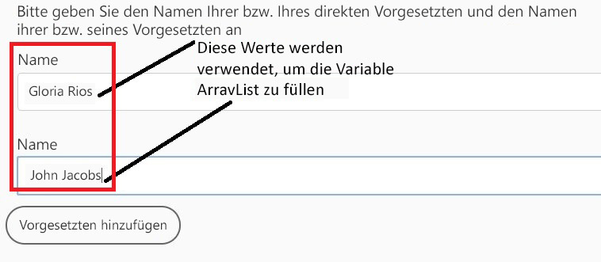
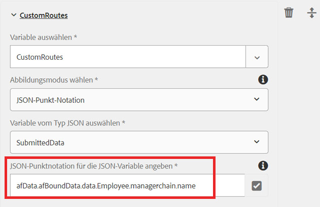
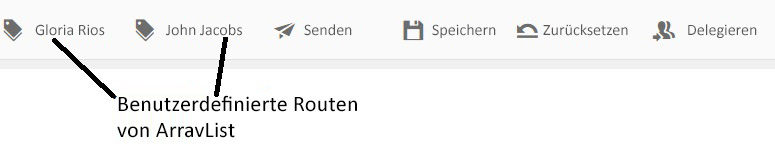

# ArrayList-Variable im AEM Workflow

Variablen des Typs ArrayList wurden in AEM Forms 6.5 eingeführt. Ein gängiger Anwendungsfall für die Verwendung der ArrayList-Variablen besteht darin, benutzerdefinierte Routen zu definieren, die in AssignTask verwendet werden.

Um die Variable ArrayList in einem AEM Workflow zu verwenden, müssen Sie ein adaptives Formular erstellen, das sich wiederholende Elemente in den gesendeten Daten generiert. Üblicherweise wird ein Schema definiert, das ein Array-Element enthält. Für die Zwecke dieses Artikels habe ich ein einfaches JSON-Schema mit Array-Elementen erstellt. Der Anwendungsfall besteht darin, dass ein Mitarbeiter einen Ausgabenbericht ausfüllt. Im Ausgabenbericht erfassen wir den Namen des Geschäftsführers und den Namen des Geschäftsführers des Absenders. Die Namen des Managers werden in einem Array namens managerchain gespeichert. Der folgende Screenshot zeigt das Ausgabenberichtsformular und die Daten aus der adaptiven Forms-Übermittlung.



Im Folgenden finden Sie die Daten aus der Übermittlung des adaptiven Formulars. Das adaptive Formular basierte auf dem JSON-Schema, dass die an das Schema gebundenen Daten im Datenelement des afBoundData-Elements gespeichert werden. Der Managerchain ist ein Array und wir müssen das ArrayList-Element mit dem name-Element des Objekts im managerchain-Array füllen.

```json
{
    "afData": {
        "afUnboundData": {
            "data": {
                "numericbox_2762582281554154833426": 700
            }
        },
        "afBoundData": {
            "data": {
                "Employee": {
                    "Name": "Conrad Simms",
                    "Department": "IT",
                    "managerchain": [{
                        "name": "Gloria Rios"
                    }, {
                        "name": "John Jacobs"
                    }]
                },
                "expense": [{
                    "description": "Hotel",
                    "amount": 300
                }, {
                    "description": "Air Fare",
                    "amount": 400
                }]
            }
        },
        "afSubmissionInfo": {
            "computedMetaInfo": {},
            "stateOverrides": {},
            "signers": {},
            "afPath": "/content/dam/formsanddocuments/helpx/travelexpensereport",
            "afSubmissionTime": "20190402102953"
            }
        }
}
```

Um die ArrayList-Variable des Subtyps String zu initialisieren, können Sie entweder den JSON Dot Notation- oder den XPath-Zuordnungsmodus verwenden. Der folgende Screenshot zeigt Ihnen, wie Sie eine ArrayList-Variable namens CustomRoutes mit der JSON-Punktnotiz füllen. Vergewissern Sie sich, dass Sie auf ein Element in einem Array-Objekt verweisen, wie im Screenshot unten dargestellt. Wir füllen die CustomRoutes ArrayList mit den Namen des managerchain-Array-Objekts.
Die CustomRoutes-ArrayList wird dann zum Füllen der Routen in der AssignTask-Komponente verwendet

Sobald die Variable CustomRoutes ArrayList mit den Werten aus den gesendeten Daten initialisiert wurde, werden die Routen der AssignTask-Komponente mit der Variablen CustomRoutes gefüllt. Der folgende Screenshot zeigt Ihnen die benutzerdefinierten Routen in einer AssignTask


Gehen Sie wie folgt vor, um diesen Workflow auf Ihrem System zu testen

* Laden Sie die Datei &quot;ArrayListVariable.zip&quot;herunter und speichern Sie sie in Ihrem Dateisystem
* [Importieren der ZIP-](assets/arraylistvariable.zip) Datei mit dem AEM Package Manager
* [Öffnen Sie das Formular &quot;TravelExpenseReport&quot;](http://localhost:4502/content/dam/formsanddocuments/helpx/travelexpensereport/jcr:content?wcmmode=disabled)
* Geben Sie ein paar Kosten und die Namen des 2 Managers ein
* Auf die Senden-Schaltfläche klicken
* [Posteingang öffnen](http://localhost:4502/aem/inbox)
* Es sollte eine neue Aufgabe mit dem Titel &quot;Spesen an den Spesen-Administrator&quot; angezeigt werden.
* Öffnen Sie das mit der Aufgabe verknüpfte Formular
* Es sollten zwei benutzerspezifische Routen mit den Namen der Manager angezeigt werden.
   [Überprüfen Sie den ReviewExpenseReportWorkflow.](http://localhost:4502/editor.html/conf/global/settings/workflow/models/ReviewExpenseReport.html) Dieser Arbeitsablauf verwendet die Variable ArrayList, die Variable JSON-Typ, den Regeleditor in der Komponente Or-Split
