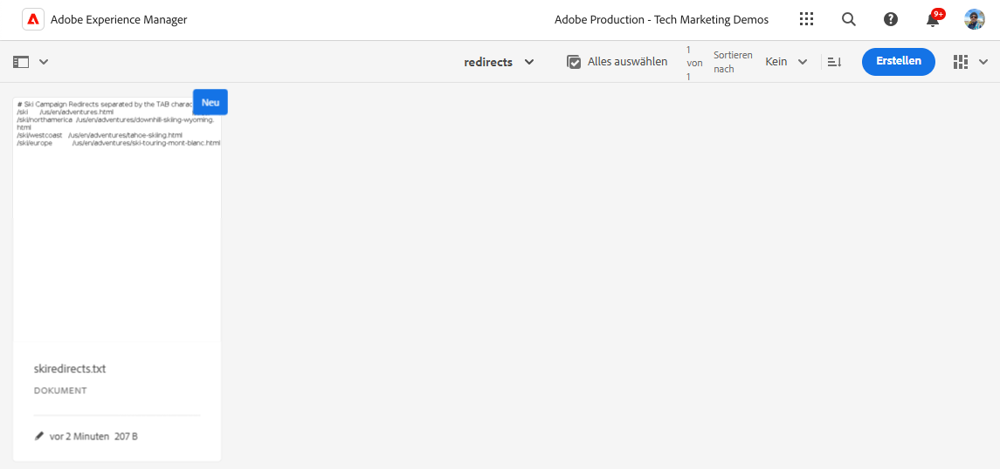
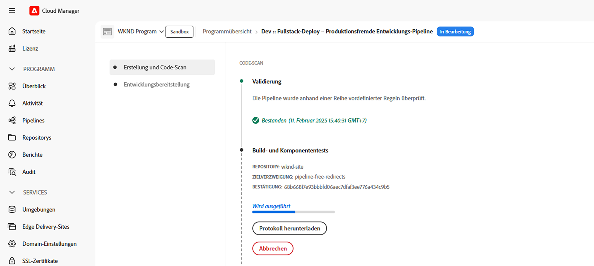

# Implementieren von Pipeline-freien URL-Umleitungen

Erfahren Sie, wie Sie [Pipeline-freie URL-Umleitungen](https://experienceleague.adobe.com/de/docs/experience-manager-cloud-service/content/implementing/content-delivery/pipeline-free-url-redirects) in AEM as a Cloud Service implementieren, damit das Marketing-Team die Umleitungen verwalten kann, ohne dass eine Entwicklerin oder ein Entwickler erforderlich ist.

Es gibt mehrere Optionen zum Verwalten von URL-Umleitungen in AEM. Weitere Informationen finden Sie unter [URL-Umleitungen](url-redirection.md).

Das Tutorial konzentriert sich auf das Erstellen von URL-Umleitungen als Schlüssel-Wert-Paare in einer Textdatei wie [Apache RewriteMap](https://httpd.apache.org/docs/2.4/rewrite/rewritemap.html) und verwendet AEM as a Cloud Service-spezifische Konfigurationen, um sie in das Apache/Dispatcher-Modul zu laden.

## Voraussetzungen

Zum Durchführen dieses Tutorials benötigen Sie Folgendes:

- AEM as a Cloud Service-Umgebung mit Version **18311 oder höher**.

- Das [WKND-Sites](https://github.com/adobe/aem-guides-wknd)-Beispielprojekt muss darin bereitgestellt sein.

## Anwendungsfall für Tutorials

Wir gehen zu Demozwecken davon aus, dass das WKND-Marketing-Team eine neue Ski-Kampagne startet. Sie möchten kurze URLs für die Ski-Adventure-Seiten erstellen und diese wie die Inhalte selbst verwalten. Sie entschieden sich für den Ansatz mit [Pipeline-freien URL-Umleitungen](https://experienceleague.adobe.com/de/docs/experience-manager-cloud-service/content/implementing/content-delivery/pipeline-free-url-redirects) zur Verwaltung der URL-Umleitungen.

Basierend auf den Anforderungen des Marketing-Teams müssen die folgenden URL-Umleitungen erstellt werden.

| Quell-URL | Ziel-URL |
|------------|------------|
| /ski | /us/en/adventures.html |
| /ski/northamerica | /us/en/adventures/downhill-skiing-wyoming.html |
| /ski/westcoast | /us/en/adventures/tahoe-skiing.html |
| /ski/europe | /us/en/adventures/ski-touring-mont-blanc.html |

Sehen wir uns nun an, wie diese URL-Umleitungen und erforderlichen einmaligen Dispatcher-Konfigurationen in der AEM as a Cloud Service-Umgebung verwaltet werden.

## Verwalten von URL-Umleitungen{#manage-redirects}

Zur Verwaltung der URL-Umleitungen stehen mehrere Optionen zur Verfügung. Sehen wir uns diese einmal an.

### Textdatei in DAM

Die URL-Umleitungen können als Schlüssel-Wert-Paare in einer Textdatei verwaltet und in das AEM Digital Asset Management (DAM) hochgeladen werden.

Beispielsweise können die oben genannten URL-Umleitungen in einer Textdatei mit dem Namen `skicampaign.txt` gespeichert und im Ordner `/content/dam/wknd/redirects` in das DAM hochgeladen werden. Nach der Überprüfung und Genehmigung kann das Marketing-Team die Textdatei veröffentlichen.

```
# Ski Campaign Redirects separated by the TAB character
/ski      /us/en/adventures.html
/ski/northamerica  /us/en/adventures/downhill-skiing-wyoming.html
/ski/westcoast   /us/en/adventures/tahoe-skiing.html
/ski/europe          /us/en/adventures/ski-touring-mont-blanc.html
```



### ACS Commons – Redirect Map Manager

Der [ACS Commons – Redirect Map Manager](https://adobe-consulting-services.github.io/acs-aem-commons/features/redirect-map-manager/index.html) bietet eine benutzerfreundliche Oberfläche zur Verwaltung der URL-Umleitungen.

Das Marketing-Team kann beispielsweise eine neue Seite *Umleitungszuordnungen* mit dem Namen `SkiCampaign` erstellen und die obigen URL-Umleitungen über die Registerkarte **Einträge bearbeiten** hinzufügen. Die URL-Umleitungen sind unter `/etc/acs-commons/redirect-maps/skicampaign/jcr:content.redirectmap.txt` verfügbar.


>[!IMPORTANT]
>
>Zur Verwendung des Redirect Map Manager ist die ACS Commons-Version **6.7.0 oder höher** erforderlich. Weitere Informationen finden Sie unter [ACS Commons - Redirect Manager](https://adobe-consulting-services.github.io/acs-aem-commons/features/redirect-manager/index.html).

### ACS Commons – Redirect Manager

Alternativ bietet der [ACS Commons – Redirect Manager](https://adobe-consulting-services.github.io/acs-aem-commons/features/redirect-manager/index.html) ebenfalls eine benutzerfreundliche Oberfläche zur Verwaltung der URL-Umleitungen.

Das Marketing-Team kann beispielsweise eine neue Konfiguration mit dem Namen `/conf/wknd` erstellen und die obigen URL-Umleitungen mithilfe der Schaltfläche **+ Umleitungskonfiguration** hinzufügen. Die URL-Umleitungen sind unter `/conf/wknd/settings/redirects.txt` verfügbar.


>[!IMPORTANT]
>
>Zur Verwendung des Redirect Manager ist die ACS Commons-Version **6.10.0 oder höher** erforderlich. Weitere Informationen finden Sie unter [ACS Commons – Redirect Manager](https://adobe-consulting-services.github.io/acs-aem-commons/features/redirect-manager/subpages/rewritemap.html).

## Konfigurieren des Dispatchers

Um die URL-Umleitungen als RewriteMap zu laden und sie auf die eingehenden Anfragen anzuwenden, sind die folgenden Dispatcher-Konfigurationen erforderlich.

### Aktivieren des Dispatcher-Moduls für den flexiblen Modus

Stellen Sie zunächst sicher, dass das Dispatcher-Modul für den _flexiblen Modus_ aktiviert ist. Das Vorhandensein der Datei `USE_SOURCES_DIRECTLY` im Ordner `dispatcher/src/opt-in` zeigt an, dass sich der Dispatcher im flexiblen Modus befindet.

### Laden von URL-Umleitungen als RewriteMap

Erstellen Sie als Nächstes eine neue Konfigurationsdatei `managed-rewrite-maps.yaml` im Ordner `dispatcher/src/opt-in` mit der folgenden Struktur.

```yaml
maps:
- name: <MAPNAME>.map # e.g. skicampaign.map
    path: <ABSOLUTE_PATH_TO_URL_REDIRECTS_FILE> # e.g. /content/dam/wknd/redirects/skicampaign.txt, /etc/acs-commons/redirect-maps/skicampaign/jcr:content.redirectmap.txt, /conf/wknd/settings/redirects.txt
    wait: false # Optional, default is false, when true, the Apache waits for the map to be loaded before starting
    ttl: 300 # Optional, default is 300 seconds, the reload interval for the map
```

Während der Bereitstellung erstellt der Dispatcher die Datei `<MAPNAME>.map` im Ordner `/tmp/rewrites`.

>[!IMPORTANT]
>
> Der Dateiname (`managed-rewrite-maps.yaml`) und der Speicherort (`dispatcher/src/opt-in`) sollten exakt der obigen Angabe entsprechen. Stellen Sie sich dies als eine Konvention vor, die befolgt werden muss.

### Anwenden von URL-Umleitungen auf eingehende Anfragen

Erstellen oder aktualisieren Sie abschließend die Apache-Datei für die Neuschreibung der Konfiguration, um die oben genannte Zuordnung (`<MAPNAME>.map`) zu verwenden. Verwenden wir beispielsweise die Datei `rewrite.rules` aus dem Ordner `dispatcher/src/conf.d/rewrites`, um die URL-Umleitungen anzuwenden.

```
...
# Use the RewriteMap to define the URL redirects
RewriteMap <MAPALIAS> dbm=sdbm:/tmp/rewrites/<MAPNAME>.map

RewriteCond ${<MAPALIAS>:$1} !=""
RewriteRule ^(.*)$ ${<MAPALIAS>:$1|/} [L,R=301]    
...
```

### Beispielkonfigurationen

Sehen wir uns die Dispatcher-Konfigurationen für jede der [oben](#manage-redirects) genannten Verwaltungsoptionen für die URL-Umleitungen an.

>[!BEGINTABS]

>[!TAB Textdatei in DAM]

Wenn die URL-Umleitungen als Schlüssel-Wert-Paare in einer Textdatei verwaltet und in das DAM hochgeladen werden, lauten die Konfigurationen wie folgt.

[!BADGE dispatcher/src/opt-in/managed-rewrite-maps.yaml]{type=Neutral tooltip="Dateiname des unten stehenden Code-Beispiels."}

```yaml
maps:
- name: skicampaign.map
  path: /content/dam/wknd/redirects/skicampaign.txt
```

[!BADGE dispatcher/src/conf.d/rewrites/rewrite.rules]{type=Neutral tooltip="Dateiname des unten stehenden Code-Beispiels."}

```
...

# The DAM-managed skicampaign.txt file as skicampaign.map
RewriteMap skicampaign dbm=sdbm:/tmp/rewrites/skicampaign.map

# Apply the RewriteMap for matching request URIs
RewriteCond ${skicampaign:$1} !=""
RewriteRule ^(.*)$ ${skicampaign:$1|/} [L,R=301]

...
```

>[!TAB ACS Commons – Redirect Map Manager]

Wenn die URL-Umleitungen mithilfe von ACS Commons – Redirect Map Manager verwaltet werden, lauten die Konfigurationen wie folgt.

[!BADGE dispatcher/src/opt-in/managed-rewrite-maps.yaml]{type=Neutral tooltip="Dateiname des unten stehenden Code-Beispiels."}

```yaml
maps:
- name: skicampaign.map
  path: /etc/acs-commons/redirect-maps/skicampaign/jcr:content.redirectmap.txt
```

[!BADGE dispatcher/src/conf.d/rewrites/rewrite.rules]{type=Neutral tooltip="Dateiname des unten stehenden Code-Beispiels."}

```
...

# The Redirect Map Manager-managed skicampaign.map
RewriteMap skicampaign dbm=sdbm:/tmp/rewrites/skicampaign.map

# Apply the RewriteMap for matching request URIs
RewriteCond ${skicampaign:$1} !=""
RewriteRule ^(.*)$ ${skicampaign:$1|/} [L,R=301]

...
```

>[!TAB ACS Commons – Redirect Manager]

Wenn die URL-Umleitungen mithilfe von ACS Commons – Redirect Manager verwaltet werden, lauten die Konfigurationen wie folgt.

[!BADGE dispatcher/src/opt-in/managed-rewrite-maps.yaml]{type=Neutral tooltip="Dateiname des unten stehenden Code-Beispiels."}

```yaml
maps:
- name: skicampaign.map
  path: /conf/wknd/settings/redirects.txt
```

[!BADGE dispatcher/src/conf.d/rewrites/rewrite.rules]{type=Neutral tooltip="Dateiname des unten stehenden Code-Beispiels."}

```
...

# The Redirect Manager-managed skicampaign.map
RewriteMap skicampaign dbm=sdbm:/tmp/rewrites/skicampaign.map

# Apply the RewriteMap for matching request URIs
RewriteCond ${skicampaign:$1} !=""
RewriteRule ^(.*)$ ${skicampaign:$1|/} [L,R=301]

...
```

>[!ENDTABS]

## Bereitstellen der Konfigurationen

>[!IMPORTANT]
>
>Der Begriff *Pipeline-frei* wird verwendet, um zu betonen, dass die Konfigurationen *nur einmal bereitgestellt* werden. Das Marketing-Team kann die URL-Umleitungen verwalten, indem es die Textdatei aktualisiert.

Verwenden Sie zum Bereitstellen der Konfigurationen die [Full-Stack](https://experienceleague.adobe.com/de/docs/experience-manager-cloud-service/content/implementing/using-cloud-manager/cicd-pipelines/introduction-ci-cd-pipelines#full-stack-pipeline)- oder [Web-Stufen-Konfigurations](https://experienceleague.adobe.com/de/docs/experience-manager-cloud-service/content/implementing/using-cloud-manager/cicd-pipelines/introduction-ci-cd-pipelines#web-tier-config-pipelines)-Pipeline in [Cloud Manager](https://my.cloudmanager.adobe.com/).




Nach erfolgreicher Bereitstellung sind die URL-Umleitungen aktiv und das Marketing-Team kann sie verwalten, ohne dass eine Entwicklerin oder ein Entwickler erforderlich ist.

## Testen der URL-Umleitungen

Testen wir die URL-Umleitungen mithilfe des Browsers oder des Befehls `curl`. Rufen Sie die URL `/ski/westcoast` auf und überprüfen Sie, ob sie zu `/us/en/adventures/tahoe-skiing.html` weiterleitet.

## Zusammenfassung

In diesem Tutorial haben Sie gelernt, wie Sie URL-Umleitungen mithilfe von Pipeline-freien Konfigurationen in einer AEM as a Cloud Service-Umgebung verwalten.

Das Marketing-Team kann die URL-Umleitungen als Schlüssel-Wert-Paare in einer Textdatei verwalten und in das DAM hochladen oder ACS Commons – Redirect Map Manager oder Redirect Manager verwenden. Die Dispatcher-Konfigurationen werden aktualisiert, um die URL-Umleitungen als RewriteMap zu laden und sie auf die eingehenden Anfragen anzuwenden.

## Zusätzliche Ressourcen

- [Pipeline-freie URL-Umleitungen](https://experienceleague.adobe.com/de/docs/experience-manager-cloud-service/content/implementing/content-delivery/pipeline-free-url-redirects)
- [URL-Umleitungen](url-redirection.md)
