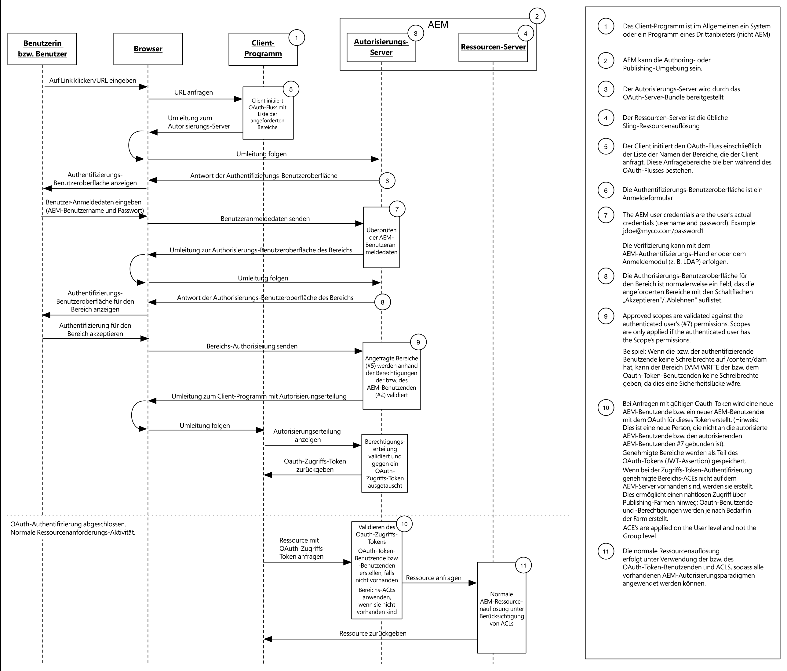

# Entwicklung von OAuth-Bereichen

Die erweiterbaren OAuth-Bereiche von Adobe Experience Manager ermöglichen die Zugriffskontrolle von Ressourcen aus einer Clientanwendung, die von einem Endbenutzer autorisiert wurde. Das unten stehende Diagramm zeigt den Anforderungsfluss im Kontext von AEM.

AEM bietet drei Bereiche:

* Profil
* Offline-Zugriff
* Replizieren

AEM erweiterbare OAuth-Bereiche ermöglichen die Definition anderer benutzerdefinierter Bereiche. Beispielsweise kann ein benutzerdefinierter Bereich entwickelt und für AEM bereitgestellt werden, mit dem eine über OAuth autorisierte mobile App auf das Lesen, aber nicht auf das Schreiben von Assets beschränkt werden kann.

OAuth ist die bevorzugte Methode zum Autorisieren einer Clientanwendung, da es ein Zugriffstoken verwendet, anstatt zu verlangen, dass die Anmeldeinformationen eines AEM Benutzers für diese Anwendung bereitgestellt werden.

* [Ansicht des Codes](https://github.com/Adobe-Consulting-Services/acs-aem-samples/blob/legacy/bundle/src/main/java/com/adobe/acs/samples/authentication/oauth/impl/SampleScopeWithPrivileges.java)
