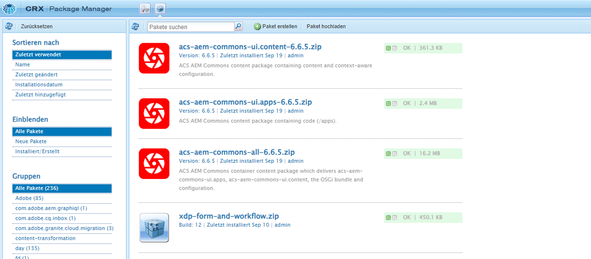

# Installieren von Drittanbieter-Artefakten – nicht im öffentlichen Maven-Repository verfügbar

Erfahren Sie, wie Sie beim Erstellen und Bereitstellen eines AEM-Projekts Drittanbieter-Artefakte installieren, die *nicht im öffentlichen Maven-Repository verfügbar sind*.

Die **Drittanbieter-Artefakte** können Folgendes sein:

- Ein [OSGi-Bundle](https://www.osgi.org/resources/architecture/) ist eine Java™-Archivdatei, die Java-Klassen, Ressourcen und ein Manifest enthält, das das Paket und seine Abhängigkeiten beschreibt. 
- [Java jar](https://docs.oracle.com/javase/tutorial/deployment/jar/basicsindex.html) ist eine Java™-Archivdatei, die Java-Klassen und Ressourcen enthält.
- [Packet](https://experienceleague.adobe.com/de/docs/experience-manager-65/content/sites/administering/contentmanagement/package-manager#what-are-packages) ist eine ZIP-Datei, die Repository-Inhalte in Form einer Dateisystem-Serialisierung enthält.

## Standardszenario

Normalerweise installieren Sie das Drittanbieter-Paket. Dies ist das Paket, das im öffentlichen Maven-Repository als Abhängigkeit in der Datei `pom.xml` Ihres AEM-Projekts *verfügbar ist*.

Zum Beispiel:

- Das **Paket** mit den [AEM WCM-Kernkomponenten](https://github.com/adobe/aem-core-wcm-components) wird in der Datei `pom.xml` des [ des WKND-Projekts](https://github.com/adobe/aem-guides-wknd/blob/main/pom.xml#L747-L753) als Abhängigkeit hinzugefügt. Hier wird der Umfang `provided` verwendet, da das Paket „AEM WCM-Kernkomponenten“ von der AEM Runtime bereitgestellt wird. Wenn das Paket nicht von der AEM Runtime bereitgestellt wird, verwenden Sie den Umfang `compile`, der den Standardumfang darstellt.

- Das **Paket** [WKND Shared](https://github.com/adobe/aem-guides-wknd-shared) wird in der Datei `pom.xml` des [WKND-Projekts](https://github.com/adobe/aem-guides-wknd/blob/main/pom.xml#L767-L773) als Abhängigkeit hinzugefügt. 


## Seltenes Szenario

Gelegentlich müssen Sie beim Erstellen und Bereitstellen eines AEM-Projekts möglicherweise ein Drittanbieter-Paket oder eine JAR oder ein Paket installieren, **das nicht** im [Maven Central-Repository](https://mvnrepository.com/) oder im [Adobe-Public Repository](https://repo.adobe.com/index.html) verfügbar ist.

Dies könnte folgende Gründe haben:

- Das Bundle oder Paket wird von einem internen Team oder Drittanbieter bereitgestellt und _ist nicht im öffentlichen Maven-Repository_ verfügbar.

- Die Java™-JAR-Datei _ist kein OSGi-Bundle_ und möglicherweise nicht im öffentlichen Maven-Repository verfügbar.

- Sie benötigen eine Funktion, die noch nicht in der neuesten Version des Drittanbieter-Pakets veröffentlicht ist, das im öffentlichen Maven-Repository verfügbar ist. Sie haben beschlossen, die lokal erstellte Version von RELEASE oder SNAPSHOT zu installieren.

## Voraussetzungen

Zum Durchführen dieses Tutorials benötigen Sie Folgendes:

- Die [lokale AEM-Entwicklungsumgebung](https://experienceleague.adobe.com/de/docs/experience-manager-learn/cloud-service/local-development-environment-set-up/overview) oder das Setup einer [schnellen Entwicklungsumgebung (Rapid Development Environment, RDE)](https://experienceleague.adobe.com/de/docs/experience-manager-learn/cloud-service/developing/rde/overview).

- Das [AEM WKND-Projekt](https://github.com/adobe/aem-guides-wknd) _, um das Drittanbieter-Paket oder die JAR oder das Paket hinzuzufügen_ und die Änderungen zu überprüfen.

## Setup

- Richten Sie die lokale Entwicklungsumgebung oder RDE-Umgebung für AEM 6.X oder AEM as a Cloud Service (AEMCS) ein.

- Klonen Sie das AEM-WKND-Projekt und stellen Sie es bereit.

  ```
  $ git clone git@github.com:adobe/aem-guides-wknd.git
  $ cd aem-guides-wknd
  $ mvn clean install -PautoInstallPackage 
  ```

  Überprüfen Sie, ob die WKND-Site-Seiten korrekt gerendert werden.

## Installieren eines Drittanbieter-Pakets in einem AEM Projekt{#install-third-party-bundle}

Installieren und verwenden Sie ein Demo-OSGi [my-example-bundle](./assets/install-third-party-articafcts/my-example-bundle.zip), das _nicht im öffentlichen Maven-Repository_ für das AEM-WKND-Projekt verfügbar ist.

Das **my-example-bundle** exportiert den `HelloWorldService`-OSGi-Dienst, die zugehörige `sayHello()`-Methode gibt die Meldung `Hello Earth!` zurück.

Weitere Informationen finden Sie in der Datei „README.md“ in der Datei [my-example-bundle.zip](./assets/install-third-party-articafcts/my-example-bundle.zip).

### Hinzufügen des Bundles zum `all`-Modul

Der erste Schritt besteht darin, das `my-example-bundle` zum `all`-Modul des AEM-WKND-Projekts hinzuzufügen.

- Laden Sie die Datei [my-example-bundle.zip](./assets/install-third-party-articafcts/my-example-bundle.zip) herunter und extrahieren Sie sie.

- Erstellen Sie im `all`-Modul des AEM-WKND-Projekts die Verzeichnisstruktur `all/src/main/content/jcr_root/apps/wknd-vendor-packages/container/install`.  Das Verzeichnis `/all/src/main/content` ist vorhanden. Sie müssen nur die Verzeichnisse `jcr_root/apps/wknd-vendor-packages/container/install` erstellen.

- Kopieren Sie die Datei `my-example-bundle-1.0-SNAPSHOT.jar` aus dem extrahierten Verzeichnis `target` in das obige Verzeichnis `all/src/main/content/jcr_root/apps/wknd-vendor-packages/container/install`.

  

### Verwenden des Dienstes aus dem Bundle

Verwenden Sie den `HelloWorldService`-OSGi-Dienst aus dem `my-example-bundle` im AEM-WKND-Projekt.

- Erstellen Sie im `core`-Modul des AEM-WKND-Projekts das Sling-Servlet `SayHello.java` unter `core/src/main/java/com/adobe/aem/guides/wknd/core/servlet`.

  ```java
  package com.adobe.aem.guides.wknd.core.servlet;
  
  import java.io.IOException;
  
  import javax.servlet.Servlet;
  import javax.servlet.ServletException;
  
  import org.apache.sling.api.SlingHttpServletRequest;
  import org.apache.sling.api.SlingHttpServletResponse;
  import org.apache.sling.api.servlets.HttpConstants;
  import org.apache.sling.api.servlets.ServletResolverConstants;
  import org.apache.sling.api.servlets.SlingSafeMethodsServlet;
  import org.osgi.service.component.annotations.Component;
  import org.osgi.service.component.annotations.Reference;
  import com.example.services.HelloWorldService;
  
  @Component(service = Servlet.class, property = {
      ServletResolverConstants.SLING_SERVLET_PATHS + "=/bin/sayhello",
      ServletResolverConstants.SLING_SERVLET_METHODS + "=" + HttpConstants.METHOD_GET
  })
  public class SayHello extends SlingSafeMethodsServlet {
  
          private static final long serialVersionUID = 1L;
  
          // Injecting the HelloWorldService from the `my-example-bundle` bundle
          @Reference
          private HelloWorldService helloWorldService;
  
          @Override
          protected void doGet(SlingHttpServletRequest request, SlingHttpServletResponse response) throws ServletException, IOException {
              // Invoking the HelloWorldService's `sayHello` method
              response.getWriter().write("My-Example-Bundle service says: " + helloWorldService.sayHello());
          }
  }
  ```

- Fügen Sie in der`pom.xml`-Stammdatei des AEM-WKND-Projekts das `my-example-bundle` als Abhängigkeit hinzu.

  ```xml
  ...
  <!-- My Example Bundle -->
  <dependency>
      <groupId>com.example</groupId>
      <artifactId>my-example-bundle</artifactId>
      <version>1.0-SNAPSHOT</version>
      <scope>system</scope>
      <systemPath>${maven.multiModuleProjectDirectory}/all/src/main/content/jcr_root/apps/wknd-vendor-packages/container/install/my-example-bundle-1.0-SNAPSHOT.jar</systemPath>
  </dependency>
  ...
  ```

  Hierbei gilt:
   - Der `system`-Bereich gibt an, dass die Abhängigkeit nicht im öffentlichen Maven-Repository nachgeschlagen werden sollte.
   - `systemPath` ist der Pfad zur Datei `my-example-bundle` im `all`-Modul des AEM-WKND-Projekts.
   - `${maven.multiModuleProjectDirectory}` ist eine Maven-Eigenschaft, die auf das Stammverzeichnis des Multi-Modul-Projekts verweist.

- Fügen Sie in der Datei `core/pom.xml` des `core`-Moduls des AEM-WKND-Projekts das `my-example-bundle` als Abhängigkeit hinzu.

  ```xml
  ...
  <!-- My Example Bundle -->
  <dependency>
      <groupId>com.example</groupId>
      <artifactId>my-example-bundle</artifactId>
  </dependency>
  ...
  ```

- Verwenden Sie den folgenden Befehl, um das AEM-WKND-Projekt zu erstellen und bereitzustellen:

  ```
  $ mvn clean install -PautoInstallPackage
  ```

- Stellen Sie sicher, dass das `SayHello`-Servlet wie erwartet funktioniert, indem Sie auf die URL `http://localhost:4502/bin/sayhello` im Browser zugreifen.

- Übergeben Sie die oben genannten Änderungen an das Repository des AEM-WKND-Projekts. Überprüfen Sie dann die Änderungen in der RDE- oder AEM-Umgebung, indem Sie die Cloud Manager-Pipeline ausführen.

  

Die Verzweigung [tutorial/install-3rd-party-bundle](https://github.com/adobe/aem-guides-wknd/compare/main...tutorial/install-3rd-party-bundle) des AEM-WKND-Projekts enthält die oben genannten Änderungen zu Ihrer Referenz.

### Wichtige Erkenntnisse{#key-learnings-bundle}

Die OSGi-Bundles, die nicht im öffentlichen Maven-Repository verfügbar sind, können in einem AEM-Projekt installiert werden, indem Sie die folgenden Schritte ausführen:

- Kopieren Sie das OSGi-Bundle in das Verzeichnis `jcr_root/apps/<PROJECT-NAME>-vendor-packages/container/install` des `all`-Moduls. Dieser Schritt ist erforderlich, um das Bundle zu verpacken und in der AEM-Instanz bereitzustellen.

- Aktualisieren Sie die `pom.xml`-Dateien von Stamm und Kernmodul, um das OSGi-Bundle als Abhängigkeit mit dem Bereich `system` und dem auf die Bundle-Datei verweisenden `systemPath` hinzuzufügen. Dieser Schritt ist erforderlich, um das Projekt zu kompilieren.

## Installieren einer JAR-Drittanbieterdatei in einem AEM-Projekt

In diesem Beispiel handelt es sich bei `my-example-jar` nicht um ein OSGi-Bundle, sondern um eine Java-JAR-Datei.

Installieren und verwenden Sie die Demodatei [my-example-jar](./assets/install-third-party-articafcts/my-example-jar.zip), die _nicht im öffentlichen Maven-Repository_ für das AEM-WKND-Projekt verfügbar ist.

**my-example-jar** ist eine Java-JAR-Datei, die eine `MyHelloWorldService`-Klasse mit einer `sayHello()`-Methode enthält, die die Meldung `Hello World!` zurückgibt.

Weitere Informationen finden Sie in der Datei „README.md“ in der Datei [my-example-jar.zip](./assets/install-third-party-articafcts/my-example-jar.zip).

### Hinzufügen der JAR-Datei zum `all`-Modul

Der erste Schritt besteht darin, die Datei `my-example-jar` zum `all`-Modul des AEM-WKND-Projekts hinzuzufügen.

- Laden Sie die Datei [my-example-jar.zip](./assets/install-third-party-articafcts/my-example-jar.zip) herunter und extrahieren Sie sie.

- Erstellen Sie im `all`-Modul des AEM-WKND-Projekts die Verzeichnisstruktur `all/resource/jar`.

- Kopieren Sie die Datei `my-example-jar-1.0-SNAPSHOT.jar` aus dem extrahierten Verzeichnis `target` in das obige Verzeichnis `all/resource/jar`.

  

### Verwenden des Dienstes aus der JAR-Datei

Verwenden Sie den `MyHelloWorldService` aus der Datei `my-example-jar` im AEM-WKND-Projekt.

- Erstellen Sie im `core`-Modul des AEMWKND-Projekts das `SayHello.java`-Sling-Servlet unter `core/src/main/java/com/adobe/aem/guides/wknd/core/servlet`.

  ```java
  package com.adobe.aem.guides.wknd.core.servlet;
  
  import java.io.IOException;
  
  import javax.servlet.Servlet;
  import javax.servlet.ServletException;
  
  import org.apache.sling.api.SlingHttpServletRequest;
  import org.apache.sling.api.SlingHttpServletResponse;
  import org.apache.sling.api.servlets.HttpConstants;
  import org.apache.sling.api.servlets.ServletResolverConstants;
  import org.apache.sling.api.servlets.SlingSafeMethodsServlet;
  import org.osgi.service.component.annotations.Component;
  
  import com.my.example.MyHelloWorldService;
  
  @Component(service = Servlet.class, property = {
          ServletResolverConstants.SLING_SERVLET_PATHS + "=/bin/sayhello",
          ServletResolverConstants.SLING_SERVLET_METHODS + "=" + HttpConstants.METHOD_GET
  })
  public class SayHello extends SlingSafeMethodsServlet {
  
      private static final long serialVersionUID = 1L;
  
      @Override
      protected void doGet(SlingHttpServletRequest request, SlingHttpServletResponse response)
              throws ServletException, IOException {
  
          // Creating an instance of MyHelloWorldService
          MyHelloWorldService myHelloWorldService = new MyHelloWorldService();
  
          // Invoking the MyHelloWorldService's `sayHello` method
          response.getWriter().write("My-Example-JAR service says: " + myHelloWorldService.sayHello());
      }
  }    
  ```

- Fügen Sie in der`pom.xml`-Stammdatei des AEM-WKND-Projekts das `my-example-jar` als Abhängigkeit hinzu.

  ```xml
  ...
  <!-- My Example JAR -->
  <dependency>
      <groupId>com.my.example</groupId>
      <artifactId>my-example-jar</artifactId>
      <version>1.0-SNAPSHOT</version>
      <scope>system</scope>
      <systemPath>${maven.multiModuleProjectDirectory}/all/resource/jar/my-example-jar-1.0-SNAPSHOT.jar</systemPath>
  </dependency>            
  ...
  ```

  Hierbei gilt:
   - Der `system`-Bereich gibt an, dass die Abhängigkeit nicht im öffentlichen Maven-Repository nachgeschlagen werden sollte.
   - `systemPath` ist der Pfad zur Datei `my-example-jar` im `all`-Modul des AEM-WKND-Projekts.
   - `${maven.multiModuleProjectDirectory}` ist eine Maven-Eigenschaft, die auf das Stammverzeichnis des Multi-Modul-Projekts verweist.

- Nehmen Sie in der Datei `core/pom.xml` im `core`-Modul des AEM-WKND-Projekts zwei Änderungen vor:

   - Fügen Sie die Datei `my-example-jar` als Abhängigkeit hinzu.

     ```xml
     ...
     <!-- My Example JAR -->
     <dependency>
         <groupId>com.my.example</groupId>
         <artifactId>my-example-jar</artifactId>
     </dependency>
     ...
     ```

   - Aktualisieren Sie die `bnd-maven-plugin`-Konfiguration, um die Datei `my-example-jar` in das OSGi-Bundle (aem-guides-wknd.core) einzuschließen, das erstellt wird.

     ```xml
     ...
     <plugin>
         <groupId>biz.aQute.bnd</groupId>
         <artifactId>bnd-maven-plugin</artifactId>
         <executions>
             <execution>
                 <id>bnd-process</id>
                 <goals>
                     <goal>bnd-process</goal>
                 </goals>
                 <configuration>
                     <bnd><![CDATA[
                 Import-Package: javax.annotation;version=0.0.0,*
                 <!-- Include the 3rd party jar as inline resource-->
                 -includeresource: \
                 lib/my-example-jar.jar=my-example-jar-1.0-SNAPSHOT.jar;lib:=true
                         ]]></bnd>
                 </configuration>
             </execution>
         </executions>
     </plugin>        
     ...
     ```

- Verwenden Sie den folgenden Befehl, um das AEM-WKND-Projekt zu erstellen und bereitzustellen:

  ```
  $ mvn clean install -PautoInstallPackage
  ```

- Stellen Sie sicher, dass das `SayHello`-Servlet wie erwartet funktioniert, indem Sie auf die URL `http://localhost:4502/bin/sayhello` im Browser zugreifen.

- Übergeben Sie die oben genannten Änderungen an das Repository des AEM-WKND-Projekts. Überprüfen Sie dann die Änderungen in der RDE- oder AEM-Umgebung, indem Sie die Cloud Manager-Pipeline ausführen.

  

Die Verzweigung [tutorial/install-3rd-party-jar](https://github.com/adobe/aem-guides-wknd/compare/main...tutorial/install-3rd-party-jar) des AEM-WKND-Projekts enthält die oben genannten Änderungen zu Ihrer Referenz.

Wenn die Java-JAR-Datei _im öffentlichen Maven-Repository verfügbar ist, es sich aber NICHT um ein OSGi-Bundle handelt_, können Sie die oben genannten Schritte ausführen, wobei der Bereich `system` von `<dependency>` und `systemPath`-Elemente nicht erforderlich sind.

### Wichtige Erkenntnisse{#key-learnings-jar}

Die Java-JAR-Dateien, die keine OSGi-Bundles sind und im öffentlichen Maven-Repository verfügbar sein können, können in einem AEM-Projekt installiert werden, indem Sie die folgenden Schritte ausführen:

- Aktualisieren Sie die `bnd-maven-plugin`-Konfiguration in der Datei `pom.xml` des Kernmoduls, um die Java-JAR-Datei als Inline-Ressource in das gerade erstellte OSGi-Bundle aufzunehmen.

Die folgenden Schritte sind nur erforderlich, wenn die Java-JAR-Datei nicht im öffentlichen Maven-Repository verfügbar ist:

- Kopieren Sie die Java-JAR-Datei in das Verzeichnis `resource/jar` des `all`-Moduls.

- Aktualisieren Sie die `pom.xml`-Dateien von Stamm und Kernmodul, um die Java-JAR-Datei als Abhängigkeit mit dem Bereich `system` und dem auf die JAR-Datei verweisenden `systemPath` hinzuzufügen.

## Installieren eines Drittanbieterpakets in einem AEM-Projekt

Installieren Sie die [ACS AEM Commons](https://adobe-consulting-services.github.io/acs-aem-commons/)-_SNAPSHOT_-Version, die lokal von der Hauptverzweigung erstellt wurde.

Dies dient lediglich dazu, um die Schritte zum Installieren eines AEM-Pakets, das nicht im öffentlichen Maven-Repository verfügbar ist, zu demonstrieren.

Das ACS AEM Commons-Paket ist im öffentlichen Maven-Repository verfügbar. Lesen Sie den Abschnitt [Hinzufügen von ACS AEM Commons zu Ihrem AEM Maven-Projekt](https://adobe-consulting-services.github.io/acs-aem-commons/pages/maven.html), um es zu Ihrem AEM-Projekt hinzuzufügen.

### Fügen Sie das Paket zum `all`-Modul hinzu.

Der erste Schritt besteht darin, das Paket zum `all`-Modul des AEM-WKND-Projekts hinzuzufügen.

- Kommentieren oder entfernen Sie die ACS AEM Commons-Release-Abhängigkeit aus der POM-Datei. Informationen zur Identifizierung der Abhängigkeit finden Sie unter [Hinzufügen von ACS AEM Commons zu Ihrem AEM Maven-Projekt](https://adobe-consulting-services.github.io/acs-aem-commons/pages/maven.html).

- Klonen Sie die `master`-Verzweigung des [ACS AEM Commons-Repositorys](https://github.com/Adobe-Consulting-Services/acs-aem-commons) auf Ihren lokalen Computer.

- Erstellen Sie die ACS AEM Commons-SNAPSHOT-Version mit dem folgenden Befehl:

  ```
  $mvn clean install
  ```

- Das lokal erstellte Paket befindet sich unter `all/target`. Es gibt zwei ZIP-Dateien. Die Datei, die auf `-cloud` endet, ist für AEM as a Cloud Service bestimmt, die andere für AEM 6.X.

- Erstellen Sie im `all`-Modul des AEM-WKND-Projekts die Verzeichnisstruktur `all/src/main/content/jcr_root/apps/wknd-vendor-packages/container/install`. Das Verzeichnis `/all/src/main/content` ist vorhanden. Sie müssen nur die Verzeichnisse `jcr_root/apps/wknd-vendor-packages/container/install` erstellen.

- Kopieren Sie die lokal erstellte Paketdatei (.zip) in das Verzeichnis `/all/src/main/content/jcr_root/apps/mysite-vendor-packages/container/install`.

- Verwenden Sie den folgenden Befehl, um das AEM-WKND-Projekt zu erstellen und bereitzustellen:

  ```
  $ mvn clean install -PautoInstallPackage
  ```

- Überprüfen Sie das installierte ACS AEM Commons-Paket:

   - CRX Package Manager unter `http://localhost:4502/crx/packmgr/index.jsp`

     

   - OSGi-Konsole unter `http://localhost:4502/system/console/bundles`

     

- Übergeben Sie die oben genannten Änderungen an das Repository des AEM-WKND-Projekts. Überprüfen Sie dann die Änderungen in der RDE- oder AEM-Umgebung, indem Sie die Cloud Manager-Pipeline ausführen.

### Wichtige Erkenntnisse{#key-learnings-package}

Die AEM-Pakete, die nicht im öffentlichen Maven-Repository verfügbar sind, können in einem AEM-Projekt installiert werden, indem Sie die folgenden Schritte ausführen:

- Kopieren Sie das Paket in das Verzeichnis `jcr_root/apps/<PROJECT-NAME>-vendor-packages/container/install` des `all`-Moduls. Dieser Schritt ist erforderlich, um das Paket zu verpacken und in der AEM-Instanz bereitzustellen.


## Zusammenfassung

In diesem Tutorial haben Sie erfahren, wie Sie Drittanbieter-Artefakte (Bundle, Java-JAR und Paket) installieren, die beim Erstellen und Bereitstellen eines AEM-Projekts nicht im öffentlichen Maven-Repository verfügbar sind.
