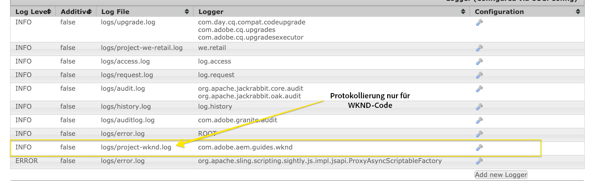
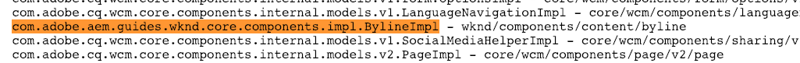
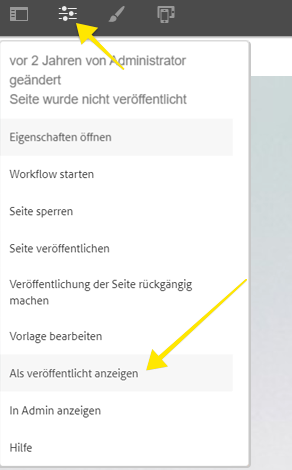
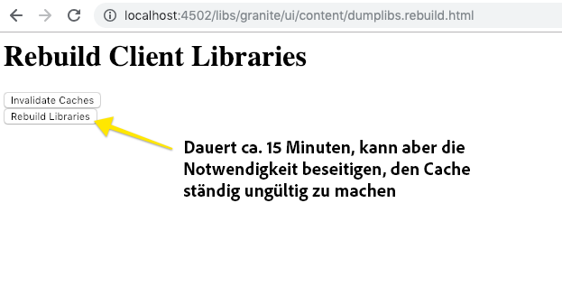

# Lokale AEM-Entwicklungsumgebung einrichten

Handbuch zur Einrichtung einer lokalen Entwicklung für Adobe Experience Manager, AEM. Behandelt wichtige Themen wie lokale Installation, Apache Maven, integrierte Entwicklungs-Umgebung und Debugging/Fehlerbehebung. Die Entwicklung mit **[!DNL Eclipse IDE], [!DNL CRXDE Lite], [!DNL Visual Studio Code] und[!DNL IntelliJ]** werden erläutert.

## Überblick

Die Einrichtung einer Umgebung für die lokale Entwicklung ist der erste Schritt bei der Entwicklung für Adobe Experience Manager oder AEM. Nehmen Sie sich die Zeit, eine Umgebung zur Qualitätsentwicklung einzurichten, um Ihre Produktivität zu steigern und schnelleren Code zu schreiben. Wir können eine AEM Umgebung zur lokalen Entwicklung in vier Bereiche unterteilen:

* Lokale AEM
* [!DNL Apache Maven] Projekt
* Integrierte Entwicklungs-Umgebung (IDE)
* Fehlerbehebung

## Lokale AEM installieren

Wenn wir uns auf eine lokale AEM beziehen, sprechen wir über eine Kopie von Adobe Experience Manager, die auf dem persönlichen Rechner eines Entwicklers ausgeführt wird. ****** AllAEM-Entwicklung sollte durch Schreiben und Ausführen von Code für eine lokale AEM-Instanz Beginn werden.

Wenn Sie neu AEM sind, können zwei grundlegende Ausführungsmodi installiert werden: ***Autor*** und ***Veröffentlichen***. Der ***Autor*** [runmode](https://helpx.adobe.com/experience-manager/6-5/sites/deploying/using/configure-runmodes.html) ist die Umgebung, die digitale Marketingexperten zum Erstellen und Verwalten von Inhalten verwenden. Bei der Entwicklung von **meistens** werden Sie Code für eine Autoreninstanz bereitstellen. Auf diese Weise können Sie neue Seiten erstellen sowie Komponenten hinzufügen und konfigurieren. AEM Sites ist ein WYSIWYG-Authoring-CMS und daher können die meisten CSS- und JavaScript-Dateien mit einer Authoring-Instanz getestet werden.

Es ist auch *kritischer*-Testcode für eine lokale ***Instanz im Veröffentlichungsmodus***. Die Instanz ***Publish*** ist die AEM Umgebung, mit der Besucher Ihrer Website interagieren. Während die Instanz ***Veröffentlichen*** derselbe Technologiestapel ist wie die Instanz ***Autor***, gibt es einige wichtige Unterscheidungen mit Konfigurationen und Berechtigungen. Code sollte *immer* mit einer lokalen ***Veröffentlichungsinstanz*** getestet werden, bevor er zu Umgebung auf höherer Ebene beworben wird.

### Schritte

1. Stellen Sie sicher, dass [Java](https://downloads.experiencecloud.adobe.com/content/software-distribution/en/general.html) installiert ist.
   * Für AEM 6.5+ bevorzugen Sie [Java JDK 11](https://experience.adobe.com/#/downloads/content/software-distribution/en/general.html?1_group.propertyvalues.property=.%2Fjcr%3Acontent%2Fmetadata%2Fdc%3AsoftwareType&amp;1_group.propertyvalues.operation=equals&amp;1_group.propertyvalues.0_values=software-type%3Atooling&amp;orderby=%40jcr%3Acontent%2Fjcr%3AlastModified&amp;orderby.sort=desc&amp;layout Liste&amp;p.offset=0&amp;p.limit=14)
   * [Java JDK 8](https://www.oracle.com/technetwork/java/javase/downloads/index.html#JDK8) für AEM Versionen vor AEM 6.5
2. Besorgen Sie sich eine Kopie des [AEM QuickStart-Jars und eines [!DNL license.properties]](https://helpx.adobe.com/experience-manager/6-5/sites/deploying/using/deploy.html#GettingtheSoftware).
3. Erstellen Sie auf Ihrem Computer eine Ordnerstruktur wie die folgende:

   ```plain
   ~/aem-sdk
       /author
       /publish
   ```

4. Benennen Sie die JAR-Datei in ***aem-author-p4502.jar*** um und platzieren Sie sie unter dem Ordner `/author`. [!DNL QuickStart] hinzufügen Sie die Datei ***[!DNL license.properties]*** unter dem Ordner `/author`.
5. Erstellen Sie eine Kopie der JAR [!DNL QuickStart], benennen Sie sie in ***aem-publish-p4503.jar*** um und platzieren Sie sie unter dem Ordner `/publish`. hinzufügen eine Kopie der Datei ***[!DNL license.properties]*** unter dem Ordner `/publish`.

   ```plain
   ~/aem-sdk
       /author
           + aem-author-p4502.jar
           + license.properties
       /publish
           + aem-publish-p4503.jar
           + license.properties
   ```

6. Klicken Sie bei gedrückter Dublette auf die Datei ***aem-author-p4502.jar***, um die Instanz **Autor** zu installieren. Dies Beginn die Autoreninstanz, die auf dem Port **4502** auf dem lokalen Computer ausgeführt wird.

   Klicken Sie bei gedrückter Dublette auf die Datei ***aem-publish-p4503.jar***, um die Instanz **Publish** zu installieren. Dadurch wird die Instanz im Veröffentlichungsmodus auf dem lokalen Beginn mit Port **4503** ausgeführt.

   >[!NOTE]
   >
   >Je nach Hardware Ihres Entwicklungscomputers kann es schwierig sein, eine **Autoreninstanz und eine**-Instanz gleichzeitig auszuführen. In seltenen Fällen müssen Sie beide gleichzeitig auf einem lokalen Setup ausführen.

   Weitere Informationen finden Sie unter [Bereitstellen und Warten einer AEM Instanz](https://helpx.adobe.com/experience-manager/6-5/sites/deploying/using/deploy.html).

## Apache Maven installieren

***[!DNL Apache Maven]*** ist ein Tool zum Verwalten des Build &amp; Deployment-Verfahrens für Java-basierte Projekte. AEM ist eine Java-basierte Plattform und [!DNL Maven] ist die Standardmethode zum Verwalten von Code für ein AEM Projekt. Wenn wir ***AEM Maven Project*** oder nur Ihr ***AEM Projekt*** angeben, beziehen wir uns auf ein Maven-Projekt, das den gesamten *benutzerspezifischen*-Code für Ihre Site enthält.

Alle AEM Projekte sollten auf der neuesten Version des **[!DNL AEM Project Archetype]** aufgebaut werden: [https://github.com/Adobe-Marketing-Cloud/aem-project-archetype](https://github.com/Adobe-Marketing-Cloud/aem-project-archetype). Das [!DNL AEM Project Archetype] erstellt einen Bootstrap eines AEM Projekts mit Beispielcode und Inhalt. Das [!DNL AEM Project Archetype] enthält auch **[!DNL AEM WCM Core Components]**, die für die Verwendung in Ihrem Projekt konfiguriert sind.

>[!CAUTION]
>
>Beim Starten eines neuen Projekts ist es eine Best Practice, die neueste Version des Archetyps zu verwenden. Denken Sie daran, dass es mehrere Versionen des Archetyps gibt und nicht alle Versionen mit früheren Versionen von AEM kompatibel sind.

### Schritte

1. [Apache Maven](https://maven.apache.org/download.cgi) herunterladen
2. Installieren Sie [Apache Maven](https://maven.apache.org/install.html) und stellen Sie sicher, dass die Installation zu Ihrer Befehlszeile `PATH` hinzugefügt wurde.
   * [!DNL macOS] Benutzer können Maven mit  [Homebrew installieren](https://brew.sh/)
3. Stellen Sie sicher, dass **[!DNL Maven]** installiert ist, indem Sie ein neues Befehlszeilenterminal öffnen und Folgendes ausführen:

   ```shell
   $ mvn --version
   Apache Maven 3.3.9
   Maven home: /Library/apache-maven-3.3.9
   Java version: 1.8.0_111, vendor: Oracle Corporation
   Java home: /Library/Java/JavaVirtualMachines/jdk1.8.0_111.jdk/Contents/Home/jre
   Default locale: en_US, platform encoding: UTF-8
   ```

4. hinzufügen Sie das Profil **[!DNL adobe-public]** in die Datei [!DNL Maven] [settings.xml](https://maven.apache.org/settings.html), um dem Maven-Build-Prozess automatisch **[!DNL repo.adobe.com]** hinzuzufügen.

5. Erstellen Sie eine Datei mit dem Namen `settings.xml` unter `~/.m2/settings.xml`, wenn sie nicht bereits vorhanden ist.

6. hinzufügen Sie das Profil **[!DNL adobe-public]** auf der Grundlage der [Anweisungen hier](https://repo.adobe.com/) in die `settings.xml`-Datei.

   Nachfolgend ist ein Beispiel `settings.xml` aufgeführt. *Beachten Sie, dass die Benennungskonvention  `settings.xml` und die Platzierung unter dem  `.m2` Ordner des Benutzers wichtig sind.*

   ```xml
   <settings xmlns="https://maven.apache.org/SETTINGS/1.0.0"
     xmlns:xsi="https://www.w3.org/2001/XMLSchema-instance"
     xsi:schemaLocation="https://maven.apache.org/SETTINGS/1.0.0
                         https://maven.apache.org/xsd/settings-1.0.0.xsd">
   <profiles>
    <!-- ====================================================== -->
    <!-- A D O B E   P U B L I C   P R O F I L E                -->
    <!-- ====================================================== -->
        <profile>
            <id>adobe-public</id>
            <activation>
                <activeByDefault>true</activeByDefault>
            </activation>
            <properties>
                <releaseRepository-Id>adobe-public-releases</releaseRepository-Id>
                <releaseRepository-Name>Adobe Public Releases</releaseRepository-Name>
                <releaseRepository-URL>https://repo.adobe.com/nexus/content/groups/public</releaseRepository-URL>
            </properties>
            <repositories>
                <repository>
                    <id>adobe-public-releases</id>
                    <name>Adobe Public Repository</name>
                    <url>https://repo.adobe.com/nexus/content/groups/public</url>
                    <releases>
                        <enabled>true</enabled>
                        <updatePolicy>never</updatePolicy>
                    </releases>
                    <snapshots>
                        <enabled>false</enabled>
                    </snapshots>
                </repository>
            </repositories>
            <pluginRepositories>
                <pluginRepository>
                    <id>adobe-public-releases</id>
                    <name>Adobe Public Repository</name>
                    <url>https://repo.adobe.com/nexus/content/groups/public</url>
                    <releases>
                        <enabled>true</enabled>
                        <updatePolicy>never</updatePolicy>
                    </releases>
                    <snapshots>
                        <enabled>false</enabled>
                    </snapshots>
                </pluginRepository>
            </pluginRepositories>
        </profile>
   </profiles>
    <activeProfiles>
        <activeProfile>adobe-public</activeProfile>
    </activeProfiles>
   </settings>
   ```

7. Stellen Sie sicher, dass das Profil **adobe-public** aktiv ist, indem Sie den folgenden Befehl ausführen:

   ```shell
   $ mvn help:effective-settings
   ...
   <activeProfiles>
       <activeProfile>adobe-public</activeProfile>
   </activeProfiles>
   <pluginGroups>
       <pluginGroup>org.apache.maven.plugins</pluginGroup>
       <pluginGroup>org.codehaus.mojo</pluginGroup>
   </pluginGroups>
   </settings>
   [INFO] ------------------------------------------------------------------------
   [INFO] BUILD SUCCESS
   [INFO] ------------------------------------------------------------------------
   [INFO] Total time:  0.856 s
   ```

   Wenn das **[!DNL adobe-public]**-Zeichen nicht angezeigt wird, ist dies ein Hinweis darauf, dass in Ihrer `~/.m2/settings.xml`-Datei nicht richtig auf die Adobe repo verwiesen wird. Bitte überprüfen Sie, ob die Datei &quot;settings.xml&quot;auf den Adoben-Repo verweist.

## Integrierte Entwicklungs-Umgebung einrichten

Eine integrierte Entwicklungs-Umgebung oder IDE ist eine Anwendung, die einen Texteditor, Syntaxunterstützung und Buildwerkzeuge kombiniert. Je nach Art der Entwicklung, die Sie durchführen, ist eine IDE möglicherweise besser als eine andere. Unabhängig von der IDE ist es wichtig, regelmäßig ***push***-Code an eine lokale AEM-Instanz senden zu können, um sie zu testen. Es ist auch wichtig, gelegentlich ***Konfigurationen von einer lokalen AEM in Ihr AEM Projekt zu ziehen, um zu einem Quellcodeverwaltungssystem wie Git zu gelangen.***

Im Folgenden finden Sie einige der beliebtesten IDEs, die mit AEM Entwicklung mit entsprechenden Videos verwendet werden, die die Integration mit einer lokalen AEM zeigen.

>[!NOTE]
>
> Das WKND-Projekt wurde aktualisiert, um standardmäßig AEM als Cloud Service zu bearbeiten. Es wurde aktualisiert, um [rückwärtskompatibel mit 6.5/6.4](https://github.com/adobe/aem-guides-wknd#building-for-aem-6xx) zu sein. Wenn Sie AEM 6.5 oder 6.4 verwenden, hängen Sie das `classic`-Profil an beliebige Maven-Befehle an.

```shell
$ mvn clean install -PautoInstallSinglePackage -Pclassic
```

Wenn Sie eine IDE verwenden, überprüfen Sie `classic` in Ihrer Maven Profil Registerkarte.


*IntelliJ Maven Profil*

### [!DNL Eclipse] IDE

Die **[[!DNL Eclipse] IDE](https://www.eclipse.org/ide/)** ist eine der beliebtesten IDEs für die Java-Entwicklung, zum großen Teil, weil sie Open Source und ***free*** ist! Adobe stellt ein Plugin bereit, **[[!DNL AEM Developer Tools]](https://eclipse.adobe.com/aem/dev-tools/)**, für [!DNL Eclipse], um die Entwicklung mit einer GUI zu vereinfachen und Code mit einer lokalen AEM zu synchronisieren. Die [!DNL Eclipse] IDE wird für Entwickler empfohlen, die neu AEM sind, weil die GUI-Unterstützung von [!DNL AEM Developer Tools].

#### Installation und Einrichtung

1. Laden Sie die [!DNL Eclipse]-IDE für [!DNL Java EE Developers] herunter und installieren Sie sie: [https://www.eclipse.org](https://www.eclipse.org/)
1. Folgen Sie den Anweisungen zum Installieren des [!DNL AEM Developer Tools]-Plug-Ins: [https://eclipse.adobe.com/aem/dev-tools/](https://eclipse.adobe.com/aem/dev-tools/)

>[!VIDEO](https://video.tv.adobe.com/v/25906?quality=12&learn=on)

* 00:30 - Maven-Projekt importieren
* 01:24 - Erstellen und Bereitstellen von Quellcode mit Maven
* 04:33 - Push-Codeänderungen mit AEM Developer Tool
* 10:55 - Codeänderungen mit AEM Developer Tool abrufen
* 13:12 - Verwenden der integrierten Debuggingwerkzeuge von Eclipse

### IntelliJ IDEA

Die **[IntelliJ IDEA](https://www.jetbrains.com/idea/)** ist eine leistungsstarke IDE für professionelle Java-Entwicklung. [!DNL IntelliJ IDEA] ist in zwei Geschmacksrichtungen, eine  ****** [!DNL Community] Freeedition und eine kommerzielle (kostenpflichtige)  [!DNL Ultimate] Version. Die kostenlose [!DNL Community]-Version von [!DNL IntellIJ IDEA] ist ausreichend für AEM Entwicklung, die [!DNL Ultimate] [erweitert jedoch ihren Funktionssatz](https://www.jetbrains.com/idea/download).

#### [!DNL Installation and Setup]

1. Laden Sie die [!DNL IntelliJ IDEA]-Datei herunter und installieren Sie sie: [https://www.jetbrains.com/idea/download](https://www.jetbrains.com/idea/download)
1. [!DNL Repo] (Befehlszeilenwerkzeug) installieren: [https://github.com/Adobe-Marketing-Cloud/tools/tree/master/repo](https://github.com/Adobe-Marketing-Cloud/tools/tree/master/repo#installation)

>[!VIDEO](https://video.tv.adobe.com/v/26089/?quality=12&learn=on)

* 00:00 - Maven-Projekt importieren
* 05:47 - Erstellen und Bereitstellen von Quellcode mit Maven
* 08:17 - Push-Änderungen mit Repo
* 14:39 - Änderungen mit Repo ziehen
* 17:25 - Verwenden der integrierten Debuggingwerkzeuge von IntelliJ IDEA

### [!DNL Visual Studio Code]

**[Visual Studio-](https://code.visualstudio.com/)** Codecs sind schnell zu einem bevorzugten Tool für  ***Front-End-*** Entwickler geworden, mit erweiterter JavaScript-Unterstützung  [!DNL Intellisense]und Browser-Debugging-Unterstützung. **[!DNL Visual Studio Code]** ist Open Source, kostenlos, mit vielen leistungsstarken Erweiterungen. [!DNL Visual Studio Code] kann mithilfe eines Adobe-Tools,  **[Repo](https://github.com/Adobe-Marketing-Cloud/tools/tree/master/repo#integration-into-visual-studio-code), in AEM integriert werden.** Es gibt auch mehrere von der Community unterstützte Erweiterungen, die installiert werden können, um sie in AEM zu integrieren.

[!DNL Visual Studio Code] ist eine großartige Wahl für Front-End-Entwickler, die hauptsächlich CSS/LESS und JavaScript-Code schreiben, um AEM Client-Bibliotheken zu erstellen. Dieses Tool ist möglicherweise nicht die beste Wahl für neue AEM-Entwickler, da Knotendefinitionen (Dialoge, Komponenten) alle in Rohdaten-XML bearbeitet werden müssen. Es sind mehrere Java-Erweiterungen für [!DNL Visual Studio Code] verfügbar, sollten Sie jedoch in erster Linie Java-Entwicklung [!DNL Eclipse IDE] oder [!DNL IntelliJ] bevorzugen.

#### Wichtige Links

* [****](https://code.visualstudio.com/Download) **DownloadVisual Studio-Code**
* **[repo](https://github.com/Adobe-Marketing-Cloud/tools/tree/master/repo#integration-into-visual-studio-code)** - FTP-ähnliches Tool für JCR-Inhalte
* **[aemed](https://aemfed.io/)**  - Schneller AEM Front-End-Workflow
* **[AEM Synchronisierung](https://marketplace.visualstudio.com/items?itemName=Yinkai15.aemsync)**  - Community-unterstützte* Erweiterung für Visual Studio-Code

>[!VIDEO](https://video.tv.adobe.com/v/25907?quality=12&learn=on)

* 00:30 - Maven-Projekt importieren
* 00:53 - Erstellen und Bereitstellen von Quellcode mit Maven
* 04:03 - Push-Codeänderungen mit dem Repo-Befehlszeilenwerkzeug
* 08:29 - Codeänderungen mit dem Repo-Befehlszeilenwerkzeug abrufen
* 10:40 - Änderungen am Push-Code mit einem eingebetteten Tool
* 14:24 - Fehlerbehebung, Client-Bibliotheken neu erstellen

### [!DNL CRXDE Lite]

[CRXDE ](https://helpx.adobe.com/experience-manager/6-4/sites/developing/using/developing-with-crxde-lite.html) Liteis ist eine browserbasierte Ansicht des AEM Repository. [!DNL CRXDE Lite] ist in AEM eingebettet und ermöglicht es Entwicklern, standardmäßige Aufgaben wie das Bearbeiten von Dateien, das Definieren von Komponenten, Dialogen und Vorlagen auszuführen. [!DNL CRXDE Lite] ist  ****** nicht als vollständige Entwicklungs-Umgebung gedacht, sondern als Debugging-Tool sehr effektiv. [!DNL CRXDE Lite] ist nützlich, wenn Sie Produktcode außerhalb der Codebasis erweitern oder einfach verstehen. [!DNL CRXDE Lite] bietet eine leistungsstarke Ansicht des Repositorys und eine Möglichkeit, Berechtigungen effektiv zu testen und zu verwalten.

[!DNL CRXDE Lite] sollte immer zusammen mit anderen IDEs zum Testen und Debuggen von Code verwendet werden, jedoch nie als primäres Entwicklungstool. Es bietet eingeschränkte Syntaxunterstützung, keine Funktion zum automatischen Vervollständigen und eine eingeschränkte Integration mit Quellcode-Verwaltungssystemen.

>[!VIDEO](https://video.tv.adobe.com/v/25917?quality=12&learn=on)

## Fehlerbehebung

***Hilfe!*** Mein Code funktioniert nicht! Wie bei jeder Entwicklung wird es Zeiten (wahrscheinlich viele) geben, in denen Ihr Code einfach nicht wie erwartet funktioniert. AEM ist eine leistungsstarke Plattform, aber mit großer Macht... ist sehr komplex. Im Folgenden finden Sie einige wichtige Ausgangspunkte zur Fehlerbehebung und Verfolgung von Problemen (bei einer umfassenden Liste von Dingen, die schiefgehen können):

### Codebereitstellung überprüfen

Ein guter erster Schritt bei Auftreten eines Problems besteht darin, zu überprüfen, ob der Code bereitgestellt und erfolgreich AEM installiert wurde.

1. **Überprüfen Sie  [!UICONTROL Package]** Manager, um sicherzustellen, dass das Codepaket hochgeladen und installiert wurde:  [http://localhost:4502/crx/packmgr/index.jsp](http://localhost:4502/crx/packmgr/index.jsp). Überprüfen Sie den Zeitstempel, um sicherzustellen, dass das Paket kürzlich installiert wurde.
1. Wenn Sie inkrementelle Dateiaktualisierungen mit einem Tool wie [!DNL Repo] oder [!DNL AEM Developer Tools] durchführen, überprüfen Sie **ob die Datei an die lokale AEM gesendet wurde und der Dateiinhalt aktualisiert wird: [http://localhost:4502/crx/de/index.jsp](http://localhost:4502/crx/de/index.jsp)[!DNL CRXDE Lite]**
1. **Überprüfen Sie, ob das Bundle** hochgeladen wird und Probleme im Zusammenhang mit Java-Code in einem OSGi-Bundle auftreten. Öffnen Sie die [!UICONTROL Adobe Experience Manager Web Console]: [http://localhost:4502/system/console/bundles](http://localhost:4502/system/console/bundles) und suchen Sie nach Ihrem Bundle. Stellen Sie sicher, dass das Bundle den Status **[!UICONTROL Aktiv]** hat. Weitere Informationen zur Fehlerbehebung bei einem Bundle im Status **[!UICONTROL Installiert]** finden Sie unten.

#### Überprüfen Sie die Protokolle

AEM ist eine chatty-Plattform und protokolliert viele nützliche Informationen in **error.log**. Die Datei **error.log** befindet sich an der Stelle, an der AEM installiert wurde: &lt; `aem-installation-folder>/crx-quickstart/logs/error.log`.

Eine nützliche Methode zur Verfolgung von Problemen ist das Hinzufügen von Protokollanweisungen zu Ihrem Java-Code:

```java
import org.slf4j.Logger;
import org.slf4j.LoggerFactory;
...

public class MyClass {
    private final Logger log = LoggerFactory.getLogger(getClass());

    ...

    String myVariable = "My Variable";

    log.debug("Debug statement of myVariable {}", myVariable);

    log.info("Info statement of myVariable {}", myVariable);
}
```

Standardmäßig ist **error.log** für die Protokollierung von *[!DNL INFO]*-Anweisungen konfiguriert. Wenn Sie die Protokollebene ändern möchten, gehen Sie zu [!UICONTROL Protokollunterstützung]: [http://localhost:4502/system/console/slinglog](http://localhost:4502/system/console/slinglog). Sie können auch feststellen, dass **error.log** zu chatty ist. Mit dem [!UICONTROL Protokollsupport] können Sie Protokollanweisungen für nur ein bestimmtes Java-Paket konfigurieren. Dies ist eine Best Practice für Projekte, um benutzerspezifische Codeprobleme einfach von OOTB AEM Plattformfragen zu trennen.



#### Das Bundle befindet sich in einem installierten Zustand {#bundle-active}

Alle Pakete (außer Fragmente) müssen den Status **[!UICONTROL Aktiv]** haben. Wenn Ihr Code-Bundle in einem Status [!UICONTROL Installiert] angezeigt wird, muss ein Problem behoben werden. Meistens handelt es sich hierbei um ein Abhängigkeitsproblem:


Im obigen Screenshot ist [!DNL WKND Core bundle] der Status [!UICONTROL Installiert]. Der Grund dafür ist, dass das Bundle eine andere Version von `com.adobe.cq.wcm.core.components.models` erwartet, als in der AEM-Instanz verfügbar ist.

Ein nützliches Tool, das verwendet werden kann, ist der [!UICONTROL Abhängigkeitssuche]: [http://localhost:4502/system/console/depfinder](http://localhost:4502/system/console/depfinder). hinzufügen Sie den Namen des Java-Pakets, um zu überprüfen, welche Version auf der AEM-Instanz verfügbar ist:


Im obigen Beispiel können wir sehen, dass die auf der AEM Instanz installierte Version **12.2** oder **12.6** ist, die vom Bundle erwartet wurde. Von hier aus können Sie rückwärts arbeiten und sehen, ob die [!DNL Maven] Abhängigkeiten von AEM mit den [!DNL Maven] Abhängigkeiten im AEM Projekt übereinstimmen. Im obigen Beispiel ist [!DNL Core Components] **v2.2.0** auf der AEM-Instanz installiert, aber das Codebündel wurde mit einer Abhängigkeit von **v2.2.2** erstellt. Dies ist der Grund für das Abhängigkeitsproblem.

#### Sling-Modellregistrierung {#osgi-component-sling-models} überprüfen

AEM Komponenten sollten immer durch ein [!DNL Sling Model] gesichert werden, um eine beliebige Geschäftslogik zu kapseln und sicherzustellen, dass das HTML-Rendering-Skript sauber bleibt. Wenn Probleme auftreten, bei denen das Sling-Modell nicht gefunden werden kann, ist es möglicherweise hilfreich, das [!DNL Sling Models] in der Konsole zu überprüfen: [http://localhost:4502/system/console/status-slingmodels](http://localhost:4502/system/console/status-slingmodels). Dies zeigt Ihnen an, ob Ihr Sling-Modell registriert wurde und mit welchem Ressourcentyp (dem Komponentenpfad) es verbunden ist.



Zeigt die Registrierung eines [!DNL Sling Model], `BylineImpl`, das mit einem Komponentenressourcentyp `wknd/components/content/byline` verknüpft ist.

#### CSS- oder JavaScript-Probleme

Bei den meisten CSS- und JavaScript-Problemen ist die Verwendung der Entwicklungstools des Browsers die effektivste Methode zur Fehlerbehebung. Um das Problem bei der Entwicklung gegen eine AEM Autoreninstanz einzuschränken, ist es hilfreich, die Seite &quot;als veröffentlicht&quot;Ansicht.



Öffnen Sie das Menü [!UICONTROL Seiteneigenschaften] und klicken Sie auf [!UICONTROL Ansicht als Veröffentlicht]. Dadurch wird die Seite ohne den AEM Editor geöffnet und mit einem Abfrage-Parameter, der auf **wcmmode=disabled** eingestellt ist. Dadurch wird die Benutzeroberfläche für das AEM Authoring deaktiviert und die Fehlerbehebung und das Debugging von Frontend-Problemen erheblich vereinfacht.

Ein weiteres häufig auftretendes Problem bei der Entwicklung von Front-End-Code ist veraltet oder veraltet CSS/JS wird geladen. Als ersten Schritt müssen Sie sicherstellen, dass der Browserverlauf gelöscht wurde und bei Bedarf einen Inkognito-Browser oder eine neue Sitzung Beginn wird.

#### Debuggen von Client-Bibliotheken

Bei verschiedenen Methoden der Kategorie und Einbettung, um mehrere Client-Bibliotheken einzuschließen, kann es schwerfällig sein, Fehler zu beheben. AEM stellt mehrere Hilfsmittel zur Verfügung. Eines der wichtigsten Werkzeuge ist [!UICONTROL Client-Bibliotheken neu erstellen], was AEM zwingt, alle LESS-Dateien neu zu kompilieren und die CSS zu generieren.

* [Dump Libs](http://localhost:4502/libs/granite/ui/content/dumplibs.html)  - Liste aller in der AEM Instanz registrierten Client-Bibliotheken. &lt;host>/libs/granite/ui/content/dumplibs.html
* [Testausgabe](http://localhost:4502/libs/granite/ui/content/dumplibs.test.html)  - ermöglicht es dem Benutzer, die erwartete HTML-Ausgabe von clientlib auf der Grundlage der Kategorie anzuzeigen. &lt;host>/libs/granite/ui/content/dumplibs.test.html
* [Überprüfung](http://localhost:4502/libs/granite/ui/content/dumplibs.validate.html)  der Abhängigkeiten von Bibliotheken: hebt alle Abhängigkeiten oder eingebetteten Kategorien hervor, die nicht gefunden werden können. &lt;host>/libs/granite/ui/content/dumplibs.validate.html
* [Client-Bibliotheken](http://localhost:4502/libs/granite/ui/content/dumplibs.rebuild.html)  neu erstellen: Ermöglicht es einem Benutzer, AEM zu erzwingen, alle Client-Bibliotheken neu zu erstellen oder den Cache der Client-Bibliotheken zu ungültigen. Dieses Tool ist besonders effektiv, wenn es mit LESS entwickelt wird, da dies AEM zwingen kann, die generierte CSS erneut zu kompilieren. Im Allgemeinen ist es effektiver, Caches zu ungültigen und dann eine Seitenaktualisierung durchzuführen, anstatt alle Bibliotheken neu zu erstellen. &lt;host>/libs/granite/ui/content/dumplibs.rebuild.html



>[!NOTE]
>
>Wenn Sie den Cache ständig mit dem Tool [!UICONTROL Client-Bibliotheken neu erstellen] ungültig machen müssen, ist es möglicherweise sinnvoll, alle Client-Bibliotheken einmal neu zu erstellen. Dies kann etwa 15 Minuten dauern, beseitigt jedoch in der Regel alle Cache-Probleme in der Zukunft.
