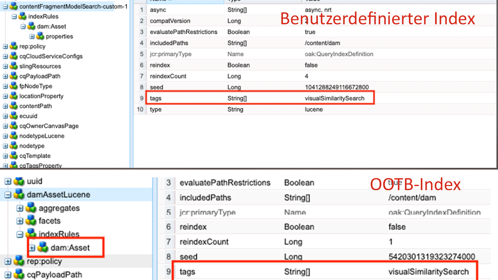
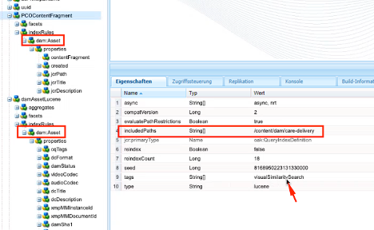
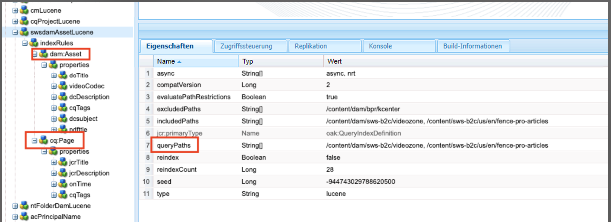
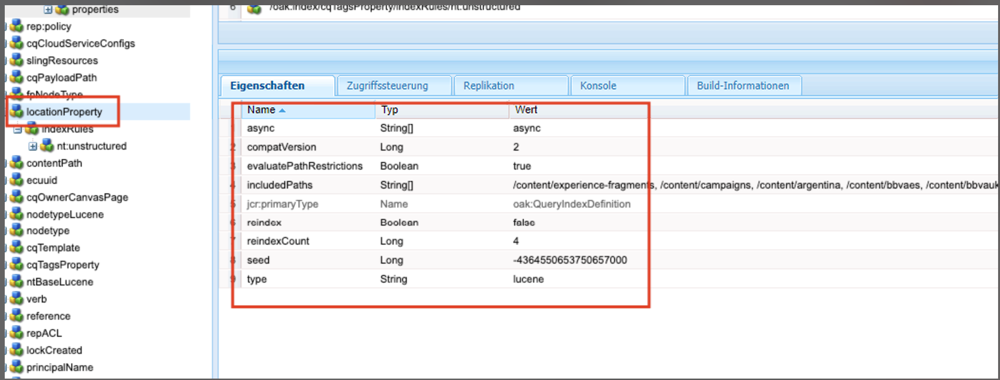

# Indizierung von Best Practices in AEM

Erfahren Sie mehr über die Best Practices für die Indizierung in Adobe Experience Manager (AEM). Apache [Jackrabbit Oak](https://jackrabbit.apache.org/oak/docs/query/query.html) ermöglicht die Inhaltssuche in AEM und die folgenden Schlüsselpunkte sind:

- Standardmäßig bietet AEM verschiedene Indizes, um beispielsweise Such- und Abfragefunktionen zu unterstützen. `damAssetLucene`, `cqPageLucene` und mehr.
- Alle Indexdefinitionen werden im Repository unter `/oak:index` Knoten.
- AEM as a Cloud Service unterstützt nur Oak Lucene-Indizes.
- Die Indexkonfiguration sollte in der AEM Projekt-Codebase verwaltet und mithilfe der CI/CD-Pipelines von Cloud Manager bereitgestellt werden.
- Wenn für eine bestimmte Abfrage mehrere Indizes verfügbar sind, wird die **Index mit den niedrigsten geschätzten Kosten verwendet wird**.
- Wenn für eine bestimmte Abfrage kein Index verfügbar ist, wird die Inhaltsstruktur durchsucht, um den entsprechenden Inhalt zu finden. Die Standardbegrenzung ist jedoch über `org.apache.jackrabbit.oak.query.QueryEngineSettingsService` wird nur 10.000 Knoten durchlaufen.
- Die Ergebnisse einer Abfrage sind **zuletzt gefiltert** , um sicherzustellen, dass der aktuelle Benutzer Lesezugriff hat. Das bedeutet, dass die Abfrageergebnisse kleiner sein können als die Anzahl der indizierten Knoten.
- Die Neuindizierung des Repositorys nach Indexdefinitionsänderungen erfordert Zeit und hängt von der Größe des Repositorys ab.

Um über eine effiziente und korrekte Suchfunktion zu verfügen, die die Leistung der AEM-Instanz nicht beeinträchtigt, sollten Sie die Best Practices für die Indizierung kennen.

## Benutzerspezifischer vs. OOTB-Index

Manchmal müssen Sie benutzerdefinierte Indizes erstellen, um Ihre Suchanforderungen zu unterstützen. Beachten Sie jedoch die folgenden Richtlinien, bevor Sie benutzerdefinierte Indizes erstellen:

- Machen Sie sich mit den Suchanforderungen vertraut und prüfen Sie, ob die OOTB-Indizes die Suchanforderungen unterstützen können. Verwendung **Tool zur Abfrageleistung**, verfügbar unter [lokales SDK](http://localhost:4502/libs/granite/operations/content/diagnosistools/queryPerformance.html) und AEMCS über die Developer Console oder `https://author-pXXXX-eYYYY.adobeaemcloud.com/ui#/aem/libs/granite/operations/content/diagnosistools/queryPerformance.html?appId=aemshell`.

- Definieren Sie eine optimale Abfrage mithilfe der [Abfragen optimieren](https://experienceleague.adobe.com/docs/experience-manager-cloud-service/content/operations/query-and-indexing-best-practices.html?#optimizing-queries) Flussdiagramm und [JCR Query Cheat Sheet](https://experienceleague.adobe.com/docs/experience-manager-65/assets/JCR_query_cheatsheet-v1.1.pdf?lang=en) als Referenz.

- Wenn die OOTB-Indizes die Suchanforderungen nicht unterstützen können, haben Sie zwei Möglichkeiten. Lesen Sie jedoch die [Tipps zum Erstellen effizienter Indizes](https://experienceleague.adobe.com/docs/experience-manager-65/content/implementing/deploying/practices/best-practices-for-queries-and-indexing.html?#should-i-create-an-index)
   - Passen Sie den OOTB-Index an: Bevorzugte Option an, da diese einfach zu verwalten und zu aktualisieren ist.
   - Vollständiger benutzerdefinierter Index: Nur, wenn die obige Option nicht funktioniert.

### OOTB-Index anpassen

- In **AEMCS** bei der Anpassung der OOTB-Indexverwendung **\&lt;ootbindexname>-\&lt;productversion>-custom-\&lt;customversion>** Namenskonvention. Beispiel: `cqPageLucene-custom-1` oder `damAssetLucene-8-custom-1`. Dies hilft beim Zusammenführen der benutzerdefinierten Indexdefinition, sobald der OOTB-Index aktualisiert wird. Siehe [Änderungen an vordefinierten Indizes](https://experienceleague.adobe.com/docs/experience-manager-cloud-service/content/operations/indexing.html?#changes-to-out-of-the-box-indexes) für weitere Details.

- In **AEM 6.x**, die oben genannte Benennung _funktioniert nicht_ Aktualisieren Sie jedoch einfach den OOTB-Index mit zusätzlichen Eigenschaften im `indexRules` Knoten.

- Kopieren Sie immer die neueste OOTB-Indexdefinition mithilfe des CRX DE Package Manager (/crx/packmgr/) aus der AEM-Instanz, benennen Sie sie um und fügen Sie Anpassungen innerhalb der XML-Datei hinzu.

- Indexdefinition im AEM Projekt speichern unter `ui.apps/src/main/content/jcr_root/_oak_index` und stellen Sie es mithilfe von CI/CD-Pipelines von Cloud Manager bereit. Siehe [Bereitstellen von benutzerdefinierten Indexdefinitionen](https://experienceleague.adobe.com/docs/experience-manager-cloud-service/content/operations/indexing.html?#deploying-custom-index-definitions) für weitere Details.

### Vollständiger benutzerdefinierter Index

Das Erstellen eines vollständig benutzerdefinierten Index muss Ihre letzte Option sein und nur, wenn die obige Option nicht funktioniert.

- Verwenden Sie beim Erstellen eines vollständig benutzerdefinierten Index **\&lt;prefix>.\&lt;customindexname>-\&lt;version>-custom-\&lt;customversion>** Namenskonvention. Beispiel: `wknd.adventures-1-custom-1`. Auf diese Weise können Namenskonflikte vermieden werden. Hier, `wknd` ist das Präfix und `adventures` ist der benutzerdefinierte Indexname. Diese Konvention gilt sowohl für AEM 6.X als auch für AEMCS und hilft bei der Vorbereitung auf die zukünftige Migration zu AEMCS.

- AEMCS unterstützt nur Lucene-Indizes. Verwenden Sie daher zur Vorbereitung auf die zukünftige Migration zu AEMCS immer Lucene-Indizes. Siehe [Lucene-Indizes vs. Eigenschaftenindizes](https://experienceleague.adobe.com/docs/experience-manager-65/content/implementing/deploying/practices/best-practices-for-queries-and-indexing.html?#lucene-or-property-indexes) für weitere Details.

- Erstellen Sie keinen benutzerdefinierten Index für denselben Knotentyp wie den OOTB-Index. Passen Sie stattdessen den OOTB-Index mit zusätzlichen Eigenschaften im `indexRules` Knoten. Erstellen Sie beispielsweise keinen benutzerdefinierten Index für die `dam:Asset` Knotentyp, aber OOTB anpassen `damAssetLucene` Index. _Dies war eine häufige Ursache für Leistungs- und Funktionsprobleme_.

- Vermeiden Sie auch das Hinzufügen mehrerer Knotentypen, beispielsweise `cq:Page` und `cq:Tag` unter den Indizierungsregeln (`indexRules`). Erstellen Sie stattdessen separate Indizes für jeden Knotentyp.

- Wie im obigen Abschnitt erwähnt, speichern Sie die Indexdefinition im AEM Projekt unter `ui.apps/src/main/content/jcr_root/_oak_index` und stellen Sie es mithilfe von CI/CD-Pipelines von Cloud Manager bereit. Siehe [Bereitstellen von benutzerdefinierten Indexdefinitionen](https://experienceleague.adobe.com/docs/experience-manager-cloud-service/content/operations/indexing.html?#deploying-custom-index-definitions) für weitere Details.

- Die Richtlinien für die Indexdefinition sind:
   - Der Knotentyp (`jcr:primaryType`) sollte `oak:QueryIndexDefinition`
   - Der Indextyp (`type`) sollte `lucene`
   - Die asynchrone Eigenschaft (`async`) sollte `async,nrt`
   - Verwendung `includedPaths` und vermeiden `excludedPaths` -Eigenschaft. Immer festlegen `queryPaths` -Wert auf denselben Wert wie `includedPaths` -Wert.
   - Um die Pfadbeschränkung durchzusetzen, verwenden Sie `evaluatePathRestrictions` -Eigenschaft und legen Sie sie auf `true`.
   - Verwendung `tags` -Eigenschaft, um den Index zu taggen, und geben Sie bei der Abfrage diesen Tag-Wert an, um den Index zu verwenden. Die allgemeine Abfragesyntax lautet: `<query> option(index tag <tagName>)`.

  ```xml
  /oak:index/wknd.adventures-1-custom-1
      - jcr:primaryType = "oak:QueryIndexDefinition"
      - type = "lucene"
      - compatVersion = 2
      - async = ["async", "nrt"]
      - includedPaths = ["/content/wknd"]
      - queryPaths = ["/content/wknd"]
      - evaluatePathRestrictions = true
      - tags = ["customAdvSearch"]
  ...
  ```

### Beispiele

Um die Best Practices zu verstehen, werden einige Beispiele vorgestellt.

#### Unsachgemäße Verwendung der Eigenschaft &quot;tags&quot;

Die folgende Abbildung zeigt eine benutzerdefinierte und OOTB-Indexdefinition, die die `tags` -Eigenschaft verwenden, verwenden beide Indizes dieselbe `visualSimilaritySearch` -Wert.



##### Analyse

Dies ist eine unsachgemäße Verwendung der `tags` -Eigenschaft auf dem benutzerdefinierten Index. Die Oak-Abfrage-Engine wählt den benutzerdefinierten Index über der OOTB-Indexursache der niedrigsten geschätzten Kosten aus.

Die richtige Methode besteht darin, den OOTB-Index anzupassen und zusätzliche Eigenschaften in der `indexRules` Knoten. Siehe [OOTB-Index anpassen](#customize-the-ootb-index) für weitere Details.

#### Index auf der `dam:Asset` Knotentyp

Die folgende Abbildung zeigt benutzerdefinierten Index für die `dam:Asset` Knotentyp mit dem `includedPaths` -Eigenschaft auf einen bestimmten Pfad festgelegt ist.



##### Analyse

Wenn Sie Omnisearch für Assets durchführen, werden falsche Ergebnisse zurückgegeben, da der benutzerdefinierte Index niedrigere geschätzte Kosten aufweist.

Erstellen Sie keinen benutzerdefinierten Index auf der `dam:Asset` Knotentyp, aber OOTB anpassen `damAssetLucene` Index mit zusätzlichen Eigenschaften in `indexRules` Knoten.

#### Mehrere Knotentypen unter Indizierungsregeln

Die folgende Abbildung zeigt einen benutzerdefinierten Index mit mehreren Knotentypen unter der `indexRules` Knoten.



##### Analyse

Es wird nicht empfohlen, mehrere Knotentypen in einem einzigen Index hinzuzufügen. Es ist jedoch in Ordnung, Knotentypen in demselben Index zu indizieren, wenn die Knotentypen eng miteinander verbunden sind, z. B. `cq:Page` und `cq:PageContent`.

Eine gültige Lösung besteht darin, die OOTB anzupassen `cqPageLucene` und `damAssetLucene` Index hinzufügen, fügen Sie zusätzliche Eigenschaften unter den vorhandenen hinzu. `indexRules` Knoten.

#### Fehlen von `queryPaths` property

Unten stehende Abbildung zeigt benutzerdefinierten Index (nicht auch nach der Benennungskonvention) ohne `queryPaths` -Eigenschaft.



##### Analyse

Immer festlegen `queryPaths` -Wert auf denselben Wert wie `includedPaths` -Wert. Um die Pfadbeschränkung zu erzwingen, legen Sie außerdem `evaluatePathRestrictions` Eigenschaft auf `true`.

#### Abfrage mit Index-Tag

Unter der Abbildung sehen Sie einen benutzerdefinierten Index mit `tags` -Eigenschaft und deren Verwendung bei der Abfrage.


```
/jcr:root/content/dam//element(*,dam:Asset)[(jcr:content/@contentFragment = 'true' and jcr:contains(., '/content/sitebuilder/test/mysite/live/ja-jp/mypage'))]order by @jcr:created descending option (index tag assetPrefixNodeNameSearch)
```

##### Analyse

Veranschaulicht das Festlegen und Korrigieren von nicht konfliktbehafteten Elementen `tags` -Eigenschaftswert auf dem Index und verwenden Sie ihn bei der Abfrage. Die allgemeine Abfragesyntax lautet: `<query> option(index tag <tagName>)`. Siehe auch [Index-Tag der Abfrageoption](https://jackrabbit.apache.org/oak/docs/query/query-engine.html#query-option-index-tag)

#### Benutzerspezifischer Index

Unter der Abbildung sehen Sie einen benutzerdefinierten Index mit `suggestion` Knoten zum Erzielen der erweiterten Suchfunktion.


##### Analyse

Es handelt sich um einen gültigen Anwendungsfall, um einen benutzerdefinierten Index für die [erweiterte Suche](https://jackrabbit.apache.org/oak/docs/query/lucene.html#advanced-search-features) Funktionalität. Der Indexname sollte jedoch dem **\&lt;prefix>.\&lt;customindexname>-\&lt;version>-custom-\&lt;customversion>** Namenskonvention.


## Hilfreiche Tools

Im Folgenden werden einige Tools vorgestellt, mit denen Sie Indizes definieren, analysieren und optimieren können.

### Tool zur Indexerstellung

Die [Oak Index Definition Generator](https://oakutils.appspot.com/generate/index) Tool-Hilfe **, um die Indexdefinition zu generieren** basierend auf den Eingabeabfragen. Es ist ein guter Ausgangspunkt, um einen benutzerdefinierten Index zu erstellen.

### Analyse-Index-Tool

Die [Indexdefinitionsanalyse](https://oakutils.appspot.com/analyze/index) Tool-Hilfe **, um die Indexdefinition zu analysieren** und enthält Empfehlungen zur Verbesserung der Indexdefinition.

### Tool zur Abfrageleistung

Die OOTB _Tool zur Abfrageleistung_ verfügbar unter [lokales SDK](http://localhost:4502/libs/granite/operations/content/diagnosistools/queryPerformance.html) und AEMCS über die Developer Console oder `https://author-pXXXX-eYYYY.adobeaemcloud.com/ui#/aem/libs/granite/operations/content/diagnosistools/queryPerformance.html?appId=aemshell` help **zur Analyse der Abfrageleistung** und [JCR Query Cheat Sheet](https://experienceleague.adobe.com/docs/experience-manager-65/assets/JCR_query_cheatsheet-v1.1.pdf?lang=en) , um die optimale Abfrage zu definieren.

### Fehlerbehebung für Tools und Tipps

Die meisten der unten stehenden Funktionen gelten für AEM 6.X und lokale Problembehebungszwecke.

- Index-Manager verfügbar unter `http://host:port/libs/granite/operations/content/diagnosistools/indexManager.html` zum Abrufen von Indexinformationen wie Typ, letzte Aktualisierung, Größe.

- Detaillierte Protokollierung von Oak-Abfragen und indizierungsbezogenen Java™-Paketen wie `org.apache.jackrabbit.oak.plugins.index`, `org.apache.jackrabbit.oak.query`, und `com.day.cq.search` via `http://host:port/system/console/slinglog` zur Fehlerbehebung.

- JMX MBean von _IndexStats_ Typ verfügbar unter `http://host:port/system/console/jmx` zum Abrufen von Indexinformationen wie Status, Fortschritt oder Statistiken zur asynchronen Indizierung. Sie bietet außerdem _FailingIndexStats_ Wenn hier keine Ergebnisse vorliegen, bedeutet dies, dass keine Indizes beschädigt sind. AsyncIndexerService markiert jeden Index, der 30 Minuten lang nicht aktualisiert werden kann (konfigurierbar), als beschädigt und stoppt die Indizierung. Wenn eine Abfrage keine erwarteten Ergebnisse liefert, sollten Entwickler dies überprüfen, bevor sie mit der Neuindizierung fortfahren, da die Neuindizierung rechnerisch kostspielig und zeitaufwendig ist.

- JMX MBean von _LuceneIndex_ Typ verfügbar unter `http://host:port/system/console/jmx` für Lucene-Index-Statistiken wie Größe, Anzahl der Dokumente pro Indexdefinition.

- JMX MBean von _QueryStat_ Typ verfügbar unter `http://host:port/system/console/jmx` für Oak Query Statistics, einschließlich langwieriger und beliebter Abfragen mit Details wie Abfrage, Ausführungszeit.

## Zusätzliche Ressourcen

Weitere Informationen finden Sie in der folgenden Dokumentation:

- [Oak-Abfragen und Indizierung](https://experienceleague.adobe.com/docs/experience-manager-65/content/implementing/deploying/deploying/queries-and-indexing.html)
- [Best Practices für Abfragen und Indizierung](https://experienceleague.adobe.com/docs/experience-manager-cloud-service/content/operations/query-and-indexing-best-practices.html)
- [Best Practices für Abfragen und Indizierung](https://experienceleague.adobe.com/docs/experience-manager-65/content/implementing/deploying/practices/best-practices-for-queries-and-indexing.html)
