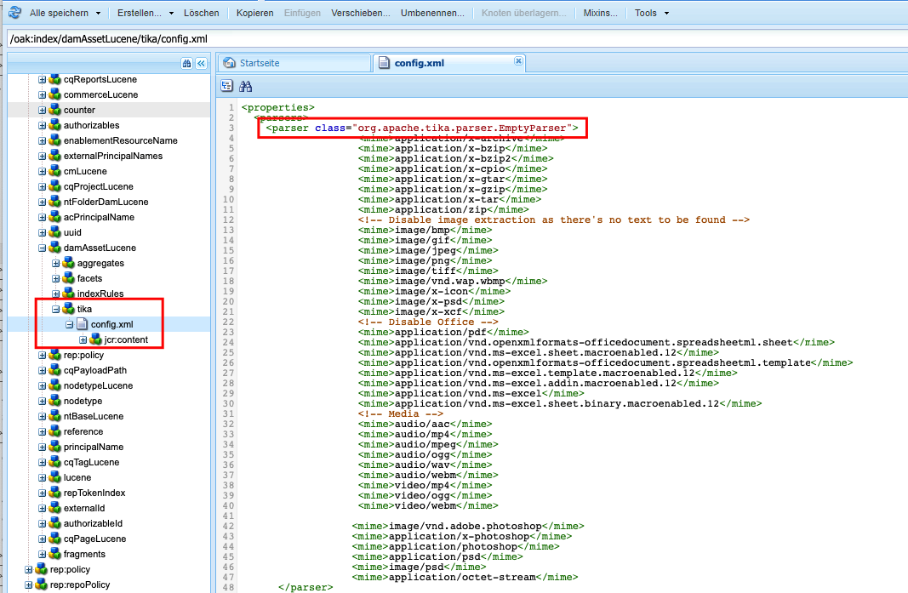
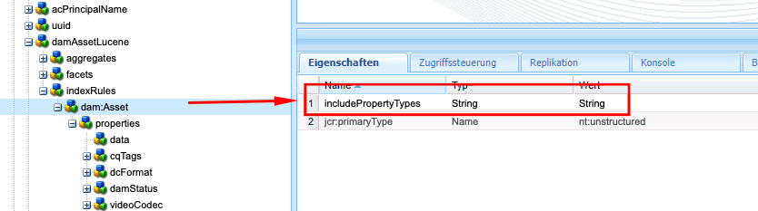
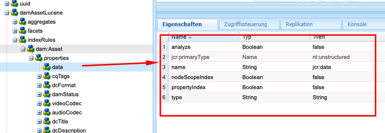

# Best Practices für die Indizierung in AEM

Erfahren Sie mehr über Best Practices für die Indizierung in Adobe Experience Manager (AEM). Die Inhaltssuche in AEM wird durch Apache [Jackrabbit Oak](https://jackrabbit.apache.org/oak/docs/query/query.html) gestützt. Beachten Sie die folgenden wichtigen Punkte:

- Standardmäßig stellt AEM verschiedene Indizes bereit, um Such- und Abfragefunktionen zu unterstützen, z. B. `damAssetLucene` und `cqPageLucene`.
- Alle Indexdefinitionen werden im Repository unter dem Knoten `/oak:index` gespeichert.
- AEM as a Cloud Service unterstützt nur Oak Lucene-Indizes.
- Die Indexkonfiguration sollte in der AEM-Projekt-Code-Basis verwaltet und mithilfe von CI/CD-Pipelines in Cloud Manager bereitgestellt werden.
- Wenn für eine bestimmte Abfrage mehrere Indizes verfügbar sind, wird der **Index mit den niedrigsten geschätzten Kosten verwendet**.
- Wenn für eine bestimmte Abfrage kein Index verfügbar ist, wird die Inhaltsstruktur durchlaufen, um den entsprechenden Inhalt zu finden. Allerdings werden über `org.apache.jackrabbit.oak.query.QueryEngineSettingsService` standardmäßig maximal 100.000 Knoten durchlaufen.
- Die Ergebnisse einer Abfrage werden **zuletzt gefiltert**, um sicherzustellen, dass der aktuelle Benutzer bzw. die aktuelle Benutzerin Lesezugriff hat. Das bedeutet, dass die Anzahl der Abfrageergebnisse möglicherweise unter der Anzahl der indizierten Knoten liegt.
- Die Neuindizierung des Repositorys nach Änderungen der Indexdefinition erfordert Zeit und hängt von der Größe des Repositorys ab.

Damit die Suchfunktion effizient und ordnungsgemäß arbeitet und sich nicht auf die Leistung der AEM-Instanz auswirkt, ist es wichtig, die Best Practices für die Indizierung zu verstehen.

## Benutzerdefinierte und vorkonfigurierte Indizes

Manchmal müssen Sie benutzerdefinierte Indizes erstellen, damit Ihre Suchanforderungen erfüllt werden. Befolgen Sie jedoch die nachstehenden Richtlinien, bevor Sie benutzerdefinierte Indizes erstellen:

- Verstehen Sie die Suchanforderungen und prüfen Sie, ob die vorkonfigurierten Indizes diese Suchanforderungen unterstützen können. Verwenden Sie das **Abfrageleistungs-Werkzeug**, das als [lokales SDK](http://localhost:4502/libs/granite/operations/content/diagnosistools/queryPerformance.html) und AEMCS über die Developer Console oder unter `https://author-pXXXX-eYYYY.adobeaemcloud.com/ui#/aem/libs/granite/operations/content/diagnosistools/queryPerformance.html?appId=aemshell` verfügbar ist.

- Definieren Sie eine optimale Abfrage und orientieren Sie sich dabei am Diagramm zum [Optimieren von Abfragen](https://experienceleague.adobe.com/de/docs/experience-manager-cloud-service/content/operations/query-and-indexing-best-practices) sowie an der [JCR-Abfrage-Schnellübersicht](https://experienceleague.adobe.com/docs/experience-manager-65/assets/JCR_query_cheatsheet-v1.1.pdf).

- Wenn die vorkonfigurierten Indizes die Suchanforderungen nicht unterstützen können, haben Sie zwei Möglichkeiten. Überprüfen Sie jedoch die [Tipps zum Erstellen effizienter Indizes](https://experienceleague.adobe.com/de/docs/experience-manager-65/content/implementing/deploying/practices/best-practices-for-queries-and-indexing)
   - Anpassen des vorkonfigurierten Index: Dies ist die bevorzugte Option, da Verwaltung und Aktualisierung einfach sind.
   - Vollständig benutzerdefinierter Index: Verwenden Sie diese Möglichkeit nur, wenn die obige Option nicht funktioniert.

### Anpassen des vorkonfigurierten Index

- Wenn Sie in **AEMCS** den vorkonfigurierten Index anpassen, verwenden Sie die Namenskonvention **\&lt;OOTBIndexName>-\&lt;productVersion>-custom-\&lt;customVersion>**. Beispiel: `cqPageLucene-custom-1` oder `damAssetLucene-8-custom-1`. Dies hilft dabei, die benutzerdefinierte Indexdefinition zusammenzuführen, wenn der vorkonfigurierte Index aktualisiert wird. Weitere Informationen finden Sie unter [Änderungen an vordefinierten Indizes](https://experienceleague.adobe.com/de/docs/experience-manager-cloud-service/content/operations/indexing).

- In **AEM 6.x** funktioniert die oben angegebene Benennung _nicht_. Aktualisieren Sie jedoch einfach den vorkonfigurierten Index mit den erforderlichen Eigenschaften im Knoten `indexRules`.

- Kopieren Sie immer die neueste vordefinierte Indexdefinition aus der AEM-Instanz mit dem CRX DE-Paket-Manager (/crx/packmgr/), benennen Sie sie um und passen Sie die XML-Datei an.

- Speichern Sie die Indexdefinition im AEM-Projekt unter `ui.apps/src/main/content/jcr_root/_oak_index` und stellen Sie sie mithilfe von CI/CD-Pipelines in Cloud Manager bereit. Weitere Informationen finden Sie unter [Bereitstellen benutzerdefinierter Indexdefinitionen](https://experienceleague.adobe.com/de/docs/experience-manager-cloud-service/content/operations/indexing).

### Vollständig benutzerdefinierter Index

Das Erstellen eines vollständig benutzerdefinierten Index sollte Ihre allerletzte Option sein. Greifen Sie nur dann darauf zurück, wenn die oben genannte Option nicht funktioniert.

- Wenn Sie einen vollständig benutzerdefinierten Index erstellen, verwenden Sie die Namenskonvention **\&lt;prefix>.\&lt;customIndexName>-\&lt;version>-custom-\&lt;customVersion>**. Zum Beispiel: `wknd.adventures-1-custom-1`. Das hilft dabei, Namenskonflikte zu vermeiden. Hier ist `wknd` das Präfix und `adventures` ist der benutzerdefinierte Indexname. Diese Konvention gilt sowohl für AEM 6.X als auch für AEMCS und hilft bei der Vorbereitung auf die zukünftige Migration zu AEMCS.

- AEMCS unterstützt nur Lucene-Indizes. Verwenden Sie daher zur Vorbereitung auf eine zukünftige Migration zu AEMCS immer Lucene-Indizes. Weitere Informationen finden Sie unter [Lucene- oder Eigenschaftenindizes](https://experienceleague.adobe.com/de/docs/experience-manager-65/content/implementing/deploying/practices/best-practices-for-queries-and-indexing).

- Vermeiden Sie es, einen benutzerdefinierten Index auf demselben Knotentyp wie den vorkonfigurieren Index zu erstellen. Passen Sie stattdessen den vorkonfigurierten Index mit den erforderlichen Eigenschaften im Knoten `indexRules` an. Erstellen Sie beispielsweise keinen benutzerdefinierten Index auf dem Knotentyp `dam:Asset`, sondern passen Sie den vorkonfigurierten Index `damAssetLucene` an. _Dies ist eine häufige Ursache für Leistungs- und Funktionsprobleme_.

- Vermeiden Sie es beispielsweise auch, mehrere Knotentypen wie `cq:Page` und `cq:Tag` unter dem Knoten für Indizierungsregeln (`indexRules`) hinzuzufügen. Erstellen Sie stattdessen separate Indizes für jeden Knotentyp.

- Wie im Abschnitt oben erwähnt, speichern Sie die Indexdefinition im AEM-Projekt unter `ui.apps/src/main/content/jcr_root/_oak_index` und stellen Sie sie mithilfe von CI/CD-Pipelines in Cloud Manager bereit. Weitere Informationen finden Sie unter [Bereitstellen benutzerdefinierter Indexdefinitionen](https://experienceleague.adobe.com/de/docs/experience-manager-cloud-service/content/operations/indexing).

- Es gelten folgende Richtlinien zur Indexdefinition:
   - Der Knotentyp (`jcr:primaryType`) sollte `oak:QueryIndexDefinition` sein
   - Der Indextyp (`type`) sollte `lucene` sein
   - Die async-Eigenschaft (`async`) sollte `async,nrt` sein
   - Verwenden Sie `includedPaths` und vermeiden Sie die Eigenschaft `excludedPaths`. Setzen Sie den Wert `queryPaths` immer auf den gleichen Wert wie `includedPaths`.
   - Um die Pfadbeschränkung zu erzwingen, verwenden Sie die Eigenschaft `evaluatePathRestrictions` und setzen Sie sie auf `true`.
   - Verwenden Sie die Eigenschaft `tags`, um den Index zu taggen, und geben Sie bei Abfragen den Wert dieses Tags an, um den Index zu verwenden. Die allgemeine Abfragesyntax lautet `<query> option(index tag <tagName>)`.

  ```xml
  /oak:index/wknd.adventures-1-custom-1
      - jcr:primaryType = "oak:QueryIndexDefinition"
      - type = "lucene"
      - compatVersion = 2
      - async = ["async", "nrt"]
      - includedPaths = ["/content/wknd"]
      - queryPaths = ["/content/wknd"]
      - evaluatePathRestrictions = true
      - tags = ["customAdvSearch"]
  ...
  ```

### Beispiele

Um die Best Practices zu verstehen, sehen wir uns einige Beispiele an.

#### Nicht ordnungsgemäße Verwendung der Eigenschaft „tags“

Die folgende Abbildung zeigt eine benutzerdefinierte und eine vorkonfigurierte Indexdefinition. Die Eigenschaft `tags` ist hervorgehoben und beide Indizes verwenden den gleichen Wert `visualSimilaritySearch`.


##### Analyse

Hier wird die Eigenschaft `tags` im benutzerdefinizerten Index nicht ordnungsgemäß verwendet. Aufgrund der niedrigeren geschätzten Kosten wählt die Oak-Abfrage-Engine den benutzerdefinierten Index anstelle des vorkonfigurierten Index aus.

Die richtige Vorgehensweise besteht darin, den vorkonfigurierten Index anzupassen und im Knoten `indexRules` die erforderlichen Eigenschaften hinzuzufügen. Weitere Informationen finden Sie unter [Anpassen des vorkonfigurierten Index](#customize-the-ootb-index).

#### Index auf dem Knotentyp `dam:Asset`

Die folgende Abbildung zeigt den benutzerdefinierten Index für den Knotentyp `dam:Asset`, wobei die Eigenschaft `includedPaths` auf einen bestimmten Pfad gesetzt ist.


##### Analyse

Wenn Sie eine Omnisearch auf Assets durchführen, werden falsche Ergebnisse ausgegeben, da der benutzerdefinierte Index niedrigere geschätzte Kosten aufweist.

Erstellen Sie keinen benutzerdefinierten Index auf dem Knotentyp `dam:Asset`, sondern passen Sie im Knoten `damAssetLucene` den vorkonfigurierten Index `indexRules` mit den erforderlichen Eigenschaften an.

#### Mehrere Knotentypen unter den Indizierungsregeln

Die folgende Abbildung zeigt einen benutzerdefinierten Index mit mehreren Knotentypen unter dem Knoten `indexRules`.


##### Analyse

Es wird nicht empfohlen, mehrere Knotentypen in einem einzigen Index hinzuzufügen. Knotentypen können jedoch im selben Index indiziert werden, wenn die Knotentypen eng miteinander zusammenhängen, z. B. `cq:Page` und `cq:PageContent`.

Eine gültige Lösung besteht darin, die vorkonfigurierten Indizes `cqPageLucene` und `damAssetLucene` anzupassen und zusätzliche Eigenschaften unter dem vorhandenen Knoten `indexRules` hinzuzufügen.

#### Fehlen der Eigenschaft `queryPaths`

Die folgende Abbildung zeigt einen benutzerdefinierten Index (der auch nicht der Namenskonvention folgt) ohne die Eigenschaft `queryPaths`.


##### Analyse

Setzen Sie den Wert `queryPaths` immer auf den gleichen Wert wie `includedPaths`. Um die Pfadbeschränkung zu erzwingen, setzen Sie außerdem die Eigenschaft `evaluatePathRestrictions` auf `true`.

#### Abfrage mit Index-Tag

Die folgende Abbildung zeigt einen benutzerdefinierten Index mit der Eigenschaft `tags` und die Verwendung bei Abfragen.


```
/jcr:root/content/dam//element(*,dam:Asset)[(jcr:content/@contentFragment = 'true' and jcr:contains(., '/content/sitebuilder/test/mysite/live/ja-jp/mypage'))]order by @jcr:created descending option (index tag assetPrefixNodeNameSearch)
```

##### Analyse

Zeigt, wie ein nicht im Konflikt stehender und richtiger Eigenschaftswert `tags` im Index festgelegt und bei Abfragen verwendet wird. Die allgemeine Abfragesyntax lautet `<query> option(index tag <tagName>)`. Siehe auch [Index-Tag der Abfrageoption](https://jackrabbit.apache.org/oak/docs/query/query-engine.html#query-option-index-tag)

#### Benutzerdefinierter Index

Die folgende Abbildung zeigt einen benutzerdefinierten Index mit dem Knoten `suggestion`, um die erweiterte Suchfunktion zu erzielen.


##### Analyse

Es ist durchaus angebracht, einen benutzerdefinierten Index für die [erweiterte Suchfunktion](https://jackrabbit.apache.org/oak/docs/query/lucene.html#advanced-search-features) zu erstellen. Der Indexname sollte jedoch der Namenskonvention **\&lt;prefix>.\&lt;customIndexName>-\&lt;version>-custom-\&lt;customVersion>** folgen.

## Indexoptimierung durch Deaktivieren von Apache Tika

AEM verwendet [Apache Tika](https://tika.apache.org/) für das _Extrahieren von Metadaten und Textinhalten aus Dateien_, wie z. B. PDF, Word, Excel und anderen. Die extrahierten Inhalte werden im Repository gespeichert und durch den Oak Lucene-Index indiziert.

Manchmal benötigen Benutzerinnen und Benutzer nicht die Möglichkeit, innerhalb des Inhalts einer Datei oder eines Assets zu suchen. In solchen Fällen können Sie die Indizierungsleistung verbessern, indem Sie Apache Tika deaktivieren. Die Vorteile:

- Schnellere Indizierung
- Reduzierung der Indexgröße
- Weniger Hardware-Nutzung

>[!CAUTION]
>
>Stellen Sie vor dem Deaktivieren von Apache Tika sicher, dass die Suchanforderungen nicht die Möglichkeit erfordern, innerhalb des Inhalts eines Assets zu suchen.


### Deaktivieren nach MIME-Typ

Um Apache Tika nach MIME-Typ zu deaktivieren, gehen Sie wie folgt vor:

- Fügen Sie den Knoten `tika` vom Typ `nt:unstructured` unter der benutzerdefinierten oder vorkonfigurierten Indexdefinition hinzu. Im folgenden Beispiel ist der PDF-MIME-Typ für den vorkonfigurierten Index `damAssetLucene` deaktiviert.

```xml
/oak:index/damAssetLucene
    - jcr:primaryType = "oak:QueryIndexDefinition"
    - type = "lucene"
    ...
    <tika jcr:primaryType="nt:unstructured">
        <config.xml/>
    </tika>
```

- Fügen Sie die Datei `config.xml` mit den folgenden Details unter den Knoten `tika` hinzu.

```xml
<properties>
  <parsers>
    <parser class="org.apache.tika.parser.EmptyParser">
      <mime>application/pdf</mime>
      <!-- Add more mime types to disable -->
  </parsers>
</properties>
```

- Um den gespeicherten Index zu aktualisieren, legen Sie die Eigenschaft `refresh` auf `true` unter dem Indexdefinitionsknoten fest. Weitere Informationen finden Sie unter [Eigenschaften der Indexdefinition](https://jackrabbit.apache.org/oak/docs/query/lucene.html#index-definition:~:text=Defaults%20to%2010000-,refresh,-Optional%20boolean%20property).

Die folgende Abbildung zeigt den vorkonfigurierten Index `damAssetLucene` mit dem Knoten `tika` und der Datei `config.xml`, die PDF- und andere MIME-Typen deaktiviert.



### Vollständiges Deaktivieren

Um Apache Tika vollständig zu deaktivieren, gehen Sie wie folgt vor:

- Fügen Sie die Eigenschaft `includePropertyTypes` bei `/oak:index/<INDEX-NAME>/indexRules/<NODE-TYPE>` hinzu und setzen Sie den Wert auf `String`. In der folgenden Abbildung wird beispielsweise die Eigenschaft `includePropertyTypes` für den Knotentyp `dam:Asset` des vorkonfigurierten Index `damAssetLucene` hinzugefügt.



- Fügen Sie `data` mit den nachstehenden Eigenschaften unter dem Knoten `properties` hinzu. Stellen Sie sicher, dass es sich um den ersten Knoten oberhalb der Eigenschaftsdefinition handelt. Siehe beispielsweise folgende Abbildung:

```xml
/oak:index/<INDEX-NAME>/indexRules/<NODE-TYPE>/properties/data
    - jcr:primaryType = "nt:unstructured"
    - type = "String"
    - name = "jcr:data"
    - nodeScopeIndex = false
    - propertyIndex = false
    - analyze = false
```



- Indizieren Sie die aktualisierte Indexdefinition neu, indem Sie die Eigenschaft `reindex` unter dem Indexdefinitionsknoten auf `true` setzen.

## Hilfreiche Tools

Sehen wir uns einige Tools an, die Ihnen beim Definieren, Analysieren und Optimieren der Indizes helfen können.

### Tool zur Indexerstellung und Oak-Tools

Das Tool [Oak Index Definition Generator](https://thomasmueller.github.io/oakTools/indexDefGenerator.html) hilft beim **Generieren der Indexdefinition** basierend auf den Eingabeabfragen. Es bietet einen guten Ausgangspunkt zum Erstellen eines benutzerdefinierten Index.

Die [Oak-Tools](https://thomasmueller.github.io/oakTools/index.html) enthalten auch andere
-Dienstprogramme für Indizierung und Abfrage, z. B. zum Konvertieren von Indizes zwischen JSON- und XML-Format,
, um XPath-Abfragen in SQL-2 zu konvertieren und Indizes zu vergleichen.

### Abfrageleistungs-Tool

Das vorkonfigurierte _Abfrageleistungs-Tool_ ist im [lokalen SDK](http://localhost:4502/libs/granite/operations/content/diagnosistools/queryPerformance.html) und AEMCS über die Developer Console oder unter `https://author-pXXXX-eYYYY.adobeaemcloud.com/ui#/aem/libs/granite/operations/content/diagnosistools/queryPerformance.html?appId=aemshell` verfügbar und hilft beim **Analysieren der Abfrageleistung** und der [JCR-Abfrage-Schnellübersicht](https://experienceleague.adobe.com/docs/experience-manager-65/assets/JCR_query_cheatsheet-v1.1.pdf?lang=de), um die optimale Abfrage zu definieren.

### Tools und Tipps zur Fehlerbehebung

Die meisten der folgenden Ressourcen gelten für AEM 6.X und lokale Fehlerbehebungszwecke.

- Der Index-Manager ist unter `http://host:port/libs/granite/operations/content/diagnosistools/indexManager.html` verfügbar und dient zum Abrufen von Indexinformationen wie Typ, letzte Aktualisierung und Größe.

- Zur Fehlerbehebung steht eine detaillierte Protokollierung von Oak-Abfrage- und indizierungsbezogenen Java™-Paketen wie `org.apache.jackrabbit.oak.plugins.index`, `org.apache.jackrabbit.oak.query` und `com.day.cq.search` über `http://host:port/system/console/slinglog` zur Verfügung.

- JMX MBean vom Typ _IndexStats_ ist unter `http://host:port/system/console/jmx` verfügbar und dient dazu, Indexinformationen wie Status, Fortschritt oder Statistiken im Zusammenhang mit der asynchronen Indizierung abzurufen. Es bietet auch _FailingIndexStats_. Wenn hier keine Ergebnisse vorliegen, bedeutet das, dass keine Indizes beschädigt sind. „AsyncIndexerService“ markiert alle Indizes, die 30 Minuten lang (konfigurierbar) nicht aktualisiert werden, als beschädigt und stoppt ihre Indizierung. Wenn eine Abfrage nicht die erwarteten Ergebnisse liefert, sollten Entwickelnde dies überprüfen, bevor sie mit einer Neuindizierung fortfahren, da eine Neuindizierung rechenintensiv und zeitaufwendig ist.

- JMX MBean vom Typ _LuceneIndex_ ist unter `http://host:port/system/console/jmx` verfügbar und bietet Lucene-Indexstatistiken wie Größe und die Anzahl der Dokumente pro Indexdefinition.

- JMX MBean vom Typ _QueryStat_ ist unter `http://host:port/system/console/jmx` verfügbar und bietet Oak-Abfragestatistiken, einschließlich langsamer und beliebter Abfragen mit Details wie Abfrage- und Ausführungszeit.

## Zusätzliche Ressourcen

Weitere Informationen finden Sie in der folgenden Dokumentation:

- [Oak-Abfragen und Indizierung](https://experienceleague.adobe.com/de/docs/experience-manager-65/content/implementing/deploying/deploying/queries-and-indexing)
- [Best Practices für Abfragen und Indizierung](https://experienceleague.adobe.com/de/docs/experience-manager-cloud-service/content/operations/query-and-indexing-best-practices)
- [Best Practices für Abfragen und Indizierung](https://experienceleague.adobe.com/de/docs/experience-manager-65/content/implementing/deploying/practices/best-practices-for-queries-and-indexing)

