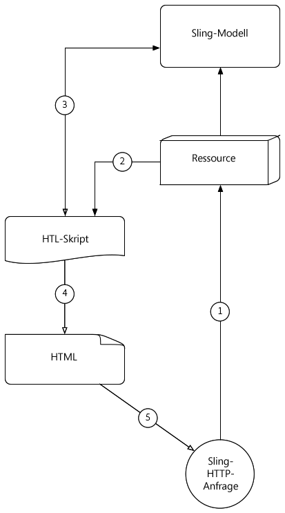
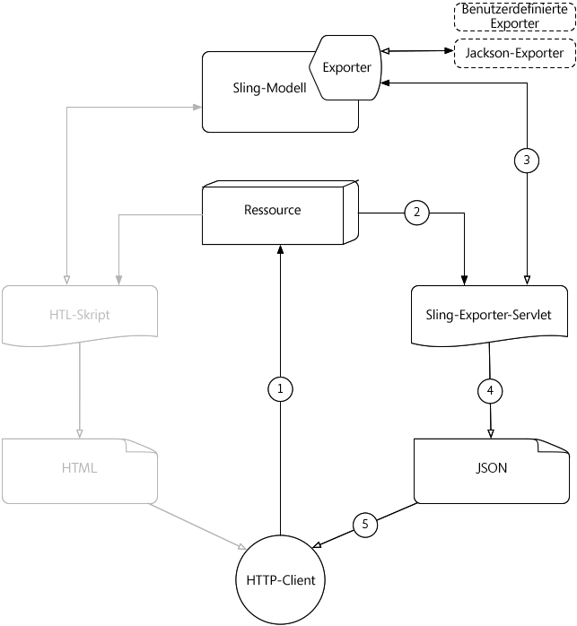

# Verstehen Sie [!DNL Sling Model Exporter]

Apache [!DNL Sling Models] 1.3.0 stellt [!DNL Sling Model Exporter] vor, eine elegante Methode zum Exportieren oder Serialisieren von [!DNL Sling Model]-Objekten in benutzerdefinierte Abstraktionen. Dieser Artikel steht im Gegensatz zum herkömmlichen Anwendungsfall, bei dem HTML-Skripten mit [!DNL Sling Models] gefüllt werden, wobei das [!DNL Sling Model Exporter]-Framework zum Serialisieren eines [!DNL Sling Model]-Skripts in JSON genutzt wird.

## HTTP-Anforderungsfluss für herkömmliches Sling-Modell

Das herkömmliche Anwendungsbeispiel für [!DNL Sling Models] ist die Bereitstellung einer Geschäftsabstraktion für eine Ressource oder Anforderung, die HTML-Skripte (oder früher JSPs) eine Schnittstelle für den Zugriff auf Geschäftsfunktionen bereitstellt.

Häufige Muster sind die Entwicklung von [!DNL Sling Models], die Komponenten oder Seiten darstellen, und die Verwendung der [!DNL Sling Model]-Objekte, um die HTML-Skripte mit Daten zu versorgen, mit einem Endergebnis von HTML, das im Browser angezeigt wird.

### HTTP-Anforderungsfluss für Sling-Modell

1. [!DNL HTTP GET] Es wird eine Ressource in AEM angefordert.

   Beispiel: `HTTP GET /content/my-resource.html`

1. Basierend auf dem `sling:resourceType` der Anforderungsressource wird das entsprechende Skript aufgelöst.

1. Das Skript passt die Anforderung oder Ressource an das gewünschte [!DNL Sling Model] an.

1. Das Skript verwendet das [!DNL Sling Model]-Objekt, um die HTML-Darstellung zu generieren.

1. Der vom Skript generierte HTML-Code wird in der HTTP-Antwort zurückgegeben.

Dieses herkömmliche Muster funktioniert im Kontext der HTML-Generierung gut, da das [!DNL Sling Model] einfach über HTML genutzt werden kann. Das Erstellen strukturierterer Daten wie JSON oder XML ist ein viel langwierigeres Unterfangen, da HTL sich nicht automatisch an die Definition dieser Formate anlehnt.

## [!DNL Sling Model Exporter] HTTP-Anforderungsfluss

Apache [!DNL Sling Model Exporter] wird mit einem Sling bereitgestellten Jackson Exporter geliefert, der automatisch ein &quot;gewöhnliches&quot; [!DNL Sling Model]-Objekt in JSON serialisiert. Der Jackson Exporter, auch wenn er relativ konfigurierbar ist, überprüft in seinem Kern das [!DNL Sling Model]-Objekt und generiert JSON mit allen &quot;Getter&quot;-Methoden als JSON-Schlüssel und die get-Rückgabewerte als JSON-Werte.

Die direkte Serialisierung von [!DNL Sling Models] ermöglicht es ihnen, sowohl normale Webanforderungen mit ihren HTML-Antworten zu bearbeiten, die mit dem traditionellen [!DNL Sling Model]-Anforderungsfluss erstellt wurden (siehe oben), als auch JSON-Darstellungen bereitzustellen, die von Webdiensten oder JavaScript-Anwendungen genutzt werden können.

*In diesem Fluss wird der Fluss beschrieben, in dem der Jackson Exporter zum Erstellen der JSON-Ausgabe verwendet wird. Die Verwendung von benutzerdefinierten Exporteuren erfolgt im selben Fluss, jedoch mit ihrem Ausgabeformat.*

1. HTTP-GET-Anforderung wird für eine Ressource in AEM mit dem Selektor und der Erweiterung durchgeführt, die beim [!DNL Sling Model]-Exporter registriert sind.

   Beispiel: `HTTP GET /content/my-resource.model.json`

1. Sling löst die Auswahl und Erweiterung der angeforderten Ressource `sling:resourceType` auf ein dynamisch generiertes Sling Exporter-Servlet auf, das dem [!DNL Sling Model] mit Exporter zugeordnet wird.
1. Das aufgelöste Sling Exporter-Servlet ruft das [!DNL Sling Model Exporter]-Objekt gegen das [!DNL Sling Model]-Objekt auf, das von der Anforderung oder Ressource angepasst wurde (wie von den Sling-Modellen-adaptiven Tabellen bestimmt).
1. Der Exporteur serialisiert das [!DNL Sling Model] auf Grundlage der Exportoptionen und exportspezifischen Sling-Modellanmerkungen und gibt das Ergebnis an das Sling Exporter-Servlet zurück.
1. Das Sling Exporter-Servlet gibt die JSON-Darstellung von [!DNL Sling Model] in der HTTP-Antwort zurück.

>[!NOTE]
>
>Während das Apache Sling-Projekt den Jackson Exporter bereitstellt, der [!DNL Sling Models] für JSON serialisiert, unterstützt das Exporter-Framework auch benutzerdefinierte Exporter. Beispielsweise könnte ein Projekt einen benutzerdefinierten Exporter implementieren, der ein [!DNL Sling Model] in XML serialisiert.

>[!NOTE]
>
>[!DNL Sling Model Exporter] *serialize* [!DNL Sling Models]  kann auch als Java-Objekte exportiert werden. Der Export in andere Java-Objekte spielt im HTTP-Anforderungsfluss keine Rolle und wird daher nicht im obigen Diagramm angezeigt.

## Begleitmaterialien

* [Dokumentation zu  [!DNL Sling Model Exporter] ApacheFramework](https://sling.apache.org/documentation/bundles/models.html#exporter-framework-since-130)
