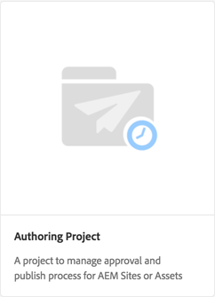
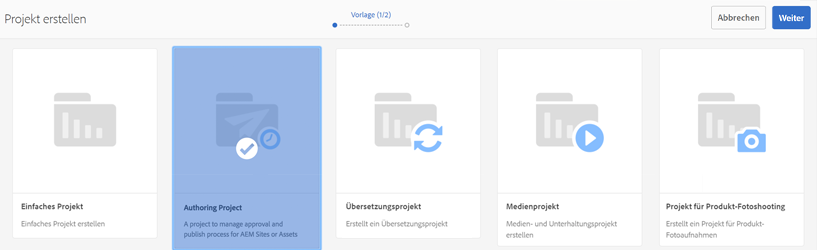
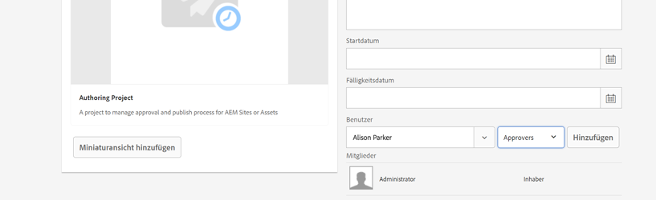
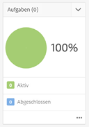
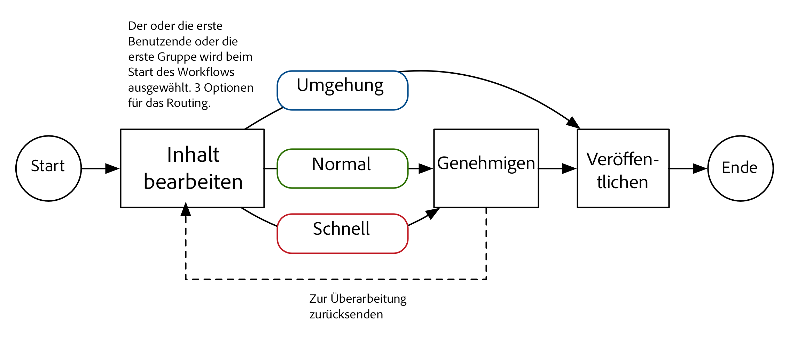
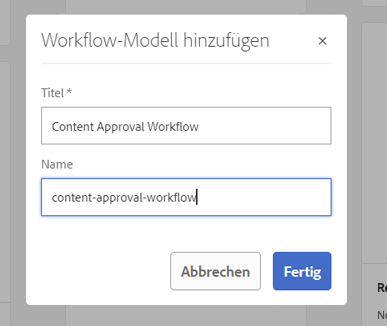
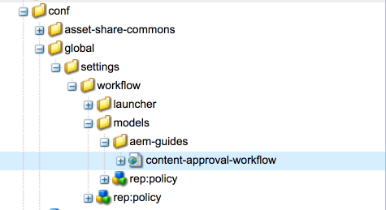

# Projekte in AEM entwickeln

Dies ist ein Entwicklungs-Tutorial, das die Entwicklung für [!DNL AEM Projects] veranschaulicht.  In diesem Lernprogramm erstellen wir eine benutzerdefinierte Projektvorlage, mit der neue Projekte in AEM zur Verwaltung von Workflows und Aufgaben für das Authoring von Inhalten erstellt werden können.

>[!VIDEO](https://video.tv.adobe.com/v/16904/?quality=12&learn=on)

*In diesem Video wird eine kurze Demo des fertigen Workflows gezeigt, der im unten stehenden Lernprogramm erstellt wurde.*

## Einführung {#introduction}

[[!DNL AEM Projects]](https://helpx.adobe.com/experience-manager/6-5/sites/authoring/using/projects.html) ist eine Funktion von AEM, die die Verwaltung und Gruppierung aller Workflows und Aufgaben, die mit der Inhaltserstellung im Rahmen einer AEM Sites- oder Asset-Implementierung verbunden sind, erleichtert.

AEM Projekte enthalten mehrere [OOTB-Projektvorlagen](https://helpx.adobe.com/experience-manager/6-5/sites/authoring/using/projects.html#ProjectTemplates). Beim Erstellen eines neuen Projekts können Autoren aus diesen verfügbaren Vorlagen wählen. Große AEM Implementierungen mit einzigartigen Geschäftsanforderungen werden benutzerdefinierte Projektvorlagen erstellen wollen, die auf ihre Bedürfnisse zugeschnitten sind. Durch Erstellen einer benutzerdefinierten Projektvorlage können Entwickler das Projektvorlagenprojekt konfigurieren, eine Verknüpfung zu benutzerdefinierten Workflows herstellen und zusätzliche Geschäftsrollen für ein Dashboard erstellen. Wir werden uns die Struktur einer Projektvorlage ansehen und ein Muster erstellen.



## Einrichtung

In diesem Lernprogramm wird der für die Erstellung einer benutzerdefinierten Projektvorlage erforderliche Code schrittweise erläutert. Sie können das [angehängte Paket](./assets/develop-aem-projects/projects-tasks-guide.ui.apps-0.0.1-SNAPSHOT.zip) in eine lokale Umgebung herunterladen und installieren, um das Lernprogramm zu befolgen. Sie können auch auf das vollständige Maven-Projekt zugreifen, das auf [GitHub](https://github.com/Adobe-Marketing-Cloud/aem-guides/tree/feature/projects-tasks-guide) gehostet wird.

* [Fertiges Lernpaket](./assets/develop-aem-projects/projects-tasks-guide.ui.apps-0.0.1-SNAPSHOT.zip)
* [Vollständiges Code-Repository auf GitHub](https://github.com/Adobe-Marketing-Cloud/aem-guides/tree/feature/projects-tasks-guide)

Dieses Tutorial geht von einigen grundlegenden Kenntnissen der [AEM Entwicklungspraktiken](https://helpx.adobe.com/experience-manager/6-5/sites/developing/using/the-basics.html) und einer gewissen Vertrautheit mit [AEM Maven-Projekteinrichtung](https://helpx.adobe.com/de/experience-manager/6-5/sites/developing/using/ht-projects-maven.html) aus. Der gesamte erwähnte Code soll als Referenz verwendet werden und sollte nur in einer [lokalen AEM-Instanz](https://helpx.adobe.com/experience-manager/6-5/sites/deploying/using/deploy.html#GettingStarted) bereitgestellt werden.

## Struktur einer Projektvorlage

Projektvorlagen sollten unter Quellcodeverwaltung gestellt werden und unter Ihrem Anwendungsordner unter /apps leben. Idealerweise sollten sie in einen Unterordner mit der Benennungsregel ***/projects/templates/**&lt;my-template> platziert werden. Indem Sie diese Benennungsregel befolgen, stehen Autoren beim Erstellen eines Projekts automatisch alle neuen benutzerdefinierten Vorlagen zur Verfügung. Die Konfiguration der verfügbaren Projektvorlagen ist festgelegt auf: **/content/projects/jcr:content**-Knoten durch die Eigenschaft **cq:allowedTemplates**. Standardmäßig ist dies ein regulärer Ausdruck: **/(apps|libs)/.*/projects/templates/.***

Der Stammknoten einer Projektvorlage hat einen **jcr:primaryType** von **cq:Template**. Unter dem Stammknoten befinden sich 3 Knoten: **gadgets**, **roles** und **Workflows**. Diese Knoten sind alle **nt:unstructured**. Unter dem Stammknoten kann auch eine Datei &quot;thumbnail.png&quot;sein, die angezeigt wird, wenn die Vorlage im Assistenten &quot;Projekt erstellen&quot;ausgewählt wird.

Die vollständige Knotenstruktur:

```shell
/apps/<my-app>
    + projects (nt:folder)
         + templates (nt:folder)
              + <project-template-root> (cq:Template)
                   + gadgets (nt:unstructured)
                   + roles (nt:unstructured)
                   + workflows (nt:unstructured)
```

### Projektvorlagenstamm

Der Stammknoten der Projektvorlage ist vom Typ **cq:Template**. Auf diesem Knoten können Sie die Eigenschaften **jcr:title** und **jcr:description** konfigurieren, die im Assistenten zum Erstellen von Projekten angezeigt werden. Es gibt auch eine Eigenschaft namens **wizard**, die auf ein Formular verweist, das die Eigenschaften des Projekts ausfüllt. Der Standardwert von: **/libs/cq/core/content/projects/wizard/steps/defaultproject.html** sollte in den meisten Fällen problemlos funktionieren, da der Benutzer die grundlegenden Projekteigenschaften ausfüllen und Gruppenmitglieder hinzufügen kann.

**Beachten Sie, dass der Assistent zum Erstellen von Projekten nicht das Servlet Sling POST verwendet. Stattdessen werden Werte in einem benutzerdefinierten Servlet veröffentlicht:**com.adobe.cq.projects.impl.servlet.ProjectServlet**. Dies sollte beim Hinzufügen benutzerdefinierter Felder berücksichtigt werden.*

Ein Beispiel für einen benutzerdefinierten Assistenten für die Vorlage des Übersetzungsprojekts: **/libs/cq/core/content/projects/wizard/translationproject/defaultproject**.

### Gadgets {#gadgets}

Es gibt keine weiteren Eigenschaften auf diesem Knoten, aber die untergeordneten Elemente des Knotens &quot;gadgets&quot;steuern, welche Projektkacheln das Dashboard des Projekts füllen, wenn ein neues Projekt erstellt wird. [Die Projektkacheln](https://helpx.adobe.com/experience-manager/6-5/sites/authoring/using/projects.html#ProjectTiles)  (auch als Gadgets oder Pods bezeichnet) sind einfache Karten, die den Arbeitsplatz eines Projekts füllen. Eine vollständige Liste der Ottomotoren finden Sie unter: **/libs/cq/gui/components/projects/admin/pod. **Projekteigentümer können Kacheln immer hinzufügen/entfernen, nachdem ein Projekt erstellt wurde.

### Rollen {#roles}

Es gibt 3 [Standardrollen](https://helpx.adobe.com/experience-manager/6-5/sites/authoring/using/projects.html#UserRolesinaProject) für jedes Projekt: **Beobachter**, **Editors** und **Inhaber**. Durch Hinzufügen untergeordneter Knoten unter dem Knoten &quot;Rollen&quot;können Sie zusätzliche geschäftsspezifische Rollen für die Vorlage hinzufügen. Sie können diese Rollen dann mit bestimmten Workflows verknüpfen, die mit dem Projekt verbunden sind.

### Workflows {#workflows}

Einer der verlockendsten Gründe für die Erstellung einer benutzerdefinierten Projektvorlage ist die Möglichkeit, die verfügbare Workflows für das Projekt zu konfigurieren. Diese können OOTB-Workflows oder benutzerdefinierte Workflows. Unter dem Knoten **Workflows** muss ein **models**-Knoten (auch `nt:unstructured`) und untergeordnete Knoten unter den verfügbaren Workflow-Modellen stehen. Die Eigenschaft **modelId **verweist auf das Workflow-Modell unter /etc/workflow und die Eigenschaft **wizard** verweist auf das Dialogfeld, das beim Starten des Workflows verwendet wird. Ein großer Vorteil von Projekten besteht darin, dass ein benutzerdefinierter Dialog (Assistent) hinzugefügt werden kann, um geschäftsspezifische Metadaten am Beginn des Workflows zu erfassen, wodurch weitere Aktionen im Workflow ausgeführt werden können.

```shell
<projects-template-root> (cq:Template)
    + workflows (nt:unstructured)
         + models (nt:unstructured)
              + <workflow-model> (nt:unstructured)
                   - modelId = points to the workflow model
                   - wizard = dialog used to start the workflow
```

## Erstellen einer Projektvorlage {#creating-project-template}

Da wir hauptsächlich Knoten kopieren/konfigurieren werden, verwenden wir CRXDE Lite. Öffnen Sie in Ihrer lokalen AEM [CRXDE Lite](http://localhost:4502/crx/de/index.jsp).

1. Beginn durch Erstellen eines neuen Ordners unter `/apps/&lt;your-app-folder&gt;` mit dem Namen `projects`. Erstellen Sie einen weiteren Ordner unter dem Namen `templates`.

   ```shell
   /apps/aem-guides/projects-tasks/
                       + projects (nt:folder)
                                + templates (nt:folder)
   ```

1. Zur Vereinfachung werden wir unsere benutzerdefinierte Vorlage aus der vorhandenen Simple Project-Vorlage Beginn geben.

   1. Kopieren Sie den Knoten **/libs/cq/core/content/projects/templates/default** unter dem in Schritt 1 erstellten Ordner *templates* und fügen Sie ihn ein.

   ```shell
   /apps/aem-guides/projects-tasks/
                + templates (nt:folder)
                     + default (cq:Template)
   ```

1. Sie sollten jetzt einen Pfad wie **/apps/aem-guides/projects-Aufgaben/projects/templates/authoring-project** haben.

   1. Bearbeiten Sie die Eigenschaften **jcr:title** und **jcr:description** des Knotens author-project in benutzerdefinierte Titel- und Beschreibungswerte.

      1. Lassen Sie die Eigenschaft **wizard** auf die Standard-Projekteigenschaften verweisen.

   ```shell
   /apps/aem-guides/projects-tasks/projects/
            + templates (nt:folder)
                 + authoring-project (cq:Template)
                      - jcr:title = "Authoring Project"
                      - jcr:description = "A project to manage approval and publish process for AEM Sites or Assets"
                      - wizard = "/libs/cq/core/content/projects/wizard/steps/defaultproject.html"
   ```

1. Für diese Projektvorlage möchten wir Aufgaben verwenden.
   1. hinzufügen Sie einen neuen **nt:unstructured**-Knoten unter Authoring-project/gadgets mit dem Namen **Aufgaben**.
   1. hinzufügen Sie die Zeichenfolgeneigenschaften dem Knoten Aufgaben für **cardWeight** = &quot;100&quot;, **jcr:title**=&quot;Aufgaben&quot; und **sling:resourceType**=&quot;cq/gui/components/projects/admin/pod/taskpod&quot;.

   Die Kachel [Aufgaben](https://docs.adobe.com/docs/en/aem/6-3/author/projects.html#Tasks) wird jetzt standardmäßig angezeigt, wenn ein neues Projekt erstellt wird.

   ```shell
   ../projects/templates/authoring-project
       + gadgets (nt:unstructured)
            + team (nt:unstructured)
            + asset (nt:unstructured)
            + work (nt:unstructured)
            + experiences (nt:unstructured)
            + projectinfo (nt:unstructured)
            ..
            + tasks (nt:unstructured)
                 - cardWeight = "100"
                 - jcr:title = "Tasks"
                 - sling:resourceType = "cq/gui/components/projects/admin/pod/taskpod"
   ```

1. Wir fügen unserer Projektvorlage eine benutzerdefinierte Rolle als genehmigende Person hinzu.

   1. Fügen Sie unter dem Knoten Projektvorlage (Authoring-Projekt) einen neuen Knoten **nt:unstructured** mit der Bezeichnung **roles** hinzu.
   1. hinzufügen einem anderen **nt:unstructured**-Knoten, der Genehmiger als untergeordnetes Element des Rollenknotens bezeichnet.
   1. hinzufügen Zeichenfolgeneigenschaften **jcr:title** = &quot;**Genehmiger**&quot;, **roleclass** =&quot;**owner**&quot;, **roleid**=&quot;**Genehmiger**&quot;.
      1. Der Name des Genehmigerknotens sowie jcr:title und roleid kann ein beliebiger Zeichenfolgenwert sein (solange roleid eindeutig ist).
      1. **Die für diese Rolle** beantragten Berechtigungen basieren auf den  [3 OOTB-Rollen] (https://docs.adobe.com/docs/en/aem/6-3/author/projects.html#User Rollen in einem Projekt):  **owner**,  **editor** und  **Beobachter**.
      1. Wenn die benutzerdefinierte Rolle mehr eine Führungsrolle ist, kann die rollierende Rolle im Allgemeinen **owner;**, wenn es sich um eine spezifischere Autorenrolle wie Fotograf oder Designer handelt, dann sollte **editor** rollierend sein. Der große Unterschied zwischen **owner** und **editor** besteht darin, dass Projekteigenschaften aktualisiert und neue Benutzer zum Projekt hinzugefügt werden können.

   ```shell
   ../projects/templates/authoring-project
       + gadgets (nt:unstructured)
       + roles (nt:unstructured)
           + approvers (nt:unstructured)
                - jcr:title = "Approvers"
                - roleclass = "owner"
                - roleid = "approver"
   ```

1. Durch Kopieren der Projektvorlage können Sie 4 OOTB Workflows konfigurieren. Jeder Knoten unter Workflows/models verweist auf einen bestimmten Workflow und einen Beginn-Dialogassistenten für diesen Workflow. Später erstellen wir einen benutzerdefinierten Workflow für dieses Projekt. Löschen Sie jetzt die Knoten unter Workflow/Modellen:

   ```shell
   ../projects/templates/authoring-project
       + gadgets (nt:unstructured)
       + roles (nt:unstructured)
       + workflows (nt:unstructured)
            + models (nt:unstructured)
               - (remove ootb models)
   ```

1. Damit Autoren die Projektvorlage leichter identifizieren können, können Sie eine benutzerdefinierte Miniaturansicht hinzufügen. Die empfohlene Größe beträgt 319 x 319 Pixel.
   1. Erstellen Sie in CRXDE Lite eine neue Datei als Geschwisterdatei mit den Knoten &quot;gadgets&quot;, &quot;roles&quot;und &quot;Workflows&quot;mit dem Namen **thumbnail.png**.
   1. Speichern Sie die Datei und navigieren Sie zum Knoten `jcr:content` und klicken Sie auf die Dublette `jcr:data` (vermeiden Sie das Klicken auf &#39;Ansicht&#39;).
      1. Dies sollte Sie mit einem Dialogfeld zum Bearbeiten `jcr:data` auffordern und Sie können eine benutzerdefinierte Miniaturansicht hochladen.

   ```shell
   ../projects/templates/authoring-project
       + gadgets (nt:unstructured)
       + roles (nt:unstructured)
       + workflows (nt:unstructured)
       + thumbnail.png (nt:file)
   ```

Abgeschlossene XML-Darstellung der Projektvorlage:

```xml
<?xml version="1.0" encoding="UTF-8"?>
<jcr:root xmlns:sling="http://sling.apache.org/jcr/sling/1.0" xmlns:cq="http://www.day.com/jcr/cq/1.0" xmlns:jcr="http://www.jcp.org/jcr/1.0" xmlns:nt="http://www.jcp.org/jcr/nt/1.0"
    jcr:description="A project to manage approval and publish process for AEM Sites or Assets"
    jcr:primaryType="cq:Template"
    jcr:title="Authoring Project"
    ranking="{Long}1"
    wizard="/libs/cq/core/content/projects/wizard/steps/defaultproject.html">
    <jcr:content
        jcr:primaryType="nt:unstructured"
        detailsHref="/projects/details.html"/>
    <gadgets jcr:primaryType="nt:unstructured">
        <team
            jcr:primaryType="nt:unstructured"
            jcr:title="Team"
            sling:resourceType="cq/gui/components/projects/admin/pod/teampod"
            cardWeight="60"/>
        <tasks
            jcr:primaryType="nt:unstructured"
            jcr:title="Tasks"
            sling:resourceType="cq/gui/components/projects/admin/pod/taskpod"
            cardWeight="100"/>
        <work
            jcr:primaryType="nt:unstructured"
            jcr:title="Workflows"
            sling:resourceType="cq/gui/components/projects/admin/pod/workpod"
            cardWeight="80"/>
        <experiences
            jcr:primaryType="nt:unstructured"
            jcr:title="Experiences"
            sling:resourceType="cq/gui/components/projects/admin/pod/channelpod"
            cardWeight="90"/>
        <projectinfo
            jcr:primaryType="nt:unstructured"
            jcr:title="Project Info"
            sling:resourceType="cq/gui/components/projects/admin/pod/projectinfopod"
            cardWeight="100"/>
    </gadgets>
    <roles jcr:primaryType="nt:unstructured">
        <approvers
            jcr:primaryType="nt:unstructured"
            jcr:title="Approvers"
            roleclass="owner"
            roleid="approvers"/>
    </roles>
    <workflows
        jcr:primaryType="nt:unstructured"
        tags="[]">
        <models jcr:primaryType="nt:unstructured">
        </models>
    </workflows>
</jcr:root>
```

## Testen der benutzerdefinierten Projektvorlage

Jetzt können wir unsere Projektvorlage testen, indem wir ein neues Projekt erstellen.

1. Die benutzerdefinierte Vorlage sollte als eine der Optionen für die Projekterstellung angezeigt werden.

   

1. Nachdem Sie die benutzerdefinierte Vorlage ausgewählt haben, klicken Sie auf &quot;Weiter&quot;und beachten Sie, dass Sie sie beim Ausfüllen der Projektmitglieder als genehmigende Rolle hinzufügen können.

   

1. Klicken Sie auf &quot;Erstellen&quot;, um das Projekt auf der Grundlage der benutzerdefinierten Vorlage zu erstellen. Sie werden im Project-Dashboard feststellen, dass die Aufgaben Kacheln und die anderen Kacheln, die unter Gadgets konfiguriert sind, automatisch angezeigt werden.

   


## Warum Workflow?

Traditionell haben Workflows, die um einen Genehmigungsprozess zentrieren, die Arbeitsablaufschritte &quot;Teilnehmer&quot;verwendet. AEM Inbox enthält Details zu Aufgaben und Arbeitsabläufen sowie eine verbesserte Integration in AEM Projekte. Diese Funktionen machen die Verwendung der Prozessschritte Aufgabe erstellen zu einer attraktiveren Option.

### Warum Aufgaben?

Durch die Verwendung eines Aufgabe Creation Step gegenüber den herkömmlichen Participant-Schritten erhalten Sie einige Vorteile:

* **Beginn- und Fälligkeitsdatum**  - erleichtert es Autoren, ihre Zeit zu verwalten. Die neue Kalenderfunktion nutzt diese Daten.
* **Priorität** : In den Prioritäten &quot;Niedrig&quot;, &quot;Normal&quot;und &quot;Hoch&quot;integrierte Prioritäten ermöglichen es Autoren, der Arbeit Priorität einzuräumen
* **Threaded Comments**  - Während Autoren an einer Aufgabe arbeiten, haben sie die Möglichkeit, Kommentare zu hinterlassen und die Zusammenarbeit zu verbessern
* **Sichtbarkeit**  - Aufgabe und Ansichten mit Projektmanagern ermöglichen es Managern, Ansichten über die Zeitverwendung zu erhalten
* **Projektintegration**  - Aufgaben sind bereits in Projektrollen und Dashboard integriert

Wie die Schritte des Teilnehmers können auch Aufgaben dynamisch zugewiesen und weitergeleitet werden. Aufgaben-Metadaten wie &quot;Titel&quot;, &quot;Priorität&quot;können auch dynamisch basierend auf vorherigen Aktionen festgelegt werden, wie im folgenden Lernprogramm gezeigt.

Aufgaben haben zwar einige Vorteile gegenüber den &quot;Participant Steps&quot;-Schritten, sie haben aber zusätzlichen Verwaltungsaufwand und sind außerhalb eines Projekts nicht so nützlich. Darüber hinaus muss das dynamische Verhalten von Aufgaben mit ecma-Skripten mit eigenen Einschränkungen kodiert werden.

## Verwendungsfallanforderungen für Muster {#goals-tutorial}



Das obige Diagramm zeigt die hohen Anforderungen an unseren Muster-Genehmigungsarbeitsablauf.

Der erste Schritt besteht darin, eine Aufgabe zu erstellen, um die Bearbeitung eines Inhaltselements abzuschließen. Der Workflow-Initiator kann den Verantwortlichen dieser ersten Aufgabe auswählen.

Sobald die erste Aufgabe abgeschlossen ist, stehen dem Verantwortlichen drei Optionen zum Routing des Workflows zur Verfügung:

**Normal **- Normales Routing erstellt eine Aufgabe, die der Projektgenehmigungsgruppe zur Überprüfung und Genehmigung zugewiesen wurde. Die Priorität der Aufgabe ist &quot;Normal&quot;und das Fälligkeitsdatum liegt bei 5 Tagen nach der Erstellung.

**Mit dem Routing &quot;Umschalt** - Eile&quot;wird auch eine Aufgabe erstellt, die der Projektgenehmigungsgruppe zugewiesen ist. Die Priorität der Aufgabe ist hoch und das Fälligkeitsdatum liegt bei nur 1 Tag.

**Umgehen** : In diesem Beispielworkflow hat der ursprüngliche Teilnehmer die Möglichkeit, die Validierungsgruppe zu umgehen. (Ja, das könnte den Zweck eines &quot;Genehmigungsarbeitsablaufs&quot;beeinträchtigen, ermöglicht uns jedoch, zusätzliche Routing-Funktionen zu illustrieren)

Die genehmigende Gruppe kann den Inhalt genehmigen oder ihn zur Überarbeitung an den ursprünglichen Verantwortlichen zurücksenden. Wenn Sie zur Umgestaltung zurückgeschickt werden, wird eine neue Aufgabe erstellt und mit der entsprechenden Bezeichnung &quot;Zur Umgestaltung zurückgeschickt&quot; versehen.

Im letzten Schritt des Workflows wird der Schritt Seite/Asset aktivieren verwendet und die Nutzlast repliziert.

## Workflow-Modell erstellen

1. Navigieren Sie im Menü AEM Beginn zu Tools -> Workflow -> Modelle. Klicken Sie oben rechts auf &quot;Erstellen&quot;, um ein neues Workflow-Modell zu erstellen.

   Geben Sie dem neuen Modell einen Titel: &quot;Content Approval Workflow&quot;und ein URL-Name: &quot;content-approval-workflow&quot;.

   

   Weitere Informationen zum Erstellen von Workflows finden Sie hier.[](https://helpx.adobe.com/experience-manager/6-5/sites/developing/using/workflows-models.html)

1. Als Best Practice sollten benutzerspezifische Workflows in ihrem eigenen Ordner unter /etc/workflow/models gruppiert werden. Erstellen Sie in CRXDE Lite ein neues **&#39;nt:folder&#39;** unter /etc/workflow/models mit dem Namen **&quot;aem-guides&quot;**. Durch Hinzufügen eines Unterordners wird sichergestellt, dass benutzerdefinierte Workflows bei Aktualisierungen oder Service Pack-Installationen nicht versehentlich überschrieben werden.

   *Beachten Sie, dass der Ordner oder die benutzerdefinierte Workflows niemals unter OOOB-Unterordnern wie /etc/workflow/models/dam oder /etc/workflow/models/projects platziert werden müssen, da der gesamte Unterordner auch durch Upgrades oder Service Packs überschrieben werden kann.

   

   Speicherort des Workflow-Modells in 6.3

   >[!NOTE]
   >
   >Bei Verwendung von AEM 6.4+ hat sich der Speicherort des Arbeitsablaufs geändert. Weitere Informationen finden Sie unter [hier.](https://helpx.adobe.com/experience-manager/6-5/sites/developing/using/workflows-best-practices.html#LocationsWorkflowModels)

   Bei Verwendung von AEM 6.4+ wird das Workflow-Modell unter `/conf/global/settings/workflow/models` erstellt. Wiederholen Sie die oben genannten Schritte mit dem Ordner &quot;/conf&quot;, fügen Sie einen Unterordner mit dem Namen &quot;`aem-guides`&quot;hinzu und verschieben Sie `content-approval-workflow` darunter.

   
SpeicherortSpeicherort des Workflow-Modells in 6.4+

1. In AEM 6.3 wurde die Möglichkeit eingeführt, einem bestimmten Workflow Workflow-Phasen hinzuzufügen. Die Schritte werden dem Benutzer über den Posteingang auf der Registerkarte &quot;Workflow-Info&quot;angezeigt. Es zeigt dem Benutzer die aktuelle Phase des Workflows sowie die Phasen vor und nach der Anwendung an.

   Um die Schritte zu konfigurieren, öffnen Sie das Dialogfeld Seiteneigenschaften über den SideKick. Die vierte Registerkarte trägt die Bezeichnung &quot;Phasen&quot;. hinzufügen Sie die folgenden Werte, um die drei Phasen dieses Workflows zu konfigurieren:

   1. Inhalt bearbeiten
   1. Genehmigung
   1. Veröffentlichen

   

   Konfigurieren Sie die Workflow-Phasen im Dialogfeld &quot;Seiteneigenschaften&quot;.

   

   Die Arbeitsablauffortschrittsleiste, wie sie vom AEM Posteingang angezeigt wird.

   Optional können Sie ein **Bild** in die Seiteneigenschaften hochladen, die als Workflow-Miniaturansicht verwendet werden, wenn Benutzer es auswählen. Die Bildabmessungen sollten 319 x 319 Pixel betragen. Wenn Sie eine **Beschreibung** zu den Seiteneigenschaften hinzufügen, wird auch angezeigt, wenn ein Benutzer den Workflow auswählen möchte.

1. Der Arbeitsablaufprozess &quot;Aufgabe erstellen&quot;dient zum Erstellen einer Aufgabe als Arbeitsablaufschritt. Der Workflow wird erst nach Abschluss der Aufgabe weitergeführt. Ein wichtiger Aspekt der Aufgabe &quot;Projekt erstellen&quot;ist, dass sie Workflow-Metadatenwerte lesen und diese zur dynamischen Erstellung der Aufgabe verwenden kann.

   Löschen Sie zunächst den &quot;Participant Step&quot;, der standardmäßig erstellt wird. Erweitern Sie im Komponentenmenü im Sidekick die Unterüberschrift **&quot;Projekte&quot;** und ziehen Sie die **&quot;Aufgabe erstellen&quot;** auf das Modell.

   Dublette+Klicken Sie auf die Aufgabe &quot;Projekt erstellen&quot;, um das Workflow-Dialogfeld zu öffnen. Konfigurieren Sie die folgenden Eigenschaften:

   Diese Registerkarte ist für alle Workflow-Prozessschritte üblich und wir legen den Titel und die Beschreibung fest (diese sind für den Endbenutzer nicht sichtbar). Die wichtige Eigenschaft, die wir einstellen werden, ist die Workflow-Phase auf **&quot;Inhalt bearbeiten&quot;** aus dem Dropdown-Menü.

   ```shell
   Common Tab
   -----------------
       Title = "Start Task Creation"
       Description = "This the first task in the Workflow"
       Workflow Stage = "Edit Content"
   ```

   Der Arbeitsablaufprozess &quot;Aufgabe erstellen&quot;dient zum Erstellen einer Aufgabe als Arbeitsablaufschritt. Auf der Registerkarte &quot;Aufgabe&quot;können Sie alle Werte der Aufgabe festlegen. In unserem Fall möchten wir, dass der Bevollmächtigte dynamisch ist, damit wir ihn leer lassen. Die übrigen Eigenschaftswerte:

   ```shell
   Task Tab
   -----------------
       Name* = "Edit Content"
       Task Priority = "Medium"
       Description = "Edit the content and finalize for approval. Once finished submit for approval."
       Due In - Days = "2"
   ```

   Die Registerkarte &quot;Routing&quot;ist ein optionales Dialogfeld, in dem die verfügbaren Aktionen für den Benutzer, der die Aufgabe abschließt, angegeben werden können. Diese Aktionen sind nur Zeichenfolgenwerte und werden in den Metadaten des Workflows gespeichert. Diese Werte können von Skripten und/oder Prozessschritten später im Workflow gelesen werden, um den Workflow dynamisch &quot;weiterzuleiten&quot;. Auf der Grundlage der [Workflow-Ziele](#goals-tutorial) werden dieser Registerkarte drei Aktionen hinzugefügt:

   ```shell
   Routing Tab
   -----------------
       Actions =
           "Normal Approval"
           "Rush Approval"
           "Bypass Approval"
   ```

   Auf dieser Registerkarte können wir ein Aufgabe-Skript konfigurieren, in dem wir verschiedene Werte der Aufgabe programmgesteuert entscheiden können, bevor sie erstellt wird. Wir haben die Möglichkeit, das Skript auf eine externe Datei zu verweisen oder ein kurzes Skript direkt in den Dialog einzubetten. In unserem Fall verweisen wir auf eine externe Aufgabe. In Schritt 5 erstellen wir dieses Skript.

   ```shell
   Advanced Settings Tab
   -----------------
      Pre-Create Task Script = "/apps/aem-guides/projects/scripts/start-task-config.ecma"
   ```

1. Im vorherigen Schritt wurde auf ein Skript zur Aufgabe vor dem Erstellen verwiesen. Wir werden dieses Skript jetzt erstellen, in dem wir den Verantwortlichen der Aufgabe basierend auf dem Wert eines Workflow-Metadatenwerts &quot;**Zessionar**&quot;festlegen. Der Wert **&quot;Zessionar&quot;** wird eingestellt, wenn der Workflow gestartet wird. Außerdem werden die Workflow-Metadaten gelesen, um die Priorität der Aufgabe dynamisch auszuwählen, indem der Wert &quot;**taskPriority&quot;** der Metadaten des Workflows sowie der **&quot;taskDueDate&quot; **dynamisch eingestellt wird, wenn die erste Aufgabe fällig wird.

   Aus organisatorischen Gründen haben wir einen Ordner unter unserem App-Ordner erstellt, in dem alle unsere projektbezogenen Skripten gespeichert werden: **/apps/aem-guides/projects-Aufgaben/projects/scripts**. Erstellen Sie eine neue Datei unter diesem Ordner mit dem Namen **&quot;Beginn-Aufgabe-config.ecma&quot;**. *Achten Sie darauf, dass der Pfad zu Ihrer Beginn-Aufgabe-config.ecma-Datei mit dem Pfad übereinstimmt, der in Schritt 4 auf der Registerkarte &quot;Erweiterte Einstellungen&quot;festgelegt wurde.

   hinzufügen als Inhalt der Datei:

   ```
   // start-task-config.ecma
   // Populate the task using values stored as workflow metadata originally posted by the start workflow wizard
   
   // set the assignee based on start workflow wizard
   var assignee = workflowData.getMetaDataMap().get("assignee", Packages.java.lang.String);
   task.setCurrentAssignee(assignee);
   
   //Set the due date for the initial task based on start workflow wizard
   var dueDate = workflowData.getMetaDataMap().get("taskDueDate", Packages.java.util.Date);
   if (dueDate != null) {
       task.setProperty("taskDueDate", dueDate);
   }
   
   //Set the priority based on start workflow wizard
   var taskPriority = workflowData.getMetaDataMap().get("taskPriority", "Medium");
   task.setProperty("taskPriority", taskPriority);
   ```

1. Navigieren Sie zurück zum Arbeitsablauf für die Inhaltsgenehmigung. Ziehen Sie die Komponente **OR Split** (im Sidekick unter der Kategorie &#39;Workflow&#39;) unter die Aufgabe **Beginn**. Wählen Sie im Dialogfeld Allgemein das Optionsfeld für 3 Zweige. Die ODER-Teilung liest den Workflow-Metadatenwert **&quot;lastTaskAction&quot;**, um die Route des Workflows zu bestimmen. Die Eigenschaft **&quot;lastTaskAction&quot;** wird auf einen der Werte aus der in Schritt 4 konfigurierten Registerkarte &quot;Routing&quot;gesetzt. Füllen Sie für jede der Registerkarten &quot;Verzweigung&quot;den Textbereich **Script** mit den folgenden Werten aus:

   ```
   function check() {
   var lastAction = workflowData.getMetaDataMap().get("lastTaskAction","");
   
   if(lastAction == "Normal Approval") {
       return true;
   }
   
   return false;
   }
   ```

   ```
   function check() {
   var lastAction = workflowData.getMetaDataMap().get("lastTaskAction","");
   
   if(lastAction == "Rush Approval") {
       return true;
   }
   
   return false;
   }
   ```

   ```
   function check() {
   var lastAction = workflowData.getMetaDataMap().get("lastTaskAction","");
   
   if(lastAction == "Bypass Approval") {
       return true;
   }
   
   return false;
   }
   ```

   *Beachten Sie, dass wir eine direkte String-Übereinstimmung durchführen, um die Route zu bestimmen. Daher ist es wichtig, dass die in den Zweigskripten eingestellten Werte mit den in Schritt 4 festgelegten Route-Werten übereinstimmen.

1. Ziehen Sie mit Drag &amp; Drop einen weiteren Schritt (**Projektversion erstellen**) auf das Aufgabe nach links (Zweig 1) unter der ODER-Teilung. Füllen Sie das Dialogfeld mit den folgenden Eigenschaften aus:

   ```
   Common Tab
   -----------------
       Title = "Approval Task Creation"
       Description = "Create a an approval task for Project Approvers. Priority is Medium."
       Workflow Stage = "Approval"
   
   Task Tab
   ------------
       Name* = "Approve Content for Publish"
       Task Priority = "Medium"
       Description = "Approve this content for publication."
       Days = "5"
   
   Routing Tab - Actions
   ----------------------------
       "Approve and Publish"
       "Send Back for Revision"
   ```

   Da dies der normale Genehmigungsweg ist, ist die Priorität der Aufgabe auf &quot;Mittel&quot;eingestellt. Zusätzlich geben wir der Gruppe der Genehmiger 5 Tage Zeit, um die Aufgabe abzuschließen. Der Verantwortliche wird auf der Registerkarte &quot;Aufgabe&quot;leer gelassen, da wir dies auf der Registerkarte &quot;Erweiterte Einstellungen&quot;dynamisch zuweisen. Bei Abschluss dieser Aufgabe geben wir der Genehmigungsgruppe zwei Möglichkeiten: **&quot;Genehmigen und veröffentlichen&quot;**, wenn sie den Inhalt genehmigen und veröffentlicht werden können, und **&quot;Zur Überarbeitung zurücksenden&quot;**, wenn Probleme auftreten, die der ursprüngliche Editor korrigieren muss. Der Genehmiger kann Kommentare hinterlassen, die der ursprüngliche Editor sieht, ob der Workflow an ihn zurückgegeben wird.

Früher haben wir in diesem Tutorial eine Projektvorlage erstellt, die eine Rolle &quot;Genehmiger&quot;enthielt. Jedes Mal, wenn ein neues Projekt aus dieser Vorlage erstellt wird, wird eine projektspezifische Gruppe für die Rolle &quot;Genehmiger&quot;erstellt. Wie ein Teilnehmerschritt kann eine Aufgabe nur einem Benutzer oder einer Gruppe zugewiesen werden. Wir möchten diese Aufgabe der Projektgruppe zuweisen, die der Gruppe der Genehmiger entspricht. Alle Workflows, die aus einem Projekt gestartet werden, verfügen über Metadaten, die die Projektrollen der projektspezifischen Gruppe zuordnen.

Kopieren Sie den folgenden Code in den Textbereich **Script** der Registerkarte **Erweiterte Einstellungen **s. Dieser Code liest die Workflow-Metadaten und weist die Aufgabe der Projektgenehmigungsgruppe zu. Wenn der Gruppenwert Genehmiger nicht gefunden wird, wird die Aufgabe der Gruppe Administratoren zugewiesen.

```
var projectApproverGrp = workflowData.getMetaDataMap().get("project.group.approvers","administrators");

task.setCurrentAssignee(projectApproverGrp);
```

1. Ziehen Sie mit Drag &amp; Drop einen weiteren Schritt (**Aufgabe erstellen**) auf das Modell, um die mittlere Verzweigung (Zweig 2) unter der ODER-Teilung zu verschieben. Füllen Sie das Dialogfeld mit den folgenden Eigenschaften aus:

   ```
   Common Tab
   -----------------
       Title = "Rush Approval Task Creation"
       Description = "Create a an approval task for Project Approvers. Priority is High."
       Workflow Stage = "Approval"
   
   Task Tab
   ------------
       Name* = "Rush Approve Content for Publish"
       Task Priority = "High"
       Description = "Rush approve this content for publication."
       Days = "1"
   
   Routing Tab - Actions
   ----------------------------
       "Approve and Publish"
       "Send Back for Revision"
   ```

   Da es sich hierbei um die Rush-Genehmigung handelt, ist die Priorität der Aufgabe auf &quot;Hoch&quot;eingestellt. Darüber hinaus geben wir der Gruppe der Genehmiger nur einen einzigen Tag, um die Aufgabe abzuschließen. Der Verantwortliche wird auf der Registerkarte &quot;Aufgabe&quot;leer gelassen, da wir dies auf der Registerkarte &quot;Erweiterte Einstellungen&quot;dynamisch zuweisen.

   Wir können dasselbe Skriptfragment wie in Schritt 7 verwenden, um den Textbereich **Script** auf der Registerkarte** Erweiterte Einstellungen **auszufüllen. Kopieren+Einfügen des folgenden Codes:

   ```
   var projectApproverGrp = workflowData.getMetaDataMap().get("project.group.approvers","administrators");
   
   task.setCurrentAssignee(projectApproverGrp);
   ```

1. Ziehen Sie die Komponente &quot;a** No Operation**&quot;in den Zweig ganz rechts (Zweig 3). Die Komponente &quot;Kein Vorgang&quot;führt keine Aktion durch und wird sofort fortgeführt, was dem Wunsch des ursprünglichen Editors entspricht, den Genehmigungsschritt zu umgehen. Technisch gesehen könnten wir diesen Zweig ohne Workflow-Schritte verlassen, aber als Best Practice fügen wir einen Schritt ohne Operation hinzu. Dies macht anderen Entwicklern deutlich, was der Zweck von Branch 3 ist.

   Dublette klicken Sie auf den Workflow-Schritt und konfigurieren Sie Titel und Beschreibung:

   ```
   Common Tab
   -----------------
       Title = "Bypass Approval"
       Description = "Placeholder step to indicate that the original editor decided to bypass the approver group."
   ```

   

   Das Workflow-Modell sollte wie folgt aussehen, nachdem alle drei Zweige in der ODER-Teilung konfiguriert wurden.

1. Da die Gruppe &quot;Genehmigende Personen&quot;die Möglichkeit hat, den Workflow für weitere Änderungen an den ursprünglichen Editor zurückzusenden, verlassen wir uns auf den Schritt **Goto**, um die letzte durchgeführte Aktion zu lesen und den Workflow an den Anfang zu leiten oder ihn fortzusetzen.

   Ziehen Sie die Komponente &quot;Gehe zu Schritt&quot;(im Sidekick unter Workflow zu finden) unter die ODER-Teilung, wo sie sich neu verbindet. Klicken Sie auf die Dublette und konfigurieren Sie die folgenden Eigenschaften im Dialogfeld:

   ```
   Common Tab
   ----------------
       Title = "Goto Step"
       Description = "Based on the Approver groups action route the workflow to the beginning or continue and publish the payload."
   
   Process Tab
   ---------------
       The step to go to. = "Start Task Creation"
   ```

   Das letzte Element, das wir konfigurieren werden, ist das Skript als Teil des Goto-Prozessschritts. Der Skriptwert kann über das Dialogfeld eingebettet oder so konfiguriert werden, dass er auf eine externe Datei verweist. Das Goto-Skript muss einen **function check()** enthalten und &quot;true&quot;zurückgeben, wenn der Workflow zum angegebenen Schritt gehen soll. Eine Rückgabe von &quot;false&quot;führt dazu, dass der Workflow vorwärts läuft.

   Wenn die genehmigende Gruppe die Aktion **&quot;Zur Revision zurücksenden&quot;** (konfiguriert in Schritt 7 und 8) wählt, dann möchten wir den Workflow zum Schritt **&quot;Erstellung der Beginn-Aufgabe&quot;** zurückgeben.

   Fügen Sie auf der Registerkarte &quot;Prozess&quot;dem Skript-Textbereich das folgende Codefragment hinzu:

   ```
   function check() {
   var lastAction = workflowData.getMetaDataMap().get("lastTaskAction","");
   
   if(lastAction == "Send Back for Revision") {
       return true;
   }
   
   return false;
   }
   ```

1. Zur Veröffentlichung der Nutzlast verwenden wir das OOOB **Seite/Asset aktivieren** Prozessschritt. Dieser Prozessschritt erfordert wenig Konfiguration und fügt die Nutzlast des Workflows zur Replikationswarteschlange zur Aktivierung hinzu. Wir fügen den Schritt unter dem Goto-Schritt hinzu und auf diese Weise kann er nur erreicht werden, wenn die genehmigende Gruppe den Inhalt zur Veröffentlichung genehmigt hat oder der ursprüngliche Editor den Bypass-Genehmigungsweg gewählt hat.

   Ziehen Sie den Schritt **Seite/Asset aktivieren** Prozess (im Sidekick unter WCM Workflow) unter dem Goto Step im Modell.

   

   Wie das Workflow-Modell aussehen sollte, nachdem Sie den Schritt &quot;Gehe zu&quot;und den Schritt &quot;Seite/Asset aktivieren&quot;hinzugefügt haben.

1. Wenn die Gruppe &quot;Genehmigende Person&quot;den Inhalt zur Überarbeitung zurücksendet, möchten wir dem ursprünglichen Editor mitteilen. Wir können dies erreichen, indem wir die Eigenschaften für die Erstellung von Aufgaben dynamisch ändern. Wir werden den Wert der Eigenschaft lastActionTaken von **&quot;Zur Revision zurücksenden&quot;** abwählen. Wenn dieser Wert vorhanden ist, ändern wir den Titel und die Beschreibung, um anzugeben, dass diese Aufgabe darauf zurückzuführen ist, dass Inhalte zur Überarbeitung zurückgesendet werden. Wir werden auch die Priorität auf **&quot;Hoch&quot;** aktualisieren, sodass es das erste Element ist, an dem der Editor arbeitet. Schließlich legen wir das Fälligkeitsdatum der Aufgabe auf einen Tag fest, ab dem der Workflow zur Überarbeitung zurückgesendet wurde.

   Ersetzen Sie das (in Schritt 5 erstellte) Skript &quot;Beginn `start-task-config.ecma`&quot;durch Folgendes:

   ```
   // start-task-config.ecma
   // Populate the task using values stored as workflow metadata originally posted by the start workflow wizard
   
   // set the assignee based on start workflow wizard
   var assignee = workflowData.getMetaDataMap().get("assignee", Packages.java.lang.String);
   task.setCurrentAssignee(assignee);
   
   //Set the due date for the initial task based on start workflow wizard
   var dueDate = workflowData.getMetaDataMap().get("taskDueDate", Packages.java.util.Date);
   if (dueDate != null) {
       task.setProperty("taskDueDate", dueDate);
   }
   
   //Set the priority based on start workflow wizard
   var taskPriority = workflowData.getMetaDataMap().get("taskPriority", "Medium");
   task.setProperty("taskPriority", taskPriority);
   
   var lastAction = workflowData.getMetaDataMap().get("lastTaskAction","");
   
   //change the title and priority if the approver group sent back the content
   if(lastAction == "Send Back for Revision") {
     var taskName = "Review and Revise Content";
   
     //since the content was rejected we will set the priority to High for the revison task
     task.setProperty("taskPriority", "High"); 
   
     //set the Task name (displayed as the task title in the Inbox) 
     task.setProperty("name", taskName);
     task.setProperty("nameHierarchy", taskName);
   
     //set the due date of this task 1 day from current date
     var calDueDate = Packages.java.util.Calendar.getInstance();
     calDueDate.add(Packages.java.util.Calendar.DATE, 1);
     task.setProperty("taskDueDate", calDueDate.getTime());
   
   }
   ```

## Erstellen des Assistenten &quot;Arbeitsablauf für Beginn&quot; {#start-workflow-wizard}

Beim Starten eines Workflows aus einem Projekt müssen Sie einen Assistenten angeben, um den Workflow Beginn. Der Standardassistent: `/libs/cq/core/content/projects/workflowwizards/default_workflow` ermöglicht dem Benutzer die Eingabe eines Workflow-Titels, eines Beginn-Kommentars und eines Nutzlasten-Pfads für die Ausführung des Workflows. Weitere Beispiele finden Sie unter: `/libs/cq/core/content/projects/workflowwizards`.

Die Erstellung eines benutzerdefinierten Assistenten kann sehr leistungsstark sein, da Sie wichtige Informationen vor den Workflow-Beginn erfassen können. Die Daten werden als Teil der Metadaten des Workflows gespeichert, und Workflow-Prozesse können dies lesen und das Verhalten dynamisch ändern, basierend auf den eingegebenen Werten. Wir erstellen einen benutzerdefinierten Assistenten, um die erste Aufgabe im Workflow dynamisch auf der Grundlage eines Beginn-Assistentenwerts zuzuweisen.

1. In CRXDE-Lite erstellen wir einen Unterordner unter dem Ordner `/apps/aem-guides/projects-tasks/projects` mit dem Namen &quot;wizards&quot;. Kopieren Sie den Standardassistenten aus: `/libs/cq/core/content/projects/workflowwizards/default_workflow` unter dem neu erstellten Assistenten-Ordner umbenennen und in **content-approval-Beginn** umbenennen. Der vollständige Pfad sollte nun sein: `/apps/aem-guides/projects-tasks/projects/wizards/content-approval-start`.

   Der Standardassistent ist ein zweispaltiger Assistent mit der ersten Spalte, in der Titel, Beschreibung und Miniaturansicht des Workflow-Modells ausgewählt sind. Die zweite Spalte enthält die Felder für den Workflow-Titel, den Beginn-Kommentar und den Nutzlastpfad. Der Assistent ist ein Standard-Touch-UI-Formular und verwendet zum Ausfüllen der Felder die Standardkomponenten [Granite UI Form](https://docs.adobe.com/docs/en/aem/6-5/develop/ref/granite-ui/api/jcr_root/libs/granite/ui/components/coral/foundation/form/index.html).

   

1. Wir fügen dem Assistenten ein zusätzliches Feld hinzu, das zum Festlegen des Verantwortlichen der ersten Aufgabe im Workflow verwendet wird (siehe [Workflow-Modell erstellen](#create-workflow-model): Schritt 5).

   Erstellen Sie unter `../content-approval-start/jcr:content/items/column2/items` einen neuen Knoten des Typs `nt:unstructured` mit dem Namen **&quot;assign&quot;**. Wir verwenden die Komponente &quot;Projekte-Benutzerauswahl&quot;(die auf der Komponente [Granite-Benutzerauswahl](https://docs.adobe.com/docs/en/aem/6-5/develop/ref/granite-ui/api/jcr_root/libs/granite/ui/components/coral/foundation/form/userpicker/index.html) basiert). Mit diesem Formularfeld können Sie die Benutzer- und Gruppenauswahl auf diejenigen beschränken, die zum aktuellen Projekt gehören.

   Im Folgenden finden Sie die XML-Darstellung des Knotens **assign**:

   ```xml
   <assign
       granite:class="js-cq-project-user-picker"
       jcr:primaryType="nt:unstructured"
       sling:resourceType="cq/gui/components/projects/admin/userpicker"
       fieldLabel="Assign To"
       hideServiceUsers="{Boolean}true"
       impersonatesOnly="{Boolean}true"
       showOnlyProjectMembers="{Boolean}true"
       name="assignee"
       projectPath="${param.project}"
       required="{Boolean}true"/>
   ```

1. Außerdem wird ein Feld zur Prioritätenauswahl hinzugefügt, das die Priorität der ersten Aufgabe im Workflow bestimmt (siehe [Workflow-Modell erstellen](#create-workflow-model): Schritt 5).

   Erstellen Sie unter `/content-approval-start/jcr:content/items/column2/items` einen neuen Knoten des Typs `nt:unstructured` mit dem Namen **priority**. Wir verwenden die Komponente [Granite UI Select component](https://docs.adobe.com/docs/en/aem/6-2/develop/ref/granite-ui/api/jcr_root/libs/granite/ui/components/coral/foundation/form/select/index.html), um das Formularfeld auszufüllen.

   Unter dem Knoten **priority** fügen wir den Knoten **items** des Knotens **nt:unstructured** hinzu. Fügen Sie unter dem Knoten **items** 3 weitere Knoten hinzu, um die Auswahloptionen für Hoch, Mittel und Niedrig auszufüllen. Jeder Knoten ist vom Typ **nt:unstructured** und sollte eine **text**- und **value**-Eigenschaft haben. Sowohl Text als auch Wert sollten mit dem gleichen Wert übereinstimmen:

   1. Hoch
   1. Mittel
   1. Niedrig

   Fügen Sie für den Knoten Medium eine zusätzliche boolesche Eigenschaft mit dem Namen &quot;**selected&quot;** mit einem Wert hinzu, der auf **true** gesetzt ist. Dadurch wird sichergestellt, dass Medium der Standardwert im Auswahlfeld ist.

   Im Folgenden finden Sie eine XML-Darstellung der Knotenstruktur und -eigenschaften:

   ```xml
   <priority
       jcr:primaryType="nt:unstructured"
       sling:resourceType="granite/ui/components/coral/foundation/form/select"
       fieldLabel="Task Priority"
       name="taskPriority">
           <items jcr:primaryType="nt:unstructured">
               <high
                   jcr:primaryType="nt:unstructured"
                   text="High"
                   value="High"/>
               <medium
                   jcr:primaryType="nt:unstructured"
                   selected="{Boolean}true"
                   text="Medium"
                   value="Medium"/>
               <low
                   jcr:primaryType="nt:unstructured"
                   text="Low"
                   value="Low"/>
               </items>
   </priority>
   ```

1. Der Workflow-Initiator kann das Fälligkeitsdatum der ersten Aufgabe festlegen. Wir verwenden das Formularfeld [Granite UI DatePicker](https://docs.adobe.com/docs/en/aem/6-5/develop/ref/granite-ui/api/jcr_root/libs/granite/ui/components/coral/foundation/form/datepicker/index.html), um diese Eingabe zu erfassen. Wir fügen auch ein unsichtbares Feld mit einem [TypeHint](https://sling.apache.org/documentation/bundles/manipulating-content-the-slingpostservlet-servlets-post.html#typehint) hinzu, um sicherzustellen, dass die Eingabe als Date-Type-Eigenschaft in der JCR gespeichert wird.

   hinzufügen zwei **nt:unstructured**-Knoten mit den folgenden Eigenschaften in XML:

   ```xml
   <duedate
       granite:rel="project-duedate"
       jcr:primaryType="nt:unstructured"
       sling:resourceType="granite/ui/components/coral/foundation/form/datepicker"
       displayedFormat="YYYY-MM-DD HH:mm"
       fieldLabel="Due Date"
       minDate="today"
       name="taskDueDate"
       type="datetime"/>
   <duedatetypehint
       jcr:primaryType="nt:unstructured"
       sling:resourceType="granite/ui/components/coral/foundation/form/hidden"
       name="taskDueDate@TypeHint"
       type="datetime"
       value="Calendar"/>
   ```

1. Sie können den vollständigen Code für das Beginn-Assistenten-Dialogfeld [hier](https://github.com/Adobe-Marketing-Cloud/aem-guides/blob/master/projects-tasks-guide/ui.apps/src/main/content/jcr_root/apps/aem-guides/projects-tasks/projects/wizards/content-approval-start/.content.xml) Ansicht ausführen.

## Verbinden des Workflows und der Projektvorlage {#connecting-workflow-project}

Das letzte, was wir tun müssen, ist sicherzustellen, dass das Workflow-Modell verfügbar ist, damit es innerhalb eines Projekts gestartet werden kann. Dazu müssen wir die Projektvorlage, die wir in Teil 1 dieser Serie erstellt haben, erneut besuchen.

Die Workflow-Konfiguration ist ein Bereich einer Projektvorlage, der die für dieses Projekt zu verwendenden Workflows angibt. Die Konfiguration ist auch für die Angabe des Beginn-Workflow-Assistenten verantwortlich, wenn der Workflow gestartet wird (den wir in den [vorherigen Schritten erstellt haben). ](#start-workflow-wizard) Die Workflow-Konfiguration einer Projektvorlage ist &quot;live&quot;, d. h. das Aktualisieren der Workflow-Konfiguration wirkt sich auf neue erstellte Projekte sowie auf vorhandene Projekte aus, die die Vorlage verwenden.

1. Navigieren Sie in CRXDE-Lite zu der Projektvorlage, die zuvor unter `/apps/aem-guides/projects-tasks/projects/templates/authoring-project/workflows/models` erstellt wurde.

   Fügen Sie unter dem Knoten models eine neue Node mit dem Namen **contentapproval** mit dem Node-Typ **nt:unstructured** hinzu. Fügen Sie dem Knoten  folgende Eigenschaften hinzu:

   ```xml
   <contentapproval
       jcr:primaryType="nt:unstructured"
       modelId="/etc/workflow/models/aem-guides/content-approval-workflow/jcr:content/model"
       wizard="/apps/aem-guides/projects-tasks/projects/wizards/content-approval-start.html"
   />
   ```

   >[!NOTE]
   >
   >Bei Verwendung von AEM 6.4 hat sich der Speicherort des Arbeitsablaufs geändert. Verweisen Sie die `modelId`-Eigenschaft auf den Speicherort des Laufzeitarbeitsablaufmodell unter `/var/workflow/models/aem-guides/content-approval-workflow`
   >
   >
   >Weitere Informationen zur Änderung des Standorts des Workflows finden Sie unter [hier.](https://helpx.adobe.com/experience-manager/6-5/sites/developing/using/workflows-best-practices.html#LocationsWorkflowModels)

   ```xml
   <contentapproval
       jcr:primaryType="nt:unstructured"
       modelId="/var/workflow/models/aem-guides/content-approval-workflow"
       wizard="/apps/aem-guides/projects-tasks/projects/wizards/content-approval-start.html"
   />
   ```

1. Sobald der Arbeitsablauf für die Inhaltsgenehmigung der Projektvorlage hinzugefügt wurde, sollte er für den Start aus der Workflow-Kachel des Projekts verfügbar sein. Dann starten Sie und spielen Sie mit den verschiedenen Routing, die wir erstellt haben.

## Begleitmaterialien

* [Download des abgeschlossenen Lernprogramms](./assets/develop-aem-projects/projects-tasks-guide.ui.apps-0.0.1-SNAPSHOT.zip)
* [Vollständiges Code-Repository auf GitHub](https://github.com/Adobe-Marketing-Cloud/aem-guides/tree/feature/projects-tasks-guide)
* [AEM Projektdokumentation](https://helpx.adobe.com/experience-manager/6-5/sites/authoring/using/projects.html)
