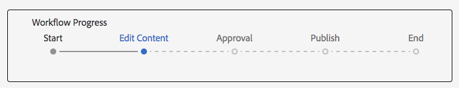

# Entwickeln von Projekten in AEM

Dieses Entwicklungs-Tutorial zeigt, wie für [!DNL AEM Projects] entwickelt wird. In diesem Tutorial erstellen wir eine benutzerdefinierte Projektvorlage, die zum Erstellen neuer Projekte in AEM für die Verwaltung von Workflows und Aufgaben zur Inhaltserstellung verwendet werden kann.

>[!VIDEO](https://video.tv.adobe.com/v/16904?quality=12&learn=on)

*In diesem Video erhalten Sie eine kurze Demo des fertigen Workflows, der im unten stehenden Tutorial erstellt wird.*

## Einführung {#introduction}

[[!DNL AEM Projects]](https://helpx.adobe.com/de/experience-manager/6-5/sites/authoring/using/projects.html) ist eine Funktion von AEM, die es erleichtert, alle Workflows und Aufgaben im Zusammenhang mit der Inhaltserstellung im Rahmen einer AEM Sites- oder Assets-Implementierung zu verwalten und zu gruppieren.

AEM-Projekte verfügen standardmäßig über mehrere [vorkonfigurierte Projektvorlagen](https://helpx.adobe.com/de/experience-manager/6-5/sites/authoring/using/projects.html#ProjectTemplates). Beim Erstellen eines neuen Projekts können Autorinnen und Autoren aus diesen verfügbaren Vorlagen auswählen. Im Falle umfangreicher AEM-Implementierungen mit besonderen Geschäftsanforderungen sollten benutzerdefinierte Projektvorlagen erstellt werden – zugeschnitten auf die entsprechenden Bedürfnisse. Durch die Erstellung einer benutzerdefinierten Projektvorlage können Entwicklerinnen und Entwickler das Projekt-Dashboard konfigurieren, sich in benutzerdefinierte Workflows sozusagen einklinken und zusätzliche Geschäftsrollen für ein Projekt erstellen. Wir werden uns die Struktur einer Projektvorlage ansehen und eine Beispielvorlage erstellen.


## Setup

In diesem Tutorial wird der Code erläutert, der zum Erstellen einer benutzerdefinierten Projektvorlage erforderlich ist. Sie können das [beigefügte Paket](./assets/develop-aem-projects/projects-tasks-guide.ui.apps-0.0.1-SNAPSHOT.zip) in eine lokale Umgebung herunterladen und dort installieren, um diesem zusammen mit dem Tutorial zu folgen. Sie können auch auf das gesamte auf [GitHub](https://github.com/Adobe-Marketing-Cloud/aem-guides/tree/feature/projects-tasks-guide) gehostete Maven-Projekt zugreifen.

* [Fertiges Tutorial-Paket](./assets/develop-aem-projects/projects-tasks-guide.ui.apps-0.0.1-SNAPSHOT.zip)
* [Vollständiges Code-Repository auf GitHub](https://github.com/Adobe-Marketing-Cloud/aem-guides/tree/feature/projects-tasks-guide)

Dieses Tutorial setzt grundlegende Kenntnisse zu [AEM-Entwicklungsmethoden](https://helpx.adobe.com/de/experience-manager/6-5/sites/developing/using/the-basics.html) und eine gewisse Vertrautheit mit dem [Setup von AEM-Maven-Projekten](https://helpx.adobe.com/de/experience-manager/6-5/sites/developing/using/ht-projects-maven.html) voraus. Der gesamte erwähnte Code sollte als Referenz verwendet und nur in einer [lokalen AEM-Entwicklungsinstanz](https://helpx.adobe.com/de/experience-manager/6-5/sites/deploying/using/deploy.html#GettingStarted) bereitgestellt werden.

## Struktur einer Projektvorlage

Projektvorlagen sollten unter Quell-Code-Verwaltung gestellt und unter dem Anwendungsordner „/apps“ gespeichert werden. Idealerweise sollten sie in einem Unterordner mit der Namenskonvention **&#42;/projects/templates/**&lt;meine-vorlage> platziert werden. Durch Befolgung dieser Namenskonvention stehen Autorinnen und Autoren beim Erstellen eines Projekts automatisch alle neuen benutzerdefinierten Vorlagen zur Verfügung. Die Konfiguration der verfügbaren Projektvorlagen ist unter dem Knoten **/content/projects/jcr:content** durch die Eigenschaft **cq:allowedTemplates** festgelegt. Standardmäßig ist dies ein regulärer Ausdruck: **/(apps|libs)/.&#42;/projects/templates/.&#42;**

Der Stammknoten einer Projektvorlage hat einen **jcr:primaryType** von **cq:Template**. Unter dem Stammknoten befinden sich drei Knoten: **Gadgets**, **Rollen** und **Workflows**. Diese Knoten sind alle **nt:unstructured**. Unter dem Stammknoten kann auch eine thumbnail.png-Datei sein, die angezeigt wird, wenn die Vorlage im Assistenten „Projekt erstellen“ ausgewählt wird.

Die vollständige Knotenstruktur:

```shell
/apps/<my-app>
    + projects (nt:folder)
         + templates (nt:folder)
              + <project-template-root> (cq:Template)
                   + gadgets (nt:unstructured)
                   + roles (nt:unstructured)
                   + workflows (nt:unstructured)
```

### Projektvorlagenstamm

Der Stammknoten der Projektvorlage hat den Typ **cq:Template**. Auf diesem Knoten können Sie die Eigenschaften **jcr:title** und **jcr:description** konfigurieren, die im Assistenten zum Erstellen von Projekten angezeigt werden. Es gibt auch eine Eigenschaft namens **Assistent**, die auf ein Formular verweist, das die Eigenschaften des Projekts ausfüllt. Der Standardwert von **/libs/cq/core/content/projects/wizard/steps/defaultproject.html** sollte in den meisten Fällen problemlos funktionieren, da die Benutzenden die grundlegenden Projekteigenschaften ausfüllen und Gruppenmitglieder hinzufügen können.

*&#42;Beachten Sie, dass der Assistent zum Erstellen von Projekten nicht das Sling-POST-Servlet verwendet. Stattdessen werden Werte an ein benutzerdefiniertes Servlet gesendet:**com.adobe.cq.projects.impl.servlet.ProjectServlet**. Dies sollte beim Hinzufügen benutzerdefinierter Felder berücksichtigt werden.*

Ein Beispiel für einen benutzerdefinierten Assistenten finden Sie für die Vorlage eines Übersetzungsprojekts: **/libs/cq/core/content/projects/wizard/translationproject/defaultproject**.

### Gadgets {#gadgets}

Es gibt keine zusätzlichen Eigenschaften auf diesem Knoten, aber die untergeordneten Elemente des Gadget-Knotens steuern, welche Projektkacheln beim Erstellen eines neuen Projekts das Dashboard des Projekts ausfüllen. [Die Projektkacheln](https://helpx.adobe.com/de/experience-manager/6-5/sites/authoring/using/projects.html#ProjectTiles) (auch als Gadgets oder Pods bezeichnet) sind einfache Karten, die den Arbeitsplatz eines Projekts füllen. Eine vollständige Liste der vorkonfigurierten Kacheln finden Sie unter **/libs/cq/gui/components/projects/admin/pod. **Projektinhaberinnen und -inhaber können Kacheln jederzeit hinzufügen/entfernen, nachdem ein Projekt erstellt wurde.

### Rollen {#roles}

Es gibt drei [Standardrollen](https://helpx.adobe.com/de/experience-manager/6-5/sites/authoring/using/projects.html#UserRolesinaProject) für jedes Projekt: **Observers**, **Editors** und **Owners**. Durch Hinzufügen von untergeordneten Knoten unter dem Benutzerknoten können Sie zusätzliche geschäftsspezifische Projektrollen für die Vorlage hinzufügen. Anschließend können Sie diese Rollen mit bestimmten Workflows verknüpfen, die mit dem Projekt zusammenhängen.

### Workflows {#workflows}

Einer der verlockendsten Gründe für die Erstellung einer benutzerdefinierten Projektvorlage besteht darin, dass Sie damit die verfügbaren Workflows für die Verwendung mit dem Projekt konfigurieren können. Diese können vorkonfigurierte Workflows oder benutzerdefinierte Workflows verwenden. Unter dem **Workflows**-Knoten muss ein **Modelle-** Knoten (auch `nt:unstructured`) sein, und die darunter liegenden untergeordneten Knoten geben die verfügbaren Workflow-Modelle an. Die Eigenschaft **modelId** verweist auf das Workflow-Modell unter /etc/workflow, und die Eigenschaft **Assistent** verweist auf das Dialogfeld, das beim Starten des Workflows verwendet wird. Ein großer Vorteil von Projekten besteht darin, dass zu Beginn des Workflows ein benutzerdefiniertes Dialogfeld (Assistent) hinzugefügt werden kann, um am Anfang des Workflows geschäftsspezifische Metadaten zu erfassen, die weitere Aktionen innerhalb des Workflows ermöglichen.

```shell
<projects-template-root> (cq:Template)
    + workflows (nt:unstructured)
         + models (nt:unstructured)
              + <workflow-model> (nt:unstructured)
                   - modelId = points to the workflow model
                   - wizard = dialog used to start the workflow
```

## Erstellen einer Projektvorlage {#creating-project-template}

Da wir hauptsächlich Knoten kopieren/konfigurieren, wird CRXDE Lite verwendet. Öffnen Sie in Ihrer lokalen AEM-Instanz [CRXDE Lite](http://localhost:4502/crx/de/index.jsp).

1. Erstellen Sie unter `/apps/&lt;your-app-folder&gt;` zunächst einen neuen Ordner namens `projects`. Erstellen Sie einen weiteren Ordner darunter mit dem Namen `templates`.

   ```shell
   /apps/aem-guides/projects-tasks/
                       + projects (nt:folder)
                                + templates (nt:folder)
   ```

1. Um die Arbeit zu erleichtern, starten wir unsere benutzerdefinierte Vorlage aus der vorhandenen einfachen Projektvorlage.

   1. Kopieren Sie den Knoten **/libs/cq/core/content/projects/templates/default** und fügen Sie ihn unterhalb des *Vorlagenordners* ein, der in Schritt 1 erstellt wurde.

   ```shell
   /apps/aem-guides/projects-tasks/
                + templates (nt:folder)
                     + default (cq:Template)
   ```

1. Sie sollten jetzt einen Pfad wie **/apps/aem-guides/projects-tasks/projects/templates/authoring-project** haben.

   1. Bearbeiten Sie die Eigenschaften **jcr:title** und **jcr:description** des Knotens „author-project“ durch benutzerdefinierte Titel- und Beschreibungswerte.

      1. Lassen Sie die **Assistenteneigenschaft** auf die standardmäßigen Projekteigenschaften verweisen.

   ```shell
   /apps/aem-guides/projects-tasks/projects/
            + templates (nt:folder)
                 + authoring-project (cq:Template)
                      - jcr:title = "Authoring Project"
                      - jcr:description = "A project to manage approval and publish process for AEM Sites or Assets"
                      - wizard = "/libs/cq/core/content/projects/wizard/steps/defaultproject.html"
   ```

1. Für diese Projektvorlage möchten wir Aufgaben verwenden.
   1. Fügen Sie einen neuen **nt:unstructured**-Knoten namens **Aufgaben** unter authoring-project/gadgets hinzu.
   1. Fügen Sie zum Aufgabenknoten die Zeichenfolge-Eigenschaften **cardWeight** = &quot;100&quot;, **jcr:title** = &quot;Aufgaben&quot; und **sling:resourceType** = &quot;cq/gui/components/projects/admin/pod/taskpod&quot; hinzu.

   Jetzt wird die [Aufgabenkachel](https://experienceleague.adobe.com/docs/#Tasks?lang=de) standardmäßig angezeigt, wenn ein neues Projekt erstellt wird.

   ```shell
   ../projects/templates/authoring-project
       + gadgets (nt:unstructured)
            + team (nt:unstructured)
            + asset (nt:unstructured)
            + work (nt:unstructured)
            + experiences (nt:unstructured)
            + projectinfo (nt:unstructured)
            ..
            + tasks (nt:unstructured)
                 - cardWeight = "100"
                 - jcr:title = "Tasks"
                 - sling:resourceType = "cq/gui/components/projects/admin/pod/taskpod"
   ```

1. Wir fügen unserer Projektvorlage eine benutzerdefinierte Genehmigerrolle („Approver“) hinzu.

   1. Fügen Sie unter dem Knoten der Projektvorlage (authoring-project) einen neuen **nt:unstructured**-Knoten mit der Beschriftung **Rollen** hinzu.
   1. Fügen Sie einen weiteren **nt:unstructured**-Knoten namens „Genehmigende“ als untergeordnetes Element des Benutzerknotens hinzu.
   1. Fügen Sie die Zeichenfolge-Eigenschaften **jcr:title** = &quot;**Approvers**&quot;, **roleclass** =&quot;**owner**&quot;, **roleid**=&quot;**approvers**&quot; hinzu.
      1. Der Name des Genehmigungsknotens sowie jcr:title und roleid können beliebige Zeichenfolgenwerte sein (solange roleid eindeutig ist).
      1. Die **Rollenklasse** legt die für diese Rolle beantragten Berechtigungen anhand der [drei vorkonfigurierten Rollen](https://docs.adobe.com/docs/de/aem/6-3/author/projects.html#User%20Roles%20in%20a%20Project) fest: **Owner**, **Editor** und **Observer**.
      1. Wenn die benutzerdefinierte Rolle eher eine Führungsrolle ist, kann die Rollenklasse **Owner** sein; wenn es sich eher um eine spezifische Authoring-Rolle wie „Photographer“ oder „Designer“ handelt, sollte die Rollenklasse **Editor** ausreichen. Der große Unterschied zwischen **Inhaberin bzw. Inhaber** und **Bearbeitenden** ist, dass Projektinhaberinnen und -inhaber Projekteigenschaften aktualisieren und dem Projekt neue Benutzende hinzufügen können.

   ```shell
   ../projects/templates/authoring-project
       + gadgets (nt:unstructured)
       + roles (nt:unstructured)
           + approvers (nt:unstructured)
                - jcr:title = "Approvers"
                - roleclass = "owner"
                - roleid = "approver"
   ```

1. Durch Kopieren der Vorlage für ein einfaches Projekt erhalten Sie vier vorkonfigurierte Workflows. Jeder Knoten unter Workflows/Modelle verweist auf einen bestimmten Workflow und einen Assistenten für das Starten eines Dialogfelds für diesen Workflow. Später in diesem Tutorial erstellen wir einen benutzerdefinierten Workflow für dieses Projekt. Für diesen Schritt löschen Sie jedoch zunächst die Knoten unter „workflow/models“:

   ```shell
   ../projects/templates/authoring-project
       + gadgets (nt:unstructured)
       + roles (nt:unstructured)
       + workflows (nt:unstructured)
            + models (nt:unstructured)
               - (remove ootb models)
   ```

1. Um es Inhaltsautorinnen und Inhaltsautoren zu erleichtern, die Projektvorlage zu identifizieren, können Sie eine benutzerdefinierte Miniaturansicht hinzufügen. Die empfohlene Größe beträgt 319 x 319 Pixel.
   1. Erstellen Sie in CRXDE Lite eine neue Datei als gleichrangiges Element mit Knoten für Gadgets, Rollen und Workflows mit dem Namen **thumbnail.png**.
   1. Speichern Sie, navigieren Sie dann zum `jcr:content`-Knoten und klicken Sie zweimal auf die Eigenschaft `jcr:data` (vermeiden Sie das Klicken auf „Ansicht“).
      1. Daraufhin sollte ein Dialogfeld zum Bearbeiten der Datei `jcr:data` angezeigt werden, in dem Sie eine benutzerdefinierte Miniaturansicht hochladen können.

   ```shell
   ../projects/templates/authoring-project
       + gadgets (nt:unstructured)
       + roles (nt:unstructured)
       + workflows (nt:unstructured)
       + thumbnail.png (nt:file)
   ```

Abgeschlossene XML-Darstellung der Projektvorlage:

```xml
<?xml version="1.0" encoding="UTF-8"?>
<jcr:root xmlns:sling="http://sling.apache.org/jcr/sling/1.0" xmlns:cq="http://www.day.com/jcr/cq/1.0" xmlns:jcr="http://www.jcp.org/jcr/1.0" xmlns:nt="http://www.jcp.org/jcr/nt/1.0"
    jcr:description="A project to manage approval and publish process for AEM Sites or Assets"
    jcr:primaryType="cq:Template"
    jcr:title="Authoring Project"
    ranking="{Long}1"
    wizard="/libs/cq/core/content/projects/wizard/steps/defaultproject.html">
    <jcr:content
        jcr:primaryType="nt:unstructured"
        detailsHref="/projects/details.html"/>
    <gadgets jcr:primaryType="nt:unstructured">
        <team
            jcr:primaryType="nt:unstructured"
            jcr:title="Team"
            sling:resourceType="cq/gui/components/projects/admin/pod/teampod"
            cardWeight="60"/>
        <tasks
            jcr:primaryType="nt:unstructured"
            jcr:title="Tasks"
            sling:resourceType="cq/gui/components/projects/admin/pod/taskpod"
            cardWeight="100"/>
        <work
            jcr:primaryType="nt:unstructured"
            jcr:title="Workflows"
            sling:resourceType="cq/gui/components/projects/admin/pod/workpod"
            cardWeight="80"/>
        <experiences
            jcr:primaryType="nt:unstructured"
            jcr:title="Experiences"
            sling:resourceType="cq/gui/components/projects/admin/pod/channelpod"
            cardWeight="90"/>
        <projectinfo
            jcr:primaryType="nt:unstructured"
            jcr:title="Project Info"
            sling:resourceType="cq/gui/components/projects/admin/pod/projectinfopod"
            cardWeight="100"/>
    </gadgets>
    <roles jcr:primaryType="nt:unstructured">
        <approvers
            jcr:primaryType="nt:unstructured"
            jcr:title="Approvers"
            roleclass="owner"
            roleid="approvers"/>
    </roles>
    <workflows
        jcr:primaryType="nt:unstructured"
        tags="[]">
        <models jcr:primaryType="nt:unstructured">
        </models>
    </workflows>
</jcr:root>
```

## Testen der benutzerdefinierten Projektvorlage

Jetzt können wir unsere Projektvorlage testen, indem wir ein neues Projekt erstellen.

1. Sie sollten die benutzerdefinierte Vorlage als eine der Optionen für die Projekterstellung sehen.

   

1. Nachdem Sie die benutzerdefinierte Vorlage ausgewählt haben, klicken Sie auf „Weiter“. Beachten Sie, dass Sie beim Ausfüllen der Projektmitglieder diese in der Rolle „Approver“ hinzufügen können.

   

1. Klicken Sie auf „Erstellen“, um das Projekt anhand der benutzerdefinierten Vorlage zu erstellen. Sie werden im Projekt-Dashboard feststellen, dass die Aufgabenkachel und die anderen unter Gadgets konfigurierten Kacheln automatisch angezeigt werden.

   


## Warum Workflows?

Traditionell haben AEM-Workflows für einen Genehmigungsprozess die Workflow-Schritte „Teilnehmende“ verwendet. Der AEM-Posteingang enthält Details zu Aufgaben und Workflows sowie eine verbesserte Integration in AEM-Projekte. Diese Funktionen machen die Verwendung der Prozessschritte „Aufgabe erstellen“ für Projekte zu einer attraktiveren Option.

### Warum Aufgaben?

Die Verwendung eines Schritts zur Aufgabenerstellung anstelle der herkömmlichen Schritte „Teilnehmende“ bietet einige Vorteile:

* **Start- und Fälligkeitsdatum** – erleichtert es Autorinnen und Autoren, ihre Zeit zu verwalten. Die neue Kalenderfunktion nutzt diese Daten.
* **Priorität** – integrierte Prioritäten von „Niedrig“, „Normal“ und „Hoch“ ermöglichen es Autorinnen und Autoren, die Arbeit zu priorisieren.
* **Thread-Kommentare** – Wenn Autorinnen oder Autoren an einer Aufgabe arbeiten, können sie Kommentare hinterlassen, was die Zusammenarbeit stärkt
* **Sichtbarkeit** – Aufgabenkacheln und -ansichten mit Projekten ermöglichen es den Vorgesetzten anzuzeigen, wie die Zeit genutzt wird
* **Projektintegration** – Aufgaben sind bereits in Projektrollen und Dashboards integriert.

Aufgaben können wie Teilnehmer-Schritte dynamisch zugewiesen und weitergeleitet werden. Aufgabenmetadaten wie Titel und Priorität können auch dynamisch basierend auf vorherigen Aktionen festgelegt werden, wie im folgenden Tutorial gezeigt wird.

Aufgaben haben zwar einige Vorteile gegenüber Teilnehmer-Schritten, sind aber außerhalb eines Projekts nicht sehr nützlich, sondern mit zusätzlichem Mehraufwand verbunden. Zusätzlich muss das dynamische Verhalten von Aufgaben mit Ecma-Skripten mit eigenen Einschränkungen codiert werden.

## Anforderungen in einem Beispielanwendungsfall {#goals-tutorial}


Im obigen Diagramm werden die allgemeinen Anforderungen für unseren Beispiel-Genehmigungs-Workflow beschrieben.

Der erste Schritt besteht darin, eine Aufgabe zu erstellen, um die Bearbeitung eines Inhaltselements abzuschließen. Wir werden der Person, die den Workflow initiiert, die Wahl überlassen, wer mit dieser ersten Aufgabe betraut wird.

Sobald die erste Aufgabe abgeschlossen ist, hat die Person, der die Aufgabe zugewiesen wurde, drei Optionen für die Weiterleitung des Workflows:

**Normal ** – Normales Routing erstellt eine Aufgabe, die der Genehmigergruppe des Projekts zugewiesen ist, um sie zu überprüfen und zu genehmigen. Die Priorität der Aufgabe ist „normal“, und das Fälligkeitsdatum liegt 5 Tage nach ihrer Erstellung.

**Eilig** – Das Eil-Routing erstellt ebenfalls eine Aufgabe, die der Genehmigergruppe des Projekts zugewiesen ist. Die Priorität der Aufgabe ist hoch und das Fälligkeitsdatum ist nur 1 Tag später.

**Umgehen** – In diesem Beispiel-Workflowhat die Person, die als erste dran ist, die Möglichkeit, die Genehmigungsgruppe zu umgehen. (Ja, dies könnte den Zweck eines „Genehmigungs“-Workflows beeinträchtigen, ermöglicht uns jedoch, zusätzliche Routing-Funktionen zu veranschaulichen)

Die Genehmigergruppe kann den Inhalt genehmigen oder ihn zur erneuten Bearbeitung an die ursprüngliche bevollmächtigte Person zurücksenden. Im Falle einer erneuten Bearbeitung wird eine neue Aufgabe erstellt und entsprechend mit der Bezeichnung „Zur Bearbeitung zurückgesendet“ versehen.

Der letzte Schritt des Workflows nutzt den vorkonfigurierten Prozessschritt „Seite/Asset aktivieren“ und repliziert die Payload.

## Erstellen eines Workflow-Modells

1. Navigieren Sie im AEM-Startmenü zu „Tools“ > „Workflow“ > „Modelle“. Klicken Sie oben rechts auf „Erstellen“, um ein neues Workflow-Modell zu erstellen.

   Geben Sie dem neuen Modell den Titel „Inhaltsgenehmigungs-Workflow“ und den URL-Namen: „content-approval-workflow“.

   

   Weitere Informationen zum [Erstellen von Workflows finden Sie hier](https://helpx.adobe.com/de/experience-manager/6-5/sites/developing/using/workflows-models.html).

1. Als Best Practice sollten benutzerdefinierte Workflows in einem eigenen Ordner unter /etc/workflow/models gruppiert werden. Erstellen Sie in CRXDE Lite einen neuen **‚nt:folder‘** unter /etc/workflow/models namens **„aem-guides“**. Durch Hinzufügen eines Unterordners wird sichergestellt, dass benutzerdefinierte Workflows bei Upgrades oder Service Pack-Installationen nicht versehentlich überschrieben werden.

   &#42;Beachten Sie, dass es wichtig ist, den Ordner oder die benutzerdefinierten Workflows nie unter den vorkonfigurierten Unterordnern wie /etc/workflow/models/dam oder /etc/workflow/models/projects zu platzieren, da der gesamte Unterordner ebenfalls durch Upgrades oder Service Packs überschrieben werden kann.

   

   Speicherort des Workflow-Modells in 6.3

   >[!NOTE]
   >
   >Bei Verwendung von AEM 6.4+ hat sich der Speicherort des Workflows geändert. Weitere Informationen dazu finden Sie [hier](https://helpx.adobe.com/de/experience-manager/6-5/sites/developing/using/workflows-best-practices.html#LocationsWorkflowModels).

   Bei Verwendung von AEM 6.4+ wird das Workflow-Modell unter `/conf/global/settings/workflow/models` erstellt. Wiederholen Sie die obigen Schritte mit dem /conf-Verzeichnis, fügen Sie einen Unterordner mit dem Namen `aem-guides` hinzu und verschieben Sie den `content-approval-workflow` darunter.

   
Speicherort des Workflow-Modells in 6.4+

1. In AEM 6.3 wurde die Möglichkeit eingeführt, Workflow-Phasen zu einem bestimmten Workflow hinzuzufügen. Die Phasen werden den Benutzenden des Posteingangs auf der Registerkarte „Workflow-Informationen“ angezeigt. Sie zeigt ihnen die aktuelle Phase des Workflows sowie die Phasen davor und danach an.

   Um die Phasen zu konfigurieren, öffnen Sie das Dialogfeld „Seiteneigenschaften“ im Sidekick. Die vierte Registerkarte heißt „Phasen“. Fügen Sie die folgenden Werte hinzu, um die drei Phasen dieses Workflows zu konfigurieren:

   1. Inhalt bearbeiten
   1. Genehmigung
   1. Veröffentlichen

   

   Konfigurieren Sie die Workflow-Phasen im Dialogfeld „Seiteneigenschaften“.

   

   Die Workflow-Fortschrittsleiste, die im AEM-Posteingang angezeigt wird.

   Optional können Sie ein **Bild** in die Seiteneigenschaften hochladen, das als Miniaturansicht eines Workflows verwendet wird, wenn Benutzende ihn auswählen. Die Bildabmessungen sollten 319 x 319 Pixel betragen. Eine hinzugefügte **Beschreibung** in den Seiteneigenschaften wird ebenfalls angezeigt, wenn Benutzende den Workflow auswählen.

1. Der Workflow-Prozess „Projektaufgabe erstellen“ dient dazu, eine Aufgabe als Schritt im Workflow zu erstellen. Erst nach Abschluss der Aufgabe wird der Workflow fortgesetzt. Ein wichtiger Aspekt des Schritts „Projektaufgabe erstellen“ besteht darin, dass er Workflow-Metadatenwerte lesen und diese zum dynamischen Erstellen der Aufgabe verwenden kann.

   Löschen Sie zunächst den Teilnehmer-Schritt, der standardmäßig erstellt wird. Erweitern Sie über den Sidekick im Komponentenmenü die Unterüberschrift **„Projekte“** und ziehen Sie **„Projektaufgabe erstellen“** auf das Modell.

   Klicken Sie zweimal auf den Schritt „Projektaufgabe erstellen“, um das Workflow-Dialogfeld zu öffnen. Konfigurieren Sie die folgenden Eigenschaften:

   Diese Registerkarte ist allen Workflow-Prozessschritten gemeinsam. Wir legen hier den Titel und die Beschreibung fest (diese sind für die Endbenutzenden nicht sichtbar). Die wichtigste Eigenschaft, die wir festlegen werden, ist die Workflow-Phase, die wir über das Dropdown-Menü auf **„Inhalt bearbeiten“** setzen.

   ```shell
   Common Tab
   -----------------
       Title = "Start Task Creation"
       Description = "This the first task in the Workflow"
       Workflow Stage = "Edit Content"
   ```

   Der Workflow-Prozess „Projektaufgabe erstellen“ dient dazu, eine Aufgabe als Schritt im Workflow zu erstellen. Auf der Registerkarte „Aufgabe“ können wir alle Werte der Aufgabe festlegen. In unserem Fall möchten wir, dass die oder der Verantwortliche dynamisch bleibt, weshalb wir dieses Feld leer lassen. Der Rest der Eigenschaftswerte:

   ```shell
   Task Tab
   -----------------
       Name* = "Edit Content"
       Task Priority = "Medium"
       Description = "Edit the content and finalize for approval. Once finished submit for approval."
       Due In - Days = "2"
   ```

   Die Registerkarte „Routing“ ist ein optionales Dialogfeld, in dem die verfügbaren Aktionen für die Benutzenden angegeben werden können, die die Aufgabe abschließen. Diese Aktionen sind lediglich Zeichenfolgenwerte, die in den Metadaten des Workflows gespeichert werden. Diese Werte können von Skripten und/oder Prozessschritten später im Workflow gelesen werden, sodass der Workflow dynamisch „weitergeleitet“ wird. Basierend auf den [Workflow-Zielen](#goals-tutorial) fügen wir dieser Registerkarte drei Aktionen hinzu:

   ```shell
   Routing Tab
   -----------------
       Actions =
           "Normal Approval"
           "Rush Approval"
           "Bypass Approval"
   ```

   Auf dieser Registerkarte können wir ein „Skript vor Erstellung einer Aufgabe“ konfigurieren, in dem wir programmgesteuert verschiedene Werte der Aufgabe festlegen können, bevor sie erstellt wird. Wir haben die Möglichkeit, das Skript auf eine externe Datei verweisen zu lassen oder ein kurzes Skript direkt in den Dialog einzubetten. In unserem Fall verweist das „Skript vor Erstellung einer Aufgabe“ auf eine externe Datei. In Schritt 5 erstellen wir dieses Skript.

   ```shell
   Advanced Settings Tab
   -----------------
      Pre-Create Task Script = "/apps/aem-guides/projects/scripts/start-task-config.ecma"
   ```

1. Im vorherigen Schritt haben wir ein solches Vorab-Skript referenziert. Wir erstellen jetzt dieses Skript, in dem wir die für die Aufgabe verantwortliche Person auf Grundlage des Werts eines Workflow-Metadatenwerts „**Verantwortliche**“ festlegen. Der Wert **„Verantwortliche“** wird festgelegt, wenn der Workflow gestartet wird. Außerdem werden die Workflow-Metadaten gelesen, sodass die Priorität der Aufgabe dynamisch ausgewählt werden kann, indem der **taskPriority**-Wert der Workflow-Metadaten sowie das **taskDueDate** gelesen wird und dynamisch festgelegt werden kann, wann die erste Aufgabe ansteht.

   Zu organisatorischen Zwecken haben wir unter unserem Anwendungsordner einen Ordner erstellt, in dem alle unsere projektbezogenen Skripte gespeichert werden: **/apps/aem-guides/projects-tasks/projects/scripts**. Erstellen Sie unter diesem Ordner eine neue Datei mit dem Namen **start-task-config.ecma**. &#42;Achten Sie darauf, dass der Pfad zu Ihrer Datei „start-task-config.ecma“ mit dem Pfad übereinstimmt, der in Schritt 4 auf der Registerkarte „Erweiterte Einstellungen“ festgelegt wurde.

   Fügen Sie Folgendes als Inhalt der Datei hinzu:

   ```
   // start-task-config.ecma
   // Populate the task using values stored as workflow metadata originally posted by the start workflow wizard
   
   // set the assignee based on start workflow wizard
   var assignee = workflowData.getMetaDataMap().get("assignee", Packages.java.lang.String);
   task.setCurrentAssignee(assignee);
   
   //Set the due date for the initial task based on start workflow wizard
   var dueDate = workflowData.getMetaDataMap().get("taskDueDate", Packages.java.util.Date);
   if (dueDate != null) {
       task.setProperty("taskDueDate", dueDate);
   }
   
   //Set the priority based on start workflow wizard
   var taskPriority = workflowData.getMetaDataMap().get("taskPriority", "Medium");
   task.setProperty("taskPriority", taskPriority);
   ```

1. Navigieren Sie zurück zum Workflow für die Inhaltsgenehmigung. Ziehen Sie die Komponente **ODER-Teilung** (befindet sich im Sidekick unter der Kategorie „Workflow“) per Drag-and-Drop unter den Schritt **Aufgabe starten**. Wählen Sie im Dialogfeld „Allgemein“ die Optionsschaltfläche für 3 Verzweigungen aus. Die ODER-Teilung liest den Metadatenwert des Workflows **lastTaskAction**, um die Route des Workflows zu bestimmen. Die Eigenschaft **lastTaskAction** ist auf einen der Werte auf der Registerkarte „Routing“ festgelegt, die in Schritt 4 konfiguriert wurde. Tragen Sie für jede Registerkarte „Verzweigung“ die folgenden Werte in den **Skript**-Textbereich ein:

   ```
   function check() {
   var lastAction = workflowData.getMetaDataMap().get("lastTaskAction","");
   
   if(lastAction == "Normal Approval") {
       return true;
   }
   
   return false;
   }
   ```

   ```
   function check() {
   var lastAction = workflowData.getMetaDataMap().get("lastTaskAction","");
   
   if(lastAction == "Rush Approval") {
       return true;
   }
   
   return false;
   }
   ```

   ```
   function check() {
   var lastAction = workflowData.getMetaDataMap().get("lastTaskAction","");
   
   if(lastAction == "Bypass Approval") {
       return true;
   }
   
   return false;
   }
   ```

   &#42;Beachten Sie, dass wir die Route durch eine direkte String-Übereinstimmung bestimmen. Daher ist es wichtig, dass die in den Verzweigungs-Skripten festgelegten Werte den in Schritt 4 festgelegten Routenwerten entsprechen.

1. Ziehen Sie per Drag-and-Drop einen weiteren Schritt „**Projektaufgabe erstellen**“ zum Modell ganz links (Verzweigung 1) unterhalb der ODER-Teilung. Füllen Sie das Dialogfeld mit den folgenden Eigenschaften aus:

   ```
   Common Tab
   -----------------
       Title = "Approval Task Creation"
       Description = "Create a an approval task for Project Approvers. Priority is Medium."
       Workflow Stage = "Approval"
   
   Task Tab
   ------------
       Name* = "Approve Content for Publish"
       Task Priority = "Medium"
       Description = "Approve this content for publication."
       Days = "5"
   
   Routing Tab - Actions
   ----------------------------
       "Approve and Publish"
       "Send Back for Revision"
   ```

   Da dies die normale Route für die Genehmigung ist, ist die Priorität der Aufgabe auf „Mittel“ eingestellt. Außerdem geben wir der Gruppe der Genehmigenden fünf Tage Zeit, um die Aufgabe abzuschließen. Das Feld „Verantwortliche“ wird auf der Registerkarte „Aufgabe“ leer gelassen, da wir dies auf der Registerkarte „Erweiterte Einstellungen“ dynamisch zuweisen werden. Wir geben für die Gruppe der Genehmigenden zwei mögliche Routen an, wenn diese Aufgabe abgeschlossen wird: **Genehmigen und veröffentlichen**, wenn sie den Inhalt genehmigen und er veröffentlicht werden kann, und **Zur Revision zurücksenden**, wenn Probleme vorliegen, die die ursprünglich bearbeitende Person korrigieren muss. Die genehmigende Person kann Kommentare hinterlassen, die die ursprünglich bearbeitende Person sieht, wenn der Workflow an sie zurückgeht.

Zuvor haben wir in diesem Tutorial eine Projektvorlage erstellt, die eine Rolle „Approver“ enthielt. Jedes Mal, wenn ein neues Projekt aus dieser Vorlage erstellt wird, wird eine projektspezifische Gruppe für die Rolle „Approver“ erstellt. Genau wie ein Teilnehmerschritt kann eine Aufgabe nur einer Person oder Gruppe zugewiesen werden. Diese Aufgabe sollte der Projektgruppe zugewiesen werden, die der Gruppe der genehmigenden Personen entspricht. Alle Workflows, die in einem Projekt gestartet werden, verfügen über Metadaten, die die Projektrollen der projektspezifischen Gruppe zuordnen.

Kopieren Sie den folgenden Code und fügen Sie ihn in den **Skript**-Textbereich auf der Registerkarte „Erweiterte Einstellungen“ ein. Dieser Code liest die Workflow-Metadaten und weist die Aufgabe der Gruppe der genehmigenden Personen des Projekts zu. Wenn der Wert der Gruppe „Genehmigende Personen“ nicht gefunden wird, wird die Aufgabe der Gruppe „Admins“ zugewiesen.

```
var projectApproverGrp = workflowData.getMetaDataMap().get("project.group.approvers","administrators");

task.setCurrentAssignee(projectApproverGrp);
```

1. Ziehen Sie per Drag-and-Drop einen weiteren Schritt „**Projektaufgabe erstellen**“ zum Modell in die mittlere Verzweigung (Verzweigung 2) unterhalb der ODER-Teilung. Füllen Sie das Dialogfeld mit den folgenden Eigenschaften aus:

   ```
   Common Tab
   -----------------
       Title = "Rush Approval Task Creation"
       Description = "Create a an approval task for Project Approvers. Priority is High."
       Workflow Stage = "Approval"
   
   Task Tab
   ------------
       Name* = "Rush Approve Content for Publish"
       Task Priority = "High"
       Description = "Rush approve this content for publication."
       Days = "1"
   
   Routing Tab - Actions
   ----------------------------
       "Approve and Publish"
       "Send Back for Revision"
   ```

   Da dies die Route für eine Eil-Genehmigung („Rush Approval“) ist, ist die Priorität der Aufgabe auf „Hoch“ eingestellt. Außerdem geben wir der Gruppe der Genehmigenden nur einen einzigen Tag Zeit, um die Aufgabe abzuschließen. Das Feld „Verantwortliche“ wird auf der Registerkarte „Aufgabe“ leer gelassen, da wir dies auf der Registerkarte „Erweiterte Einstellungen“ dynamisch zuweisen werden.

   Wir können dasselbe Skript-Snippet wie in Schritt 7 erneut verwenden, um den **Skript**-Textbereich auf der Registerkarte „Erweiterte Einstellungen“ zu füllen. Kopieren Sie den folgenden Code und fügen Sie ihn ein:

   ```
   var projectApproverGrp = workflowData.getMetaDataMap().get("project.group.approvers","administrators");
   
   task.setCurrentAssignee(projectApproverGrp);
   ```

1. Ziehen Sie eine Komponente vom Typ „Kein Vorgang“ per Drag-and-Drop in die Verzweigung ganz rechts (Verzweigung 3). Die Komponente vom Typ „Kein Vorgang“ führt keine Aktion durch und leitet sofort weiter, was dem Wunsch der ursprünglich bearbeitenden Person entspricht, den Genehmigungsschritt zu umgehen. Technisch gesehen könnten wir diese Verzweigung auch ohne Workflow-Schritte verlassen. Als Best Practice fügen wir jedoch einen Schritt „Kein Vorgang“ hinzu. Dies macht anderen Entwicklungspersonen den Zweck von Verzweigung 3 deutlich.

   Doppelklicken Sie auf den Workflow-Schritt und konfigurieren Sie den Titel und die Beschreibung:

   ```
   Common Tab
   -----------------
       Title = "Bypass Approval"
       Description = "Placeholder step to indicate that the original editor decided to bypass the approver group."
   ```

   

   Das Workflow-Modell sollte wie folgt aussehen, nachdem alle drei Zweige in der ODER-Teilung konfiguriert worden sind.

1. Da die Genehmigergruppe die Möglichkeit hat, den Workflow für weitere Änderungen an die ursprünglich bearbeitende Person zurückzusenden, verlassen wir uns auf den Schritt **Wechseln zu**, um die letzte durchgeführte Aktion zu lesen und den Workflow an den Anfang zu leiten oder fortzusetzen.

   Ziehen Sie die Komponente „Zum Schritt wechseln“ (im Sidekick unter „Workflow“ zu finden) unter die ODER-Teilung, wo sie sich neu verbindet. Klicken Sie zweimal darauf und konfigurieren Sie die folgenden Eigenschaften im Dialogfeld:

   ```
   Common Tab
   ----------------
       Title = "Goto Step"
       Description = "Based on the Approver groups action route the workflow to the beginning or continue and publish the payload."
   
   Process Tab
   ---------------
       The step to go to. = "Start Task Creation"
   ```

   Das letzte Element, das wir konfigurieren werden, ist das Skript als Teil des Prozessschritts „Wechseln zu“. Der Skriptwert kann über das Dialogfeld eingebettet oder so konfiguriert werden, dass er auf eine externe Datei verweist. Das Wechseln-zu-Skript muss einen **function check()** beinhalten und „true“ zurückgeben, wenn der Workflow zum angegebenen Schritt wechseln soll. Die Rückgabe von „false“ führt dazu, dass der Workflow einfach fortgesetzt wird.

   Wenn die Genehmigergruppe die Aktion **„Zur Revision zurücksenden“** wählt (konfiguriert in Schritt 7 und 8), dann setzen wir den Workflow auf den Schritt **„Aufgabenerstellung starten“** zurück.

   Fügen Sie auf der Registerkarte „Prozess“ das folgende Snippet zum Skript-Textbereich hinzu:

   ```
   function check() {
   var lastAction = workflowData.getMetaDataMap().get("lastTaskAction","");
   
   if(lastAction == "Send Back for Revision") {
       return true;
   }
   
   return false;
   }
   ```

1. Zum Veröffentlichen der Payload verwenden wir den vorkonfigurierten Prozessschritt **Seite/Asset aktivieren**. Dieser Prozessschritt erfordert einige wenige Konfigurationen und fügt die Payload des Workflows zur Replikationswarteschlange zur Aktivierung hinzu. Wir fügen den Schritt unter dem Schritt „Wechseln zu“ hinzu. Auf diese Weise kann er nur erreicht werden, wenn die Genehmigergruppe den Inhalt zur Veröffentlichung genehmigt oder die ursprünglich bearbeitende Person die Route „Genehmigung umgehen“ ausgewählt hat.

   Ziehen Sie den Prozessschritt **Seite/Asset aktivieren** (im Sidekick unter „WCM-Workflow“ zu finden) unter den Schritt „Wechseln zu“ im Modell.

   

   So sollte das Workflow-Modell aussehen, nachdem der Schritt „Wechseln zu“ und der Schritt „Seite/Asset aktivieren“ hinzugefügt wurden.

1. Wenn die Genehmigergruppe den Inhalt zur Revision zurücksendet, möchten wir dies der ursprünglich bearbeitenden Person mitteilen. Dazu können wir die Eigenschaften der Aufgabenerstellung dynamisch ändern. Wir ändern sie je nachdem, ob die lastActionTaken-Eigenschaft den Wert **„Zur Revision zurücksenden“** hat. Wenn dieser Wert vorhanden ist, ändern wir den Titel und die Beschreibung, um anzugeben, dass diese Aufgabe das Ergebnis davon ist, dass Inhalte zur Revision zurückgesendet wurden. Wir aktualisieren auch die Priorität auf **„Hoch“** sodass es das erste Element ist, an dem die bearbeitende Person arbeitet. Schließlich legen wir das Fälligkeitsdatum der Aufgabe auf einen Tag nach dem Datum fest, an dem der Workflow zur Revision zurückgesendet wurde.

   Ersetzen Sie das Start-`start-task-config.ecma`-Skript (erstellt in Schritt 5) durch folgenden Inhalt:

   ```
   // start-task-config.ecma
   // Populate the task using values stored as workflow metadata originally posted by the start workflow wizard
   
   // set the assignee based on start workflow wizard
   var assignee = workflowData.getMetaDataMap().get("assignee", Packages.java.lang.String);
   task.setCurrentAssignee(assignee);
   
   //Set the due date for the initial task based on start workflow wizard
   var dueDate = workflowData.getMetaDataMap().get("taskDueDate", Packages.java.util.Date);
   if (dueDate != null) {
       task.setProperty("taskDueDate", dueDate);
   }
   
   //Set the priority based on start workflow wizard
   var taskPriority = workflowData.getMetaDataMap().get("taskPriority", "Medium");
   task.setProperty("taskPriority", taskPriority);
   
   var lastAction = workflowData.getMetaDataMap().get("lastTaskAction","");
   
   //change the title and priority if the approver group sent back the content
   if(lastAction == "Send Back for Revision") {
     var taskName = "Review and Revise Content";
   
     //since the content was rejected we will set the priority to High for the revison task
     task.setProperty("taskPriority", "High"); 
   
     //set the Task name (displayed as the task title in the Inbox) 
     task.setProperty("name", taskName);
     task.setProperty("nameHierarchy", taskName);
   
     //set the due date of this task 1 day from current date
     var calDueDate = Packages.java.util.Calendar.getInstance();
     calDueDate.add(Packages.java.util.Calendar.DATE, 1);
     task.setProperty("taskDueDate", calDueDate.getTime());
   
   }
   ```

## Erstellen des Assistenten „Workflow starten“ {#start-workflow-wizard}

Beim Starten eines Workflows innerhalb eines Projekts müssen Sie einen Assistenten angeben, um den Workflow zu starten. Der Standardassistent `/libs/cq/core/content/projects/workflowwizards/default_workflow` ermöglicht den Benutzenden die Eingabe eines Workflow-Titels, eines Start-Kommentars und eines Payload-Pfads für die Ausführung des Workflows. Es gibt auch einige weitere Beispiele unter `/libs/cq/core/content/projects/workflowwizards`.

Die Erstellung eines benutzerdefinierten Assistenten kann sehr leistungsstark sein, da Sie wichtige Informationen vor Beginn des Workflows erfassen können. Die Daten werden als Teil der Metadaten gespeichert. Workflow-Prozesse können sie lesen und das Verhalten dynamisch anhand der eingegebenen Werte ändern. Wir erstellen einen benutzerdefinierten Assistenten, um die erste Aufgabe im Workflow dynamisch, nämlich basierend auf dem Wert des Startassistenten, zuzuweisen.

1. In CRXDE Lite erstellen wir einen Unterordner unter dem `/apps/aem-guides/projects-tasks/projects`-Ordner namens „wizards“ (Assistenten). Kopieren Sie den Standardassistenten aus `/libs/cq/core/content/projects/workflowwizards/default_workflow` unter den neu erstellten Assistenten-Ordner und benennen Sie ihn in **content-approval-start** um. Der vollständige Pfad sollte jetzt sein: `/apps/aem-guides/projects-tasks/projects/wizards/content-approval-start`.

   Der Standardassistent ist ein zweispaltiger Assistent, in dem die erste Spalte Titel, Beschreibung und Miniaturansicht des ausgewählten Workflow-Modells anzeigt. Die zweite Spalte enthält Felder für den Workflow-Titel, den Startkommentar und den Payload-Pfad. Der Assistent ist ein standardmäßiges Touch-Benutzeroberflächenformular und verwendet standardmäßige [Formularkomponenten der Granite-Benutzeroberfläche](https://experienceleague.adobe.com/docs/?lang=de), um die Felder auszufüllen.

   

1. Wir fügen dem Assistenten ein zusätzliches Feld hinzu, mit dem der oder die Verantwortliche der ersten Aufgabe im Workflow festgelegt wird (siehe [Erstellen des Workflow-Modells](#create-workflow-model): Schritt 5).

   Erstellen Sie unter `../content-approval-start/jcr:content/items/column2/items` einen neuen Knoten des Typs `nt:unstructured` namens **„Zuweisen“**. Wir verwenden die Komponente „Benutzerauswahl für Projekte“ (basierend auf der [Granite-Benutzerauswahlkomponente](https://experienceleague.adobe.com/docs/?lang=de)). Dieses Formularfeld ermöglicht es, die Benutzer- und Gruppenauswahl auf diejenigen zu beschränken, die zum aktuellen Projekt gehören.

   Nachfolgend finden Sie die XML-Darstellung des **Zuweisen**-Knotens:

   ```xml
   <assign
       granite:class="js-cq-project-user-picker"
       jcr:primaryType="nt:unstructured"
       sling:resourceType="cq/gui/components/projects/admin/userpicker"
       fieldLabel="Assign To"
       hideServiceUsers="{Boolean}true"
       impersonatesOnly="{Boolean}true"
       showOnlyProjectMembers="{Boolean}true"
       name="assignee"
       projectPath="${param.project}"
       required="{Boolean}true"/>
   ```

1. Außerdem wird ein Feld für die Prioritätsauswahl hinzugefügt, das die Priorität der ersten Aufgabe im Workflow bestimmt (siehe [Erstellen des Workflow-Modells](#create-workflow-model): Schritt 5).

   Erstellen Sie unter `/content-approval-start/jcr:content/items/column2/items` einen neuen Knoten des Typs `nt:unstructured` namens **Priorität**. Wir werden die [Auswahlkomponente der Granite-Benutzeroberfläche](https://experienceleague.adobe.com/docs/experience-manager-release-information/aem-release-updates/previous-updates/aem-previous-versions.html?lang=de) verwenden, um das Formularfeld auszufüllen.

   Unter dem **Prioritätsknoten** fügen wir einen Knoten namens **Elemente** vom Typ **nt:unstructured** hinzu. Fügen Sie unter dem **Elementeknoten** drei weitere Knoten hinzu, um die Auswahloptionen für „Hoch“, „Mittel“ und „Niedrig“ auszufüllen. Jeder Knoten ist vom Typ **nt:unstructured** und sollte eine **Text-** und eine **Werteigenschaft** haben. Text und Wert sollten beide denselben Wert aufweisen:

   1. Hoch
   1. Mittel
   1. Niedrig

   Fügen Sie für den Knoten „Mittel“ eine zusätzliche boolesche Eigenschaft mit dem Namen **selected** und dem Wert **true** hinzu. Dadurch wird sichergestellt, dass „Mittel“ der Standardwert im Auswahlfeld ist.

   Nachfolgend finden Sie eine XML-Darstellung der Knotenstruktur und -eigenschaften:

   ```xml
   <priority
       jcr:primaryType="nt:unstructured"
       sling:resourceType="granite/ui/components/coral/foundation/form/select"
       fieldLabel="Task Priority"
       name="taskPriority">
           <items jcr:primaryType="nt:unstructured">
               <high
                   jcr:primaryType="nt:unstructured"
                   text="High"
                   value="High"/>
               <medium
                   jcr:primaryType="nt:unstructured"
                   selected="{Boolean}true"
                   text="Medium"
                   value="Medium"/>
               <low
                   jcr:primaryType="nt:unstructured"
                   text="Low"
                   value="Low"/>
               </items>
   </priority>
   ```

1. Wir werden der Person, die den Workflow initiiert, die Wahl überlassen, das Fälligkeitsdatum für die erste Aufgabe festzulegen. Wir verwenden das Formularfeld [DatePicker in der Granite-Benutzeroberfläche](https://experienceleague.adobe.com/docs/?lang=de), um diese Eingabe zu erfassen. Wir fügen auch ein ausgeblendetes Feld mit einem [TypeHint](https://sling.apache.org/documentation/bundles/manipulating-content-the-slingpostservlet-servlets-post.html#typehint) hinzu, um sicherzustellen, dass die Eingabe als Eigenschaft vom Typ „Datum“ im JCR gespeichert wird.

   Fügen Sie zwei **nt:unstructured**-Knoten mit den folgenden Eigenschaften hinzu, die nachfolgend in XML dargestellt werden:

   ```xml
   <duedate
       granite:rel="project-duedate"
       jcr:primaryType="nt:unstructured"
       sling:resourceType="granite/ui/components/coral/foundation/form/datepicker"
       displayedFormat="YYYY-MM-DD HH:mm"
       fieldLabel="Due Date"
       minDate="today"
       name="taskDueDate"
       type="datetime"/>
   <duedatetypehint
       jcr:primaryType="nt:unstructured"
       sling:resourceType="granite/ui/components/coral/foundation/form/hidden"
       name="taskDueDate@TypeHint"
       type="datetime"
       value="Calendar"/>
   ```

1. Sie können den vollständigen Code für das Dialogfeld des Startassistenten [hier](https://github.com/Adobe-Marketing-Cloud/aem-guides/blob/master/projects-tasks-guide/ui.apps/src/main/content/jcr_root/apps/aem-guides/projects-tasks/projects/wizards/content-approval-start/.content.xml) anzeigen.

## Verbinden von Workflow und Projektvorlage {#connecting-workflow-project}

Als Letztes müssen wir sicherstellen, dass das Workflow-Modell innerhalb eines der Projekte gestartet werden kann. Dazu müssen wir zur Projektvorlage zurückgehen, die wir in Teil 1 dieser Serie erstellt haben.

Die Workflow-Konfiguration ist ein Bereich einer Projektvorlage, der die verfügbaren Workflows angibt, die mit diesem Projekt verwendet werden sollen. Die Konfiguration ist auch dafür verantwortlich, den Assistenten „Workflow starten“ anzugeben, wenn der Workflow gestartet wird (den wir in den [vorherigen Schritten erstellt haben)](#start-workflow-wizard). Die Workflow-Konfiguration einer Projektvorlage ist „live“, d. h., eine Aktualisierung der Workflow-Konfiguration wirkt sich sowohl auf neu erstellte Projekte als auch auf vorhandene Projekte aus, die die Vorlage verwenden.

1. Navigieren Sie in CRXDE-Lite zur zuvor erstellten Authoring-Projektvorlage unter `/apps/aem-guides/projects-tasks/projects/templates/authoring-project/workflows/models`.

   Fügen Sie unter dem Modellknoten einen neuen Knoten mit dem Namen **contentapproval** und dem Knotentyp **nt:unstructured** hinzu. Fügen Sie dem Knoten folgende Eigenschaften hinzu:

   ```xml
   <contentapproval
       jcr:primaryType="nt:unstructured"
       modelId="/etc/workflow/models/aem-guides/content-approval-workflow/jcr:content/model"
       wizard="/apps/aem-guides/projects-tasks/projects/wizards/content-approval-start.html"
   />
   ```

   >[!NOTE]
   >
   >Wenn Sie AEM 6.4 verwenden, hat sich der Speicherort des Workflows geändert. Lassen Sie die `modelId`-Eigenschaft auf den Speicherort des Runtime-Workflow-Modells unter `/var/workflow/models/aem-guides/content-approval-workflow` verweisen.
   >
   >
   >Weitere Informationen zur Änderung des Workflow-Speicherorts [finden Sie hier](https://helpx.adobe.com/de/experience-manager/6-5/sites/developing/using/workflows-best-practices.html#LocationsWorkflowModels).

   ```xml
   <contentapproval
       jcr:primaryType="nt:unstructured"
       modelId="/var/workflow/models/aem-guides/content-approval-workflow"
       wizard="/apps/aem-guides/projects-tasks/projects/wizards/content-approval-start.html"
   />
   ```

1. Nachdem der Inhaltsgenehmigungs-Workflow der Projektvorlage hinzugefügt wurde, sollte er über die Workflow-Kachel des Projekts gestartet werden können. Legen Sie los und probieren Sie die verschiedenen Routings aus, die wir erstellt haben.

## Hilfsmaterialien

* [Download des fertigen Tutorial-Pakets](./assets/develop-aem-projects/projects-tasks-guide.ui.apps-0.0.1-SNAPSHOT.zip)
* [Vollständiges Code-Repository auf GitHub](https://github.com/Adobe-Marketing-Cloud/aem-guides/tree/feature/projects-tasks-guide)
* [Dokumentation zu AEM-Projekten](https://helpx.adobe.com/de/experience-manager/6-5/sites/authoring/using/projects.html)
